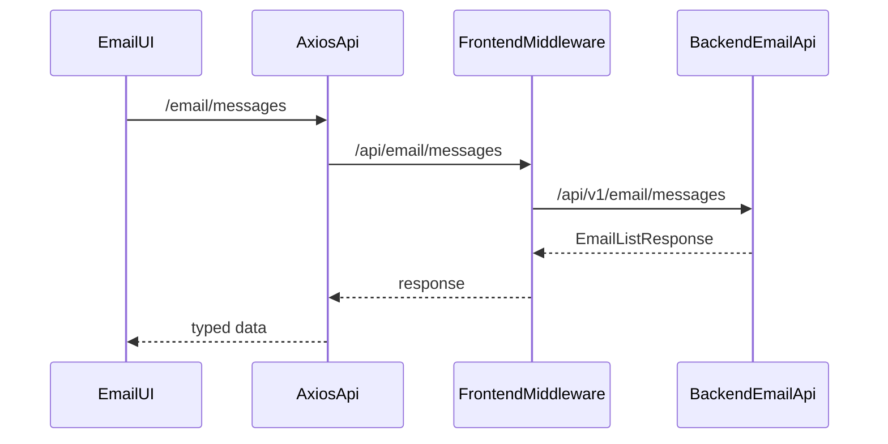

# Email 真实功能接入计划

## 背景
当前已完成两件基础工作：

- 后端基础层已落地：`backend/src/routes/email.ts`、`backend/src/services/email/*`、`packages/shared/src/types/email.ts`、`packages/shared/src/validators/email.ts`、`packages/db/src/schema/email-*.ts`。
- 前端已完成结构迁移和 mock 替换：`frontend/modules/email/` 承载业务代码，`frontend/app/[lang]/(dashboard)/(apps)/email/page.tsx` 仅做挂载，`frontend/middleware.ts` 已让 `/api/email/*` 代理到 backend `/api/v1/email/*`。

本计划的目标是把当前 demo UI 变成符合 `docs/prd/email/core_email_prd.md` Phase 1 的真实邮箱工作区。

## 范围

- 接入当前后端真实 API：账号、消息、发送、同步、文件夹、附件。
- 将 demo view model 逐步替换为 `@portal/shared` 的 Email 契约类型。
- 保留现有 dashboard route 和 shell，不新增全局 Provider，不修改 `components/ui/*`。
- 完成必要前端 specs 同步，确保文档描述实际代码状态。

## 非目标

- 不实现 PRD Phase 2 的 IMAP IDLE、全文搜索、高级过滤、Conversation threading。
- 不实现 Phase 3 的 AI 回复、Workflow Task、Copilot 三栏执行态。
- 不重构全局 auth、middleware 代理框架或 dashboard layout。
- 不在前端恢复 `app/api/email/*` mock route。

## 技术方向

当前代理路径保持如下：

关键决策：

- 前端 service 继续通过 `frontend/config/axios.config.ts` 使用相对 `/api` baseURL，避免硬编码 backend 地址。
- `frontend/middleware.ts` 负责统一代理 `/api/email/*`，复用 Authorization、cookie、workspace/user headers 透传。
- `frontend/modules/email/services/email-api.ts` 从 demo 适配层演进为真实 API client，优先返回 shared contract，再在组件边界做 UI view model 映射。
- `frontend/modules/email/pages/email-workspace-page.tsx` 保持 Server Component 数据入口，但需要明确账号缺失、未同步、无邮件、后端错误等状态。

## 实施单元

- U1. 统一前端 Email 契约与 API client

  **目标：** 让 `frontend/modules/email/services/email-api.ts` 完整覆盖后端 Phase 1 API，不再混用 demo 类型。

  **文件：**
  - 修改：`frontend/modules/email/services/email-api.ts`
  - 修改：`frontend/modules/email/types/email-view.ts`
  - 可选新增测试：`frontend/modules/email/tests/email-api-adapter.test.ts`

  **做法：**
  - 引入并使用 `EmailAccountResponse`、`EmailListResponse`、`EmailMessageResponse`、`EmailFolderResponse`、`SendEmailRequest`、`EmailSyncResponse` 等 shared 类型。
  - 保留 `/email/...` client 路径，让 axios 组合成 `/api/email/...`，交给 middleware 代理。
  - 将 demo-only 的 `EmailDemoMail` 收缩为 UI-only view model，或替换成 `EmailMessageView`。
  - 补齐错误响应归一化，保证后端 `401/403/404/422/500` 能被页面区分展示。

  **测试场景：**
  - Happy path：`EmailListResponse.items` 能映射为列表所需字段。
  - Error path：后端 422/500 响应能转换成页面可展示错误。
  - Integration：`/email/messages/:id`、`/email/messages/send`、`/email/sync` 路径不会退回 mock route。

- U2. 实现邮箱账号设置与连接测试

  **目标：** 提供真实账号绑定/编辑/删除/测试连接能力，对应 PRD 邮箱绑定流程。

  **文件：**
  - 新增或修改：`frontend/modules/email/pages/email-settings-page.tsx`
  - 新增或修改：`frontend/modules/email/components/email-account-form.tsx`
  - 新增或修改：`frontend/modules/email/components/email-account-card.tsx`
  - 修改：`frontend/modules/email/stores/email-account-store.ts`
  - 修改：`frontend/modules/email/services/email-api.ts`
  - 测试：`frontend/modules/email/tests/email-account-form.test.tsx`

  **做法：**
  - 基于 `CreateEmailAccountRequest` 和 provider preset 字段实现账号表单。
  - 支持 IMAP/POP3 条件字段，SMTP 字段，密码输入，sync interval。
  - 调用 `/api/email/account` 与 `/api/email/account/test`。
  - 当未绑定账号时，Email 工作区显示账号设置 CTA，而不是空白列表。

  **测试场景：**
  - Happy path：Gmail/163/custom 表单可提交正确 payload。
  - Edge case：选择 IMAP 时缺少 `imap_host`/`imap_port` 显示校验错误。
  - Error path：连接测试失败时显示 receive/smtp 具体错误。
  - Permission/State：后端 401/403 时显示明确不可操作状态。

- U3. 接入真实邮件列表、文件夹和详情

  **目标：** 将收件箱从 demo category tabs 改为真实 folder/list/detail 工作流。

  **文件：**
  - 修改：`frontend/modules/email/components/email-workspace.tsx`
  - 修改：`frontend/modules/email/components/email-sidebar-nav.tsx`
  - 修改：`frontend/modules/email/components/email-list.tsx`
  - 修改：`frontend/modules/email/components/email-detail.tsx`
  - 修改：`frontend/modules/email/hooks/use-email.ts`
  - 修改：`frontend/modules/email/stores/email-store.ts`
  - 测试：`frontend/modules/email/tests/email-workspace.test.tsx`

  **做法：**
  - 使用 `/api/email/folders` 渲染真实 folder tree/count。
  - 使用 `/api/email/messages` 支持 folder、search、read/starred、pagination/sort query。
  - 使用 `/api/email/messages/:messageId` 获取详情，展示 text/html body、from/to/cc、日期、附件列表。
  - 删除 primary/social/promotions 的 demo category 假设，改为 Inbox/Sent/Drafts/Trash/Archive 等 folder type。

  **测试场景：**
  - Happy path：选择 Inbox 调用 `folder_type=inbox` 并刷新列表。
  - Edge case：空 folder 显示 Empty 状态和同步/设置入口。
  - Error path：详情加载失败后列表状态不丢失，并提供返回列表。
  - Integration：列表点击后详情请求使用同一个 message id。

- U4. 实现真实发送邮件与撰写体验

  **目标：** 将 `email-compose-form.tsx` 从 demo 发送改为 `SendEmailRequest`，并处理发送中/成功/失败状态。

  **文件：**
  - 修改：`frontend/modules/email/components/email-compose-form.tsx`
  - 修改：`frontend/modules/email/services/email-actions.ts`
  - 修改：`frontend/modules/email/services/email-api.ts`
  - 测试：`frontend/modules/email/tests/email-compose-form.test.tsx`

  **做法：**
  - 表单字段改为 to/cc/bcc/subject/body_html/body_text。
  - 当前可继续沿用 Quill，但需要在计划实现时评估是否按 spec 替换为 TipTap；如果替换会扩大依赖和 UI 改动，可作为后续单独 PR。
  - 调用 `/api/email/messages/send`，成功后关闭 compose 并刷新 Sent 或当前列表。
  - 后端 422 校验错误需要映射到表单字段或顶部错误。

  **测试场景：**
  - Happy path：有效 recipient + subject + body 提交后调用 send endpoint。
  - Edge case：多个 recipient、空 subject、空 body 的行为符合 shared validator。
  - Error path：后端 SMTP 失败展示失败原因，不清空用户输入。

- U5. 接入同步和同步状态

  **目标：** 提供手动同步、同步状态展示和错误反馈。

  **文件：**
  - 修改：`frontend/modules/email/hooks/use-email-sync.ts`
  - 修改：`frontend/modules/email/components/email-header.tsx`
  - 修改：`frontend/modules/email/components/email-workspace.tsx`
  - 修改：`frontend/modules/email/services/email-api.ts`
  - 测试：`frontend/modules/email/tests/use-email-sync.test.ts`

  **做法：**
  - 调用 `/api/email/sync` 和 `/api/email/sync/status`。
  - 在 header 或 account card 显示 last sync、status、last error。
  - 同步成功后刷新 folders 和 messages。
  - 同步失败时保留当前列表并显示可重试错误。

  **测试场景：**
  - Happy path：点击 Sync 后状态从 syncing 到成功，并刷新列表。
  - Error path：后端返回失败时显示错误且按钮可再次点击。
  - Edge case：未绑定账号时 Sync 按钮禁用并引导设置。

- U6. 接入附件下载和详情附件展示

  **目标：** 让邮件详情中附件列表使用真实 `EmailAttachmentResponse`，支持下载。

  **文件：**
  - 新增或修改：`frontend/modules/email/components/email-attachment-list.tsx`
  - 修改：`frontend/modules/email/components/email-detail.tsx`
  - 修改：`frontend/modules/email/services/email-api.ts`
  - 测试：`frontend/modules/email/tests/email-attachment-list.test.tsx`

  **做法：**
  - 从 `EmailMessageResponse.attachments` 渲染 filename、content type、size。
  - 下载链接指向 `/api/email/attachments/:attachmentId`，由 middleware 代理到 backend。
  - 处理附件不存在、无权限、下载失败的 UI 状态。

  **测试场景：**
  - Happy path：附件列表显示名称、大小和下载入口。
  - Edge case：无附件时不显示 demo 图片。
  - Error path：附件下载失败时有用户可见提示。

- U7. 权限、审计可见性和文档收尾

  **目标：** 确保前端行为与后端 RBAC/审计预期一致，并同步代码结构文档。

  **文件：**
  - 修改：`frontend/specs/email.md`
  - 修改：`frontend/specs/INDEX.md`
  - 修改：`frontend/specs/pages.md`
  - 必要时修改：`docs/INDEX.md`、`AGENTS.md`
  - 测试：按上述单元测试和页面集成测试落位

  **做法：**
  - 明确哪些 UI 操作依赖 `email.account.*`、`email.message.*`、`email.sync.*` 权限。
  - 后端已写审计的操作，前端不额外伪造审计，只确保调用真实 mutation endpoint。
  - 文档更新以实际落地文件为准，避免继续描述 demo/mock 状态。

  **测试场景：**
  - Permission：缺权限时隐藏或禁用对应危险操作。
  - Documentation：specs 中的目录结构和挂载页与代码一致。
  - Regression：`frontend/app/api/email/*` 不被恢复，`LOCAL_API_PREFIXES` 不包含 `/api/email`。

## 风险与缓解

- 后端当前只支持单账号 `/account`，前端不要先做多账号列表体验；如果要多账号，需要先扩展后端契约。
- 真实邮箱协议错误复杂，前端必须显示后端返回错误，不能只 toast “失败”。
- Compose 当前是 Quill，spec 写 TipTap；建议先完成真实发送，再单独决定是否替换编辑器。
- 全量 `@portal/web typecheck` 已存在非 Email 历史错误，Email 实施时应使用目标路径 lint/typecheck 过滤和单测补充证明。

## 验收标准

- `/[lang]/email` 不再依赖任何 `frontend/app/api/email/*` mock route。
- 未绑定账号时显示账号设置入口；绑定成功后可测试连接。
- 可通过真实后端列出邮件、查看详情、发送邮件、删除/更新邮件状态、触发同步。
- 附件从真实 `attachments` 字段渲染，下载走 middleware 代理。
- 关键失败状态可见：未登录/无权限/无账号/连接失败/同步失败/空列表。
- `frontend/specs/email.md` 与 `frontend/modules/email/` 实际结构保持一致。