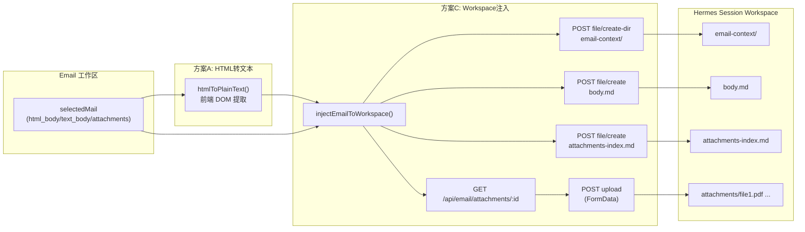

# 邮件上下文注入 Hermes Workspace 计划

## 现状问题

1. `hermesMailContext` 只取 `text_body ?? snippet`，当邮件仅有 `html_body` 时 agent 只能看到极短的 snippet
2. 附件信息完全未传递给 Hermes，agent 无从知晓也无法阅读附件内容
3. `email-detail.tsx` 用 `sandbox=""` iframe 渲染 HTML，JS 无法跨域提取文本

## 架构约束

- Hermes Workspace 由 **hermes-webui**（`localhost:8787`）管理，非 Portal Express 后端
- BFF 代理路径：`/api/hermes/runtime/*` → hermes-webui `/api/*`
- 已有 API：`file/create-dir`、`file/create`（文本）、`upload`（FormData 二进制）
- 邮件附件下载：`GET /api/email/attachments/:id`（从 S3 取 binary）
- **注意**：IMAP 同步当前未将附件持久化到 S3（`createMany` 无调用），此计划的附件注入功能在同步补全后才能完整运作；但基础设施和 API 已就绪

## 数据流



## 方案 A：HTML 正文转纯文本

### 新增文件

**`frontend/modules/email/lib/html-to-text.ts`** — 纯函数，使用浏览器 `DOMParser` 提取文本：

```typescript
export function htmlToPlainText(html: string): string {
  if (!html) return "";
  const doc = new DOMParser().parseFromString(html, "text/html");
  // 移除 script/style
  doc.querySelectorAll("script, style").forEach((el) => el.remove());
  return (doc.body.textContent ?? "").replace(/\n{3,}/g, "\n\n").trim();
}
```

### 修改 `email-workspace.tsx` 第 265-278 行

将 `hermesMailContext` 的 body 逻辑改为：

```typescript
body: selectedMail.text_body
  ?? htmlToPlainText(selectedMail.html_body ?? "")
  ?? selectedMail.snippet
  ?? "",
```

同时在 payload 中增加 `attachments` 元数据摘要，让 agent 在首条消息的 context 中知道有哪些附件：

```typescript
attachments: selectedMail.attachments.map(a => ({
  id: a.id,
  filename: a.filename,
  content_type: a.content_type,
  size_bytes: a.size_bytes,
})),
```

## 方案 C：附件注入 Hermes Workspace

### Workspace 目录结构

在 Hermes session workspace 内创建如下结构：

```
email-context/
  body.md                    ← 邮件正文（Markdown 格式，含元数据头）
  attachments-index.md       ← 附件清单（文件名/类型/大小/路径）
  attachments/
    报告.pdf                  ← 二进制附件（通过 upload 端点）
    数据.csv                  ← 文本附件（通过 file/create）
```

### 新增文件

**`frontend/modules/hermes/services/workspace-email-inject.ts`**

核心导出函数：

```typescript
export async function injectEmailToWorkspace(params: {
  sessionId: string;
  email: EmailMessageResponse;
  plainBody: string;  // 已经过 html→text 的正文
}): Promise<{ ok: boolean; error?: string }>
```

实现步骤：
1. 调用 `POST /api/hermes/runtime/file/create-dir` 创建 `email-context/` 和 `email-context/attachments/`
2. 调用 `POST /api/hermes/runtime/file/create` 写入 `email-context/body.md`，内容格式：
   ```markdown
   # 邮件正文
   - 主题: {subject}
   - 发件人: {from}
   - 收件人: {to}
   - 日期: {date}
   ---
   {plainBody}
   ```
3. 如果有附件，写入 `email-context/attachments-index.md`（附件清单表）
4. 遍历附件：
   - 判断 `content_type`：文本类（`text/*`, `application/json`, `application/csv`）→ 下载后用 `file/create` 写入
   - 二进制类 → 下载 Blob → 构造 `File` 对象 → 通过 `POST /api/hermes/runtime/upload`（FormData，含 `session_id` + `file`）上传
   - 上传后用 `file/rename` 将文件从 workspace 根移到 `email-context/attachments/` 下（如果 upload 不支持子路径）

辅助函数：
- `downloadAttachmentAsBlob(attachmentId: string): Promise<Blob>` — fetch `/api/email/attachments/:id`
- `isTextContentType(ct: string): boolean` — 判断是否为文本可读类型
- `apiJson<T>(url, opts)` — 复用已有的 fetch JSON 封装

### 修改文件

**`frontend/modules/hermes/hooks/use-hermes-panel-chat.ts`**

- 在 `send` 回调中，当 `isFirst`（首轮消息）且 context 为 email 类型时，先调用 `injectEmailToWorkspace`，再发消息
- 或者：在 `onSessionEstablished` 回调中触发注入（session 建立后立即注入，不阻塞消息流）
- 新增 `injectedRef` 防止重复注入

**`frontend/modules/email/components/email-workspace.tsx`**

- 将 `hermesMailContext.payload` 扩充 `attachments` 元数据
- 将 body 替换为 `htmlToPlainText` 处理后的值

**`frontend/modules/hermes/components/panel/HermesChatPanel.tsx`**

- 新增一个 `presetAction`："注入附件到 Workspace"（或自动注入时不需要此按钮）
- 注入完成后 toast 提示

### 关键决策

| 决策点 | 选择 | 理由 |
|--------|------|------|
| 注入时机 | 首轮消息发送时自动注入 | 用户无需手动操作；避免选择邮件但不聊天时浪费资源 |
| 重复注入 | 使用 `injectedRef` + 检查 `email-context/` 目录是否存在 | 切换邮件后清空 ref；同一邮件不重复 |
| 二进制附件 | 通过 upload FormData | 复用已有的 `uploadFiles` 模式（`use-runtime-sse.ts` 第 239 行） |
| 文本附件 | 通过 file/create 直接写内容 | 更高效，无需 FormData |
| 附件不存在时（S3 缺失） | 静默跳过，在 index 中标注「未找到」 | 不阻断整体流程 |

## 不在本次范围内

- 后端补全 IMAP 同步附件持久化（S3 写入 + DB createMany）— 独立任务
- PDF/图片等二进制文件的文本提取（方案 E）— 后续增强
- 修改 hermes-webui 上游 API — 仅使用已有端点
