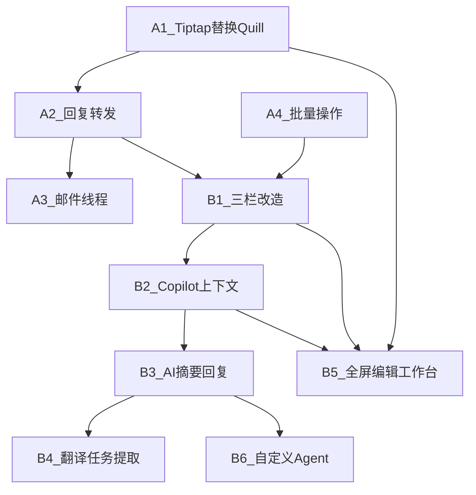

# Email Phase 2 实施计划

PRD 来源：[docs/prd/email/extend_with_copilo.md](docs/prd/email/extend_with_copilo.md)

## 现状关键数据

- 当前布局：2 栏 `ResizablePanelGroup`（`defaultLayout[0]` 侧栏 + `defaultLayout[1]` 内容区），第三个值 `defaultLayout[2]` 已存在但未使用
- Quill 依赖：`react-quilljs@1.3.3` + `quill@1.3.7`，仅在 [email-compose-form.tsx](frontend/modules/email/components/email-compose-form.tsx) 中使用
- CopilotKit 范式：`@copilotkit/react-core` 的 `useCopilotReadable` / `useCopilotAction`，参考 Documents 模块和 Hermes 模块
- `GlobalCopilotProvider` 已挂载在 [app/[lang]/layout.tsx](frontend/app/[lang]/layout.tsx)，Email 模块当前无任何 Copilot 接入

---

## Phase 2-A：基础升级

### A1 — Tiptap 替换 Quill

**目标**：用 Tiptap 替换 Quill 编辑器，保持发送 HTML 不变。

**步骤**：

1. 安装 Tiptap 依赖到 `frontend/`：
   - `@tiptap/react`, `@tiptap/pm`, `@tiptap/starter-kit`, `@tiptap/extension-link`, `@tiptap/extension-image`, `@tiptap/extension-placeholder`, `@tiptap/extension-underline`
2. 新建 [frontend/modules/email/components/email-tiptap-editor.tsx](frontend/modules/email/components/email-tiptap-editor.tsx)：
   - 封装 `useEditor` + StarterKit + Link + Image + Placeholder + Underline
   - 暴露 `ref` 或 `onEditorReady` 回调，让父组件获取 `editor` 实例
   - 提供 toolbar（加粗/斜体/下划线/链接/列表/标题/图片）
   - 样式用 Tailwind prose 类 + 最小化自定义 CSS
3. 改造 [email-compose-form.tsx](frontend/modules/email/components/email-compose-form.tsx)：
   - 移除 `import { useQuill } from "react-quilljs"` 和 `import "quill/dist/quill.snow.css"`
   - 用 `EmailTiptapEditor` 替换 `
`
   - 提交时 `editor.getHTML()` 替代 `quill.root.innerHTML`；`editor.getText()` 替代 `quill.getText()`
4. 移除 Quill 依赖：`pnpm remove react-quilljs quill --filter @portal/web`
5. 验证：发送邮件 → 收件端（Gmail/Outlook）检查 HTML 渲染效果

**验证点**：Tiptap `getHTML()` 输出与 Quill 等效的 `
`, `<strong>`, `<a>`, `<ul>` 语义 HTML。

---

### A2 — 回复/转发功能

**目标**：解锁 EmailDetail 中 disabled 的回复/转发按钮，支持回复/转发撰写模式。

**步骤**：

1. 扩展 email store（[email-store.ts](frontend/modules/email/stores/email-store.ts)）：
   - 新增 `composeMode: null | "new" | "reply" | "replyAll" | "forward"`
   - 新增 `composeDraft: { to, cc, subject, quoteHtml, inReplyTo, references } | null`
   - 新增 `setComposeMode(mode, sourceMail?)` — 根据 mode 自动填充 draft 字段
2. 改造 [email-detail.tsx](frontend/modules/email/components/email-detail.tsx)：
   - 回复按钮：`onClick` 调 `setComposeMode("reply", mail)` + `setOpenComposeMail(true)`
   - 转发按钮：`onClick` 调 `setComposeMode("forward", mail)` + `setOpenComposeMail(true)`
   - 移除 `disabled` 属性和「（后续）」标签文案
3. 改造 [email-compose-form.tsx](frontend/modules/email/components/email-compose-form.tsx)：
   - 读取 store 中的 `composeDraft`，预填 to/cc/subject
   - 回复模式：`to = mail.from`，`subject = "Re: " + mail.subject`，引用原文包在 `<blockquote>`
   - 转发模式：`to = ""`，`subject = "Fwd: " + mail.subject`，引用原文包在 `<blockquote>`
   - 发送时传 `in_reply_to` / `references` 字段（后端 `SendEmailRequest` 已支持）
4. 改造 [email-workspace.tsx](frontend/modules/email/components/email-workspace.tsx)：
   - `openComposeMail` 由 store `composeMode !== null` 驱动

**验证点**：回复邮件后，收件端能看到正确的 In-Reply-To 头和引用原文。

---

### A3 — 邮件线程基础

**目标**：基于 `in_reply_to` / `references` 字段做前端侧线程分组展示。

**步骤**：

1. 新建 [frontend/modules/email/components/email-thread-view.tsx](frontend/modules/email/components/email-thread-view.tsx)：
   - 接收当前邮件的 `thread_id` 或 `references` 列表
   - 从已加载的 `messages` 中过滤同线程邮件（前端过滤，不增加后端端点）
   - 按时间排序，折叠展示（Accordion 或可展开的邮件条目）
   - 当前打开的邮件高亮
2. 在 `EmailDetail`（或新的 `email-detail-pane.tsx`）中，当选中邮件有 `references` 时，渲染 `EmailThreadView`

**验证点**：回复链中的邮件能在详情区按时间顺序折叠展示。

---

### A4 — 批量操作解锁

**目标**：解锁 EmailHeader 中 disabled 的归档/删除等按钮，接入已有批量操作 API。

**步骤**：

1. 扩展 email store 或 workspace 本地状态：
   - 新增 `selectedMessageIds: Set<string>`
   - 列表区的 Checkbox 绑定 `selectedMessageIds` 的增删
2. 改造 [email-header.tsx](frontend/modules/email/components/email-header.tsx)：
   - 归档按钮：`onClick` → `batchEmailMessageActions({ messageIds, action: "archive" })`
   - 删除按钮：`onClick` → `batchEmailMessageActions({ messageIds, action: "trash" })`
   - 标记已读/未读：复用 `batchEmailMessageActions` 的 `markRead` / `markUnread`
   - 移除「（后续）」标签文案
3. 改造 [email-list.tsx](frontend/modules/email/components/email-list.tsx)：
   - 每行增加 Checkbox 供多选
   - 选中状态高亮
4. 操作成功后刷新列表（调用 `loadMessages`）

**验证点**：多选邮件 → 批量归档/删除 → 列表刷新正确。

---

## Phase 2-B：AI 工作台

### B1 — EmailWorkspace 三栏改造

**目标**：从 2 栏扩展为 3 栏，新增右侧可折叠 AI Panel。

**步骤**：

1. 扩展 [email-workspace.tsx](frontend/modules/email/components/email-workspace.tsx) 的 `ResizablePanelGroup`：
   - Panel 1（侧栏导航）：不变
   - Panel 2（邮件列表/详情）：不变
   - 新增 `ResizableHandle` + Panel 3（`EmailAIPanel`，默认宽度 ~25%，可折叠到 0）
   - `defaultLayout` 调整为三值：如 `[15, 55, 30]`（百分比）
2. 新建 [frontend/modules/email/components/email-ai-panel.tsx](frontend/modules/email/components/email-ai-panel.tsx)：
   - 骨架结构：上下文区 + 快捷动作区 + 结果展示区
   - 接收 `selectedMail` 作为上下文
   - 折叠按钮切换 Panel 显隐（`collapsible` + `collapsedSize={0}`）
3. 新建 [frontend/modules/email/components/email-detail-pane.tsx](frontend/modules/email/components/email-detail-pane.tsx)：
   - 包裹 `EmailDetail` + `EmailActionBar` + `EmailThreadView`
   - 统一详情区的操作入口
4. 新建 [frontend/modules/email/components/email-action-bar.tsx](frontend/modules/email/components/email-action-bar.tsx)：
   - 回复 / 全部回复 / 转发 / AI 摘要 / 创建任务 / 标记等按钮
   - AI 相关按钮触发 AI Panel 中的对应 action
5. cookie 持久化需兼容新的三值 layout

**验证点**：宽屏三栏可拖拽调整，AI Panel 可折叠/展开，cookie 持久化正常。

---

### B2 — 注册 Copilot 邮件上下文

**目标**：将当前选中邮件信息注册到 CopilotKit，让 AI 能感知邮件上下文。

**步骤**：

1. 新建 [frontend/modules/email/hooks/use-email-copilot-context.ts](frontend/modules/email/hooks/use-email-copilot-context.ts)：
   - 参考 Documents 模块的 `useSpreadsheetDocumentAi.ts` 范式
   - `useCopilotReadable({ description, value })` 注册：
     - 当前邮件 subject, from, to, cc, textBody/snippet, date
     - 当前文件夹类型、账号邮箱地址
   - 依赖 `useEmailStore().selectedMail`，邮件切换时自动更新上下文
2. 在 `EmailAIPanel` 或 `EmailWorkspace` 中调用此 hook

**验证点**：在全局 Copilot Sidebar 中提问「当前邮件是关于什么的」，能基于邮件上下文回答。

---

### B3 — AI 摘要 + AI 回复草稿

**目标**：注册 `summarize_email` 和 `draft_reply` 两个 Copilot Action。

**步骤**：

1. 新建 [frontend/modules/email/hooks/use-email-agent-actions.ts](frontend/modules/email/hooks/use-email-agent-actions.ts)：
   - 参考 Hermes 模块的 `frontend-tools.ts` 范式
   - `useCopilotAction({ name: "summarize_email", parameters, handler })` — handler 可选：直接依赖 LLM 生成，或调后端聚合接口
   - `useCopilotAction({ name: "draft_reply", parameters, handler })` — 生成回复草稿 HTML
2. 新建 [frontend/modules/email/components/email-ai-action-button.tsx](frontend/modules/email/components/email-ai-action-button.tsx)：
   - 单个 Agent 动作按钮（图标 + 标签 + loading 状态）
3. 新建 [frontend/modules/email/components/email-ai-result-card.tsx](frontend/modules/email/components/email-ai-result-card.tsx)：
   - 展示 AI 返回结果（markdown 渲染）
   - 操作按钮：复制 / 采纳到编辑器 / 重试
4. 在 `EmailAIPanel` 中集成：点击按钮 → 调用 action → 流式展示结果

**验证点**：点击「AI 摘要」生成摘要文本；点击「AI 回复」生成草稿，点击「采纳」填入编辑器。

---

### B4 — 翻译 + 任务提取

**目标**：扩展 Agent Actions，增加 `translate_email` 和 `extract_tasks`。

**步骤**：

1. 在 `use-email-agent-actions.ts` 中追加：
   - `useCopilotAction({ name: "translate_email", parameters: [targetLang], handler })`
   - `useCopilotAction({ name: "extract_tasks", parameters: [], handler })`
   - `useCopilotAction({ name: "extract_data", parameters: [], handler })`
2. 在 `EmailAIPanel` 中追加对应的 action button
3. 翻译结果展示在 result card 中，支持切换目标语言
4. 任务提取结果展示为清单列表，支持一键复制

**验证点**：翻译输出正确目标语言文本；任务提取输出结构化清单。

---

### B5 — 编辑工作台全屏模式

**目标**：新增全屏撰写模式（沉浸式编辑 + 右侧 AI 辅助面板）。

**步骤**：

1. 新建 [frontend/modules/email/components/email-compose-workspace.tsx](frontend/modules/email/components/email-compose-workspace.tsx)：
   - 全屏 overlay 或替换 EmailWorkspace 内容区
   - 左侧：收件人/主题表单 + `EmailTiptapEditor`
   - 右侧：`EmailComposeAIPanel`（可折叠）
   - 底栏：附件 / 发送 / 保存草稿
2. 新建 [frontend/modules/email/components/email-compose-ai-panel.tsx](frontend/modules/email/components/email-compose-ai-panel.tsx)：
   - AI 改写/润色、翻译、语气调整按钮
   - 利用 `useCopilotAction` 注册撰写相关 actions
   - 结果可直接插入/替换编辑器选区
3. 在 `email-compose-form.tsx` 中增加「全屏模式」切换入口按钮
4. 在 `email-workspace.tsx` 中管理全屏撰写状态

**验证点**：从浮窗模式切换到全屏模式，AI 面板可触发改写/翻译并填入编辑器。

---

### B6 — 自定义 Agent 触发入口

**目标**：在 AI Panel 提供可配置的自定义 Agent 动作入口。

**步骤**：

1. 在 `use-email-agent-actions.ts` 中增加 `custom_agent` action：
   - 接收 `agentId` + 自由参数
   - handler 调用通用 Agent 执行接口
2. 在 `EmailAIPanel` 底部增加「更多 Agent」区域：
   - 展示可用 Agent 列表（初期可硬编码，后续从配置加载）
   - 点击触发对应 Agent，结果展示在 result card

**验证点**：点击自定义 Agent 按钮能发起请求并展示结果。

---

## 依赖关系

## 文档同步（完成后必做）

完成实施后需更新：
- `frontend/specs/pages.md` — 无新增页面，但组件结构变化需记录
- `frontend/specs/components.md` — 新增组件清单
- `frontend/specs/layout-structure.md` — Email 三栏布局描述
- `docs/INDEX.md` + `AGENTS.md` — 如有结构性变更
