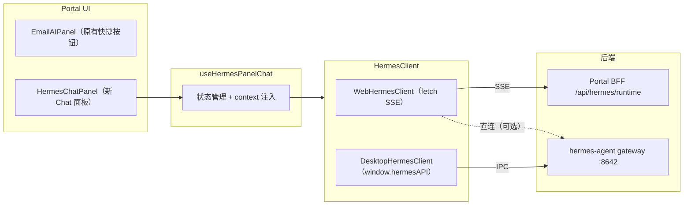

# Hermes Client + Chat Panel 集成方案

## 现状分析

当前邮件 AI 通路：`useEmailAgentActions` -> `requestEmailAiCompletion` -> `POST /api/email/ai-completion`（同步 request/response）。

Hermes 已有两条流式通路可复用：
- **Copilot AG-UI**: [gateway-streaming-agent.ts](frontend/modules/hermes/copilot/gateway-streaming-agent.ts) -- 连接 `HERMES_GATEWAY_BASE_URL:8642` 的 SSE
- **Runtime BFF**: [use-runtime-sse.ts](frontend/modules/hermes/runtime/hooks/use-runtime-sse.ts) -- 连接 `/api/hermes/runtime/chat/start` + EventSource

Portal 需要统一的 `HermesClient` 接口，让面板组件**不关心底层是 Web HTTP 还是 Desktop IPC**。

---

## 架构



---

## Step 1: 统一 HermesClient 接口 + 双实现

新增目录 `frontend/modules/hermes/client/`，共 4 个文件：

### 1.1 `hermes-client.types.ts` -- 接口契约

```typescript
export interface HermesClientSendOptions {
  message: string;
  sessionId?: string;
  profile?: string;
  history?: Array<{ role: string; content: string }>;
}

export interface HermesStreamCallbacks {
  onChunk: (text: string) => void;
  onToolProgress?: (toolName: string, preview?: string) => void;
  onUsage?: (usage: Record<string, unknown>) => void;
  onDone: (result?: { sessionId?: string }) => void;
  onError: (error: string) => void;
}

export interface HermesClient {
  send(opts: HermesClientSendOptions, cb: HermesStreamCallbacks): AbortController;
  checkHealth(): Promise<boolean>;
}
```

返回值为 `AbortController`，调用方可随时 `abort()` 取消。

### 1.2 `web-hermes-client.ts` -- Web 环境实现

复用 [use-runtime-sse.ts](frontend/modules/hermes/runtime/hooks/use-runtime-sse.ts) 中的 BFF SSE 模式：
1. `POST /api/hermes/runtime/chat/start` 获取 `stream_id`
2. `new EventSource(/api/hermes/runtime/chat/stream?stream_id=...)` 监听 `token` / `tool` / `done` / `apperror`
3. 健康检查：`GET /api/hermes/health`

### 1.3 `desktop-hermes-client.ts` -- Desktop WebView 环境

检测 `window.hermesAPI`，映射 IPC：
- `send`: 调用 `hermesAPI.sendMessage(message, profile, sessionId, history)`；注册 `onChatChunk` / `onChatDone` / `onChatError` / `onChatToolProgress` / `onChatUsage`
- `checkHealth`: 调用 `hermesAPI.gatewayStatus()`
- abort: 调用 `hermesAPI.abortChat()`

### 1.4 `index.ts` -- 工厂

```typescript
export function createHermesClient(): HermesClient {
  if (typeof window !== 'undefined' && (window as any).hermesAPI?.sendMessage) {
    return new DesktopHermesClient();
  }
  return new WebHermesClient();
}
```

---

## Step 2: HermesChatPanel 面板组件 + useHermesPanelChat hook

### 2.1 `useHermesPanelChat` hook

新增 `frontend/modules/hermes/hooks/use-hermes-panel-chat.ts`

- 内部持有 `createHermesClient()` 实例
- 管理 `messages: PanelMessage[]`、`busy`、`error`、`toolCalls`
- `send(userMessage)` 方法：将 `context`（邮件正文等）注入 system 前缀，调用 `client.send()`，流式拼接到 messages
- `cancel()` 方法：调用 `AbortController.abort()`
- `clear()` 方法：清空消息
- 支持传入 `presetSystemPrompt` 让调用方自定义 system 指令

消息类型定义：

```typescript
export type PanelMessage = {
  role: 'user' | 'assistant';
  content: string;
  timestamp: number;
  isStreaming?: boolean;
};
```

### 2.2 面板组件

新增 `frontend/modules/hermes/components/panel/` 目录，共 4 个文件：

- **`HermesChatPanel.tsx`** -- 主面板容器
  - Props: `context?` / `presetActions?` / `onApplyResult?` / `className?`
  - 头部：Hermes 标识 + 上下文摘要行
  - 主体：消息列表 + 工具卡片
  - 底部：精简版 Composer（Textarea + Send/Cancel）
  - 可选 preset action 按钮栏（类似 EmailAIPanel 的快捷按钮）

- **`HermesPanelMessageList.tsx`** -- 消息列表
  - 复用 [RuntimeMarkdown](frontend/modules/hermes/runtime/components/RuntimeMarkdown.tsx) 渲染 Markdown
  - 每条消息带复制按钮
  - 流式消息显示打字光标

- **`HermesPanelComposer.tsx`** -- 精简输入框
  - 从 [RuntimeComposer](frontend/modules/hermes/runtime/components/RuntimeComposer.tsx) 精简：去掉文件上传、模型选择
  - 保留：Textarea + Enter 发送 + 取消按钮

- **`HermesPanelToolCard.tsx`** -- 工具卡片
  - 直接封装 [RuntimeToolCard](frontend/modules/hermes/runtime/components/RuntimeToolCard.tsx)

---

## Step 3: 邮件工作区集成

### 3.1 改动 [email-workspace.tsx](frontend/modules/email/components/email-workspace.tsx)

在右侧第三个 `ResizablePanel`（当前放 `EmailAIPanel`）上方加 Tab 切换：

```
[邮件 AI] [Hermes Chat]
```

- **邮件 AI** tab：保持现有 `EmailAIPanel` 完全不变（快捷按钮 + 同步 AI 结果），代码零改动
- **Hermes Chat** tab：新增 `HermesChatPanel`，传入当前选中邮件作为 context

实现方式：在 `EmailWorkspace` 内加一个 `aiPanelTab` state（`"email-ai" | "hermes-chat"`），用简单 Tab 切换两个面板的显隐。

### 3.2 context 传递

```typescript
<HermesChatPanel
  context={{
    type: 'email',
    payload: { subject, from, body: textBody },
    summary: `${subject} · ${from.address}`,
  }}
  presetActions={[
    { label: '摘要', prompt: '请总结这封邮件的要点' },
    { label: '回复草稿', prompt: '请为这封邮件写一封专业回复' },
    { label: '提取待办', prompt: '请提取邮件中的待办事项' },
  ]}
  onApplyResult={(md) => {
    navigator.clipboard.writeText(md);
    setComposeMode("new");
    toast.success("已复制到剪贴板，撰写窗口已打开");
  }}
/>
```

### 3.3 禁止改动

- **不改** `EmailAIPanel` 组件本身
- **不改** `useEmailAgentActions` hook
- **不改** `email-ai-completion.ts`
- **不改** 文档模块任何代码
- **不改** provider / layout / components/ui

---

## 文件清单

| 操作 | 文件路径 |
|------|----------|
| 新增 | `frontend/modules/hermes/client/hermes-client.types.ts` |
| 新增 | `frontend/modules/hermes/client/web-hermes-client.ts` |
| 新增 | `frontend/modules/hermes/client/desktop-hermes-client.ts` |
| 新增 | `frontend/modules/hermes/client/index.ts` |
| 新增 | `frontend/modules/hermes/hooks/use-hermes-panel-chat.ts` |
| 新增 | `frontend/modules/hermes/components/panel/HermesChatPanel.tsx` |
| 新增 | `frontend/modules/hermes/components/panel/HermesPanelMessageList.tsx` |
| 新增 | `frontend/modules/hermes/components/panel/HermesPanelComposer.tsx` |
| 新增 | `frontend/modules/hermes/components/panel/HermesPanelToolCard.tsx` |
| 修改 | `frontend/modules/email/components/email-workspace.tsx`（仅在右侧面板区加 Tab 切换） |

---

## 验证标准

1. `HermesChatPanel` 能独立渲染、发送消息、流式接收回复
2. `WebHermesClient` 成功连接 `/api/hermes/runtime/chat/start` SSE（后端未就绪时优雅显示错误）
3. `DesktopHermesClient` 在无 `window.hermesAPI` 时自动降级到 `WebHermesClient`
4. 邮件工作区右侧 Tab 切换正常，原 `EmailAIPanel` 功能不受影响
5. 无 TypeScript 编译错误，无 linter 新增错误
