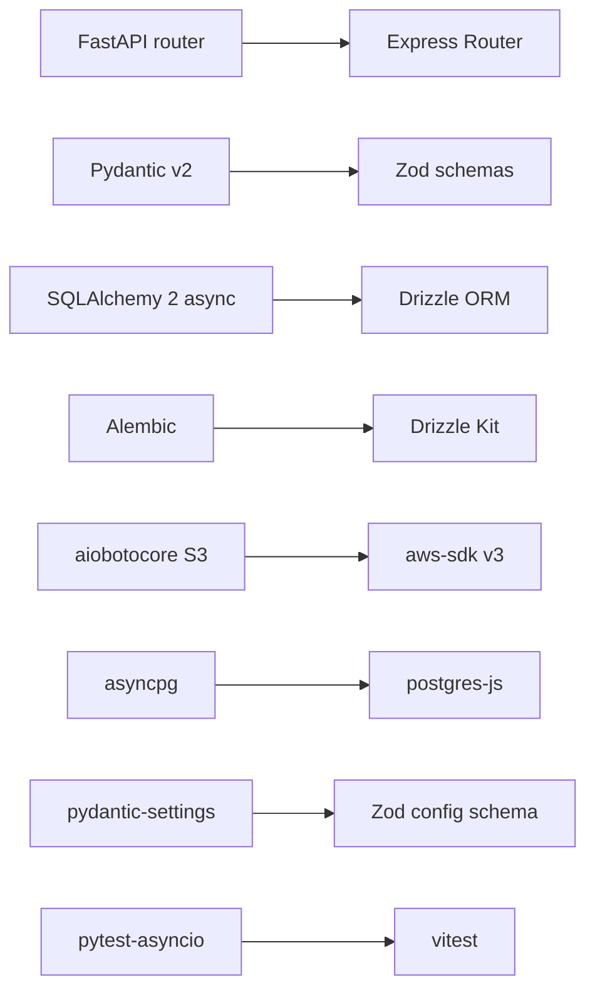

# 迁移计划：ai-os-api documents -> portal/backend

## 范围与原则

- **仅迁移 documents 模块**（auth/permissions 是"🔜 规划"，源码不存在）
- **数据库全新重建**：用 Drizzle Kit 从 schema 生成 0001 migration，废弃 Alembic 历史
- **API 契约 100% 对齐**：12 个端点、URL 路径、请求/响应字段、错误码、HTTP 状态全部对齐
- **行为对齐**：版本冲突乐观锁、权限校验、20 MB 快照上限、SHA-256 校验、事件日志
- **不双前缀**：仅挂 `/api/v1/documents`（前端 [middleware.ts](portal/frontend/middleware.ts) 已剥离 `/api` 前缀代理至 `/api/v1`）
- **Windows 兼容**：clean 脚本使用 `rimraf`（已有惯例）

## 技术栈映射



## 阶段拆分

### Phase 1: 依赖与配置准备

修改 [backend/package.json](portal/backend/package.json) 增加：
- `@aws-sdk/client-s3` (^3.700.0)
- `@aws-sdk/s3-request-presigner` (^3.700.0)（用于 GET snapshot 直传场景，可选；先加上）

修改 [backend/src/config.ts](portal/backend/src/config.ts) 的 `configSchema` 增加 S3 配置：

```typescript
s3Endpoint: z.string().optional(),
s3Region: z.string().default("us-east-1"),
s3Bucket: z.string().default("portal-documents"),
s3AccessKeyId: z.string().optional(),
s3SecretAccessKey: z.string().optional(),
s3ForcePathStyle: z.coerce.boolean().default(true),
snapshotMaxBytes: z.coerce.number().default(20 * 1024 * 1024),
```

修改 [.env.example](portal/.env.example) 增加 S3 段。

修改 [backend/src/middleware/auth.ts](portal/backend/src/middleware/auth.ts) 的 `RequestContext`：
- 增加 `roles: string[]`、`departments: string[]`
- 解析 `x-roles` / `x-departments`（逗号或空格分隔的 UUID 列表）
- 校验 UUID 格式，缺失字段时为空数组

### Phase 2: Drizzle Schema（packages/db）

替换 [packages/db/src/schema/index.ts](portal/packages/db/src/schema/index.ts) 的导出列表，仅保留 documents 域：

```typescript
export * from "./documents.js";
export * from "./document-versions.js";
export * from "./document-permissions.js";
export * from "./document-events.js";
```

删除 stub 文件 `boards.ts` / `tasks.ts` / `users.ts` / `tenants.ts` / `projects.ts`（用户范围已明确仅 documents）。

新建 4 个 schema 文件：

- [packages/db/src/schema/documents.ts](portal/packages/db/src/schema/documents.ts) — 对应 [models.py L13-48](portal/ai-os-api/app/modules/documents/models.py)：16 列 + 4 个 CHECK 约束（document_type / engine / status / provider）
- [packages/db/src/schema/document-versions.ts](portal/packages/db/src/schema/document-versions.ts) — 对应 [models.py L51-86](portal/ai-os-api/app/modules/documents/models.py)：15 列 + FK + 3 个 CHECK 约束 + 唯一约束 `(document_id, version_no)`
- [packages/db/src/schema/document-permissions.ts](portal/packages/db/src/schema/document-permissions.ts) — 对应 [models.py L89-105](portal/ai-os-api/app/modules/documents/models.py)：7 列 + FK + 2 个 CHECK 约束 + 唯一约束 `(document_id, subject_type, subject_id, role)`
- [packages/db/src/schema/document-events.ts](portal/packages/db/src/schema/document-events.ts) — 对应 [models.py L108-119](portal/ai-os-api/app/modules/documents/models.py)：6 列 + FK + 索引 `(document_id, created_at)`

执行：
```bash
DATABASE_URL=postgresql://... pnpm db:generate
```

产生 `packages/db/src/migrations/0001_*.sql`，提交到仓库。

### Phase 3: 共享类型与 Zod 验证器（packages/shared）

新增 [packages/shared/src/constants.ts](portal/packages/shared/src/constants.ts) 增量（保留现有 TASK_STATUSES 等）：

```typescript
export const DOCUMENT_TYPES = ["spreadsheet"] as const;
export const DOCUMENT_ENGINES = ["univer"] as const;
export const DOCUMENT_STATUSES = ["draft", "active", "archived", "deleted"] as const;
export const DOCUMENT_PROVIDERS = ["local", "wecom", "onlyoffice"] as const;
export const DOCUMENT_PERMISSION_ROLES = ["view", "edit", "owner"] as const;
export const DOCUMENT_PERMISSION_SUBJECTS = ["user", "role", "department"] as const;
export const SNAPSHOT_SAVE_MODES = ["manual", "autosave", "system"] as const;
export const VERSION_CREATED_FROM = ["manual_save", "ai_patch_apply"] as const;
```

新增 [packages/shared/src/types/document.ts](portal/packages/shared/src/types/document.ts) — 对应 [schemas.py 全部 13 个 Pydantic 类](portal/ai-os-api/app/modules/documents/schemas.py)，TypeScript 接口形式。

新增 [packages/shared/src/validators/documents.ts](portal/packages/shared/src/validators/documents.ts) — 6 个核心 Zod schema：
- `documentCreateSchema`（对应 DocumentCreateRequest）
- `documentUpdateSchema`（对应 DocumentUpdateRequest）
- `snapshotSaveSchema`（对应 SnapshotSaveRequest，含 base_version_no >= 1 校验）
- `documentPermissionItemSchema`
- `documentPermissionsReplaceSchema`
- `listQuerySchema`（统一分页 + keyword + status）

更新 [packages/shared/src/types/index.ts](portal/packages/shared/src/types/index.ts) 和 [packages/shared/src/validators/index.ts](portal/packages/shared/src/validators/index.ts) 导出。

### Phase 4: S3 存储层（backend/src/storage）

新建 [backend/src/storage/s3-client.ts](portal/backend/src/storage/s3-client.ts) — `S3Client` 单例工厂，从 `AppConfig` 读取配置。

新建 [backend/src/storage/snapshot-storage.ts](portal/backend/src/storage/snapshot-storage.ts) — 对应 [storage.py](portal/ai-os-api/app/modules/documents/storage.py)：
- `putSnapshot(bucket, key, body)` — `PutObjectCommand`
- `getSnapshot(bucket, key)` — `GetObjectCommand` + 流式读取转 string
- `deleteSnapshot(bucket, key)` — `DeleteObjectCommand`（如需要）

### Phase 5: 业务逻辑层（backend/src/services/documents/）

新建 6 个文件：

- [backend/src/services/documents/checksum.ts](portal/backend/src/services/documents/checksum.ts) — Node `crypto` 的 SHA-256（对应 [checksum.py](portal/ai-os-api/app/modules/documents/checksum.py)）
- [backend/src/services/documents/errors.ts](portal/backend/src/services/documents/errors.ts) — 5 个业务异常子类，继承现有 `HttpError`：

  ```typescript
  export class DocumentNotFoundError extends HttpError {
    constructor() { super(404, "Document not found"); }
  }
  export class DocumentPermissionDeniedError extends HttpError {
    constructor() { super(403, "Permission denied"); }
  }
  export class VersionConflictError extends HttpError {
    constructor(public readonly currentVersionNo: number, public readonly baseVersionNo: number) {
      super(409, "Document version conflict");
    }
  }
  export class SnapshotTooLargeError extends HttpError {
    constructor() { super(413, "Snapshot exceeds max size 20MB"); }
  }
  export class SnapshotNotFoundError extends HttpError {
    constructor() { super(404, "Snapshot not found"); }
  }
  ```

  扩展 [backend/src/middleware/error-handler.ts](portal/backend/src/middleware/error-handler.ts)：当 err 是 `VersionConflictError` 时响应体加入 `current_version_no` / `base_version_no`；统一返回 `{ code, message }` 形式（对齐 FastAPI `detail` 结构）。

- [backend/src/services/documents/permission.ts](portal/backend/src/services/documents/permission.ts) — 对应 [permission.py](portal/ai-os-api/app/modules/documents/permission.py)：`canView` / `canEdit` / `canOwner`，以及"通过 user/roles/departments 三维度查找用户当前最高权限"

- [backend/src/services/documents/repository.ts](portal/backend/src/services/documents/repository.ts) — 对应 [repository.py](portal/ai-os-api/app/modules/documents/repository.py)：纯 Drizzle CRUD（getDocument、listDocuments、patchDocument、softDeleteDocument、insertVersion、listVersions、getVersion、listPermissions、replacePermissions、insertEvent、listEvents）

- [backend/src/services/documents/events.ts](portal/backend/src/services/documents/events.ts) — 对应 [events.py](portal/ai-os-api/app/modules/documents/events.py)：事件记录便捷函数

- [backend/src/services/documents/service.ts](portal/backend/src/services/documents/service.ts) — 对应 [service.py](portal/ai-os-api/app/modules/documents/service.py)：编排层。关键方法：
  - `createDocument(ctx, title)` — 插入 documents + 0 字节占位 version + owner permission
  - `getDocumentOr404(documentId)`
  - `getCurrentUserRole(ctx, documentId)` — 调用 permission 模块
  - `saveSnapshot(ctx, documentId, payload)` — 校验 base_version_no、size、写 S3、写 version 行、更新 current_version_no、记录事件，**用 transaction**
  - `getSnapshot(ctx, documentId)` / `getSnapshotByVersion(ctx, documentId, versionNo)` — 读 S3 并组装 SnapshotEnvelope

事务边界：用 `db.transaction(async (tx) => {...})` 包住每个写操作，对齐 Python 的 `async with session.begin()`。

### Phase 6: 路由层

替换 [backend/src/routes/documents.ts](portal/backend/src/routes/documents.ts)（当前是 stub），实现 12 个端点：

| Express 路径 | FastAPI 路径（参考） | 处理逻辑 |
|---|---|---|
| `POST /` | `POST ""` | createDocument |
| `GET /` | `GET ""` | listDocuments + 分页 + 权限过滤 |
| `GET /:documentId` | `GET /{document_id}` | getDocument |
| `PATCH /:documentId` | `PATCH /{document_id}` | patchDocument |
| `DELETE /:documentId` | `DELETE /{document_id}` | softDeleteDocument |
| `GET /:documentId/snapshot` | `GET /{...}/snapshot` | getSnapshot |
| `PUT /:documentId/snapshot` | `PUT /{...}/snapshot` | saveSnapshot |
| `GET /:documentId/versions` | `GET /{...}/versions` | listVersions |
| `GET /:documentId/versions/:versionNo` | `GET /{...}/versions/{n}` | getSnapshotByVersion |
| `GET /:documentId/permissions` | `GET /{...}/permissions` | listPermissions（仅 owner 可见） |
| `PUT /:documentId/permissions` | `PUT /{...}/permissions` | replacePermissions（仅 owner） |
| `GET /:documentId/events` | `GET /{...}/events` | listEvents |

每个 handler：
1. 用 Zod schema 解析 `req.body` / `req.query` / `req.params`，失败抛 `validationError`
2. 走 service 层
3. 业务异常自动通过 errorHandler 转 HTTP 响应

修改 [backend/src/app.ts](portal/backend/src/app.ts)：
- 路由工厂签名改为 `documentRoutes(deps: { db, storage, config })`
- 在 `createApp` 中初始化 `db = createDb(config.dbUrl)`、`storage = new SnapshotStorage(config)`，注入到路由
- 移除其他 stub 路由挂载（projects/boards/tasks/calendars/chat/comments/email/user/finance）以及对应的 stub 文件
- 仅保留 `health` + `documents`

### Phase 7: 测试翻译（Vitest）

在 [backend/](portal/backend/) 下新建测试，对应 [ai-os-api/tests/](portal/ai-os-api/tests/) 的 4 个文件（不含 conftest.py）：

- `tests/checksum.test.ts` — 对应 `test_checksum.py`，纯函数验证
- `tests/version-conflict.test.ts` — 对应 `test_version_conflict.py`，验证 saveSnapshot 抛 VersionConflictError 含 current/base
- `tests/permission-service.test.ts` — 对应 `test_permission_service.py`，验证 canView/canEdit/canOwner 的三维度合并逻辑

测试不依赖真实 PG/S3：用内存 mock（vitest `vi.fn()` 模拟 repository 与 storage 层）。

### Phase 8: 验证

```bash
cd portal
pnpm install                                  # 加入 aws-sdk 依赖
pnpm --filter @portal/db typecheck            # schema 合法
DATABASE_URL=postgresql://... pnpm db:generate  # 生成 0001 migration
pnpm --filter @portal/shared typecheck
pnpm --filter @portal/server typecheck
pnpm test                                     # 测试通过
DATABASE_URL=postgresql://... pnpm db:migrate # 建表
pnpm dev:server                               # 8000 启动
curl http://localhost:8000/health             # ok

curl -X POST http://localhost:8000/api/v1/documents \
  -H "content-type: application/json" \
  -H "x-tenant-id: 00000000-0000-0000-0000-000000000001" \
  -H "x-workspace-id: 00000000-0000-0000-0000-000000000001" \
  -H "x-user-id: 00000000-0000-0000-0000-000000000001" \
  -d '{"title":"hello","document_type":"spreadsheet","engine":"univer"}'
```

执行 12 个端点的最小冒烟测试。

### Phase 9: 处理 ai-os-api 目录

在 [ai-os-api/](portal/ai-os-api/) 根新增 `DEPRECATED.md`，标注：
- 已被 `portal/backend` 取代
- 文档模块已 100% 迁移
- 不再维护，保留 60 天后删除（或由用户后续决定）

**不删除目录**（保留作历史参考），由用户确认后再清理。

更新 [docs/INDEX.md](portal/docs/INDEX.md) / [AGENTS.md](portal/AGENTS.md) 引用，把"ai-os-api 是 Python API"改成"已迁至 backend"。

## 文件清单

**新增**（约 25 个文件）:
- packages/db/src/schema/{documents, document-versions, document-permissions, document-events}.ts (4)
- packages/db/src/migrations/0001_*.sql (1, 自动生成)
- packages/shared/src/types/document.ts (1)
- packages/shared/src/validators/documents.ts (1)
- backend/src/storage/{s3-client, snapshot-storage}.ts (2)
- backend/src/services/documents/{checksum, errors, permission, repository, events, service}.ts (6)
- backend/tests/{checksum, version-conflict, permission-service}.test.ts (3)
- ai-os-api/DEPRECATED.md (1)
- 其他文档同步更新（INDEX.md / AGENTS.md）(2-3)

**修改**:
- backend/package.json (+aws-sdk 依赖)
- backend/src/config.ts (+S3/snapshot 配置项)
- backend/src/middleware/auth.ts (+roles/departments)
- backend/src/middleware/error-handler.ts (+VersionConflict 字段)
- backend/src/app.ts (清理 stub、注入依赖、改路由签名)
- backend/src/routes/documents.ts (从 stub 改为完整实现)
- packages/db/src/schema/index.ts (改导出)
- packages/shared/src/constants.ts (+documents 域常量)
- packages/shared/src/{types,validators}/index.ts (改导出)
- .env.example (+S3 段)

**删除**:
- packages/db/src/schema/{boards, tasks, users, tenants, projects}.ts (5 个 stub)
- backend/src/routes/{boards, calendars, chat, comments, email, user, finance, projects, tasks}.ts (9 个 stub) — 保留 health 与 documents

## 风险与对策

| 风险 | 对策 |
|---|---|
| Drizzle CHECK 约束语法与 PG 行为差异 | 用 `check()` 表达式 + 在 SQL 层验证；migration 生成后手工校对一次 |
| Drizzle migration 自动命名可能与原 Alembic 风格不一致 | 接受 Drizzle 默认命名，不强求与 0001/0002 对齐 |
| postgres-js client 使用方式与 asyncpg 不同 | 已有 [packages/db/src/client.ts](portal/packages/db/src/client.ts) 工厂，复用 |
| S3 流式下载在 aws-sdk v3 与 aiobotocore 行为差异 | 用 `getObject().Body.transformToString()`（v3 标准 API），快照本身是 JSON 字符串 |
| Express handler 异步异常捕获 | Express 5 原生支持 async handler 异常自动转 next(err)，无需 wrapper |
| 现有 backend stub 文件被删除会破坏当前 pnpm dev 启动 | Phase 6 同步修改 app.ts，确保删除前后能过 typecheck |
| ai-os-api 目录暂留是否被 pnpm install 误识别 | ai-os-api 没有 package.json（是 pyproject.toml），pnpm 不会扫到它 |

## 不在范围内（后续工作）

- auth 模块（JWT/OAuth）—— 仍按原"🔜 规划"标记
- permissions RBAC 模块（独立于 documents 内嵌权限）
- 数据从旧库导入到新库的脚本（用户选择 fresh-rebuild）
- ai-os-api 目录的最终删除（先 deprecated 再由用户确认）
