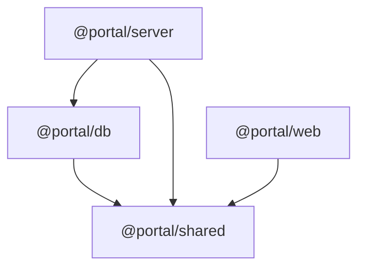

# Portal Monorepo 架构迁移实施计划

## 当前状态

已有内容:
- `portal/frontend/` — 完整 Next.js 14 前端（name: "dash-tail", 150+ 依赖）
- `portal/ai-os-api/` — 既有 Python API（不纳入 pnpm workspace）
- `portal/docs/`, `portal/scripts/`, `portal/skills/` — 文档和脚本
- `portal/AGENTS.md`, `portal/CURSOR.md` — 元文件

需要从零创建的:
- 根级 monorepo 配置（package.json / pnpm-workspace.yaml / turbo.json / .npmrc / .gitignore / .env.example）
- `tooling/tsconfig/` — 共享 TypeScript 基础配置
- `packages/shared/` — 前后端共享类型/常量/验证器
- `packages/db/` — Drizzle schema + 迁移
- `backend/` — Express REST API 完整骨架
- 前端适配（改名 + shared 依赖 + tsconfig paths + transpilePackages）
- `.github/workflows/ci.yml`

## 依赖拓扑（决定构建顺序）



Turborepo 按此拓扑构建: shared -> db -> server + web（并行）

## 实施阶段

### Phase 1: 根级 Monorepo 基础设施（6 个文件）

在 `portal/` 根目录创建:

- **`package.json`** — workspace root，纯编排脚本（name: "portal"），唯一 devDep 是 `turbo`。参照 [monorepo.md 5.1](portal/docs/prd/monorepo.md) 第 256-278 行
- **`pnpm-workspace.yaml`** — 声明 `frontend`、`backend`、`packages/*` 三组成员。参照 [monorepo.md 第二章](portal/docs/prd/monorepo.md) 第 194-198 行
- **`turbo.json`** — 任务定义：build/typecheck/dev/test/lint/clean。参照 [monorepo.md 第三章](portal/docs/prd/monorepo.md) 第 208-233 行
- **`.npmrc`** — `shamefully-hoist=false` + Next.js 所需的 `public-hoist-pattern`。参照 [monorepo.md 第四章](portal/docs/prd/monorepo.md) 第 239-246 行
- **`.gitignore`** — 覆盖 node_modules/dist/.next/.turbo/.env/Python 等。参照 [monorepo.md 第十三章](portal/docs/prd/monorepo.md) 第 979-1017 行
- **`.env.example`** — backend + frontend + Hermes 完整环境变量模板。参照 [monorepo.md 第十一章](portal/docs/prd/monorepo.md) 第 911-939 行

验证: 文件语法正确、目录结构就绪

### Phase 2: 共享 TypeScript 工具链（2 个文件）

创建 `tooling/tsconfig/`:

- **`base.json`** — ES2022 target, bundler moduleResolution, strict。参照 [monorepo.md 6.1](portal/docs/prd/monorepo.md) 第 427-447 行
- **`node.json`** — extends base，添加 outDir/rootDir。参照 [monorepo.md 6.2](portal/docs/prd/monorepo.md) 第 452-459 行

frontend 不使用此工具链（保持现有 tsconfig 不变），仅 backend + packages 继承。

### Phase 3: packages/shared 骨架（约 12 个文件）

创建 `packages/shared/`:

- **`package.json`** — name: `@portal/shared`，zod 在 dependencies（非 devDeps）。参照 [monorepo.md 5.4](portal/docs/prd/monorepo.md) 第 356-383 行
- **`tsconfig.json`** — extends `../../tooling/tsconfig/node.json`。参照 [monorepo.md 6.5](portal/docs/prd/monorepo.md) 第 526-536 行
- **`src/index.ts`** — 统一导出入口。参照 [monorepo.md 8.1](portal/docs/prd/monorepo.md) 第 772-775 行
- **`src/constants.ts`** — TASK_STATUSES / BOARD_TYPES / PROJECT_STATUSES。参照 [monorepo.md 8.2](portal/docs/prd/monorepo.md) 第 780-800 行
- **`src/types/index.ts`** — 汇总导出
- **`src/types/common.ts`** — PaginatedRequest / PaginatedResponse / ApiErrorResponse。参照 [monorepo.md 8.3](portal/docs/prd/monorepo.md) 第 804-823 行
- **`src/types/project.ts`** — 空导出占位
- **`src/types/board.ts`** — 空导出占位
- **`src/types/task.ts`** — 空导出占位
- **`src/types/user.ts`** — 空导出占位
- **`src/validators/index.ts`** — 汇总导出
- **`src/validators/schemas.ts`** — 空导出占位

验证: `pnpm --filter @portal/shared typecheck` 通过

### Phase 4: packages/db 骨架（约 10 个文件）

创建 `packages/db/`:

- **`package.json`** — name: `@portal/db`，依赖 `@portal/shared` + drizzle-orm + postgres。参照 [monorepo.md 5.5](portal/docs/prd/monorepo.md) 第 390-418 行
- **`tsconfig.json`** — extends `../../tooling/tsconfig/node.json`。参照 [monorepo.md 6.6](portal/docs/prd/monorepo.md) 第 540-549 行
- **`drizzle.config.ts`** — PostgreSQL dialect。参照 [monorepo.md 9.3](portal/docs/prd/monorepo.md) 第 853-864 行
- **`src/index.ts`** — 导出 createDb + schema。参照 [monorepo.md 9.2](portal/docs/prd/monorepo.md) 第 846-849 行
- **`src/client.ts`** — createDb 工厂函数。参照 [monorepo.md 9.1](portal/docs/prd/monorepo.md) 第 831-841 行
- **`src/schema/index.ts`** — 汇总导出 schema
- **`src/schema/projects.ts`** — 空导出占位
- **`src/schema/boards.ts`** — 空导出占位
- **`src/schema/tasks.ts`** — 空导出占位
- **`src/schema/users.ts`** — 空导出占位
- **`src/schema/tenants.ts`** — 空导出占位

验证: `pnpm --filter @portal/db typecheck` 通过

### Phase 5: backend 完整骨架（约 15 个文件）

创建 `backend/`:

- **`package.json`** — name: `@portal/server`，Express 5 + pino + cors + zod + dotenv。参照 [monorepo.md 5.3](portal/docs/prd/monorepo.md) 第 318-351 行
- **`tsconfig.json`** — extends `../tooling/tsconfig/node.json`。参照 [monorepo.md 6.4](portal/docs/prd/monorepo.md) 第 512-521 行
- **`src/index.ts`** — 入口，loadConfig + createApp + listen。参照 [monorepo.md 7.1](portal/docs/prd/monorepo.md) 第 558-569 行
- **`src/config.ts`** — Zod schema 配置加载。参照 [monorepo.md 7.2](portal/docs/prd/monorepo.md) 第 574-597 行
- **`src/app.ts`** — Express app 工厂，挂载所有路由。参照 [monorepo.md 7.3](portal/docs/prd/monorepo.md) 第 602-647 行
- **`src/errors.ts`** — HttpError 类 + throw 工厂函数。参照 [monorepo.md 7.7](portal/docs/prd/monorepo.md) 第 719-748 行
- **`src/middleware/auth.ts`** — 租户/用户身份注入。参照 [monorepo.md 7.4](portal/docs/prd/monorepo.md) 第 651-681 行
- **`src/middleware/logger.ts`** — pino + pino-http。参照 [monorepo.md 7.5](portal/docs/prd/monorepo.md) 第 686-697 行
- **`src/middleware/error-handler.ts`** — 统一错误处理。参照 [monorepo.md 7.6](portal/docs/prd/monorepo.md) 第 702-715 行
- **`src/routes/health.ts`** — GET /health。参照 [monorepo.md 7.8](portal/docs/prd/monorepo.md) 第 752-763 行
- **`src/routes/projects.ts`** — stub Router
- **`src/routes/boards.ts`** — stub Router
- **`src/routes/tasks.ts`** — stub Router
- **`src/routes/calendars.ts`** — stub Router
- **`src/routes/chat.ts`** — stub Router
- **`src/routes/comments.ts`** — stub Router
- **`src/routes/email.ts`** — stub Router
- **`src/routes/user.ts`** — stub Router
- **`src/routes/finance.ts`** — stub Router
- **`src/services/`** — 空目录（.gitkeep）

验证: `pnpm --filter @portal/server typecheck` 通过

### Phase 6: 前端适配（改造 3 个现有文件）

修改 `frontend/` 中的 3 个文件:

- **`frontend/package.json`** — `name` 改为 `"@portal/web"`；添加 `"@portal/shared": "workspace:*"` 到 dependencies；添加 `typecheck` 和 `clean` 脚本；`dev` 脚本添加 `--port 3000`。参照 [monorepo.md 5.2](portal/docs/prd/monorepo.md) 第 284-314 行
- **`frontend/tsconfig.json`** — 在 paths 中添加 `"@portal/shared": ["../packages/shared/src"]` 和 `"@portal/shared/*": ["../packages/shared/src/*"]`。参照 [monorepo.md 6.3](portal/docs/prd/monorepo.md) 第 466-505 行
- **`frontend/next.config.js`** — 添加 `transpilePackages: ["@portal/shared"]`。参照 [monorepo.md 10.1](portal/docs/prd/monorepo.md) 第 872-884 行

注意: `frontend/middleware.ts` 无需修改（已有正确的环境变量配置）

验证: `pnpm --filter @portal/web typecheck` 通过

### Phase 7: CI 配置（1 个文件）

- **`.github/workflows/ci.yml`** — checkout + pnpm + node 20 + install + typecheck + test + build。参照 [monorepo.md 第十二章](portal/docs/prd/monorepo.md) 第 951-973 行

### Phase 8: 安装依赖 + 全量验证

```bash
cd portal
pnpm install                                      # 生成 lockfile
pnpm --filter @portal/shared typecheck            # shared 包类型检查
pnpm --filter @portal/db typecheck                # db 包类型检查
pnpm --filter @portal/server typecheck            # backend 类型检查
pnpm typecheck                                    # 全量类型检查
pnpm dev:server                                   # 启动后端，curl /health
pnpm dev:web                                      # 启动前端，浏览器验证
pnpm build                                        # 全量构建
```

## 需要创建的文件总清单（约 50 个文件）

- 根级: 6 个（package.json / pnpm-workspace.yaml / turbo.json / .npmrc / .gitignore / .env.example）
- tooling/: 2 个（base.json / node.json）
- packages/shared/: 12 个（package.json + tsconfig + 10 个 src 文件）
- packages/db/: 10 个（package.json + tsconfig + drizzle.config + 7 个 src 文件）
- backend/: 19 个（package.json + tsconfig + 17 个 src 文件）
- .github/: 1 个（ci.yml）
- 修改现有文件: 3 个（frontend 的 package.json / tsconfig.json / next.config.js）

## Windows 注意事项

- 所有 `rm -rf` 命令（在 package.json clean 脚本中）在 Windows 上不可用，如需跨平台可改用 `rimraf` 或在 CI 中处理
- 路径分隔符: tsconfig extends 使用 `/` 即可，pnpm/turbo 自动处理
