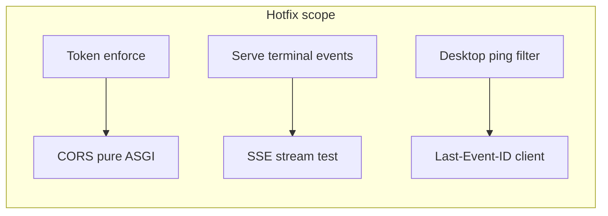

# Team v1.3.1 Hotfix 计划

> 依据 [team_v1.3 实施计划](.cursor/plans/team_v1.3_实施计划_1a5b3280.plan.md) 与 [PRD](prd/team_v1.3_desktop&serve_task.md) §6.3–6.4、§8.8 对当前实现的 review。**不修改**原计划文件。

## Review 结论：「高 — 建议优先修」清单

| ID | 问题 | 现状证据 | 影响 |
|----|------|----------|------|
| **H1** | 全局 Workbench SSE 未过滤 `ping` | [`TaskWorkbenchScreen.tsx`](copilot-desktop/src/renderer/src/screens/TaskWorkbench/TaskWorkbenchScreen.tsx) L115–121：任意 SSE 消息都 `reloadLists()`；时间线流 L139 已 `if (msg.event === "ping") return` | 每 ~10s 全量 HTTP 刷新，违背 PRD heartbeat 语义 |
| **H2** | `execute_run` 同步终态未写 `task_events` | [`task_runtime.py`](copilot-serve/src/services/task_runtime.py) L324–339：`completed`/`failed` 分支仅 `sync_service.enqueue`，无 `append_event` | Timeline / 全局 SSE 缺 `task_completed`/`task_failed`，B2 终态 30s 关流可能永不触发 |
| **H3** | Task H Token 未闭环 | [`copilot-serve-process.ts`](copilot-desktop/src/main/copilot-serve/copilot-serve-process.ts) L100 硬编码 `COPILOT_REQUIRE_TOKEN: "false"`；Serve 侧 [`verify_desktop_token`](copilot-serve/src/api/deps.py) 已挂 router 但未生效 | 生成 token 却不校验，与 PRD §8.8 不符 |
| **H4** | JSON API 缺 CORS | [`app.py`](copilot-serve/src/app.py) 无全局 CORS；仅 [`STREAM_SSE_HEADERS`](copilot-serve/src/services/sse_helpers.py) 且 `Allow-Origin` 固定 `http://127.0.0.1` | Vite dev（`http://localhost:*`）下 `fetch` 任务 API 可能失败；Electron 跨源时同样风险 |
| **H5** | Desktop 未实现 Last-Event-ID 重连 | [`workbench-stream.ts`](copilot-desktop/src/renderer/src/lib/copilot-serve/workbench-stream.ts) 支持 header，但 Screen 未维护 `lastEventId`；时间线 `lastId` 在 callback 更新却未用于断线重连 | 不符合 PRD §6.4.3–4；重连会重复拉全量事件 |
| **H6** | SSE 无真实 HTTP 流测试 | [`test_task_workbench_stream.py`](copilot-serve/tests/api/test_task_workbench_stream.py) 只测 REST + `format_sse` | 无法回归「流式不被中间件缓冲」类回归（v1.3 曾因此降级测试） |

---

## H1 — Desktop：全局 SSE 忽略 ping

**文件**：[`TaskWorkbenchScreen.tsx`](copilot-desktop/src/renderer/src/screens/TaskWorkbench/TaskWorkbenchScreen.tsx)

**改动**：
- 全局 `subscribeSse` 回调与 PRD §7.2 一致：仅 `task_created` / `task_updated` / `approval_created`（或 `workbench_event` 字段）触发 `reloadLists` / `reloadDetail`
- 忽略 `event === "ping"` 及 `data.type === "ping"`

**验收**：打开 Task Workbench，Network 面板观察：ping 间隔内不应出现周期性 `GET /tasks` _burst。

---

## H2 — Serve：`execute_run` 同步终态补 `append_event`

**文件**：[`task_runtime.py`](copilot-serve/src/services/task_runtime.py)

**改动**（与既有 `mark_completed` / `mark_failed` 对齐）：
- `raw_status in {completed, success, done}` → `append_event(..., "task_completed", run_id=..., payload=...)`
- `raw_status in {failed, error}` → `append_event(..., "task_failed", ...)`

**验收**：Mock Gateway 同步返回 `completed` 时，`GET /api/v1/tasks/{id}/events` 含 `task_completed` 且带 `event_payload`。

---

## H3 — Token：Main spawn 与 Serve 校验联动

**Desktop** — [`copilot-serve-process.ts`](copilot-desktop/src/main/copilot-serve/copilot-serve-process.ts)：
- spawn env 改为 `COPILOT_REQUIRE_TOKEN: "true"`（与注入的 `COPILOT_DESKTOP_TOKEN` 配套）
- 保留 `getConnection()` 在 `running` 后返回 token（已有逻辑）

**Serve** — 保持 [`api/router.py`](copilot-serve/src/api/router.py) 的 `Depends(verify_desktop_token)`；[`health`](copilot-serve/src/api/v1/health.py) 已在 deps 白名单。

**测试** — [`tests/conftest.py`](copilot-serve/tests/conftest.py) 或单测：`monkeypatch COPILOT_REQUIRE_TOKEN=true` + 无 header → 401；带 header → 200。

**清理**：删除未使用的 [`token_auth.py`](copilot-serve/src/api/middleware/token_auth.py) 中 `build_desktop_token_middleware`（或整文件若仅余死代码），避免与 deps 双轨。

---

## H4 — CORS：不缓冲的纯 ASGI 层（修复 JSON + 扩展 SSE Origin）

**问题根因**：FastAPI `@app.middleware("http")` / `BaseHTTPMiddleware` 会缓冲 `StreamingResponse`（v1.3 实施时已踩坑）。

**方案**：在 [`app.py`](copilot-serve/src/app.py) 增加 **纯 ASGI** CORS 包装（参考 Starlette `CORSMiddleware` 模式，仅 `send` 拦截加头，不读 body）：
- `allow_origins` 来自 [`config.cors_allow_origins`](copilot-serve/src/core/config.py)（默认 `http://127.0.0.1,http://localhost`）
- 处理 `OPTIONS` 预检
- **不**使用 `BaseHTTPMiddleware`

**同步**：[`STREAM_SSE_HEADERS`](copilot-serve/src/services/sse_helpers.py) 的 `Access-Control-Allow-Origin` 改为与请求 `Origin` 匹配（或在流响应生成时动态设置），避免只允许 `127.0.0.1` 而 dev 为 `localhost`。

**验收**：
- `curl -N .../events/stream` 首包可见 `ping-start` 或业务事件（<2s）
- Renderer `fetch` `POST /api/v1/tasks` 在 `Origin: http://localhost:5173` 下成功

---

## H5 — Desktop：Last-Event-ID 状态与重连

**文件**：
- [`TaskWorkbenchScreen.tsx`](copilot-desktop/src/renderer/src/screens/TaskWorkbench/TaskWorkbenchScreen.tsx)
- 可选小改 [`workbench-stream.ts`](copilot-desktop/src/renderer/src/lib/copilot-serve/workbench-stream.ts)：`onMessage` 返回 `SseMessage` 供上层更新 cursor

**改动**：
- `useRef` 保存 `lastGlobalEventId` / `lastTimelineEventId`
- 非 ping 消息且带 `msg.id` 时更新 ref
- SSE 连接异常结束后：带 `Last-Event-ID` 延迟重连（简单指数退避 1 次即可，避免无限循环）
- 时间线切换 `selectedId` 时重置 timeline cursor

**验收**：断网恢复后不应重复推送已消费事件（Serve 侧 `list_*_after` 已支持）。

---

## H6 — Serve：真实 SSE HTTP 测试

**文件**：
- [`tests/api/test_task_workbench_stream.py`](copilot-serve/tests/api/test_task_workbench_stream.py)
- [`tests/api/test_task_events_stream.py`](copilot-serve/tests/api/test_task_events_stream.py)

**改动**（在 H4 完成后）：
- 使用 `httpx` `client.stream("GET", ".../events/stream")` + `asyncio.timeout(5)`
- 先 `POST /tasks` 创建任务，再读流，断言 body 含 `event:` 与 `task_created`（或先收到 `ping-start` 后收到业务事件）
- 保留现有 REST/`format_sse` 断言作为补充

**验收**：`pytest tests/api -q` 全绿且含流式用例。

---

## 不在本次 hotfix 范围（中/低，记录备查）

- Task G 目录拆分（`components/` / `hooks/`）— 计划结构偏差，非功能缺陷
- Desktop 启动时自动 `alembic upgrade head` — 运维增强
- [`docs/ARCHITECTURE.md`](copilot-desktop/docs/ARCHITECTURE.md) 补 V1.3 章节 — 文档项
- 列表筛选 / ApprovalModal 独立组件 — PRD UI 增强

---

## 建议实施顺序

1. **H2**（Serve 事件完整性，无依赖）
2. **H4**（CORS ASGI，解锁 H6）
3. **H3**（Token）
4. **H6**（SSE 测试）
5. **H1 + H5**（Desktop SSE 行为，可同 PR）
6. 跑 `pytest tests/api tests/test_v1_acceptance.py` + `copilot-desktop npm run typecheck`

## 完成定义（DoD）

- [ ] 6 项 H1–H6 均有对应代码变更与上述验收通过
- [ ] 不修改 [team_v1.3_实施计划](.cursor/plans/team_v1.3_实施计划_1a5b3280.plan.md)
- [ ] 可选：在 `copilot-serve/CHANGELOG` 或 `AGENT.md` 增加 **v1.3.1 hotfix** 一行说明（非必须）
