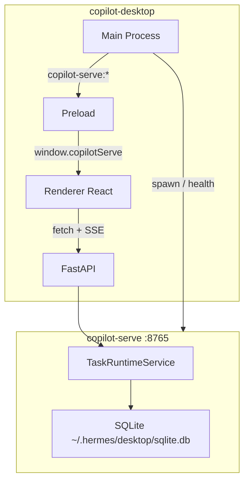
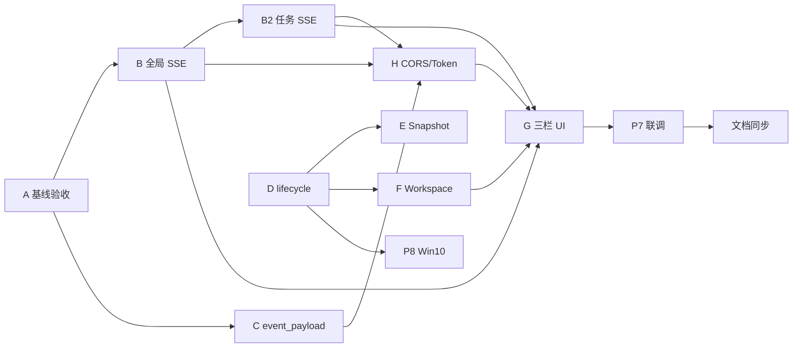

# Agent Team v1.3 实施计划（修订版）

> 对照 [prd/team_v1.3_desktop&serve_task.md](prd/team_v1.3_desktop&serve_task.md)。  
> **代码布局约定**：`copilot-serve` 使用**扁平** [`src/`](copilot-serve/src/)（`from core.xxx`、`main:app`），**不再**使用 `src/ai_copilot_serve/` 子目录。  
> **i18n 约定**：`copilot-desktop` 仅维护 **en / zh-CN**（[`src/shared/i18n/locales/`](copilot-desktop/src/shared/i18n/locales/)）。

## 全局架构



## 执行顺序



**并行**：Serve 链（B/B2/C/H）与 Desktop 链（D→E→F→G）可并行；**G 依赖 B + B2 + H**。

---

## Task A — copilot-serve 工程基线 (P0) ✅ 已基本完成

**目标**：开发/打包/迁移命令稳定，与当前仓库一致。

**已完成**（验收即可，勿再迁移 `ai_copilot_serve/` 子目录）：

| 项 | 约定 |
|----|------|
| 源码 | 扁平 [`copilot-serve/src/`](copilot-serve/src/)：`api/`、`core/`、`main.py` 等 |
| 导入 | `from core.config`、`from api.router`（`PYTHONPATH=src` 或 `pip install -e`） |
| 启动 | `uvicorn main:app --app-dir src --host 127.0.0.1 --port 8765` |
| CLI | `pyproject.toml` → `ai-copilot-serve = "main:main"` |
| SQLite 默认 | `~/.hermes/desktop/sqlite.db`（`SQLITE_PATH` 可覆盖） |
| 建表 | **生产仅 Alembic**；`init_db(create_all)` 仅测试 [`tests/conftest.py`](copilot-serve/tests/conftest.py) |
| 遗留 | 根目录 `app/` 已重命名为 `_legacy_app/`，避免与 `src/app.py` 冲突 |

**验收**：

```bash
cd copilot-serve
pip install -e ".[dev]"
alembic upgrade head
uvicorn main:app --app-dir src --host 127.0.0.1 --port 8765
curl http://127.0.0.1:8765/api/v1/health
pytest
```

---

## Task B — 全局 Workbench SSE (P1)

**目标**：`GET /api/v1/desktop/task-workbench/events/stream`

**变更文件**：

- [`src/api/v1/desktop_workbench.py`](copilot-serve/src/api/v1/desktop_workbench.py) — 新增 stream 路由
- [`src/services/workbench_event_stream.py`](copilot-serve/src/services/workbench_event_stream.py) — 新建
- [`src/db/repositories/v12_repos.py`](copilot-serve/src/db/repositories/v12_repos.py) — `list_recent_global_events(after_id)`

**事件**：`task_created` / `task_updated` / `approval_created` / `ping`（每 10s）

**要求**：全局读 `task_events`；`Last-Event-ID`；客户端断开即停；`text/event-stream`

**测试**：新增 `tests/api/test_task_workbench_stream.py`

**验收**：`curl -N http://127.0.0.1:8765/api/v1/desktop/task-workbench/events/stream`

---

## Task B2 — 任务级 Timeline SSE 增强 (P1', PRD §6.4)

**目标**：增强现有 [`src/api/v1/tasks.py`](copilot-serve/src/api/v1/tasks.py) `/{task_id}/events/stream`

**相对现状补齐**：

| 项 | 说明 |
|----|------|
| `event_payload` | SSE data 含完整字段 |
| `run_id` | 与 PRD JSON 示例一致 |
| heartbeat | 空闲时 `ping` |
| `Last-Event-ID` | 断线重连 |
| 结束策略 | 任务 `completed`/`failed`/`cancelled` 后 **再推 30s** 再关闭流 |

**测试**：新增 `tests/api/test_task_events_stream.py`

---

## Task C — task_events 写入审计 (P2)

**目标**：状态流转均有可追溯事件，且带结构化 `event_payload`。

**文件**：[`src/services/task_runtime.py`](copilot-serve/src/services/task_runtime.py)

**已具备**（代码库现状，验收时核对即可）：

- `routing`（`apply_routing`）
- `hermes_run_created`（`execute_run`，含 `run_id`）
- `task_created` / `task_ingested` / `approval_requested` / `task_completed` / `task_failed` / `task_cancelled`

**待审计**：所有 `append_event` 调用是否传入 `event_payload`（JSON）；与 B/B2 推送字段一致。

**说明**：`TaskListenerWorker` / `RunEventWorker` 在 [`src/workers/v12_workers.py`](copilot-serve/src/workers/v12_workers.py)，PRD 中的 `team_task_listener.py` / `run_event_bridge.py` **不强制拆文件**。

---

## Task D — Desktop copilot-serve 生命周期 (P3)

**目标**：Main 管进程；Preload 暴露 `window.copilotServe`；**不含**任务业务 API。

**新增**（[`copilot-desktop/`](copilot-desktop/)）：

| 路径 | 职责 |
|------|------|
| `src/shared/copilot-serve/copilot-serve-contract.ts` | 类型契约 |
| `src/main/copilot-serve/copilot-serve-process.ts` | spawn、pid、port、baseUrl |
| `src/main/copilot-serve/copilot-serve-paths.ts` | 解析 serve 安装/源码路径 |
| `src/main/copilot-serve/copilot-serve-health.ts` | `GET /api/v1/health` |
| `src/main/copilot-serve/copilot-serve-ipc.ts` | IPC 注册 |
| `src/main/copilot-serve/copilot-serve-logs.ts` | `~/.hermes/desktop/copilot-serve.log` |
| `src/preload/copilot-serve-api.ts` | contextBridge |

**修改**：`src/preload/index.ts`、`index.d.ts`、`src/main/index.ts`（`setupIPC` 内注册）

**IPC**：`copilot-serve:get-connection|get-status|start|stop|restart|get-logs` + `on-status-changed`

**启动建议**：

```text
cwd: <copilot-serve 根目录>
command: uvicorn main:app --app-dir src --host 127.0.0.1 --port 8765
env:
  SQLITE_PATH=<USERPROFILE>/.hermes/desktop/sqlite.db  (或 ~/.hermes/...)
  COPILOT_DESKTOP_TOKEN=<random>   # 与 Task H 联动
windowsHide: true
```

---

## Task E — Runtime Snapshot (P4)

- [`src/shared/aios/aios-contract.ts`](copilot-desktop/src/shared/aios/aios-contract.ts)：`AiOsServiceId` 增加 `"copilot-serve"`
- [`src/main/aios/aios-runtime-supervisor.ts`](copilot-desktop/src/main/aios/aios-runtime-supervisor.ts)：`http://127.0.0.1:8765/api/v1/health`

---

## Task F — Workspace 注册 task-workbench (P5)

**修改**：

- [`workspace-contract.ts`](copilot-desktop/src/shared/workspace/workspace-contract.ts) — `'task-workbench'`
- [`workspace-registry.ts`](copilot-desktop/src/renderer/src/workspace/workspace-registry.ts)
- [`WorkspaceRenderer.tsx`](copilot-desktop/src/renderer/src/components/workspace/WorkspaceRenderer.tsx)
- [`workspace-secondary-nav.ts`](copilot-desktop/src/shared/workspace/workspace-secondary-nav.ts) — 按需（三栏同屏时侧栏可极简或空数组）
- **i18n（仅 en / zh-CN）**：[`locales/en/navigation.ts`](copilot-desktop/src/shared/i18n/locales/en/navigation.ts)、[`locales/zh-CN/navigation.ts`](copilot-desktop/src/shared/i18n/locales/zh-CN/navigation.ts) — `taskWorkbench` 等

```ts
{
  id: "task-workbench",
  titleKey: "navigation.taskWorkbench",
  kind: "react",
  closeable: false,
  draggable: false,
  persistable: true,
  source: "local",
}
```

---

## Task G — Task Workbench UI (P6)

**目录**：`copilot-desktop/src/renderer/src/`

```
lib/copilot-serve/
  http-client.ts      # baseUrl + X-Copilot-Desktop-Token
  task-client.ts      # /api/v1/tasks、bind-profile、run、cancel
  approval-client.ts  # /api/v1/approvals
  team-task-client.ts # POST /api/v1/team-tasks/pull
  workbench-stream.ts
  types.ts

screens/TaskWorkbench/
  TaskWorkbenchScreen.tsx
  components/  (Header, TaskList, TaskDetailPanel, ExecutionTimeline, ApprovalModal, ProfileBindingSelect, EmptyState)
  hooks/       (useTaskList, useTaskDetail, useTaskTimelineStream, useWorkbenchEventStream, usePendingApprovals)
```

**Serve API 对照**（Renderer 直调，不经 Main）：

| UI | API |
|----|-----|
| 列表/筛选 | `GET /api/v1/tasks` |
| 详情 | `GET /api/v1/tasks/{id}` |
| 创建 | `POST /api/v1/tasks` |
| Team Hub 拉取 | `POST /api/v1/team-tasks/pull` |
| 绑定 Profile | `POST /api/v1/tasks/{id}/bind-profile` |
| 执行/取消 | `POST .../run`、`POST .../cancel` |
| 审批 | `GET /approvals/pending`、`POST .../approve|reject` |
| 全局刷新 | B: `.../task-workbench/events/stream` |
| 时间线 | B2: `.../tasks/{id}/events/stream` |
| 摘要 | `GET .../task-workbench/summary` |

**技术**：SSE 用 `fetch + ReadableStream`（非 `EventSource`，需自定义 Token header）。

---

## Task H — CORS + Local Token (P8)

- [`src/app.py`](copilot-serve/src/app.py) — CORS（`127.0.0.1`）
- [`src/core/config.py`](copilot-serve/src/core/config.py) — `COPILOT_DESKTOP_TOKEN`、`COPILOT_REQUIRE_TOKEN`
- `src/api/middleware/token_auth.py` — 校验 `X-Copilot-Desktop-Token`

**流转**：Main spawn 注入 token → Renderer `getConnection().token` → fetch/SSE header。

---

## P7 — 端到端联调

手动/script 验收链：

```text
启动 serve（D）→ 打开 Task Workbench（F/G）
→ 创建本地任务 → Team Hub pull（stub）
→ 绑定 Profile → run → 时间线事件
→ 触发审批 → approve → 完成/失败
→ 列表经全局 SSE 自动刷新
```

---

## P8 — Windows 10 验证

- `windowsHide: true` 启动 Python/uvicorn
- 桌面启动后无多余 CMD 窗口
- 日志写入 `~/.hermes/desktop/copilot-serve.log`

---

## 文档同步

| 项目 | 文件 |
|------|------|
| copilot-desktop | `AGENTS.md`（V1.3 / copilotServe）、`docs/API_CONTRACTS.md`、`docs/ARCHITECTURE.md` |
| copilot-serve | `AGENT.md`、`docs/api-contract.md`（B/B2 端点） |
| Portal 主仓 | 仅当有跨包契约变更时更新根 `AGENTS.md` / `docs/INDEX.md` |

---

## 验收 Checklist

**copilot-serve**

- [ ] `uvicorn main:app --app-dir src` 正常
- [ ] `alembic upgrade head` 对 `~/.hermes/desktop/sqlite.db` 生效
- [ ] `curl /api/v1/health` 200
- [ ] 全局 + 任务级 SSE 满足 B/B2
- [ ] `pytest` 含新增 stream 测试

**copilot-desktop**

- [ ] `npm run typecheck` / `npm test`
- [ ] Task Workbench Tab 可见（en/zh-CN 文案）
- [ ] `window.copilotServe` 生命周期可用
- [ ] 三栏 + 审批 + 无 Main 侧任务业务逻辑
- [ ] P8 Windows 无 CMD 弹窗
