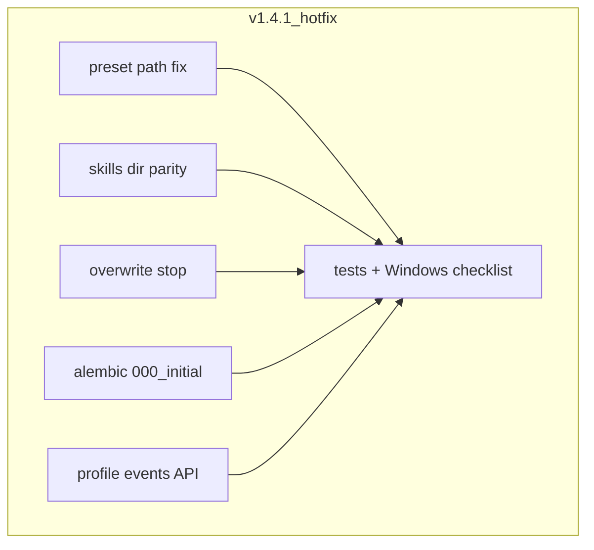

# team_v1.4.1_hotfix 实施计划

> 依据 [team_v1.4 实施计划](.cursor/plans/team_v1.4_multi_profiles_861a9652.plan.md) review 结论与 [PRD](prd/team_v1.4_multi-profiles.md) §9.1。**不修改** v1.4 原计划文件；变更落在 `copilot-serve/`、`copilot-desktop/` 独立 git 子仓库。

## 范围与验收总览

| ID | 问题 | 验收 |
|----|------|------|
| P0 | `_resolve_preset_yaml` 将 `team_v1.4` 误解析为 `team_v1_4` | 不传 `preset_yaml` 时加载 [hermes-expert-profiles.team_v1.4.yaml](copilot-serve/resources/profile-presets/hermes-expert-profiles.team_v1.4.yaml)；pytest 断言 YAML 含 `version: team_v1.4` |
| P1 | Serve 技能文件扁平拷贝 | 路径为 `skills/role-source/agency-agents-zh/<rel>`，与 [role-file-writer.ts](copilot-desktop/src/main/profile-roles/role-file-writer.ts) 一致 |
| P2 | overwrite 删库前未 stop | overwrite 前 `stop_profile`；进程在跑时无孤儿 PID |
| P3 | Alembic 无基线 | 新增 `000_initial` + 文档 brownfield/greenfield 路径 |
| P4 | 缺 `GET /profiles/{id}/events` | REST 聚合 task_events + start/stop/restart 写 `audit_logs` |
| P5 | 测试/联调缺口 | mock git service 测试、Desktop preview 冲突测试、Windows 6 端口清单 |



---

## P0 — Preset YAML 路径解析

**文件**：[role_library_service.py](copilot-serve/src/services/role_library_service.py)

**改动**：
- 抽取 `preset_filenames_for_version(version: str) -> list[str]`，与 Desktop [role-preset-installer.ts](copilot-desktop/src/main/profile-roles/role-preset-installer.ts) 对齐：
  - `team_v1.4` / 默认 → `["hermes-expert-profiles.team_v1.4.yaml", "hermes-expert-profiles.v1.yaml"]`
  - `v1` / `1` → `["hermes-expert-profiles.v1.yaml"]`
  - 其它版本：先尝试字面量 `hermes-expert-profiles.{version}.yaml`，再尝试 `replace(".","_")` 作为兜底
- **删除**单独的 `version.replace(".", "_")` 作为主路径逻辑

**测试**（新增/扩展 [tests/test_role_library_import.py](copilot-serve/tests/test_role_library_import.py) 或 `test_role_library_preset_resolve.py`）：
- `POST /api/v1/profiles/import-preset` 仅传 `{"preset_version":"team_v1.4","overwrite":false}`（无 `preset_yaml`、mock `sync_library` 返回空目录或 skip sync via monkeypatch）
- 断言响应未因 `FileNotFoundError` 失败，且解析到的 YAML 含 `version: team_v1.4`（可对 `import_preset` 做单元测试直接调 `_resolve_preset_yaml`）

---

## P1 — Serve `compile_role_files` 目录结构对齐 Desktop

**文件**：[role_compiler.py](copilot-serve/src/integrations/hermes/role_compiler.py)

**改动**：
```python
ROLE_SOURCE_SUBDIR = "agency-agents-zh"
# dest = profile_home / "skills" / "role-source" / ROLE_SOURCE_SUBDIR / rel
# copied_rel = f"skills/role-source/{ROLE_SOURCE_SUBDIR}/{rel}"
```
- `profile-role.json` 的 `generatedFiles` 使用完整相对路径（与 Desktop manifest 一致）
- 更新 [tests/test_role_compiler.py](copilot-serve/tests/test_role_compiler.py)：断言拷贝路径含 `agency-agents-zh/marketing/...`

**注意**：已用 v1.4 Serve import 生成的 Profile Home 在 hotfix 后需 **Recompile Role** 或 reinstall 才能修正磁盘布局（在 AGENT.md / 发布说明中写一句）。

---

## P2 — overwrite 前停止 Gateway

**文件**：
- [role_library_service.py](copilot-serve/src/services/role_library_service.py)
- [api/deps.py](copilot-serve/src/api/deps.py)

**改动**：
- `RoleLibraryService.__init__` 增加可选 `gateway_supervisor: GatewaySupervisor | None`
- `get_role_library_service` 注入 `GatewaySupervisor`（与 [get_gateway_supervisor](copilot-serve/src/api/deps.py) 同源 app.state 测试 supervisor）
- 在 `import_preset` 的 `if existing and body.overwrite:` 分支：
  1. `await supervisor.stop_profile(existing.id)`（`try/except`：已 stopped 则忽略）
  2. 再删 `ProfileRoleSpec` + `Profile`

**测试**（[tests/test_role_library_import.py](copilot-serve/tests/test_role_library_import.py) 或 service 单测）：
- mock supervisor 记录 `stop_profile` 被调用一次后再 delete

---

## P3 — Alembic 基线迁移 + 部署文档

**现状**：[001_add_role_spec_and_profile_fields.py](copilot-serve/migrations/versions/001_add_role_spec_and_profile_fields.py) `down_revision=None`，仅 `ALTER profiles` + `CREATE profile_role_specs`，空库 `upgrade head` 会失败。

**改动**：
1. 新增 `migrations/versions/000_initial_schema.py`（`revision=000_initial`，`down_revision=None`）  
   - 创建 v1.3 已有表：`profiles`（**不含** v1.4 四列）、`local_tasks`、`task_events`、`approvals`、`audit_logs`、`sync_outbox`、`team_task_bindings`、`workspaces` 等（与 [db/models/__init__.py](copilot-serve/src/db/models/__init__.py) 一致）
   - 实现方式：`alembic revision` + 对照各 model 手写 `op.create_table`，或空库 `init_db` 后 `alembic revision --autogenerate` 再人工删减重复
2. 修改 `001_role_spec`：`down_revision = "000_initial"`（revision id 保持不变，避免已 stamp 环境混乱；若本地无人 stamp 可安全改链）
3. 更新 [copilot-serve/AGENT.md](copilot-serve/AGENT.md)「Database / Migrations」小节：

| 场景 | 命令 |
|------|------|
| 全新库 | `uv run alembic upgrade head` |
| 旧库（曾用测试 `init_db` 或手工表，已有 profiles 无 role_spec 列） | `alembic stamp 000_initial` → `alembic upgrade head` |
| 已跑过 v1.4 增量 SQL 手工补丁 | `alembic stamp 001_role_spec` |

**验收**：临时空 SQLite 文件执行 `upgrade head` 成功且存在 `profile_role_specs` 表。

---

## P4 — `GET /profiles/{profile_id}/events`（REST + audit）

用户选择：**REST 列表 + start/stop/restart 写 audit_logs**。

### 4.1 Schema & Repository

**新增** [schemas/profile_events.py](copilot-serve/src/schemas/profile_events.py)（或扩 [schemas/profile.py](copilot-serve/src/schemas/profile.py)）：
```python
class ProfileEventResponse(BaseModel):
    id: str
    source: Literal["task", "audit"]  # 区分来源
    event_type: str
    task_id: str | None = None
    message: str | None = None
    event_payload: str | None = None
    created_at: datetime
```

**扩展** [v12_repos.py](copilot-serve/src/db/repositories/v12_repos.py)：
- `TaskEventRepository.list_by_profile_id(profile_id, limit=200)`：`JOIN local_tasks ON task_events.task_id = local_tasks.id WHERE local_tasks.target_profile_id = :id`
- `AuditLogRepository.list_by_profile_id(profile_id, limit=200)`：`payload_json` JSON 含 `profile_id` 或新增列（**hotfix 优先 JSON 过滤**，避免二次 migration；若性能差再 v1.5 加列）

### 4.2 运行时审计写入

**文件**：[gateway_supervisor.py](copilot-serve/src/services/gateway_supervisor.py)

在 `start_profile` / `stop_profile` / `restart_profile` 成功或失败路径调用小函数 `append_profile_audit(session, profile_id, action, payload)`：
- `action`: `profile_started` / `profile_stopped` / `profile_restart_failed` 等
- `payload_json`: `{"profile_id":"...","status":"...","gateway_port":...}`

需在各 `_with_session` 分支内 commit 前写入（与现有 task `append_event` 模式对齐）。

### 4.3 API

**文件**：[profiles.py](copilot-serve/src/api/v1/profiles.py)

```python
@router.get("/{profile_id}/events", response_model=list[ProfileEventResponse])
async def profile_events(profile_id, session, limit=200):
    # 404 if profile missing
    # merge task events + audit events, sort by created_at
```

**测试** [tests/api/test_profile_events.py](copilot-serve/tests/api/test_profile_events.py)：
- 创建 profile → start（mock gateway）→ `GET .../events` 含 `profile_started`
- 创建 task + `bind-profile` + `append_event` → events 含 task 来源事件

**PRD 同步**：在 [prd/team_v1.4_multi-profiles.md](prd/team_v1.4_multi-profiles.md) §9.1 补充 events 响应语义（REST 列表，非 SSE；SSE 仍用 `/desktop/task-workbench/events/stream`）。

---

## P5 — 测试补齐 + Windows 联调

### 5.1 Serve — `test_role_library_service.py`

**新增** [tests/test_role_library_service.py](copilot-serve/tests/test_role_library_service.py)：
- **mock git**：monkeypatch `RoleLibraryService._run_git` / `asyncio.create_subprocess_exec`，返回假 commit
- **sync_library**：断言 `ok=True`、path 正确
- **recompile_role**：tmp `source_root` + 内联 `source_paths`，不触网
- **import_preset overwrite**：断言 mock `stop_profile` 调用（P2）

### 5.2 Desktop — preview 端口冲突

**扩展** [tests/preset-installer.test.ts](copilot-desktop/tests/preset-installer.test.ts)：
- `initProfileRuntimeDb()` + 插入占用 9601 的 profile
- `previewExpertPresetInstall({ presetVersion: "team_v1.4" })` → `canInstall === false`，`portConflicts` 含 `writer-9601`

（vitest 需隔离 tmp DB 或测试后清理，参考现有 profile-runtime 测试模式。）

### 5.3 Windows 6 端口联调（手工清单）

写入 hotfix 验证节（可附于 PR 描述或 `copilot-serve/AGENT.md` §Verification）：

1. `cd copilot-serve && uv run alembic upgrade head`
2. Desktop：Settings → Install preset `team_v1.4`（overwrite 可选）
3. Sync Role Library → 6 profiles Start（或 startAll）
4. 浏览器/curl：`http://127.0.0.1:9601/health` … `9641/health` 均 200
5. 停一个 profile 再 start，确认其它端口仍健康
6. `GET /api/v1/profiles/{id}/events` 可见 start/stop 审计

**不纳入 CI**（环境依赖 hermes CLI / 实机端口）。

### 5.4 回归命令

```bash
cd copilot-serve && uv run pytest tests/test_role_compiler.py tests/test_role_library_import.py tests/test_role_library_service.py tests/api/test_profiles_restart.py tests/api/test_profile_events.py tests/test_v1_acceptance.py -q

cd copilot-desktop && pnpm exec vitest run tests/role-compiler.test.ts tests/preset-installer.test.ts
```

---

## 文件变更清单（按优先级）

| 优先级 | 路径 |
|--------|------|
| P0 | `copilot-serve/src/services/role_library_service.py` + tests |
| P1 | `copilot-serve/src/integrations/hermes/role_compiler.py` + `tests/test_role_compiler.py` |
| P2 | `role_library_service.py`, `api/deps.py` + tests |
| P3 | `migrations/versions/000_initial_schema.py`, `001_*.py`, `AGENT.md` |
| P4 | `gateway_supervisor.py`, `profiles.py`, `schemas/*`, `v12_repos.py`, `tests/api/test_profile_events.py`, `prd/team_v1.4_multi-profiles.md` |
| P5 | `tests/test_role_library_service.py`, `copilot-desktop/tests/preset-installer.test.ts` |

---

## 风险与不在范围

- **Serve import 仍不写入** `profile_entries` / `profile_capabilities`（PRD §10 Desktop 表；Serve DB 无对应表）— 本 hotfix 不扩 scope；Desktop 安装路径不变。
- **已生成扁平 skills 目录** 的 Profile 需 recompile（P1 说明）。
- **P4 audit 用 payload_json 过滤**：数据量大时 v1.5 可加 `audit_logs.profile_id` 列与索引。

---

## 建议实施顺序

P0 → P1 → P2 → P3 → P4 → P5（测试随各 Phase 同行提交）。
