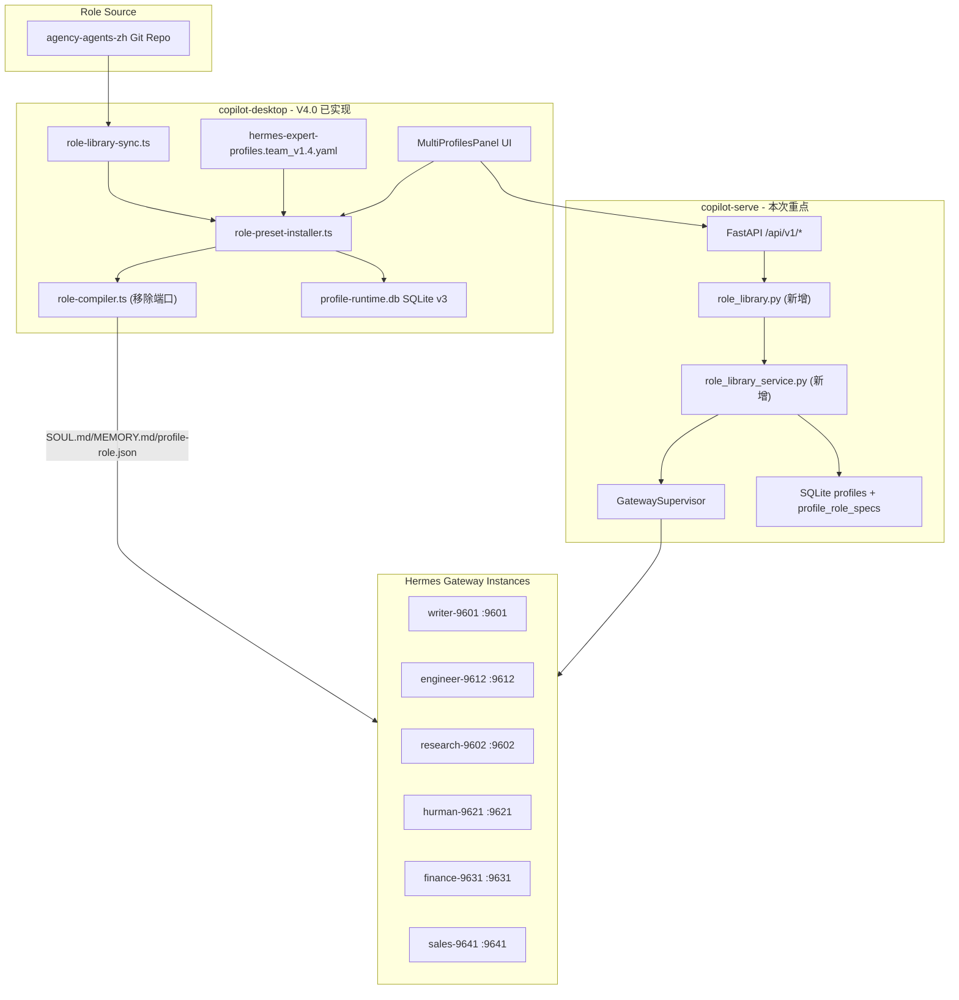

# team_v1.4 Multi Profiles 专家角色初始化 实施计划（修订版）

> 探索结果表明 copilot-desktop V4.0 多 Profile 基础设施**已完整落地**（preset YAML、role-compiler、role-install-service、preset-installer、IPC、UI）。本计划聚焦 **Serve 端补齐** + **Desktop 端微调**。

---

## 现状分析

### copilot-serve（Python FastAPI，端口 8765）

**已实现**：
- Profile CRUD API（7 端点：list/create/get/update/delete/start/stop）
- `GatewaySupervisor`（启停 + 健康轮询 + 日志 + shutdown_all）
- `ProfileService`（CRUD + set_status）
- SQLAlchemy `Profile` 模型（id/name/type/port/enabled/auto_start/status/pid）
- `GatewayProcessManager`（子进程管理、日志文件）
- `HermesGatewayClient`（health_check/list_models/create_run/stream）
- `ProfileType` 枚举：DEFAULT/WRITER/CODING/FINANCE/RESEARCH

**缺失**（team_v1.4 需补齐）：
- `ProfileRoleSpec` 模型/表（role_key、role_name、source_repo、source_paths_json、soul_path、checksum）
- Profile 模型扩展（display_name、description、role 字段）
- `POST /profiles/{id}/restart` 端点
- `GET /profiles/{id}/health` 专用端点
- Role Library 管理：sync、import-preset、recompile、list-specs
- Alembic migration（`migrations/versions/` 当前为空）

关键文件：
- [src/api/v1/profiles.py](copilot-serve/src/api/v1/profiles.py)
- [src/services/gateway_supervisor.py](copilot-serve/src/services/gateway_supervisor.py)
- [src/services/profile_service.py](copilot-serve/src/services/profile_service.py)
- [src/db/models/profile.py](copilot-serve/src/db/models/profile.py)
- [src/core/constants.py](copilot-serve/src/core/constants.py)
- [src/api/router.py](copilot-serve/src/api/router.py) — 路由注册

### copilot-desktop（Electron + React + TypeScript）

**已实现（V4.0）**：
- `resources/profile-presets/hermes-expert-profiles.v1.yaml` — 6 个专家 Profile（9601-9641）
- `src/main/profile-roles/role-compiler.ts` — `compileProfileRole()`/`buildSoulMarkdown()`/`buildMemoryMarkdown()`
- `src/main/profile-roles/role-preset-installer.ts` — `previewExpertPresetInstall()`/`installExpertPreset()`
- `src/main/profile-roles/role-library-sync.ts` — `syncRoleLibrary()`
- `src/main/profile-roles/role-install-service.ts` — `installRoleSpecForProfile()`/`recompileRoleSpecForProfile()`
- `src/main/profile-runtime-manager.ts` — 完整生命周期（start/stop/restart/startAll）
- `src/main/profile-runtime-db.ts` — SQLite schema v3（含 `profile_role_specs`）
- Preload：`window.profileRole`（sync/preview/install/specs/recompile）、`window.profileRuntime`（启停/列表/日志）
- UI：`SettingsDrawer/multi-profiles/`（MultiProfilesPanel、ProfilePresetInstallCard、ProfileRuntimeActions、ProfileRoleSourceView、ProfileLogViewer）
- 共享类型：`src/shared/profile-roles/profile-role-contract.ts`、`src/shared/profile-runtime/profile-runtime-contract.ts`

**需修改（team_v1.4 PRD 要求）**：
- `buildSoulMarkdown()` 当前生成包含端口的身份描述（「在端口 {port} 上提供专家能力」）→ 需移除
- Preset 版本升级：当前为 `v1`，PRD 要求 `team_v1.4` 版本标记

---

## 实施步骤

### Phase 1: copilot-serve — 数据模型扩展 + Alembic 迁移

**修改文件**：
- `src/core/constants.py` — `ProfileType` 枚举新增 `SPECIALIST`/`ENGINEER`/`HURMAN`/`SALES`
- `src/db/models/profile.py` — `Profile` 模型新增：`display_name`(String)、`role`(String)、`role_name`(String)、`description`(Text)

**新增文件**：
- `src/db/models/role_spec.py` — `ProfileRoleSpec` 模型

```python
class ProfileRoleSpec(Base):
    __tablename__ = "profile_role_specs"
    id: Mapped[str]  # UUID PK
    profile_id: Mapped[str]  # FK profiles.id
    role_key: Mapped[str]
    role_name: Mapped[str]
    source_repo: Mapped[str]
    source_paths_json: Mapped[str]  # JSON array
    soul_path: Mapped[str | None]
    memory_path: Mapped[str | None]
    source_checksum: Mapped[str | None]
    output_mode: Mapped[str]  # "soul-memory-skill"
    created_at / updated_at
```

- `migrations/versions/001_add_role_spec_and_profile_fields.py` — Alembic 迁移

**修改**：`src/db/models/__init__.py` 导出新模型

### Phase 2: copilot-serve — Role Library Service + API

**新增文件**：

1. `src/schemas/role_library.py`

```python
class PresetImportRequest(BaseModel):
    preset_yaml: str | None = None  # 直接传 YAML 内容
    preset_version: str = "team_v1.4"
    overwrite: bool = False

class PresetImportResponse(BaseModel):
    ok: bool
    imported_count: int
    port_conflicts: list[dict]
    existing_without_overwrite: list[str]
    errors: list[str]

class RoleSpecResponse(BaseModel):  # from_attributes
    id, profile_id, role_key, role_name, source_repo, source_paths_json,
    soul_path, memory_path, source_checksum, output_mode, created_at

class RoleLibrarySyncResponse(BaseModel):
    ok: bool
    path: str
    commit: str | None
```

2. `src/services/role_library_service.py`

```python
class RoleLibraryService:
    async def sync_library(ref: str | None) -> RoleLibrarySyncResponse
    async def import_preset(body: PresetImportRequest) -> PresetImportResponse
    async def recompile_role(profile_id: str) -> RoleSpecResponse
    async def list_specs() -> list[RoleSpecResponse]
```

3. `src/db/repositories/role_spec_repo.py` — RoleSpec CRUD

4. `src/api/v1/role_library.py`

| 方法 | 路径 | 说明 |
|------|------|------|
| POST | `/role-library/sync` | git clone/fetch agency-agents-zh |
| POST | `/profiles/import-preset` | 解析 preset YAML → 批量创建 Profile + RoleSpec |
| POST | `/role-library/recompile/{profile_id}` | 重新编译 SOUL/MEMORY |
| GET | `/role-library/specs` | 列出所有 RoleSpec |

**修改文件**：
- `src/api/v1/profiles.py` — 新增 `restart` 和 `health` 端点
- `src/api/router.py` — 注册 `role_library.router`
- `src/api/deps.py` — 新增 `get_role_library_service` 依赖

### Phase 3: copilot-desktop — role-compiler 修复

**修改文件**：`src/main/profile-roles/role-compiler.ts`

当前 `buildSoulMarkdown()` 身份段：
```
你是 Hermes Desktop 中的{roleName}，在端口 {port} 上提供专家能力。
```

修改为（PRD §7 要求）：
```
你是 Hermes Desktop 中的{roleName}，负责{roleSummary}。
```

验证：`profile-role.json` manifest 仍保留 `port` 字段。

### Phase 4: copilot-desktop — Preset 版本升级

**新增文件**：`resources/profile-presets/hermes-expert-profiles.team_v1.4.yaml`
- 基于现有 `v1.yaml` 内容
- `version: team_v1.4`（替代 `v1`）
- 确保 6 个 profile 与 PRD §6 对齐（端口/角色名/sourcePaths）

**修改文件**：`src/main/profile-roles/role-preset-installer.ts`
- `resolveExpertPresetPath()` 支持按 `version` 参数选择 preset 文件
- 优先加载 `team_v1.4` 版本，向后兼容 `v1`

### Phase 5: 集成测试 + Windows 验证

**copilot-serve 测试**（`tests/`）：
- `test_role_library.py`：preset import 端口冲突、overwrite=false、批量创建、RoleSpec 持久化
- `test_profiles_restart.py`：restart = stop + start、状态转换正确
- `test_role_library_service.py`：sync（mock git）、recompile（mock 文件系统）

**copilot-desktop 测试**（`tests/`）：
- `role-compiler.test.ts`：断言 `buildSoulMarkdown()` 输出**不含**端口号
- `preset-installer.test.ts`：team_v1.4 版本解析、preview 端口冲突

**Windows 验证清单**：
- 一键导入 6 个 profile → SQLite 正确
- 多 profile 同时启动 → 各端口 `/health` 可达
- 单个 profile 失败不影响其它
- 无 CMD 弹窗

---

## 架构流程



---

## 关键约束

- **角色名称不带端口**：SOUL.md 标题 = 角色名（如"写作生文专家"），profile-role.json 可保留 port
- **Desktop 与 Serve 共享 preset schema**：roleSpec 字段定义保持一致（roleKey/roleName/sourceRepo/sourcePaths/outputMode）
- **单个 profile 失败不阻塞其它**：startAllProfiles() 逐个 try-catch 隔离
- **SQLite 只存路径/checksum**：源文件保留在 Profile Home 的 skills 目录
- **copilot-desktop 独立 git**：变更在 `copilot-desktop/` 内提交
- **copilot-serve 独立 git**：变更在 `copilot-serve/` 内提交
- **Alembic 首次迁移**：`migrations/versions/` 当前为空，需生成初始迁移（含全部现有模型 + 新增 role_spec 表）

---

## 工作量预估

| Phase | 范围 | 估计复杂度 |
|-------|------|-----------|
| Phase 1 | Serve 模型 + 迁移 | 中（模型定义 + Alembic 配置） |
| Phase 2 | Serve API + Service | 高（role_library_service 涉及 git/文件/YAML/编译） |
| Phase 3 | Desktop compiler 修复 | 低（一行身份文案修改 + 测试） |
| Phase 4 | Desktop preset 升级 | 低（复制 + 版本号 + installer 兼容） |
| Phase 5 | 测试 | 中（Serve pytest + Desktop vitest） |
