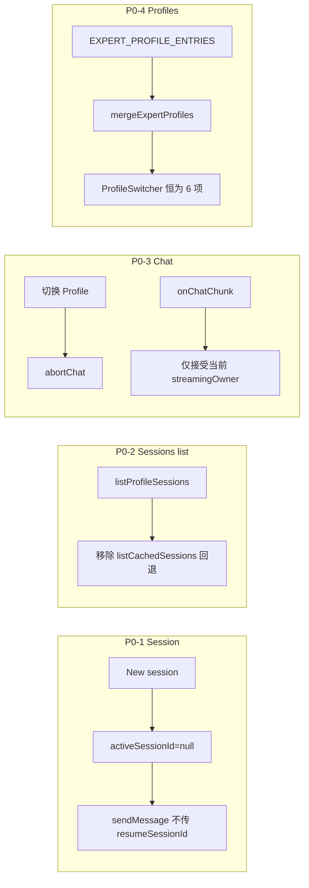

# team_v1.5.1_hotfix — P0 补丁计划

## 范围

仅包含上次 Review 的 **P0** 四项，不纳入 P1（health/Restart、重复轮询、路径 `root+sep`、`API_CONTRACTS` 等）。



---

## P0-1：新建 Session 不传假 `sessionId`

**问题**：[aiosWorkspaceApi.ts](copilot-desktop/src/renderer/src/screens/AIOSWorkspace/api/aiosWorkspaceApi.ts) 的 `createSession` 生成 `session-${Date.now()}`，随后 `sendMessage` 会把该 ID 当作 Hermes resume id，首条消息易失败。

**改法（Renderer-only）**：

1. **`createSession` 语义改为「开启新对话草稿」**
   - 在 [aiosWorkspaceApi.ts](copilot-desktop/src/renderer/src/screens/AIOSWorkspace/api/aiosWorkspaceApi.ts) 中删除假 ID 生成；可改为返回 `null` 或保留 API 签名但文档化「仅用于触发 UI 清空」。
   - 新增工具函数 `isPersistedSessionId(id: string | null): boolean`（例如：非空且不以 `session-` 本地前缀开头——或更简单：**仅当 id 存在且来自 DB/服务端列表选中时才视为 persisted**）。

2. **`sendMessage` 守卫**
   - 仅当 `sessionId` 为已持久化 session 时才传入 `hermesAPI.sendMessage` 第三参数；草稿态传 `undefined`，由 Main 在 `onDone` 返回真实 `sessionId`（见 [index.ts](copilot-desktop/src/main/index.ts) `chat-done`）。

3. **UI 接线**
   - [SessionList.tsx](copilot-desktop/src/renderer/src/screens/AIOSWorkspace/components/SessionList.tsx)：`New` 点击改为 `setActiveSessionId(null)`，不再 `createSession().then(s => setActiveSessionId(s.id))`。
   - [useProfileSessions.ts](copilot-desktop/src/renderer/src/screens/AIOSWorkspace/hooks/useProfileSessions.ts)：`createSession` 可简化为 no-op 或移除，由列表组件直接清 session。
   - [ChatHeader.tsx](copilot-desktop/src/renderer/src/screens/AIOSWorkspace/components/ChatHeader.tsx)：`activeSessionId == null` 时标题显示 i18n「新对话」（新增 key `aiosWorkspace.sessions.newDraft`）。
   - [useHermesChatStream.ts](copilot-desktop/src/renderer/src/screens/AIOSWorkspace/hooks/useHermesChatStream.ts)：`onMessageComplete` 收到 `sessionId` 后，通过 context 的 `setActiveSessionId` 写入，并触发 session 列表 `refetch`（在 ChatPanel 或 hook 内调用 `useProfileSessions` 的 refetch——可通过 context 增加 `sessionsVersion` bump 或暴露 refetch 回调）。

**验收**：新建 → 发首条消息 → `chat-done` 后出现真实 session id；列表在完成后刷新可见新 session。

---

## P0-2：Session 列表不按 Profile 串数据

**问题**：`listSessions` 在 `listProfileSessions` 为空时回退到全局 [listCachedSessions](copilot-desktop/src/main/session-cache.ts)（无 `profileId` 字段），切换专家会看到相同列表。

**改法**：

1. 在 [aiosWorkspaceApi.ts](copilot-desktop/src/renderer/src/screens/AIOSWorkspace/api/aiosWorkspaceApi.ts) 的 `listSessions`：
   - **删除** `listCachedSessions` fallback。
   - `listProfileSessions` 失败或空数组时返回 `[]`（可打 debug log，不向 UI 抛错）。

2. **`searchSessions`（P0 最小处理）**
   - 当前 [searchSessions](copilot-desktop/src/main/sessions.ts) 为全局 FTS，无法按 profile 过滤。
   - P0：**有关键字时**仍调用 `searchSessions`，但在 API 层加注释 + UI 空结果提示；或 P0 更严：**有 keyword 时仅过滤当前 `listProfileSessions` 结果**（本地 filter title），避免拉全局缓存。推荐后者，满足「不串 profile」。

3. [SessionList.tsx](copilot-desktop/src/renderer/src/screens/AIOSWorkspace/components/SessionList.tsx)：无 session 时保留现有 empty 文案。

**验收**：writer / research 各启 profile 后，session 列表互不相同；无 state.db 时显示空列表而非 default profile 的缓存。

---

## P0-3：Chat 流式事件防串 Profile

**问题**：[useHermesChatStream.ts](copilot-desktop/src/renderer/src/screens/AIOSWorkspace/hooks/useHermesChatStream.ts) 在 `[]` 依赖下注册全局 `chat-chunk` / `chat-done` / `chat-error`（[preload/index.ts](copilot-desktop/src/preload/index.ts)），切换 Profile 时可能把 A 的 chunk 写入 B 的 UI。

**改法（不扩 Main IPC，P0 够用）**：

1. 在 `useHermesChatStream` 增加 ref：
   - `activeProfileRef`：始终等于当前 `profileId` 参数。
   - `streamingOwnerRef`：`send()` 开始时设为当前 `profileId`，结束/abort 时清空。

2. 事件处理守卫：
   ```ts
   if (streamingOwnerRef.current !== activeProfileRef.current) return;
   ```
   对 chunk / done / error / tool progress 均生效。

3. **切换 Profile 时 abort**：
   - `profileId` 变化 effect 内：`await aiosWorkspaceApi.abortChat()`，并清空 `streamingOwnerRef`、reset 消息态（已有 reset，补 abort）。
   - 可选：在 [AIOSWorkspaceContext.tsx](copilot-desktop/src/renderer/src/screens/AIOSWorkspace/context/AIOSWorkspaceContext.tsx) `setActiveProfileId` 内也调 `abortChat()`（双保险）。

4. **`send` 完成后的 `setRunState("streaming")`**：保持；若 `sendMessage` promise resolve 早于 stream，以事件守卫为准。

**验收**：Profile A streaming 中切换到 B，B 的 timeline 不出现 A 的 token；切换后 A 的后续 chunk 被忽略。

---

## P0-4：未装 preset 仍展示 6 个专家入口

**问题**：[useActiveProfile.ts](copilot-desktop/src/renderer/src/screens/AIOSWorkspace/hooks/useActiveProfile.ts) 在 `listProfiles()` 为空时仅用 `getRuntimeStatus` 兜底，无 runtime 时左栏为空，违反 PRD「6 个专家入口」。

**改法**：

1. 新增 [mergeExpertProfiles.ts](copilot-desktop/src/renderer/src/screens/AIOSWorkspace/api/mergeExpertProfiles.ts)（或放在 `constants.ts` 旁）：
   - 以 [EXPERT_PROFILE_ENTRIES](copilot-desktop/src/renderer/src/screens/AIOSWorkspace/constants.ts) 为**固定顺序**生成 6 条 `AIOSProfile`。
   - 用 `profile.name`（`writer-9601` 等）合并 DB/runtime 数据：`Map<string, AIOSProfile>` keyed by `name`。
   - 未合并到的条目生成占位：`status: "not_deployed"`（或 `"stopped"`）、`healthy: false`、`id` 暂用 `entry.id`（name 字符串）并标记 `installed: false`（可选字段）或靠 `workspacePath` 为空判断。
   - 已安装条目使用 DB 的 UUID `id`（`startProfile` 必须用 UUID）。

2. 更新 [useActiveProfile.ts](copilot-desktop/src/renderer/src/screens/AIOSWorkspace/hooks/useActiveProfile.ts)：
   ```ts
   const dbList = await aiosWorkspaceApi.listProfiles();
   const runtime = await aiosWorkspaceApi.getRuntimeStatus();
   const list = mergeExpertProfiles(dbList, runtime);
   setProfiles(list);
   ```
   移除「list 为空才 fallback」分支。

3. [ProfileSwitcher.tsx](copilot-desktop/src/renderer/src/screens/AIOSWorkspace/components/ProfileSwitcher.tsx) / [ChatComposer.tsx](copilot-desktop/src/renderer/src/screens/AIOSWorkspace/components/ChatComposer.tsx)：
   - 占位 profile（无 DB 记录）：`start` 仍可调但会失败并显示 `lastError`；或 P0 在 `installed === false` 时禁用 Start（更清晰）。**推荐**：`workspacePath` 为空 → 视为未部署，Composer 显示「请先安装专家 preset」类提示（复用 `startProfileHint` 变体）。

4. **`listProfiles` 过滤逻辑**：
   - 合并后不再依赖 `listProfiles` 的 filter 作为唯一数据源；`listProfiles` 可保留为「拉 DB 原始行」供 merge 使用。

**验收**：未执行 `installPreset` 时左栏仍显示 6 个中文角色名；安装后同名条目切换为 UUID id 且可 Start。

---

## 涉及文件清单

| 文件 | 变更 |
|------|------|
| [api/aiosWorkspaceApi.ts](copilot-desktop/src/renderer/src/screens/AIOSWorkspace/api/aiosWorkspaceApi.ts) | P0-1、P0-2 |
| [api/mergeExpertProfiles.ts](copilot-desktop/src/renderer/src/screens/AIOSWorkspace/api/mergeExpertProfiles.ts) | P0-4 新建 |
| [hooks/useActiveProfile.ts](copilot-desktop/src/renderer/src/screens/AIOSWorkspace/hooks/useActiveProfile.ts) | P0-4 |
| [hooks/useHermesChatStream.ts](copilot-desktop/src/renderer/src/screens/AIOSWorkspace/hooks/useHermesChatStream.ts) | P0-1、P0-3 |
| [hooks/useProfileSessions.ts](copilot-desktop/src/renderer/src/screens/AIOSWorkspace/hooks/useProfileSessions.ts) | P0-1、P0-2 |
| [context/AIOSWorkspaceContext.tsx](copilot-desktop/src/renderer/src/screens/AIOSWorkspace/context/AIOSWorkspaceContext.tsx) | P0-3 可选 abort |
| [components/SessionList.tsx](copilot-desktop/src/renderer/src/screens/AIOSWorkspace/components/SessionList.tsx) | P0-1 |
| [components/ChatHeader.tsx](copilot-desktop/src/renderer/src/screens/AIOSWorkspace/components/ChatHeader.tsx) | P0-1 |
| [panels/ChatPanel.tsx](copilot-desktop/src/renderer/src/screens/AIOSWorkspace/panels/ChatPanel.tsx) | P0-1 refetch sessions on done |
| [types.ts](copilot-desktop/src/renderer/src/screens/AIOSWorkspace/types.ts) | 可选 `installed?: boolean` |
| [locales/en/zh-CN aiOSWorkspace.ts](copilot-desktop/src/shared/i18n/locales/) | 新对话 / 未部署文案 |

**不修改**：Main IPC 契约、全局 Layout、`hermes.ts` 发送逻辑（除非 P0-3 实测 abort 不足）。

---

## 验证步骤

1. `cd copilot-desktop && npm run typecheck`
2. 未装 preset：打开 AIOS Workspace → 左栏固定 6 专家
3. 安装 preset 后：6 条合并 runtime 状态，端口仅在 Runtime Tab
4. writer 新建对话 → 发消息 → 获得新 session；research 列表不同
5. writer streaming 中切 research → 无串流 token
6. 快速切换 profile → 无 crash，composer 状态正确

---

## 与 v1.5 计划的关系

本 hotfix **不替代** team_v1.5 主体实现，仅在 [AIOSWorkspace](copilot-desktop/src/renderer/src/screens/AIOSWorkspace/) 上做最小 diff。P1 项建议单列 `team_v1.5.2` 或同一分支后续 commit。
