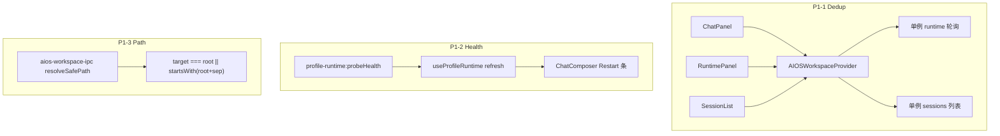

# team_v1.5.2_hotfix — P1 补丁计划

## 范围与前提

- **包含**：Review §7 的 P1 五项（重复轮询、health/Restart、`root+sep`、API 契约、Session 删除）。
- **不包含**：P2（Approval/retry/markdown、Runtime audit 面板、Workspace git、MEMORY 整文件写入等）。
- **依赖**：[`team_v1.5.1`](e:\git-ai\smc-coworker-full\.cursor\plans\team_v1.5.1_p0_hotfix_0ed35774.plan.md) P0 已合入（草稿 session、profile 内 sessions、chat 隔离、6 专家 merge）。
- **不修改**：`.cursor/plans/*.plan.md` 计划文件本身。



---

## P1-1：合并 `useProfileRuntime` / `useProfileSessions` 重复拉取

**现状**（P0 后仍存在）：

- [`ChatPanel.tsx`](copilot-desktop/src/renderer/src/screens/AIOSWorkspace/panels/ChatPanel.tsx) 与 [`RuntimePanel.tsx`](copilot-desktop/src/renderer/src/screens/AIOSWorkspace/panels/RuntimePanel.tsx) 各调用 [`useProfileRuntime`](copilot-desktop/src/renderer/src/screens/AIOSWorkspace/hooks/useProfileRuntime.ts) → **两套 8s `setInterval` + 两套 `onRuntimeStatusChanged`**。
- `ChatPanel` 与 [`SessionList.tsx`](copilot-desktop/src/renderer/src/screens/AIOSWorkspace/components/SessionList.tsx) 各调用 [`useProfileSessions`](copilot-desktop/src/renderer/src/screens/AIOSWorkspace/hooks/useProfileSessions.ts) → **重复 `listSessions`**。

**改法（Renderer-only，推荐）**：

1. 扩展 [`AIOSWorkspaceContext.tsx`](copilot-desktop/src/renderer/src/screens/AIOSWorkspace/context/AIOSWorkspaceContext.tsx)（或新增 `AIOSWorkspaceDataContext` 由 Provider 嵌套一次）：
   - 在 Provider 内**只调用一次** runtime / sessions 逻辑（可将现有 hook 实现内联或抽 `useAIOSWorkspaceData(activeProfileId)`）。
   - Context 暴露：`runtime`（status/healthy/port/start/stop/restart/...）、`sessions`、`sessionsLoading`、`sessionsKeyword`、`setSessionsKeyword`、`refetchSessions`（保留现有 `sessionsRefreshNonce` + `refreshSessions` bump）。
2. `SessionList`：用 `setSessionsKeyword` 替代本地 keyword 驱动重复 hook；删除组件内 `useProfileSessions`。
3. `ChatPanel` / `RuntimePanel`：从 context 读 `runtime` / `sessions`，删除各自 `useProfileRuntime` / `useProfileSessions`。
4. [`useProfileRuntime.ts`](copilot-desktop/src/renderer/src/screens/AIOSWorkspace/hooks/useProfileRuntime.ts) / [`useProfileSessions.ts`](copilot-desktop/src/renderer/src/screens/AIOSWorkspace/hooks/useProfileSessions.ts)：保留为纯函数实现供 Provider 调用，或标记仅 Provider 使用。

**验收**：DevTools 观察同一 profile 下仅 **1 条** 8s runtime 轮询；切换 session / 发消息后 sessions 仍通过 `refreshSessions` 刷新一次。

---

## P1-2：Gateway health 探测 + `running` 但不健康时 Restart

**现状**：

- PRD [`team_v1.5_multi-profiles-ui.md`](e:\git-ai\smc-coworker-full\prd\team_v1.5_multi-profiles-ui.md) §6.1：`profile running 但 health=false` → 显示 **Restart**。
- Renderer 将 `healthy: status === "running"`（[`mergeExpertProfiles.ts`](copilot-desktop/src/renderer/src/screens/AIOSWorkspace/api/mergeExpertProfiles.ts)、[`useProfileRuntime.ts`](copilot-desktop/src/renderer/src/screens/AIOSWorkspace/hooks/useProfileRuntime.ts)）。
- Main 已有 `checkHealth(host, port)`（[`hermes-local-adapter.ts`](copilot-desktop/src/main/hermes-local-adapter.ts) L24–35），但 **未暴露只读 IPC**；`adapter.health()` 会改写 DB status，不适合 UI 轮询。

**改法**：

1. **Main**：抽取或复用 `checkHealth` → 新增 `probeProfileHealth(profileId): Promise<boolean>`（[`profile-runtime-manager.ts`](copilot-desktop/src/main/profile-runtime-manager.ts)），仅当 instance `status === "running"` 时请求 `http://{host}:{port}/health`，**不**调用 `updateRuntimeStatus`。
2. **IPC 链**（遵循 [`copilot-desktop/AGENTS.md`](copilot-desktop/AGENTS.md) checklist）：
   - [`profile-runtime-ipc.ts`](copilot-desktop/src/main/profile-runtime-ipc.ts)：`profile-runtime:probeHealth`
   - [`profile-runtime-contract.ts`](copilot-desktop/src/shared/profile-runtime/profile-runtime-contract.ts) + [`profile-runtime-api.ts`](copilot-desktop/src/preload/profile-runtime-api.ts) + [`index.d.ts`](copilot-desktop/src/preload/index.d.ts)
3. **Renderer**：
   - [`aiosWorkspaceApi.ts`](copilot-desktop/src/renderer/src/screens/AIOSWorkspace/api/aiosWorkspaceApi.ts)：`probeProfileHealth(profileId)`
   - Provider 内 runtime `refresh`：`getRuntimeStatus` 后，对 `running` 的 profile 调 probe，写 `profiles[].healthy`（与 DB `status` 解耦）。
   - [`ChatComposer.tsx`](copilot-desktop/src/renderer/src/screens/AIOSWorkspace/components/ChatComposer.tsx)：优先级 `presetRequired` > **`running && !healthy` → Restart 条**（文案 + `onRestartProfile`）> `!running` → Start。
   - [`RuntimePanel.tsx`](copilot-desktop/src/renderer/src/screens/AIOSWorkspace/panels/RuntimePanel.tsx)：health 显示 `OK` / `Unhealthy` / `—`。
4. **i18n**：[`en/zh-CN aiosWorkspace.ts`](copilot-desktop/src/shared/i18n/locales/) 增加 `chat.restartUnhealthyHint` 等。

**验收**：Gateway 进程在但 `/health` 非 200 时，Composer 显示 Restart（非 Start）；点击 Restart 调用既有 `restartProfile`；健康时 Chat 可输入。

---

## P1-3：Workspace 路径校验 `root + sep`

**问题**：[`aios-workspace-ipc.ts`](copilot-desktop/src/main/aios-workspace-ipc.ts) L32 `target.startsWith(root)` 在 Windows 上可能被 `writer-evil` 前缀绕过。

**改法**：

```ts
import { sep } from "path";
const rootNorm = resolve(root);
const rootPrefix = rootNorm.endsWith(sep) ? rootNorm : rootNorm + sep;
if (target !== rootNorm && !target.startsWith(rootPrefix)) return null;
```

仅改 `resolveSafePath`；`list-files` 的相对路径计算逻辑不变。

**验收**：`list-files` / `read-file` 对 `../` 与兄弟目录前缀路径仍拒绝；正常子路径可访问。

---

## P1-4：登记 `docs/API_CONTRACTS.md`（aios-workspace + probeHealth）

**现状**：[`copilot-desktop/AGENTS.md`](copilot-desktop/AGENTS.md) 要求新 IPC 写入 `docs/API_CONTRACTS.md`，但仓库内 **尚无** `copilot-desktop/docs/` 目录。

**改法**：

1. 新建 [`copilot-desktop/docs/API_CONTRACTS.md`](copilot-desktop/docs/API_CONTRACTS.md)（可先建最小骨架 + 本次增量，避免一次性抄全量 `index.ts`）：
   - **`aios-workspace:list-files`** / **`aios-workspace:read-file`**（参数、返回 DTO、错误码、路径沙箱说明）。
   - **`profile-runtime:probeHealth`**（P1-2 新增）。
   - 交叉引用 AIOSWorkspace 使用的既有 channels：`profile-runtime:listProfileSessions`、`profile-runtime:status` 等（表格列出 channel / 方向 / 用途）。
2. 功能收尾时按 AGENTS「sync-project-docs」可选更新 `docs/INDEX.md`（若该目录后续补齐）。

**验收**：文档中 channel 名与 Main/Preload 源码一致；Reviewer 可对照注册 handler。

---

## P1-5：Session 删除 + `listProfileSessions` home 修正

**现状**：

- UI 可点删除，[`aiosWorkspaceApi.deleteSession`](copilot-desktop/src/renderer/src/screens/AIOSWorkspace/api/aiosWorkspaceApi.ts) **空实现**。
- [`profile-runtime-ipc.ts`](copilot-desktop/src/main/profile-runtime-ipc.ts) L98–111：`listProfileSessions` 使用 `profileHome(profileId)`，**profileId 为 UUID** 时会指向错误目录（P0 去掉全局 fallback 后列表可能恒为空）。

**改法**：

1. 修正 `listProfileSessions`：与 [`aios-workspace-ipc.ts`](copilot-desktop/src/main/aios-workspace-ipc.ts) 一致，`getProfile(profileId)` → `profileHome(profile.name)`。
2. 新增 `profile-runtime:deleteProfileSession(profileId, sessionId)`：`state.db` 内 `DELETE FROM sessions WHERE id = ?`（只读连接改为读写短连接）；无 db 时 no-op。
3. Preload + contract + [`aiosWorkspaceApi.deleteSession`](copilot-desktop/src/renderer/src/screens/AIOSWorkspace/api/aiosWorkspaceApi.ts) 接线。
4. 保持 SessionList 删除按钮；删除后若删的是 active session → `setActiveSessionId(null)`（已有逻辑）。

**验收**：writer profile 下列表有数据时可删除；删除后列表刷新；不同 profile 的 db 互不影响。

---

## 涉及文件（预估）

| 区域 | 文件 |
|------|------|
| Main | `aios-workspace-ipc.ts`, `profile-runtime-ipc.ts`, `profile-runtime-manager.ts`（+ 可选 `gateway-health.ts`） |
| Shared/Preload | `profile-runtime-contract.ts`, `profile-runtime-api.ts`, `index.d.ts` |
| Renderer | `AIOSWorkspaceContext.tsx`, `ChatPanel.tsx`, `RuntimePanel.tsx`, `SessionList.tsx`, `ChatComposer.tsx`, `aiosWorkspaceApi.ts`, `useProfileRuntime.ts`, `useProfileSessions.ts`, `mergeExpertProfiles.ts` |
| i18n | `locales/en|zh-CN/aiosWorkspace.ts` |
| Docs | `copilot-desktop/docs/API_CONTRACTS.md`（新建） |

---

## 验证步骤

1. `cd copilot-desktop; npm run typecheck`
2. **Dedup**：打开 AIOS Workspace，Network/日志侧确认无双倍 8s 轮询（或临时在 `refresh` 内打 debug 计数）。
3. **Health**：Start profile 后 mock `/health` 失败（或停 gateway 进程保留 running 状态）→ Composer 显示 Restart。
4. **Path**：对 `../`、非法前缀路径调用 workspace list/read → 空或 `FILE_NOT_FOUND`。
5. **Sessions**：安装 preset 的 writer 下列表非空；删除一条后列表更新。
6. **契约**：`API_CONTRACTS.md` 含 `aios-workspace:*` 与 `probeHealth` / `deleteProfileSession`。

---

## 与 v1.5.1 的关系

| 版本 | 内容 |
|------|------|
| v1.5.1 | P0：session 草稿、profile sessions、chat 隔离、6 专家入口 |
| **v1.5.2** | P1：性能/健康/安全/契约/删除 |
| 后续 v1.5.x | P2 体验与 PRD 缺口（markdown、audit、git 等） |
