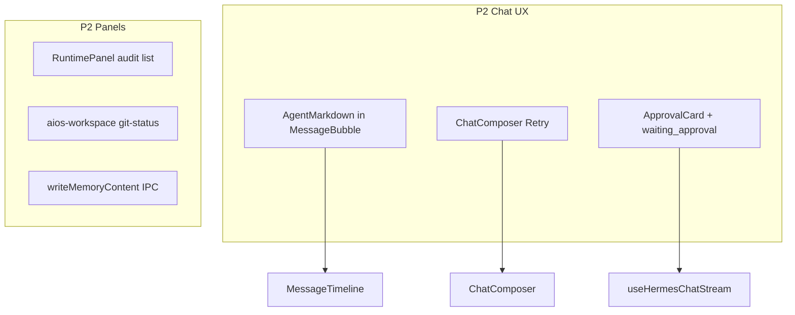

# team_v1.5.3_hotfix — P2 补丁计划

## 范围

- **包含**：Review §7 P2 四项 + PRD §6.5–6.7 对应缺口。
- **不包含**：Skills/Memory 写操作二期、Workspace 文件 CRUD、Session pin/archive、Hermes 新 approval IPC（若无现成 Gateway 契约则仅 UI 壳）。
- **依赖**：[team_v1.5.1 P0](e:\git-ai\smc-coworker-full\.cursor\plans\team_v1.5.1_p0_hotfix_0ed35774.plan.md)、[team_v1.5.2 P1](e:\git-ai\smc-coworker-full\.cursor\plans\team_v1.5.2_p1_hotfix_8ffd21c4.plan.md) 已落地。
- **不修改**：`.cursor/plans/*.plan.md` 计划文件本身。

---

## P2-1：Assistant / Skill Markdown 渲染

**现状**：[MessageBubble.tsx](copilot-desktop/src/renderer/src/screens/AIOSWorkspace/components/MessageBubble.tsx) 纯文本；[SkillsPanel.tsx](copilot-desktop/src/renderer/src/screens/AIOSWorkspace/panels/SkillsPanel.tsx) 用 `<pre>`；项目已有 [AgentMarkdown.tsx](copilot-desktop/src/renderer/src/components/AgentMarkdown.tsx)（`react-markdown` + GFM）。

**改法（Renderer-only）**：

1. `MessageBubble`：`role === "assistant"` 时用 `<AgentMarkdown>{message.content}</AgentMarkdown>`；user 保持纯文本气泡。
2. `MessageTimeline`：流式 `streamingContent` 同样用 `AgentMarkdown`（或 assistant 样式容器包裹）。
3. `SkillsPanel`：选中 skill 且路径以 `.md` 结尾（或 content 像 markdown）时用 `AgentMarkdown`；其它仍 `pre` 单色字体。

**验收**：Assistant 回复显示标题/列表/代码块；Skill 预览可读 markdown。

---

## P2-2：错误后 Retry

**现状**：[useHermesChatStream.ts](copilot-desktop/src/renderer/src/screens/AIOSWorkspace/hooks/useHermesChatStream.ts) 已有 `retryLast()`；[ChatComposer.tsx](copilot-desktop/src/renderer/src/screens/AIOSWorkspace/components/ChatComposer.tsx) 无入口。

**改法**：

1. `ChatComposer` 增加 `runState === "error"` 时展示 **Retry** 按钮（与 Cancel/Send 并列或替换 Send）。
2. [ChatPanel.tsx](copilot-desktop/src/renderer/src/screens/AIOSWorkspace/panels/ChatPanel.tsx) 传入 `onRetry={() => void chat.retryLast()}`。
3. i18n：`aiosWorkspace.chat.retry`（en/zh-CN）。

**验收**：消息失败后点 Retry 会重发最后一条 user 消息。

---

## P2-3：Approval UI 壳 + `waiting_approval` 状态

**现状**：[ApprovalCard.tsx](copilot-desktop/src/renderer/src/screens/AIOSWorkspace/components/ApprovalCard.tsx) 无引用；`ChatRunState` 含 `waiting_approval` 但未进入状态机；Main 仅有 `chat-tool-progress` 字符串（[index.ts](copilot-desktop/src/main/index.ts) L816），**无** `chat-approval` / approve IPC。

**改法（P2 最小，不扩 Hermes 协议）**：

1. `useHermesChatStream` 的 `onToolProgress`：
   - 若 tool 字符串匹配启发式（如含 `approval`、`confirm`、`human`、JSON 字段 `requires_approval`）→ `setRunState("waiting_approval")`，`activeTool.status = "waiting_approval"`。
   - 否则保持现有 `running`。
2. `MessageTimeline`：当 `runState === "waiting_approval"` 或 `activeTool?.status === "waiting_approval"` 时渲染 `ApprovalCard`（标题用 tool name / 固定 i18n）。
3. 按钮行为（文档化限制）：
   - **Approve**：清除 approval 态 → `runState` 回 `idle`；若后续 Gateway 有 resume API 再接线（P2 不新增 Main IPC）。
   - **Reject**：调用既有 `cancel()`（`abortChat`）。
4. `ChatComposer`：`waiting_approval` 时禁用输入。

**验收**：模拟 tool 名含 `approval` 时出现卡片；Reject 可取消；无 Gateway 时不声称「已批准工具执行」。

---

## P2-4：Runtime audit + profile events

**现状**：[aiosWorkspaceApi.listAuditEvents](copilot-desktop/src/renderer/src/screens/AIOSWorkspace/api/aiosWorkspaceApi.ts) 已封装；[RuntimePanel.tsx](copilot-desktop/src/renderer/src/screens/AIOSWorkspace/panels/RuntimePanel.tsx) 仅 logs，无 audit/events。

**改法**：

1. **Audit 列表**：`RuntimePanel` 内 `useEffect` 调用 `listAuditEvents(activeProfileId, 30)`，表格/列表展示 `created_at`、`action`、`status`（截断 `payload_json`）。
2. **Profile events**：复用 `aiosWorkspaceApi.onRuntimeStatusChanged`，在 Panel 本地 state 保留最近 20 条 `RuntimeStatusChangeEvent`（`profileId` 过滤当前 active），展示在 audit 上方或折叠区「Events」。
3. i18n：`runtime.audit`、`runtime.events`、`runtime.noAudit`。

**验收**：Start/Stop profile 后 Events 区有记录；audit 表有 `profile_runtime` 类事件（若 DB 有数据）。

---

## P2-5：Workspace git branch / dirty count

**现状**：PRD §6.6 要求；[WorkspacePanel.tsx](copilot-desktop/src/renderer/src/screens/AIOSWorkspace/panels/WorkspacePanel.tsx) 无 git 信息；无 git IPC。

**改法（Main + Renderer）**：

1. [aios-workspace-ipc.ts](copilot-desktop/src/main/aios-workspace-ipc.ts) 新增 `aios-workspace:git-status`：
   - 解析 profile home（同 `resolveSafePath` 的 `getProfile` + `profileHome(name)`）。
   - 若 `{home}/.git` 不存在 → `{ branch: null, dirtyCount: 0 }`。
   - 否则 `execFile('git', ['-C', home, 'rev-parse', '--abbrev-ref', 'HEAD'])` + `git status --porcelain` 统计非空行数。
   - 超时 3s、捕获错误，失败返回 null branch。
2. Preload：`window.aiosWorkspace.gitStatus(profileId)` + [index.d.ts](copilot-desktop/src/preload/index.d.ts)。
3. [useWorkspaceTree.ts](copilot-desktop/src/renderer/src/screens/AIOSWorkspace/hooks/useWorkspaceTree.ts)：`refetch` 时并行拉 git status。
4. `WorkspacePanel` 顶栏显示：`branch · N changed` 或 `Not a git repo`。

**验收**：profile home 为 git 仓库时显示分支名；有未提交变更时 dirtyCount > 0。

---

## P2-6：MEMORY.md 整文件写入

**现状**：[aiosWorkspaceApi.writeMemoryFile](copilot-desktop/src/renderer/src/screens/AIOSWorkspace/api/aiosWorkspaceApi.ts) 对 `MEMORY.md` 走 `addMemoryEntry`（追加条目），与 [MemoryPanel](copilot-desktop/src/renderer/src/screens/AIOSWorkspace/panels/MemoryPanel.tsx) 整文件编辑语义不符（[memory.ts](copilot-desktop/src/main/memory.ts) 仅有 entry API）。

**改法**：

1. **Main** [memory.ts](copilot-desktop/src/main/memory.ts)：新增 `writeMemoryContent(content, profile?)`，与 `writeUserProfile` 类似——`writeFileSafe(memoryPath, content)` + `MEMORY_CHAR_LIMIT` 校验。
2. **IPC**：[index.ts](copilot-desktop/src/main/index.ts) 注册 `write-memory-content`；[preload/index.ts](copilot-desktop/src/preload/index.ts) + `index.d.ts` 增加 `writeMemoryContent`。
3. **Renderer**：`aiosWorkspaceApi.writeMemoryFile` 在 `MEMORY.md` 分支改为 `writeMemoryContent`；`USER.md` / `SOUL.md` 不变。
4. **可选（同 PR）**：保存成功后 Main handler 内 `getProfileByName` + `insertAuditEvent`（`action: memory_save`），满足 PRD「保存后写 audit」——若 profile 名→UUID 解析简单则一并做。

**验收**：编辑 MEMORY 全文保存后 `refetch` 内容一致（非追加一条 entry）。

---

## 文档

更新 [copilot-desktop/docs/API_CONTRACTS.md](copilot-desktop/docs/API_CONTRACTS.md)：

- `aios-workspace:git-status`
- `write-memory-content`（Hermes memory IPC）
- 注明 Approval 仍为 Renderer 启发式，无新 chat channel

---

## 涉及文件（预估）

| 区域 | 文件 |
|------|------|
| Renderer | `MessageBubble.tsx`, `MessageTimeline.tsx`, `ChatComposer.tsx`, `ChatPanel.tsx`, `SkillsPanel.tsx`, `RuntimePanel.tsx`, `WorkspacePanel.tsx`, `useHermesChatStream.ts`, `useWorkspaceTree.ts`, `aiosWorkspaceApi.ts` |
| Main | `memory.ts`, `index.ts`, `aios-workspace-ipc.ts` |
| Preload | `index.ts`, `index.d.ts`（aiosWorkspace + hermes memory） |
| i18n | `locales/en|zh-CN/aiosWorkspace.ts` |
| Docs | `docs/API_CONTRACTS.md` |

---

## 验证步骤

1. `cd copilot-desktop; npm run typecheck`
2. Assistant 消息与 `.md` skill 预览渲染 markdown
3. 故意触发 chat error → Retry 重发
4. tool progress 含 `approval` → 出现 ApprovalCard；Reject 取消
5. Runtime Tab 见 audit + status change events
6. Workspace Tab 见 git branch/dirty（有 `.git` 的 profile home）
7. MEMORY.md 整文件编辑保存后内容一致
8. `API_CONTRACTS.md` 含新 channel

---

## 与 v1.5.x 关系

| 版本 | 内容 |
|------|------|
| v1.5.1 | P0：session / chat 隔离 / 6 专家 |
| v1.5.2 | P1：dedup / health / path / 契约 / session 删除 |
| **v1.5.3** | P2：markdown / retry / approval 壳 / audit+events / git / MEMORY 覆盖写 |
