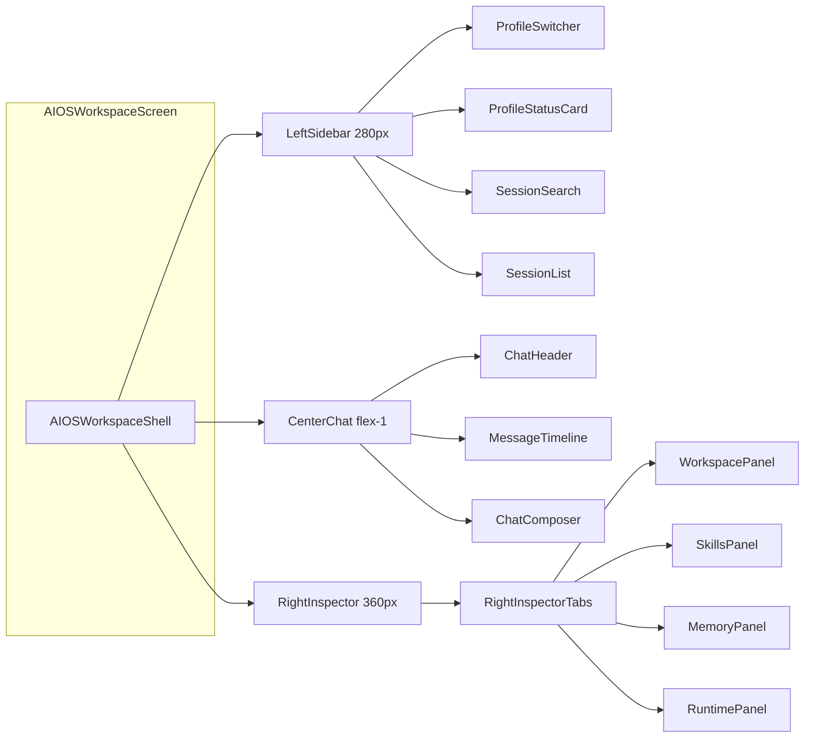
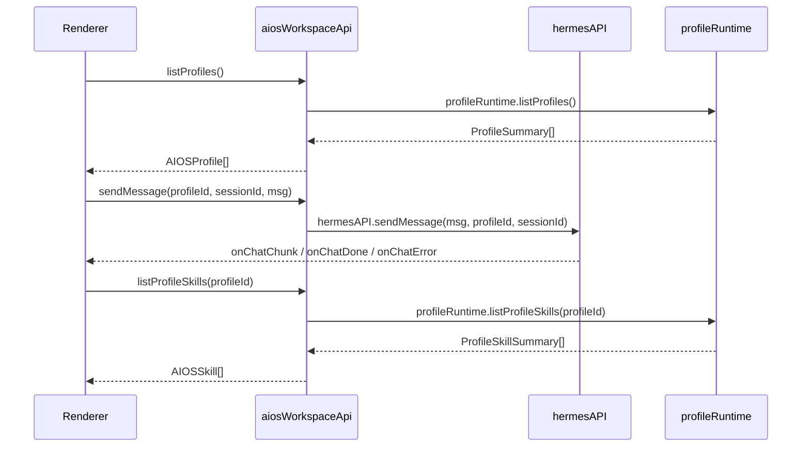

# team_v1.5: Multi Profiles Workspace UI 实施计划

## 现状与差距分析

### 已有基础

- [AIOSWorkspaceScreen.tsx](copilot-desktop/src/renderer/src/screens/AIOSWorkspace/AIOSWorkspaceScreen.tsx) -- 仅一个 Shell 容器
- [AIOSWorkspaceShell.tsx](copilot-desktop/src/renderer/src/screens/AIOSWorkspace/panels/AIOSWorkspaceShell.tsx) -- 简单 switch(panel) 切 ChatPanel/SessionsPanel/AgentsPanel
- [ChatPanel.tsx](copilot-desktop/src/renderer/src/screens/AIOSWorkspace/panels/ChatPanel.tsx) -- 已实现基础 streaming（`hermesAPI.sendMessage` + `onChatChunk/Done/Error`），但无 profile 切换感知、无 ToolCallCard、无 Approval
- [SessionsPanel.tsx](copilot-desktop/src/renderer/src/screens/AIOSWorkspace/panels/SessionsPanel.tsx) -- 已有搜索 + 列表，但无 profile 筛选、无新建/删除/重命名
- [AgentsPanel.tsx](copilot-desktop/src/renderer/src/screens/AIOSWorkspace/panels/AgentsPanel.tsx) -- 只列出 profiles，无切换交互

### Preload API 覆盖度

PRD 要求 `window.aiosWorkspace.*` 统一访问。实际可复用的 Preload API：

| PRD 需求 | 现有 API | 缺口 |
|----------|---------|------|
| profiles 列表/启停 | `profileRuntime.listProfiles/startProfile/stopProfile/restartProfile` | 无 |
| profile 状态/事件 | `profileRuntime.getRuntimeStatus/onRuntimeStatusChanged/getGatewayLogs` | 无 |
| chat streaming | `hermesAPI.sendMessage(msg, profile, sessionId, history)` + chunk/done/error | 无 ToolCall 事件回调 |
| sessions | `profileRuntime.listProfileSessions(profileId)` + `hermesAPI.searchSessions` | 缺 createSession / renameSession / deleteSession per-profile |
| skills | `profileRuntime.listProfileSkills(profileId)` + `hermesAPI.getSkillContent` | 无 |
| memory | `hermesAPI.readMemory(profile)` / `hermesAPI.writeSoul/addMemoryEntry/writeUserProfile` | 无（均已支持 profile 参数） |
| workspace 文件树 | **不存在** | 需新增 IPC：listWorkspaceFiles / readWorkspaceFile |
| workspace 列表 | copilot-serve `GET /workspaces` 或 `hermesAPI.getHermesHome` | 间接可用 |

### 关键决策

1. **不新建 `window.aiosWorkspace`**：创建 Renderer 层 adapter `aiosWorkspaceApi.ts` 包装 `hermesAPI` + `profileRuntime`，避免 IPC 层变更风险
2. **Workspace 文件树**：需新增 IPC channel（Main 读 profile_home 下文件），需走完整 IPC 新增流程（Main handler -> Preload -> index.d.ts）
3. **Session CRUD**：现有 `hermesAPI` 的 session 接口不支持 per-profile 的 create/delete/rename，但可通过 copilot-serve `/profiles/{id}/runs` 间接实现，或新增 IPC

---

## 架构设计

### 三栏布局结构



### 状态管理

不引入全局 Store。状态放在 `AIOSWorkspaceShell` 内，通过 props/context 下传：

```typescript
type AIOSWorkspaceState = {
  activeProfileId: string | null;
  activeSessionId: string | null;
  activeRightTab: "workspace" | "skills" | "memory" | "runtime";
  rightPanelCollapsed: boolean;
};
```

持久化到 `localStorage`：`aios.workspace.activeProfileId`、`aios.workspace.activeRightTab`、`aios.workspace.collapsedRightPanel`。

### 数据流



---

## 文件结构（最终状态）

```
src/renderer/src/screens/AIOSWorkspace/
  AIOSWorkspaceScreen.tsx          -- 入口，不变签名
  types.ts                         -- 新建：数据模型
  constants.ts                     -- 新建：6 个 profile 常量
  api/
    aiosWorkspaceApi.ts            -- 新建：包装 hermesAPI + profileRuntime
  hooks/
    useActiveProfile.ts            -- 新建
    useProfileRuntime.ts           -- 新建
    useProfileSessions.ts          -- 新建
    useHermesChatStream.ts         -- 新建（从 ChatPanel 抽出）
    useProfileSkills.ts            -- 新建
    useProfileMemory.ts            -- 新建
    useWorkspaceTree.ts            -- 新建
  components/
    ProfileSwitcher.tsx            -- 新建
    ProfileStatusBadge.tsx         -- 新建
    SessionList.tsx                -- 新建（替换旧 SessionsPanel）
    SessionSearch.tsx              -- 新建
    ChatHeader.tsx                 -- 新建
    MessageTimeline.tsx            -- 新建
    MessageBubble.tsx              -- 新建
    ToolCallCard.tsx               -- 新建
    ChatComposer.tsx               -- 新建
    RightInspectorTabs.tsx         -- 新建
  panels/
    AIOSWorkspaceShell.tsx         -- 重写：三栏容器
    ChatPanel.tsx                  -- 重写：使用 hooks
    SkillsPanel.tsx                -- 新建
    MemoryPanel.tsx                -- 新建
    WorkspacePanel.tsx             -- 新建
    RuntimePanel.tsx               -- 新建
    SessionsPanel.tsx              -- 删除（SessionList 组件取代）
    AgentsPanel.tsx                -- 删除（ProfileSwitcher 取代）
```

---

## 实施步骤

### Step 1: 基础类型与常量

- 新建 `types.ts`：定义 `AIOSProfile`, `AIOSSession`, `AIOSMessage`, `AIOSSkillToolCall`, `AIOSSkill`, `AIOSMemoryFile`, `ChatRunState`, `AIOSWorkspaceState`
- 新建 `constants.ts`：6 个专家 Profile 的 profileId -> displayName 映射
- 更新 [workspace-contract.ts](copilot-desktop/src/shared/workspace/workspace-contract.ts)：`WorkspaceSecondaryPanel` 增加 `skills | memory | runtime | workspace` 值
- 更新 [workspace-secondary-nav.ts](copilot-desktop/src/shared/workspace/workspace-secondary-nav.ts)：`aios-workspace` 的 secondary nav 列表改为包含新面板

### Step 2: API Adapter 层

- 新建 `api/aiosWorkspaceApi.ts`：统一包装 `window.profileRuntime` 和 `window.hermesAPI`
- 方法映射：
  - `listProfiles()` -> `profileRuntime.listProfiles()` + 映射为 `AIOSProfile`
  - `startProfile/stopProfile/restartProfile` -> `profileRuntime.*`
  - `sendMessage(profileId, sessionId, msg)` -> `hermesAPI.sendMessage(msg, profileId, sessionId)`
  - `listSessions(profileId)` -> `profileRuntime.listProfileSessions(profileId)`
  - `listSkills(profileId)` -> `profileRuntime.listProfileSkills(profileId)`
  - `readMemory(profileId)` -> `hermesAPI.readMemory(profileId)` + `hermesAPI.readSoul(profileId)`
  - `getGatewayLogs(profileId)` -> `profileRuntime.getGatewayLogs(profileId)`

### Step 3: Hooks 层

每个 hook 负责 loading/error/data/refetch：
- `useActiveProfile` -- 管理 activeProfileId + localStorage 持久化
- `useProfileRuntime` -- 轮询 profile 状态 + 订阅 `onRuntimeStatusChanged`
- `useProfileSessions` -- 按 profileId 加载 sessions
- `useHermesChatStream` -- 从 ChatPanel 提取，管理 streaming 事件注册/清理 + ChatRunState
- `useProfileSkills` -- 按 profileId 加载 skills
- `useProfileMemory` -- 加载 SOUL.md/MEMORY.md/USER.md

### Step 4: 重构页面 Shell（三栏布局）

重写 `AIOSWorkspaceShell.tsx`：
- flex 三栏：`LeftSidebar(280px)` | `CenterChat(flex-1, min-520px)` | `RightInspector(360px, 可折叠)`
- 通过 React Context 提供 `activeProfileId`, `activeSessionId`, `setActiveProfile`, `setActiveSession` 等操作
- `AIOSWorkspaceScreen.tsx` 保持入口签名不变

### Step 5: LeftSidebar 组件

- `ProfileSwitcher` -- 下拉/列表切换当前 profile，显示 6 个专家角色名称（不含端口）
- `ProfileStatusBadge` -- running/stopped/error/starting 状态标识
- `SessionSearch` -- debounce 搜索框
- `SessionList` -- 当前 profile 的 session 列表，支持选中/新建/删除/重命名

### Step 6: CenterChat

- `ChatHeader` -- 当前 profile 名 + session 标题 + profile 状态
- `MessageTimeline` -- 消息列表（复用现有 ChatBubble 逻辑 + 新增 ToolCallCard）
- `MessageBubble` -- user/assistant 气泡，assistant 支持 markdown 渲染
- `ToolCallCard` -- tool call 名称 + 参数 + 状态（running/completed/error）
- `ChatComposer` -- 输入框 + Send + Cancel，profile 未启动时禁用并显示 Start Profile 按钮
- 状态机：idle -> creating -> streaming -> completed/error/cancelled

### Step 7: RightInspector

- `RightInspectorTabs` -- Workspace/Skills/Memory/Runtime 四个 tab
- `SkillsPanel` -- 按 category 分组 + 搜索 + skill markdown 预览
- `MemoryPanel` -- SOUL.md 只读 + MEMORY.md/USER.md 可编辑 + 保存
- `RuntimePanel` -- port/pid/health/logs tail/events + Start/Stop/Restart 按钮
- `WorkspacePanel` -- 文件树 + breadcrumb + 文件预览（第一阶段只读）

### Step 8: Workspace 文件树 IPC（如需要）

如果 `hermesAPI.getHermesHome(profile)` 返回的 profile_home 路径需要文件浏览：
1. Main: 新增 `aios-workspace:list-files` / `aios-workspace:read-file` handler（读取 profile_home 下目录）
2. Preload: 封装到 `aiosWorkspaceApi` 或新增 preload API
3. index.d.ts: 补充类型
4. 安全约束：只读、只允许 profile_home 子路径

替代方案：通过 copilot-serve `GET /workspaces` 间接访问（避免新增 IPC），但覆盖度可能不足。

### Step 9: i18n

在 `src/shared/i18n/locales/en/` 和 `zh-CN/` 中补充 `aiosWorkspace` 模块 key（profile 名称、面板标题、按钮文本、状态文本等）。

### Step 10: 联调验证

按 PRD 10 节验收标准逐项验证：
- Profile 切换 + session 隔离
- Chat streaming + error/cancel
- Skills/Memory/Runtime 面板数据正确
- Workspace 文件浏览

---

## 风险与注意事项

- **不改路由壳**：不修改 `Layout.tsx`、`MainPage`、`WorkspaceRenderer` 等全局模块
- **不改 Preload 层**（除非 workspace 文件树确实无法通过现有 API 实现）
- **不直连 Hermes Gateway 端口**：所有数据通过 `hermesAPI`（走 Main 代理）或 `profileRuntime` 获取
- **Chat 事件清理**：`useHermesChatStream` 必须在 unmount 和 profile 切换时正确清理 onChatChunk/Done/Error 订阅
- **Session 隔离**：切换 profile 时必须重置 sessionId + messages
- **Workspace 文件树安全**：只读、路径白名单限制在 profile_home 内
