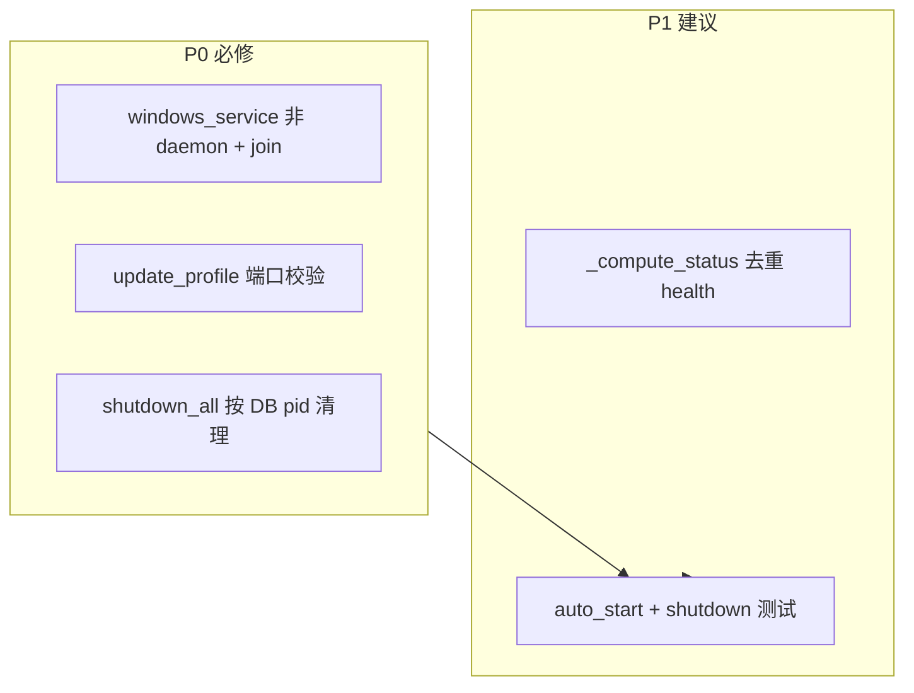

# team_v1.6.1_hotfix — Review 问题修复计划

## 范围

仅修复 **copilot-serve**（独立子项目），不改 copilot-desktop / Portal。  
**不包含** review 中的 P2（Job Object、Electron 安装 Service、PID cmdline 校验、版本号改 1.6.0）。

你已确认：**reconcile 时 PID 不存在仍标 `ERROR`**，本 hotfix 不改动该语义。



---

## P0-1：Windows Service 工作线程（高）

**问题**：[windows_service.py](copilot-serve/src/local_service/windows_service.py) 中 `daemon=True` + `_stop_event.wait()`：uvicorn 线程崩溃后 SCM 仍可能显示 RUNNING，`:8765` 已不可用。

**改法**（最小、符合 pywin32 惯例）：

1. `daemon=False`
2. `SvcDoRun`：`start()` 后对 `_worker.join()` 阻塞，直到 uvicorn 正常退出
3. `SvcStop`：先 `request_shutdown()`，再 `_worker.join(timeout=30)`，最后 `SERVICE_STOPPED`
4. 删除仅用于无限等待的 `_stop_event.wait()`（或仅保留给 stop 唤醒 join 的超时路径）

**验证**：

- `uv run ai-copilot-service run` 前台启停仍正常
- 手动 `Ctrl+C` / `SvcStop` 能在 30s 内退出
- （可选手工）安装服务后 stop，任务管理器无残留 `python` gateway 监听 8765

---

## P0-2：`update_profile` 端口冲突检测（中）

**问题**：[profile_service.py](copilot-serve/src/services/profile_service.py) 的 `create_profile` 已用 [port_allocator.py](copilot-serve/src/runtime/port_allocator.py)，但 `update_profile` 在 `body.gateway_port` 时直接赋值，可造成 DB/OS 端口冲突。

**改法**：

```python
if body.gateway_port is not None and body.gateway_port != profile.gateway_port:
    profiles = await self._repo.list_all()
    used_ports = {p.gateway_port for p in profiles if p.id != profile_id}
    try:
        port = allocate_port(self._settings, body.gateway_port, used_ports)
    except ValueError as exc:
        raise ConflictError(str(exc)) from exc
    profile.gateway_port = port
    sync_profile_config(...)
```

- 端口未变时跳过分配逻辑
- 与 `create_profile` 一致：`ValueError` → `ConflictError`（API 409）

**验证**：新增单元/API 测试——两 profile 占 8642/8643 后，将 profile B 更新为 8642 应返回 409。

---

## P0-3：`shutdown_all` 清理 reconcile 后的孤儿 Gateway（中）

**问题**：[gateway_supervisor.py](copilot-serve/src/services/gateway_supervisor.py) 的 `shutdown_all` 仅调用 [gateway_process.py](copilot-serve/src/runtime/gateway_process.py) 的 `_handles`；reconcile 后 untracked 但 `running` + `gateway_pid` 的进程在 [lifecycle.py](copilot-serve/src/core/lifecycle.py) 退出时不会被 kill。

**改法**：扩展 `GatewaySupervisor.shutdown_all()`：

1. 开 session，列出 `status == running`（或 `gateway_pid IS NOT NULL`）的 profiles
2. 对每个 profile：`await self._process_manager.stop(profile.id, pid=profile.gateway_pid)`
3. 将 DB 状态批量设为 `STOPPED`（`gateway_pid=None`），写审计 `profile_stopped` / `service_shutdown`（二选一或合并 payload）
4. 最后 `await self._process_manager.shutdown_all()` 清理剩余 handle

**注意**：`lifecycle` 已有 `await supervisor.shutdown_all()`，无需改调用点。

**验证**：新增测试——mock gateway 启动 → 从 `_handles` pop 模拟服务重启 → 调 `shutdown_all()` → 断言 PID 不再存活且 DB 为 `stopped`。

---

## P1-1：`_compute_status` 去重 health 检查（低）

**问题**：未跟踪但 PID 存活时，79–86 行与 99–104 行可能各打一次 health。

**改法**：在 untracked+alive 分支设置 `healthy` 后，下方 `if profile.status == RUNNING` 块内若 `healthy` 已确定则跳过第二次 check（小 refactor，行为不变）。

文件：[gateway_supervisor.py](copilot-serve/src/services/gateway_supervisor.py) `_compute_status`。

---

## P1-2：测试补强

| 测试文件 | 场景 |
|----------|------|
| `tests/test_profile_port_update.py`（新建） | update 端口冲突 → 409 |
| `tests/test_gateway_shutdown_orphans.py`（新建） | untracked running + `shutdown_all` kill pid |
| `tests/test_gateway_autostart_lifespan.py`（新建） | 两个 `auto_start=true` profile + mock gateway，lifespan 启动后 status=running（`conftest` 需临时允许 autostart 或专用 fixture） |

沿用现有 [mock_hermes_gateway.py](copilot-serve/scripts/mock_hermes_gateway.py) 与 [conftest.py](copilot-serve/tests/conftest.py) 模式。

**回归命令**：

```powershell
cd copilot-serve
uv run pytest tests/test_port_allocator.py tests/test_gateway_process_pid.py tests/test_gateway_supervisor_boot.py tests/test_v1_acceptance.py -q
```

---

## 文档同步

在 [specs/team_v1.6/](specs/team_v1.6/) 旁新增轻量记录（或扩展现有 `log.md`）：

- `specs/team_v1.6.1/state.md` — hotfix 范围与验收勾选
- `specs/team_v1.6.1/log.md` — 变更摘要

不修改 [.cursor/plans/team_v1.6_实施计划_6e4f125e.plan.md](.cursor/plans/team_v1.6_实施计划_6e4f125e.plan.md)。

---

## 验收清单

- [ ] Windows Service：`SvcDoRun`/`SvcStop` 能可靠启停 uvicorn（非 daemon）
- [ ] `PATCH/PUT` 更新 `gateway_port` 与已有 profile/OS 冲突时返回 409
- [ ] 应用 shutdown 后无残留 gateway 子进程（untracked running 场景）
- [ ] auto_start lifespan 测试通过
- [ ] 既有 v1.6 测试套件无回归

## 预估改动面

| 文件 | 变更类型 |
|------|----------|
| `src/local_service/windows_service.py` | 修改 |
| `src/services/profile_service.py` | 修改 |
| `src/services/gateway_supervisor.py` | 修改（shutdown_all + 可选 _compute_status） |
| `tests/test_*.py` | 新增 2–3 个 |
| `specs/team_v1.6.1/*.md` | 新增 |

约 **150–220 行** 净增，符合 v1.5.1 hotfix「最小补丁」风格。
