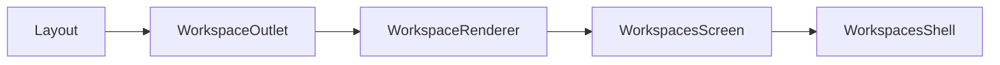

# team_v1.6.2 Workspaces 三栏布局 Hotfix 实施计划

## 背景与现状（对照 [copilot-desktop/AGENTS.md](copilot-desktop/AGENTS.md) 与 PRD）

**架构约束（保持不变）**：Renderer 仅通过 Preload（`window.profileRuntime`、`window.workspaces` 等）访问 Main；本次 **不新增 IPC**。

**当前实现路径**（已接通）：



[`WorkspaceRenderer.tsx`](copilot-desktop/src/renderer/src/components/workspace/WorkspaceRenderer.tsx) 对 `workspaces` 渲染 [`WorkspacesScreen`](copilot-desktop/src/renderer/src/screens/Workspaces/index.tsx) → [`WorkspacesShell`](copilot-desktop/src/renderer/src/screens/Workspaces/panels/WorkspacesShell.tsx)。

**与 PRD 的差距**：

| 问题 | 现状 | PRD 目标 |
|------|------|----------|
| 布局 | 顶栏纵向 `ProfileSwitcher` + 左 Sidebar + 中心（**无右栏**） | Status Cards + 三栏 grid，左右可折叠 |
| 右 Inspector | `RightInspectorTabs`、`RuntimePanel` 等 **已实现但未 import** | 挂载 workspace/skills/memory/runtime 四 tab |
| Memory lazy 失败 | `lazy` 路径已是静态；子模块 `../../assets/icons` **目录不存在** | 页面可加载 |
| 入口重复 | `screens/AIOSWorkspace/` 32 文件平行副本，**Renderer 未引用** | 单一入口 + wrapper |
| Props | `activePanel` / `onPanelChange` 传入但未消费 | 与 `activeNavItem` 同步 |

```93:108:copilot-desktop/src/renderer/src/screens/Workspaces/panels/WorkspacesShell.tsx
    <div className="flex h-full min-h-0 w-full flex-col overflow-hidden ...">
      <header className="flex shrink-0 ...">
        <ProfileSwitcher />
      </header>
      <div className="flex min-h-0 flex-1">
        <WorkspacesSidebar ... />
        <main ...><PageLoader pageKey={activeNavItem} /></main>
      </div>
    </div>
```

```2:2:copilot-desktop/src/renderer/src/screens/Workspaces/pages/Memory/Memory.tsx
import { Plus, Trash, Refresh } from "../../assets/icons";
```

同类问题：`Sessions.tsx`、`Skills.tsx`、`Models.tsx`。

---

## 实施策略：就地演进（非 PRD 全量新建）

PRD 建议新建 `WorkspaceThreeColumnLayout.tsx`、`WorkspaceLayoutContext.tsx` 等，但仓库 **已有等价能力**：

- 布局壳：[`WorkspacesShell.tsx`](copilot-desktop/src/renderer/src/screens/Workspaces/panels/WorkspacesShell.tsx)
- 状态：[`WorkspacesContext.tsx`](copilot-desktop/src/renderer/src/screens/Workspaces/context/WorkspacesContext.tsx)（含 `activeRightTab`、`rightPanelCollapsed`）
- 右栏内容：[`RuntimePanel`](copilot-desktop/src/renderer/src/screens/Workspaces/panels/RuntimePanel.tsx)、`WorkspacePanel`、`SkillsPanel`、`MemoryPanel`
- 左栏：[`WorkspacesSidebar.tsx`](copilot-desktop/src/renderer/src/screens/Workspaces/components/WorkspacesSidebar.tsx)（已用 lucide）

**原则**：在现有文件上接线，避免与 `AIOSWorkspace/` 再建第三套布局；仅按需新增 `WorkspaceStatusCards.tsx`、`WorkspaceRightPanel.tsx`、`registry/workspace-pages.tsx`。

---

## 目标布局（实现后）

```txt
WorkspacesShell (h-full min-h-0 overflow-hidden)
├─ WorkspaceStatusCards          shrink-0，横向 profile 卡 + setting + git 占位
└─ grid body (flex-1 min-h-0)
   ├─ WorkspacesSidebar          220px | 48px icon rail
   ├─ PageLoader (center)        min-w-0 min-h-0
   └─ WorkspaceRightPanel        0px | 340px + RightInspectorTabs
```

折叠宽度写入 [`constants.ts`](copilot-desktop/src/renderer/src/screens/Workspaces/constants.ts) 的 `LAYOUT`（扩展 `rightPanelWidthPx`、`sidebarCollapsedWidthPx` 等）。

---

## 分阶段任务

### P0 — 三栏 Shell + 修复页面加载（必做）

**1. 扩展 `WorkspacesContext`**

- 新增 `leftPanelCollapsed` + `setLeftPanelCollapsed` + `STORAGE_KEYS.collapsedLeftPanel`
- 保留现有 `rightPanelCollapsed` / `activeRightTab`

**2. 新增 `WorkspaceStatusCards.tsx`**

- 从 header 迁出 profile 切换：横向卡片（`displayName` + `ProfileStatusBadge` + `port: {gatewayPort}` 分行，避免 PRD 中的「专家名Not deployed」粘连）
- 操作区：`Settings`（需 `onOpenSettings` prop）、`Git pull` / `Git push`（P2：先 `disabled` + tooltip「未接通」，不阻塞布局）
- 复用 `useWorkspaces()` 的 `profiles` / `setActiveProfileId`

**3. 重构 `WorkspacesShell.tsx`**

- 顶栏改为 `<WorkspaceStatusCards onOpenSettings={...} />`
- body 使用 CSS `grid` + `gridTemplateColumns`（随 `leftPanelCollapsed` / `rightPanelCollapsed` 变化）
- 条件渲染右栏：`!rightPanelCollapsed && <WorkspaceRightPanel />`

**4. 新增 `WorkspaceRightPanel.tsx`**

- 顶部 [`RightInspectorTabs`](copilot-desktop/src/renderer/src/screens/Workspaces/components/RightInspectorTabs.tsx)
- 按 `activeRightTab` 渲染对应 `*Panel`（已有实现）
- 右栏 `min-h-0 overflow-hidden`，内部各自滚动

**5. 左栏折叠 — 改 `WorkspacesSidebar.tsx`**

- 接收 `collapsed`：展开 220–232px 带 label；折叠 48px 仅 icon（复用 `SIDEBAR_NAV_ITEMS` + `ICON_MAP`）
- 顶部折叠按钮调用 `toggleLeft` / `setLeftPanelCollapsed`

**6. 修复 icons（根因）**

将 4 个页面的 `../../assets/icons` 改为 `lucide-react`（与 `WorkspacesSidebar`、`Memory.tsx` 内已有 `lucide` 用法一致）：

- [`Memory.tsx`](copilot-desktop/src/renderer/src/screens/Workspaces/pages/Memory/Memory.tsx)
- [`Sessions.tsx`](copilot-desktop/src/renderer/src/screens/Workspaces/pages/Sessions/Sessions.tsx)
- [`Skills.tsx`](copilot-desktop/src/renderer/src/screens/Workspaces/pages/Skills/Skills.tsx)
- [`Models.tsx`](copilot-desktop/src/renderer/src/screens/Workspaces/pages/Models/Models.tsx)

**7. 抽取 `registry/workspace-pages.tsx`（小 refactor）**

- 将 `WorkspacesShell` 内 `PAGE_COMPONENTS` 迁至独立 registry（静态 `React.lazy`，保持现有 `ErrorBoundary` + `Suspense`）
- 确认 8 个 page 均有 `export default`

**8. Props 贯通**

- [`index.tsx`](copilot-desktop/src/renderer/src/screens/Workspaces/index.tsx)：`initialNavItem` 来自 `activePanel`；`onPanelChange` 在 `setActiveNavItem` 时回调
- [`WorkspaceRenderer.tsx`](copilot-desktop/src/renderer/src/components/workspace/WorkspaceRenderer.tsx)：向 `WorkspacesScreen` 传入 `onOpenRuntimeSettings`（供 Status Cards 打开 Settings Drawer）

**9. 根节点高度**

- 评估去掉 `WorkspacesScreen` 外层 `p-2`（或改为内层 padding），保证 `h-full min-h-0 overflow-hidden` 贯穿到 `MainPage` → `WorkspaceOutlet`

---

### P1 — 入口统一（建议同 PR 完成）

**10. `AIOSWorkspaceScreen` 改为薄 wrapper**

```tsx
// AIOSWorkspaceScreen.tsx
export function AIOSWorkspaceScreen(props) {
  return <WorkspacesScreen {...props} />;
}
```

**11. 清理重复树（可选同 PR，或 follow-up）**

- 确认无 import 后删除 [`screens/AIOSWorkspace/`](copilot-desktop/src/renderer/src/screens/AIOSWorkspace/) 整目录（32 个镜像文件），避免双份维护
- **不**在 `workspace-registry` 增加 `aios-workspace` id（当前 `View` 类型仅 `workspaces`；AGENTS.md 亦以 `workspaces` 为准）

**12. i18n（按需）**

- 在 `src/shared/i18n/locales/en|zh-CN/` 的 workspaces 模块补充：`statusCards.settings`、`gitPull`、`gitPullDisabled` 等（若用 `useI18n`）

---

### P2 — 体验完善（可后置）

- Status Cards 接入真实 git pull/push（需 Main/Preload 新 IPC 或扩展现有 `window.workspaces` — **超出本次 hotfix 范围**）
- `WorkspacesSidebar` 导航文案改用 i18n key（当前硬编码 `item.key`）
- Vitest：对 `workspace-pages` registry 键完整性加单测（8 key 均有 component）

---

## 不改动的边界（PRD 明确禁止）

- `src/main/**`、`src/preload/**`（除非发现既有 API 类型错误——当前无此需求）
- `frontend/` Portal 代码与 `docs/INDEX.md`（独立子项目）
- `electron-builder.yml`、全局 Layout Provider

---

## 验证清单

```bash
cd copilot-desktop
npm run typecheck:web
npm run lint
npm test
npm run dev
```

手动（对应 PRD §11）：

1. 顶栏 Tab 进入 `workspaces`
2. 顶部见 Status Cards；左侧为 nav；右侧 Inspector 可显隐
3. 依次点击 chat … settings，**Memory 不再报** `Failed to fetch dynamically imported module`
4. 折叠左栏（48px rail）/ 隐藏右栏，中心区自动扩展
5. 切换 profile；Settings 打开 TopBar Drawer；Git 按钮 disabled 不破坏布局

完成后按 [copilot-desktop/.agents/skills/sync-project-docs/SKILL.md](copilot-desktop/.agents/skills/sync-project-docs/SKILL.md) 增量更新 `AGENTS.md` / `docs/READING_GUIDE.md` 中仍指向 `AIOSWorkspaceScreen` 为主入口的表述。

---

## 风险与决策

| 风险 | 缓解 |
|------|------|
| 删除 `AIOSWorkspace/` 误伤引用 | 全 repo grep 后再删；wrapper 保留单文件 |
| 三栏 grid 与 MainPage 高度链断裂 | 保持每层 `min-h-0`；必要时去掉外层 `p-2` |
| Chat 仍走 `ChatPanel` 非 lazy page | 保持现状（registry 中 chat 继续指向 `ChatPanel`） |

**不采用**：按 PRD 文件名全量新建平行目录（会与现有 59 个 Workspaces 文件冲突、违反最小变更原则）。
