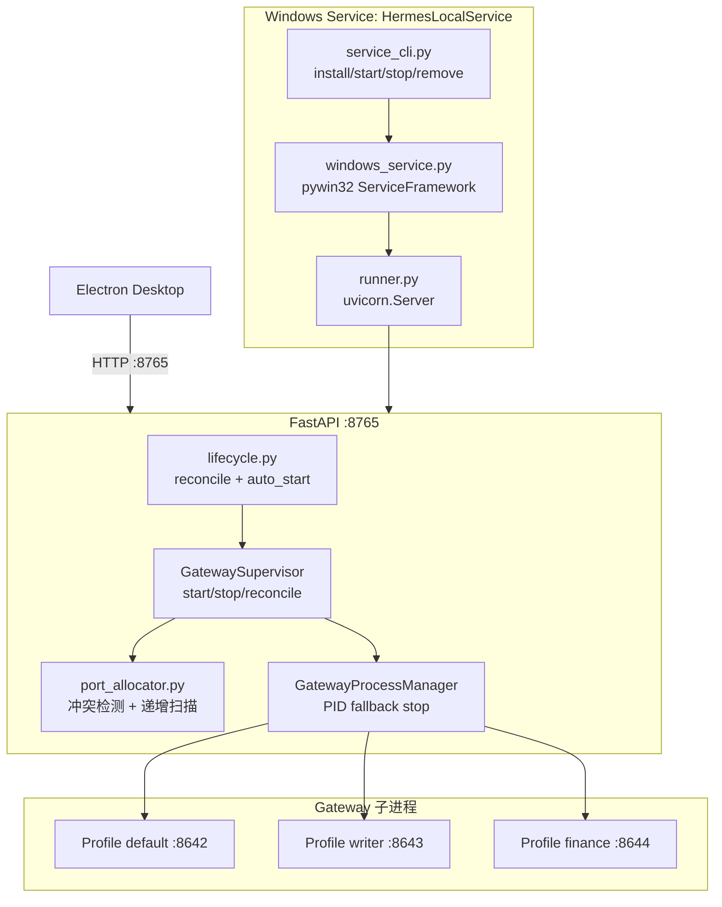

# team_v1.6: Gateway Supervisor 升级为 Windows 常驻服务

## 现状总结

`copilot-serve` 已具备 GatewaySupervisor + GatewayProcessManager + ProfileService 多 Profile 管理主干，但存在以下缺陷：

- `main.py` 缺少 `get_settings` 导入（P0 bug）
- `port_allocator.py` 仅 9 行，无冲突检测，多 profile 都拿 8642
- `GatewayProcessManager` 的 `_handles` 是内存字典，服务重启后丢失
- `auto_start` 字段虽存在于 Profile 模型但未在启动时执行
- 无 Windows Service 入口（当前只能手动 `uvicorn`）

数据库 schema 无需变更（Profile 模型字段已齐全）。

## 目标架构



## 实施步骤

### Step 1: 修复 P0 bug — main.py import

**文件**: [copilot-serve/src/main.py](copilot-serve/src/main.py)

补充缺失的 import：

```python
from core.config import get_settings
```

同时补充 `app_dir="src"` 参数确保 uvicorn 在正确目录下加载模块。

---

### Step 2: 重写端口分配器

**文件**: [copilot-serve/src/runtime/port_allocator.py](copilot-serve/src/runtime/port_allocator.py)

当前 9 行代码替换为完整实现：
- `is_port_available(host, port)` — socket 探测 OS 端口占用
- `allocate_port(settings, requested, used_ports, max_scan=100)` — 用户指定则检查冲突 + OS 占用；未指定则从 `default_gateway_port` 递增扫描

**联动修改**: [copilot-serve/src/services/profile_service.py](copilot-serve/src/services/profile_service.py) 的 `create_profile()` 需查询已有 profile 的端口集合并传入：

```python
profiles = await self._repo.list_all()
used_ports = {p.gateway_port for p in profiles}
port = allocate_port(self._settings, body.gateway_port, used_ports)
```

---

### Step 3: GatewayProcessManager 增加 PID fallback

**文件**: [copilot-serve/src/runtime/gateway_process.py](copilot-serve/src/runtime/gateway_process.py)

新增方法：
- `is_pid_alive(pid: int) -> bool` — 用 psutil 检查 PID 是否存在
- `terminate_pid(pid: int) -> None` — terminate + wait + kill fallback

修改 `stop()` 签名，增加 `pid` 参数：
```python
async def stop(self, profile_id: str, *, pid: int | None = None) -> None:
```

当内存 handle 不存在时，通过 `pid` 参数 fallback 到 psutil 直接 kill。

---

### Step 4: GatewaySupervisor 增加 reconcile + auto_start

**文件**: [copilot-serve/src/services/gateway_supervisor.py](copilot-serve/src/services/gateway_supervisor.py)

新增两个方法：

1. `reconcile_on_boot()`:
   - 读取所有 status=running 的 profile
   - PID 存在 + health OK → 保持 running（标记 tracked=false，不受 `_handles` 管理）
   - PID 存在 + health failed → kill + 标记 error
   - PID 不存在 → 标记 stopped/error
   - 写 audit_log

2. `start_auto_start_profiles()`:
   - 查询 enabled=true + auto_start=true + status!=running 的 profile
   - 依次调用 `start_profile()`
   - 返回启动结果列表

修改 `stop_profile()` 传入 `pid` 参数：
```python
await self._process_manager.stop(profile.id, pid=profile.gateway_pid)
```

---

### Step 5: lifecycle 接入 reconcile + auto_start

**文件**: [copilot-serve/src/core/lifecycle.py](copilot-serve/src/core/lifecycle.py)

在 `app.state.gateway_supervisor = supervisor` 之后、启动 workers 之前：

```python
disable_autostart = bool(getattr(app.state, "_disable_gateway_autostart", False))
if not disable_autostart:
    await supervisor.reconcile_on_boot()
    await supervisor.start_auto_start_profiles()
```

测试场景可通过 `app.state._disable_gateway_autostart = True` 跳过。

---

### Step 6: 新增 local_service 包 — Windows Service 入口

**新增文件**（均在 `copilot-serve/src/local_service/` 下）：

| 文件 | 职责 |
|------|------|
| `__init__.py` | 包标记 |
| `runner.py` | `run_local_service()` — uvicorn.Server 可控启停 |
| `windows_service.py` | pywin32 `ServiceFramework` 包装 |
| `service_state.py` | 服务状态（pid / version / uptime / 进程信息） |
| `service_cli.py` | `ai-copilot-service` CLI（install/start/stop/restart/remove/status/run） |

关键设计：
- `runner.py` 使用 `uvicorn.Server(config)` 而非 `uvicorn.run()`，通过 `server.should_exit = True` 实现 graceful shutdown
- `windows_service.py` 的 `SvcStop` 设置 `should_exit` 后等待线程退出
- `service_cli.py` 无管理员权限时 `install` 明确报错

---

### Step 7: 新增 PowerShell 服务管理脚本

**新增文件**（均在 `copilot-serve/scripts/` 下）：

| 文件 | 功能 |
|------|------|
| `service-install.ps1` | 检查管理员权限 + 调用 `ai-copilot-service install` |
| `service-uninstall.ps1` | 停止 + 卸载服务 |
| `service-start.ps1` | 启动服务 |
| `service-stop.ps1` | 停止服务 |
| `service-status.ps1` | 查询服务状态 |
| `service-dev.ps1` | 开发模式启动（非服务，直接 `ai-copilot-service run`） |

---

### Step 8: pyproject.toml 更新

**文件**: [copilot-serve/pyproject.toml](copilot-serve/pyproject.toml)

```toml
[project.optional-dependencies]
service = [
  "pywin32>=306; platform_system == 'Windows'"
]

[project.scripts]
smc-copilot-serve = "main:main"
ai-copilot-service = "local_service.service_cli:main"
```

---

### Step 9 (P1): 新增 /api/v1/service/status 端点

**文件**: [copilot-serve/src/api/v1/system.py](copilot-serve/src/api/v1/system.py) + [copilot-serve/src/schemas/system.py](copilot-serve/src/schemas/system.py)

返回示例：
```json
{
  "service": "HermesLocalService",
  "version": "1.6.0",
  "pid": 1234,
  "uptime_seconds": 3600,
  "host": "127.0.0.1",
  "port": 8765,
  "profiles": { "total": 3, "running": 2, "error": 0 }
}
```

---

### Step 10 (P1): 测试与验收

- 单元测试：端口分配冲突场景、reconcile 各分支、auto_start 启动流
- `smoke-test.ps1` 扩展：多 profile 并发创建 + 启动 + 重启恢复
- 验收标准见 `specs/team_v1.6/state.md` 第五节

---

## 不做的事（P2 / 后续版本）

- Windows Job Object 管理子进程树
- 服务崩溃后 gateway orphan 自动清理策略
- Electron 安装器集成 Windows Service 安装
- copilot-desktop UI 增加 Local Service 管理页
- copilot-desktop Main Process 启动时自动检测/启动 Windows Service

## 跨项目影响

| 项目 | 影响 | 本版是否改 |
|------|------|------------|
| copilot-serve | 主要改造对象 | 是 |
| copilot-desktop | Electron Main 需增加 Service 检测启动逻辑 | 否（P2） |
| frontend (portal) | 无影响 | 否 |
| backend (portal) | 无影响 | 否 |
