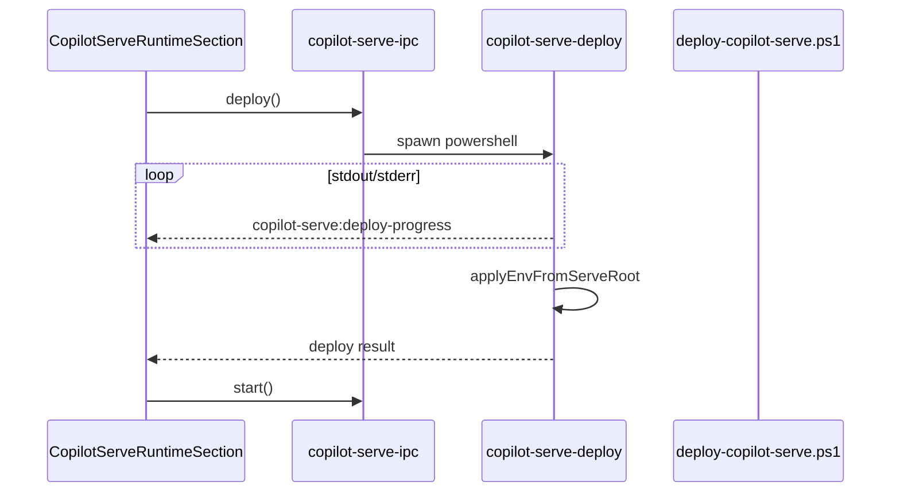

# team_v1.7.1_hotfix：补齐 v1.7 部署闭环缺口

## 背景

[team_v1.7 实施计划](.cursor/plans/team_v1.7_安装部署_0fd1b5c6.plan.md) 主链路已落地；review 发现若干与 [prd/team_v1.7_install.md](prd/team_v1.7_install.md) §10.3 及计划 Phase 2.3 不一致之处。本 hotfix **不改动** `/api/v1/*`、不启用 Windows Service、不调整默认 git 分支（保持 **master**）。

## 范围矩阵

| 优先级 | 缺口 | hotfix 动作 |
|--------|------|-------------|
| P0 | `uv sync` 无退出码检查 | PS1 fail-fast |
| P0 | 部署后 User env 未注入当前进程 | Main 从磁盘刷新 `process.env` |
| P0 | 部署日志非流式 | IPC `deploy-progress` 事件 + UI 订阅 |
| P1 | 8765 占用未在 runtime preflight | 复用 `isPortAvailable` + Win `netstat` PID |
| P1 | `getCopilotServeStatus` dead `stopped` 分支 | 用 `runtimeDir` + `pyproject.toml` 区分 missing/stopped |
| P1 | 升级用户 `desktop-runtime.json` 缺 copilot 字段 | `mergeRuntimeConfig` 显式合并三字段 |
| P1 | `deploy.ts` 类型重复 | 仅从 contract import |
| P2 | deploy 仅 Windows | IPC 非 win32 返回明确错误 |
| P2 | Portal Runtime 条与 copilot-serve 不同步 | `emitStatusChanged` 写 `profile-runtime-db` |
| P2 | UI `stop` 未 await | `await window.copilotServe.stop()` |
| 不做 | `copilot-serve-cache` 目录 | 保留目录，不在本 hotfix 实现缓存逻辑 |
| 不做 | Settings i18n | 维持现有中文文案 |



---

## 1. 部署脚本加固（P0）

**文件**: [copilot-desktop/build/scripts/deploy-copilot-serve.ps1](copilot-desktop/build/scripts/deploy-copilot-serve.ps1)

- 在 `uv sync --extra service` 与 `uv venv` 后增加 `$LASTEXITCODE` 检查（与 alembic 一致）
- 可选：抽取 `Assert-LastExit([string]$Step)` 小函数，避免重复

**验证**: 人为让 `uv sync` 失败（断网/坏 lock），脚本应以非 0 退出且 `deploy-state.json` 为 `failed`。

---

## 2. 部署后进程内环境变量（P0）

**新函数**（建议放在 [copilot-desktop/src/main/copilot-serve/copilot-serve-paths.ts](copilot-desktop/src/main/copilot-serve/copilot-serve-paths.ts) 或独立 `copilot-serve-env.ts`）:

```typescript
export function applyCopilotServeEnvFromDisk(serveRoot: string, port?: number): void {
  process.env.COPILOT_SERVE_ROOT = serveRoot;
  const venvPy = join(serveRoot, ".venv", "Scripts", "python.exe"); // win
  if (existsSync(venvPy)) process.env.COPILOT_SERVE_PYTHON = venvPy;
  if (port) process.env.COPILOT_SERVE_PORT = String(port);
}
```

**调用点**:
- [copilot-desktop/src/main/copilot-serve/copilot-serve-deploy.ts](copilot-desktop/src/main/copilot-serve/copilot-serve-deploy.ts)：`close` 且 `code === 0` 时，用 `resolveCopilotServeRoot()` 或 `join(installDir, "runtime", "copilot-serve")` 调用
- 不改变 PRD「User 级持久 env」行为；仅补 **同会话** 无需重启即可 `start`

---

## 3. IPC 流式部署日志（P0，用户选定）

### 3.1 Contract + Preload

**文件**: [copilot-desktop/src/shared/copilot-serve/copilot-serve-contract.ts](copilot-desktop/src/shared/copilot-serve/copilot-serve-contract.ts)

- 新增 `CopilotServeDeployProgressEvent { line: string; stream: "stdout" | "stderr" }`
- `CopilotServeAPI` 增加 `onDeployProgress(callback): () => void`

**文件**: [copilot-desktop/src/preload/copilot-serve-api.ts](copilot-desktop/src/preload/copilot-serve-api.ts)

- `ipcRenderer.on("copilot-serve:deploy-progress", ...)` 包装 unsubscribe

### 3.2 Main deploy

**文件**: [copilot-desktop/src/main/copilot-serve/copilot-serve-deploy.ts](copilot-desktop/src/main/copilot-serve/copilot-serve-deploy.ts)

- `runCopilotServeDeploy(options, onProgress?: (line) => void)` 或在 IPC 层传入 `getWindow`
- `stdout`/`stderr` `data` 回调：`getWindow()?.webContents.send("copilot-serve:deploy-progress", { line, stream })`
- 非 `win32`：立即返回 `{ success: false, error: "copilot-serve deploy is only supported on Windows" }`（P2）

**文件**: [copilot-desktop/src/main/copilot-serve/copilot-serve-ipc.ts](copilot-desktop/src/main/copilot-serve/copilot-serve-ipc.ts)

- `deploy` handler 传入 `getWindow`，注册 progress 推送

### 3.3 Renderer

**文件**: [copilot-desktop/src/renderer/src/modules/hermes-runtime/sections/CopilotServeRuntimeSection.tsx](copilot-desktop/src/renderer/src/modules/hermes-runtime/sections/CopilotServeRuntimeSection.tsx)

- `useEffect` 订阅 `onDeployProgress`，追加到 `deployLog` state
- 部署开始清空日志；结束时保留完整 log + 仍展示 `result.error`

---

## 4. Runtime preflight：8765 端口（P1）

**文件**: [copilot-desktop/src/main/copilot-serve/copilot-serve-preflight.ts](copilot-desktop/src/main/copilot-serve/copilot-serve-preflight.ts)

- 从 [copilot-desktop/src/main/copilot-serve/copilot-serve-paths.ts](copilot-desktop/src/main/copilot-serve/copilot-serve-paths.ts) 取 `port`
- 复用 [copilot-desktop/src/main/aios/aios-port-check.ts](copilot-desktop/src/main/aios/aios-port-check.ts) `isPortAvailable(port)`
- 若不可用：
  - Windows：`execFileSync('netstat', ['-ano'], ...)` + 解析 `:8765` 行取 PID（对齐 NSIS `RuntimePrecheck.nsh` 思路）
  - 若 PID === 当前 `child?.pid`（copilot-serve 已自启）→ `pass`/`warn` 而非 `fail`
- 新增 check项 `port8765`；占用时 `status: fail`，`detail` 含 PID

**验证**: 先 `python -m uvicorn` 占 8765，precheck 应 fail 并显示 PID。

---

## 5. 状态与配置修正（P1）

### 5.1 `getCopilotServeStatus` missing/stopped

**文件**: [copilot-desktop/src/main/copilot-serve/copilot-serve-process.ts](copilot-desktop/src/main/copilot-serve/copilot-serve-process.ts)

```typescript
if (!paths) {
  const runtimeDir = resolveCopilotServeRuntimeDir();
  const deployed = runtimeDir && existsSync(join(runtimeDir, "pyproject.toml"));
  return { status: deployed ? "stopped" : "missing", ... };
}
```

### 5.2 `mergeRuntimeConfig` 升级补字段

**文件**: [copilot-desktop/src/main/enterprise/desktop-runtime-config.ts](copilot-desktop/src/main/enterprise/desktop-runtime-config.ts)

对 `copilotServeDir` / `copilotServeDeployScript` / `copilotServePort` 采用与 `hermesHome` 相同的三元合并，避免老 json 缺字段。

### 5.3 类型去重

**文件**: [copilot-desktop/src/main/copilot-serve/copilot-serve-deploy.ts](copilot-desktop/src/main/copilot-serve/copilot-serve-deploy.ts)

- 删除本地 `CopilotServeDeployOptions/Result`，改为从 contract import

---

## 6. Portal Runtime 条同步（P2）

**文件**: [copilot-desktop/src/main/copilot-serve/copilot-serve-ipc.ts](copilot-desktop/src/main/copilot-serve/copilot-serve-ipc.ts)

在 `emitStatusChanged` 中调用 `updateRuntimeServiceStatus("copilot-serve", mappedStatus, { pid, port, last_error })`（[profile-runtime-db.ts](copilot-desktop/src/main/profile-runtime-db.ts)）。

映射表：

| CopilotServeProcessStatus | RuntimeServiceStatus |
|---------------------------|----------------------|
| missing | not_installed |
| stopped | stopped |
| starting | starting |
| running | running |
| degraded | degraded |
| error | error |

---

## 7. 文档（轻量）

新增 [prd/team_v1.7.1_hotfix_install.md](prd/team_v1.7.1_hotfix_install.md)（1 页）：

- 修复项列表、验收步骤（deploy 失败回滚、8765 占用、同会话 deploy+start、流式日志）
- 明确 **不改变** v1.7 API/Service 边界

copilot-serve 侧：**无代码变更**（除非 PS1 镜像同步到 serve 仓库文档；可选在 README 注「desktop 安装器内嵌脚本以 desktop 仓库为准」）。

---

## 验收清单（DoD）

1. `uv sync` 失败 → deploy 非 0，UI 流式日志可见错误行，`deploy-state.json` 为 failed
2. 同会话 deploy 成功 → 不重启 desktop → `start` 成功且 health OK
3. 8765 被外部进程占用 → precheck `port8765` fail，detail 含 PID
4. 升级安装（无 copilot 字段的旧 json）→ `mergeRuntimeConfig` 后 Settings 可找到 deploy 脚本
5. Portal `RuntimeStatusBar` 中 copilot-serve 状态与 Settings 一致
6. `npx tsc --noEmit`（copilot-desktop）通过

---

## 建议实施顺序

1. PS1 退出码 + env 刷新工具函数  
2. deploy IPC 流式 + contract/preload  
3. preflight 8765 + status/merge/types  
4. Runtime DB 同步 + UI 小修  
5. PRD hotfix 文档 + 手测

**预估改动**: copilot-desktop ~8–10 文件；copilot-serve 0–1 文件（文档可选）。
