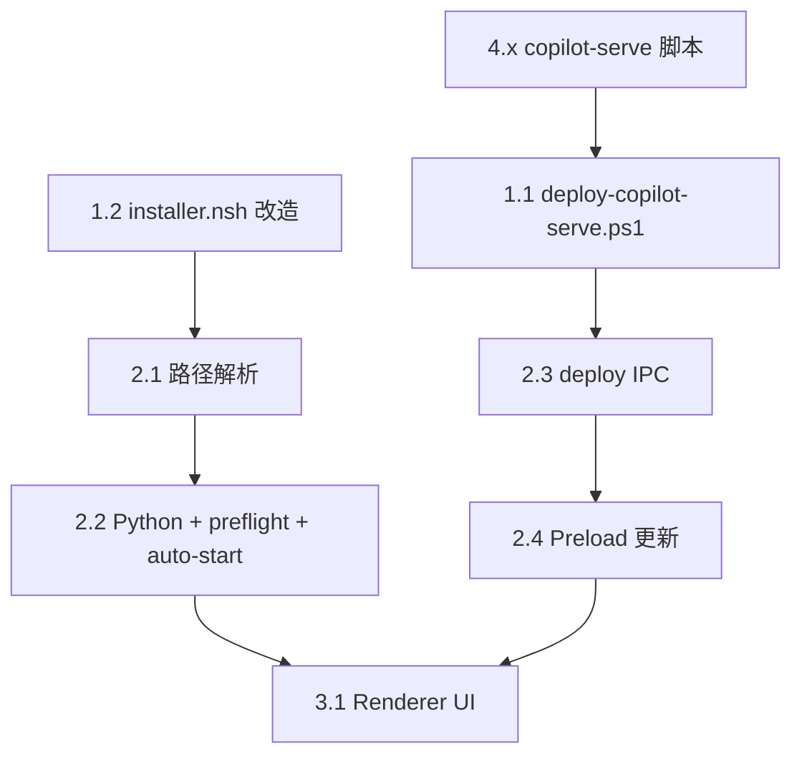

# team_v1.7 实施计划：copilot-desktop + copilot-serve 本地部署闭环

## 现状基线

**copilot-desktop 已有能力**：
- Main Process spawn copilot-serve（`copilot-serve-process.ts`）：token 注入、health 轮询、日志收集
- Preload `window.copilotServe` API（get-connection/status/start/stop/restart/getLogs）
- NSIS 安装器创建 `runtime/hermes-agent`、`bin/hermes.cmd`、写 `desktop-runtime.json`
- `desktop-runtime-config.ts` 提供 JSON 读写/合并 API

**copilot-desktop 缺口**：
- 路径解析无 `$INSTDIR/runtime/copilot-serve`
- Python 解析只有 `COPILOT_SERVE_PYTHON || "python"`，无 venv 自动探测
- 无 `deploy-copilot-serve.ps1`
- 安装器未创建 `runtime/copilot-serve` 目录
- 无 Renderer copilot-serve 设置/安装 UI
- Main Process 启动时不自动 start（仅 IPC 手动触发）

**copilot-serve 已有能力**：
- 完整 FastAPI + Gateway Supervisor + 多 Profile
- Alembic 迁移链（3 个 revision）
- `smoke-test.ps1` 冒烟脚本
- Windows Service 封装（可选）

---

## 实施分 4 个阶段

### Phase 1: 安装器 + 部署脚本

#### 1.1 新建 `build/scripts/deploy-copilot-serve.ps1`

位置：[copilot-desktop/build/scripts/deploy-copilot-serve.ps1](copilot-desktop/build/scripts/deploy-copilot-serve.ps1)

核心逻辑（PRD 第 4 节）：

```powershell
param(
  [string]$InstallRoot = "$env:LOCALAPPDATA\Programs\SMC Copilot",
  [string]$RepoUrl = "https://github.com/loudon84/ai-os-serve.git",
  [string]$Branch = "master",
  [int]$Port = 8765,
  [switch]$Force,
  [switch]$RestartDesktop
)
```

流程：Windows 版本检查 → Git → Python 3.12 → uv → clone/pull → .venv → `uv sync --extra service` → 写 `.env` → `alembic upgrade head` → 设置用户环境变量 → 写 `deploy-state.json` → 可选重启 desktop

#### 1.2 修改 `build/installer.nsh`

在 `customInstall` 宏中增加：
- `CreateDirectory "$INSTDIR\runtime\copilot-serve"`
- `SetOutPath "$INSTDIR\runtime"` + `File "build\scripts\deploy-copilot-serve.ps1"`

在 `desktop-runtime.json` 写入段增加字段：
```json
"copilotServeDir": "$INSTDIR\\runtime\\copilot-serve",
"copilotServeDeployScript": "$INSTDIR\\runtime\\deploy-copilot-serve.ps1",
"copilotServePort": 8765
```

在 `RuntimePrecheck.nsh` 中增加 8765 端口检测。

---

### Phase 2: Main Process 改造

#### 2.1 路径解析 — `copilot-serve-paths.ts`

修改 `resolveCopilotServeRoot()` 优先级：

```
1. COPILOT_SERVE_ROOT 环境变量
2. desktop-runtime.json 中的 copilotServeDir
3. app.getPath("exe") 推导 → runtime/copilot-serve
4. 开发态候选路径（保留现有）
```

需要从 `desktop-runtime-config.ts` 导入 `readRuntimeConfig()`。

#### 2.2 Python 解析 — `copilot-serve-process.ts`

修改 `resolvePythonExecutable()`:

```
1. COPILOT_SERVE_PYTHON 环境变量
2. <serveRoot>/.venv/Scripts/python.exe（Windows）
3. py -3.12（Windows py launcher）
4. python（fallback）
```

增加 preflight 检查函数：验证 Python 版本 + pyproject.toml + .venv + .env + sqlite 是否就绪。

增加应用启动自动 start：在 `app.whenReady()` 链路中，若 preflight 通过则自动 `startCopilotServeProcess()`。

#### 2.3 新增 IPC — `copilot-serve-ipc.ts`

```typescript
ipcMain.handle("copilot-serve:deploy", (_, options) => runDeployScript(options));
ipcMain.handle("copilot-serve:precheck", () => runPrecheck());
ipcMain.handle("copilot-serve:open-runtime-dir", () => shell.openPath(serveRoot));
```

`runDeployScript`：通过 `child_process.spawn` 执行 `deploy-copilot-serve.ps1`，流式返回日志。

#### 2.4 Preload 更新 — `copilot-serve-api.ts`

新增暴露：
- `deploy(options?)` → `copilot-serve:deploy`
- `precheck()` → `copilot-serve:precheck`
- `openRuntimeDir()` → `copilot-serve:open-runtime-dir`

同步更新 `copilot-serve-contract.ts` 类型定义。

---

### Phase 3: Renderer UI

#### 3.1 Copilot Serve Runtime 状态卡片

位置建议：在现有 Settings/Runtime 区域（或 HermesRuntime 相关页面）新增一个 Section。

状态展示：
- installed / missing / starting / running / degraded / error / stopped
- pid / port / baseUrl / logPath / lastError

操作按钮：
- 安装 copilot-serve（调 deploy）
- 启动 / 停止 / 重启
- 查看日志
- 打开 runtime 目录

验证项（precheck 结果展示）：
- Python 3.12 / Git / uv / pyproject.toml / .venv / .env / SQLite / health

---

### Phase 4: copilot-serve 侧补充

#### 4.1 新增脚本

- [copilot-serve/scripts/bootstrap-windows.ps1](copilot-serve/scripts/bootstrap-windows.ps1) — 单仓库快速开发部署（venv + deps + .env + migrate）
- [copilot-serve/scripts/migrate-windows.ps1](copilot-serve/scripts/migrate-windows.ps1) — 单独执行 `alembic upgrade head`
- [copilot-serve/scripts/smoke-test-windows.ps1](copilot-serve/scripts/smoke-test-windows.ps1) — 基于现有 `smoke-test.ps1` 扩展验收场景

#### 4.2 文档更新

- `.env.example`：补充 `HERMES_GATEWAY_COMMAND` 说明
- `docs/api-contract.md`：增加 team_v1.7 Windows Desktop 部署说明
- `README.md`：增加 Windows 部署章节

---

## 关键依赖关系



**建议执行顺序**：Phase 4（copilot-serve 脚本，无依赖） → Phase 1（installer + deploy 脚本） → Phase 2（Main Process） → Phase 3（Renderer UI）

---

## 验收目标（PRD 第 10 节）

- 干净 Win10 机器：安装 → 点击安装 copilot-serve → health OK → 创建 profile → 启动 gateway
- 升级安装：sqlite.db/profiles 不丢、可 pull 更新、alembic 可重复执行
- 异常场景：Git/Python/uv 缺失提示、端口占用展示、deploy 日志可查

---

## 注意事项

- **不修改** copilot-serve API 路径（`/api/v1/*` 稳定）
- **不默认启用** Windows Service 模式（desktop spawn 为主）
- **不改名** 环境变量前缀（`COPILOT_SERVE_*` 沿用）
- 两个项目为独立 git，需分别 commit/push
