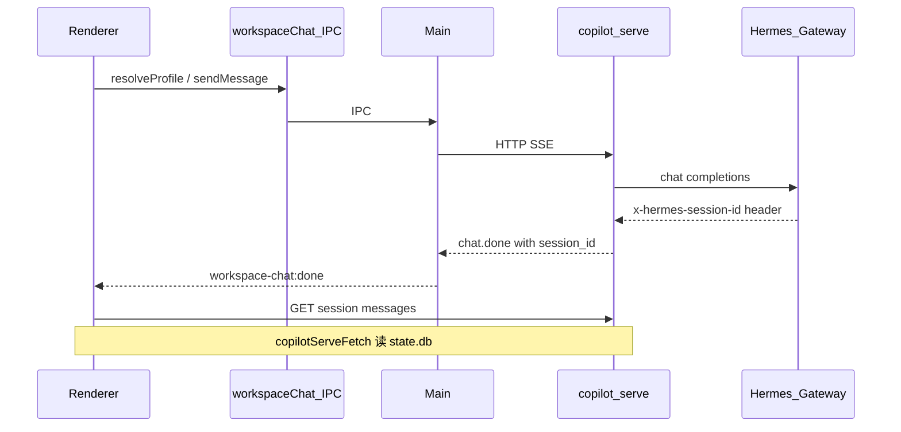

# team_v1.8.1_hotfix 修复计划

依据 [review 结论](.cursor/plans/team_v1.8_chatpanel_优化_c06b40a6.plan.md) 与 [prd/team_v1.8_chatpanel.md](prd/team_v1.8_chatpanel.md) 第 6–8 节，在 **不修改 plan 文件** 前提下完成 hotfix。你已选择：**会话历史迁移到 copilot-serve**（非保留 `hermesAPI.getSessionMessages`）。

---

## 目标架构（hotfix 后）



---

## P0 — 阻塞验收（必须先做）

### P0-1 `profileInstalled` 逻辑错误

**文件**: [useHermesWebChat.ts](copilot-desktop/src/renderer/src/screens/Workspaces/pages/Chat/hooks/useHermesWebChat.ts)

- 将 `profileInstalled` 从 OR 改为 AND：
  - `activeProfile?.installed !== false && resolved?.status !== "not_deployed"`
- 与 `canChat`、`showPresetRequired` 行为对齐。

### P0-2 审批流回归

**参考旧实现**: [useHermesChatStream.ts](copilot-desktop/src/renderer/src/screens/Workspaces/hooks/useHermesChatStream.ts) + [approvalUtils.ts](copilot-desktop/src/renderer/src/screens/Workspaces/api/approvalUtils.ts)

**文件**: [useChatStream.ts](copilot-desktop/src/renderer/src/screens/Workspaces/pages/Chat/hooks/useChatStream.ts)、[HermesWebChatSurface.tsx](copilot-desktop/src/renderer/src/screens/Workspaces/pages/Chat/HermesWebChatSurface.tsx)

- `onToolProgress`：对 `ev.name` / `ev.label` 调用 `toolRequiresApproval()`，设置 `activeTool.status = waiting_approval` 与 `runState = waiting_approval`。
- 导出 `dismissApproval`（与旧 hook 一致：清 tool + `idle`）。
- `HermesWebChatSurface`：`onApprove={stream.dismissApproval}`，`onReject` 保持 `cancel()`。

### P0-3 新会话 `session_id` 回写

**根因**: Gateway 在响应头返回 `x-hermes-session-id`（见 [hermes.ts](copilot-desktop/src/main/hermes.ts) L345），但 [chat_stream_service.py](copilot-serve/src/services/chat_stream_service.py) 未读取；`WorkspaceChatDoneEvent` 仅含请求侧 scope。

**Serve**

- 在 `stream_chat` 的 `client.stream(...)` 上读取 `response.headers.get("x-hermes-session-id")`。
- 扩展 [schemas/chat.py](copilot-serve/src/schemas/chat.py) / [workspace-chat-contract.ts](copilot-desktop/src/shared/workspace-chat/workspace-chat-contract.ts)：`WorkspaceChatDoneEvent` 增加可选 `resolved_session_id?: string`（或当 header 存在时更新 `session_id` 字段并文档化）。
- `chat.done` SSE data 带上解析后的 session id。
- 更新 [mock_hermes_gateway.py](copilot-serve/scripts/mock_hermes_gateway.py) SSE 响应添加 `x-hermes-session-id` header，保证 pytest 可断言。

**Renderer**

- [useChatStream.ts](copilot-desktop/src/renderer/src/screens/Workspaces/pages/Chat/hooks/useChatStream.ts) `onDone`：若 `resolved_session_id`（或更新后的 `session_id`）满足 `isPersistedSessionId`，则 `sessionRef.current = id` 并调用 `onSessionId(id)`。
- 首条消息仍用 `session_${Date.now()}` 草稿 id 发送；收到 Gateway id 后刷新 Sessions 列表（已有 `refreshSessions` 回调）。

---

## P1 — 稳定性与架构一致性

### P1-1 Main Process 多 stream 隔离

**文件**: [workspace-chat-stream.ts](copilot-desktop/src/main/workspace-chat/workspace-chat-stream.ts)

- 用 `Map<string, { abort, streamId }>` 替代全局 `activeAbort` / `activeStreamId`。
- Key 建议：`${profile_id}:${session_id}`（同 profile 多 session 不互相误杀）；profile 切换时按 prefix `profile_id:` 批量 abort。
- `abortWorkspaceChatStream(profileId, sessionId?)`：有 `sessionId` 只 abort 该 key，否则 abort 该 profile 下全部。
- IPC [workspace-chat-ipc.ts](copilot-desktop/src/main/workspace-chat/workspace-chat-ipc.ts)：可选扩展 `abort` 参数为 `{ profileId, sessionId?, streamId? }`；Renderer `resetStream` 传入当前 `sessionId`。

### P1-2 `resetStream` 依赖清理

**文件**: [useChatStream.ts](copilot-desktop/src/renderer/src/screens/Workspaces/pages/Chat/hooks/useChatStream.ts)

- `resetStream` 移除 `runState` 依赖，用 `runStateRef` 判断是否置 `cancelled`，避免 effect 连锁触发。
- profile/workspace/session 切换时：先 abort → 再清 streaming；对未完成 assistant 流在 cancel 路径保留 `[interrupted]` 标记（PRD 3.7）。

### P1-3 Profile 切换时 abort 新链路

**文件**: [WorkspacesContext.tsx](copilot-desktop/src/renderer/src/screens/Workspaces/context/WorkspacesContext.tsx)

- `setActiveProfileId` 除 `workspacesApi.abortChat()` 外，对**已 resolve 的** `profile_id` 调用 `window.workspaceChat.abort(profileId)`（可在切换前用当前 activeProfileId 调 abort，与旧路径并行）。

### P1-4 会话历史迁移到 copilot-serve（用户选定）

**Serve 新增**

- `src/services/chat_session_service.py`：按 `profile.profile_path/state.db` 读取 `messages` 表（逻辑对齐 [sessions.ts](copilot-desktop/src/main/sessions.ts) L153–180；只读、参数化 SQL、无 ORM 泄漏）。
- [chat.py](copilot-serve/src/api/v1/chat.py) 新增：
  - `GET /api/v1/profiles/{profile_id}/sessions/{session_id}/messages`
  - 返回 `{ messages: [{ id, role, content, timestamp }] }`
  - profile 不存在 / `not_deployed` / db 缺失 → 结构化 `ChatApiError`（`PROFILE_NOT_FOUND` / `PROFILE_NOT_DEPLOYED`）。

**Desktop**

- [useChatStream.ts](copilot-desktop/src/renderer/src/screens/Workspaces/pages/Chat/hooks/useChatStream.ts) `loadSessionHistory`：改用 `copilotServeFetch` + `ensureCopilotServeConfig()`（与 [workspacesApi.ts](copilot-desktop/src/renderer/src/screens/Workspaces/api/workspacesApi.ts) 一致），**不再**调用 `window.hermesAPI.getSessionMessages`。
- 需传入 `profileId`（resolved id）到 `useChatStream` / `loadSessionHistory`。

**测试**: `tests/api/test_workspace_chat.py` 增加「有 state.db 时拉历史」用例（测试夹具写入临时 db 或 mock service）。

### P1-5 `send()` 历史消息闭包

**文件**: [useChatStream.ts](copilot-desktop/src/renderer/src/screens/Workspaces/pages/Chat/hooks/useChatStream.ts)

- 用 `messagesRef` 在 `setMessages` 后同步，构建 `history` 时读 ref，避免 `messages` 依赖导致重复 send 或漏最后一条 user 消息。

### P1-6 订阅 `onUsage` 并展示

**文件**: [useChatStream.ts](copilot-desktop/src/renderer/src/screens/Workspaces/pages/Chat/hooks/useChatStream.ts)、[ChatScrollArea.tsx](copilot-desktop/src/renderer/src/screens/Workspaces/pages/Chat/ChatScrollArea.tsx) 或新建轻量 `UsageRow.tsx`

- 状态：`lastUsage`（tokens）。
- scope 校验与 chunk 一致；在消息区底部或 `ActivityRow` 下方展示 usage（PRD 8.4）。

---

## P2 — PRD 缺口与质量债

### P2-1 缺失 UI 组件（PRD 3.1）

| 组件 | 做法 |
|------|------|
| [WorkspaceSelector.tsx](copilot-desktop/src/renderer/src/screens/Workspaces/pages/Chat/WorkspaceSelector.tsx) | 新增：`useWorkspaceOptions` 通过 `copilotServeFetch(GET /api/v1/workspaces)`；无记录时 fallback 单项「Profile home」（`workspace_id = profile_id`）。`useHermesWebChat` 持有 `workspaceId` state，切换时 abort + 清附件。 |
| [AttachmentMenu.tsx](copilot-desktop/src/renderer/src/screens/Workspaces/pages/Chat/AttachmentMenu.tsx) | Attach 按钮下拉：「选择文件」→ 现有 upload；预留 disabled「粘贴上传」。 |
| [ProviderDetails.tsx](copilot-desktop/src/renderer/src/screens/Workspaces/pages/Chat/ProviderDetails.tsx) | 从 [ErrorCard.tsx](copilot-desktop/src/renderer/src/screens/Workspaces/pages/Chat/ErrorCard.tsx) 抽出折叠区；`ErrorCard` 组合 `ProviderDetails`。 |

**ComposerBar** ([ComposerBar.tsx](copilot-desktop/src/renderer/src/screens/Workspaces/pages/Chat/ComposerBar.tsx))：接入 `WorkspaceSelector`、`AttachmentMenu`；Composer 区域增加 `onDrop`/`onDragOver` 调用 upload（PRD 3.5 拖拽，hotfix 最小实现）。

### P2-2 ChatScrollArea PRD 细节

**文件**: [ChatScrollArea.tsx](copilot-desktop/src/renderer/src/screens/Workspaces/pages/Chat/ChatScrollArea.tsx)

- 按 `createdAt` 插入日期分隔线（日级）。
- `lastError` 使用 `ErrorCard` + `details`（从 `onError` 的 `ev.details` 传入，非仅 string）。
- 可选：`retryLast` 恢复到 `useChatStream`（对齐旧 hook）。

### P2-3 错误码体系补全

**文件**: [errors.py](copilot-serve/src/core/errors.py)

- 为 PRD 第 6 节 15 个 code 增加 factory（已有部分：`PROFILE_NOT_FOUND`、`GATEWAY_*`、`ATTACHMENT_*`、`WORKSPACE_NOT_FOUND`、`CHAT_STREAM_*`）。
- 补齐并接入：`PROFILE_NOT_DEPLOYED`（chat send / list models 时）、`MODEL_LIST_FAILED`、`MODEL_CONFIG_INVALID`、`WORKSPACE_PATH_INVALID`。
- `chat_model_service` / `profile_ref_resolver`：在 `status == not_deployed` 且调用写操作时抛 `PROFILE_NOT_DEPLOYED`（resolve GET 仍返回 200 + status，符合 PRD 4.4）。

### P2-4 pytest 补全（PRD 7.1）

**文件**: [tests/api/test_workspace_chat.py](copilot-serve/tests/api/test_workspace_chat.py)、新建 `tests/api/test_workspace_attachments.py`

| 用例 | 断言 |
|------|------|
| resolve + `profile_path` 不存在 | `status == not_deployed` |
| upload 文本附件 | 201 + `attachments[].text_preview` |
| 单文件 > 25MB | `ATTACHMENT_TOO_LARGE` |
| attachment scope mismatch on chat send | `ATTACHMENT_SCOPE_MISMATCH` |
| session messages | GET messages 返回排序后的 user/assistant |
| SSE mock | `resolved_session_id` 在 `chat.done` 中 |

### P2-5 遗留代码与文档

- [pages/Chat/Chat.tsx](copilot-desktop/src/renderer/src/screens/Workspaces/pages/Chat/Chat.tsx)：文件头 `@deprecated`，说明 Workspaces 仅 [workspace-pages.tsx](copilot-desktop/src/renderer/src/screens/Workspaces/registry/workspace-pages.tsx) 使用 `ChatPanel`。
- 文档：`copilot-desktop/docs/API_CONTRACTS.md`（abort 参数、session messages、done 字段）、`copilot-serve/AGENT.md`、根 `AGENTS.md` 增加 **team_v1.8.1_hotfix** 一行。
- [prd/team_v1.8_chatpanel.md](prd/team_v1.8_chatpanel.md) 末尾追加 **v1.8.1 hotfix** 变更摘要（可选 10 行）。

---

## 实施顺序（建议）

```txt
1. P0 serve session header + contract + mock
2. P0 Renderer session / approval / profileInstalled
3. P1 Main stream Map + abort 联动 + resetStream/send ref
4. P1 serve session messages API + loadSessionHistory 迁移
5. P1 onUsage
6. P2 UI 组件 + ChatScrollArea 增强
7. P2 errors + pytest 全量
8. 文档 + typecheck + pytest 验收
```

---

## 验收命令

```powershell
cd copilot-serve; uv run pytest tests/api/test_workspace_chat.py tests/api/test_workspace_attachments.py -q
cd copilot-desktop; npm run typecheck
```

**手测清单**（PRD 8）：default resolve、新对话进 Sessions、审批卡片 Approve/Reject、切 profile 不串流、附件超限错误码、usage 显示。

---

## 风险与边界

- **state.db 路径**：serve 读消息依赖 `profile_path` 与 Hermes 本地布局一致；路径不存在时返回空列表而非 500。
- **审批 Approve**：仍为 P2 级「本地 dismiss」、不 resume Gateway（与 [API_CONTRACTS.md](copilot-desktop/docs/API_CONTRACTS.md) team_v1.5.3 一致）；Reject 走 abort。
- **Workspace 列表**：若 DB 无 workspace 行，UI 仅 profile home，不阻断 chat。
