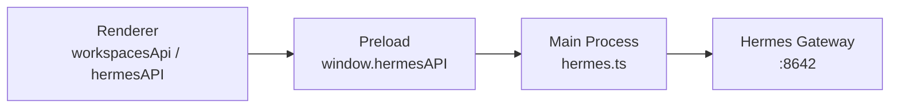
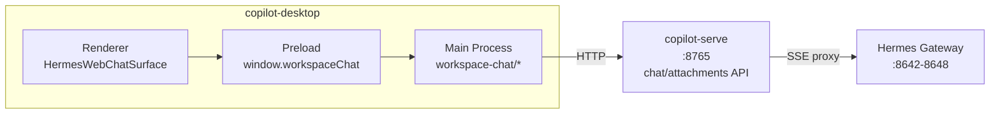

# team_v1.8 Workspaces Chat Panel 优化实施计划

## 现状分析

### copilot-desktop Renderer 层

当前 Workspaces Chat 有**两套并行的 Chat 实现**：

1. **panels/ChatPanel.tsx**（当前打开文件）：使用 `useHermesChatStream` + `ChatComposer` + `ChatHeader` + `MessageTimeline`，通过 `workspacesApi` 调用 `window.hermesAPI.sendMessage` 直接与 Hermes Gateway 通信
2. **pages/Chat/Chat.tsx**：更完整的实现，包含 `ChatInput`、`MessageList`、`ModelPicker`、`ChatHeader`、`ChatEmptyState`，以及 `useChatIPC`、`useChatActions`、`useModelConfig`、`useFastMode`、`useLocalCommands` 等 hooks

### copilot-desktop 通信链路

当前问题：
- Chat 直接通过 `window.hermesAPI` 调 Main，Main 直连 Hermes Gateway
- 没有 profile resolve（用 name 而非 ID），导致 "Profile default not found"
- 无 stream scope 隔离（切 profile/session 时旧 stream 可能污染）
- 无附件上传能力
- 无模型配置持久化（仅 Main 内存 + Hermes Gateway 配置）

### copilot-serve 层

已有完善的 Profile/Gateway 管理体系（[src/api/v1/profiles.py](copilot-serve/src/api/v1/profiles.py)、[src/services/profile_service.py](copilot-serve/src/services/profile_service.py)、[src/integrations/hermes/client.py](copilot-serve/src/integrations/hermes/client.py)），但缺少 chat completions 代理、模型配置持久化、附件管理功能。

---

## 目标架构

关键变化：
- Renderer 不再直接调 `window.hermesAPI` 做 chat，改走 `window.workspaceChat` → Main → copilot-serve → Gateway
- copilot-serve 成为 chat 的中间层，负责 profile resolve、模型管理、附件、stream 代理
- Stream 事件携带 scope（profile_id/workspace_id/session_id/stream_id），Renderer 做校验

---

## 阶段一：copilot-serve 后端 API（Python）

### 1.1 数据库迁移

新增 Alembic migration `migrations/versions/20260525_team_v18_workspace_chat.py`：
- `profile_chat_settings` 表（默认模型配置）
- `chat_attachments` 表 + 索引

参考已有 migration 格式：[migrations/versions/0001_create_profiles.py](copilot-serve/migrations/versions/0001_create_profiles.py)

### 1.2 Schema 定义

新增文件：
- `src/schemas/chat.py` — `ResolvedProfile`、`ChatModel`、`ChatModelListResponse`、`ProfileChatModelConfig`、`WorkspaceChatSendPayload`、SSE 事件类型
- `src/schemas/attachments.py` — `ChatAttachment`、`UploadAttachmentsResponse`

### 1.3 DB Model

新增文件：
- `src/db/models/chat_settings.py` — `ProfileChatSettings` SQLAlchemy model
- `src/db/models/chat_attachment.py` — `ChatAttachment` SQLAlchemy model

### 1.4 Service 层

新增文件：
- `src/services/profile_ref_resolver.py` — ref → profile_id 解析（复用 [profile_service.py](copilot-serve/src/services/profile_service.py) 的 `get_profile` / `get_by_name`）
- `src/services/chat_model_service.py` — 模型列表（调 [hermes_gateway_client.py](copilot-serve/src/integrations/hermes/client.py) 的 `list_models`）+ 默认模型 CRUD
- `src/services/chat_stream_service.py` — SSE 代理（透传 Hermes Gateway `POST /v1/chat/completions`，注入附件上下文，转换为统一事件格式）
- `src/services/attachment_service.py` — 文件保存/文本抽取/SHA256/大小校验

### 1.5 API 路由

新增文件：
- `src/api/v1/chat.py` — 5 个端点：
  - `GET /profiles/resolve?ref=`
  - `GET /profiles/{id}/chat/models`
  - `GET /profiles/{id}/chat/model-config`
  - `PUT /profiles/{id}/chat/model-config`
  - `POST /profiles/{id}/chat/completions`（SSE）
- `src/api/v1/attachments.py` — 2 个端点：
  - `POST /workspaces/{id}/attachments`
  - `DELETE /workspaces/{id}/attachments/{att_id}`

注册到 [src/api/router.py](copilot-serve/src/api/router.py)

---

## 阶段二：copilot-desktop Main Process + Preload

### 2.1 Main Process 新增模块

新增目录 `src/main/workspace-chat/`：
- `workspace-chat-ipc.ts` — 注册 8 个 IPC channel
- `workspace-chat-client.ts` — HTTP 调 copilot-serve chat API
- `workspace-chat-stream.ts` — 处理 copilot-serve SSE，转发事件到 Renderer
- `workspace-attachment-staging.ts` — 附件上传代理
- `workspace-profile-resolver.ts` — 调 copilot-serve resolve API

### 2.2 Preload API

新增 `src/preload/workspace-chat-api.ts`，暴露 `window.workspaceChat` 对象（13 个方法/事件订阅）。

更新 `src/preload/index.ts` + `src/preload/index.d.ts` 注册新 API。

### 2.3 IPC 注册

在 `src/main/index.ts` 中调用 `setupWorkspaceChatIPC()`。

---

## 阶段三：copilot-desktop Renderer UI 重构

### 3.1 新增 Chat Surface 组件

新增目录 `src/renderer/src/screens/Workspaces/pages/Chat/`（复用已有目录，替换内容）：
- `HermesWebChatSurface.tsx` — 主组件
- `ChatScrollArea.tsx` — 滚动消息区
- `ComposerBar.tsx` — 底部输入区（含 Textarea、AttachmentTray、Bottom Toolbar）
- `ChatBubble.tsx` — 消息气泡
- `ActivityRow.tsx` — 折叠 Activity/Tool Progress
- `ErrorCard.tsx` + `ProviderDetails.tsx` — 错误展示
- `StatusToast.tsx` — 状态浮层
- `ModelSelector.tsx` — 模型选择（替代现有 `ModelPicker.tsx`）
- `AttachmentTray.tsx` + `AttachmentMenu.tsx` — 附件
- `ProfileSelector.tsx` — Profile 切换
- `WorkspaceSelector.tsx` — Workspace 选择
- `MoreActionsMenu.tsx` — 更多操作

### 3.2 新增 Hooks

在 `pages/Chat/hooks/` 下：
- `useHermesWebChat.ts` — 编排所有子 hooks 的主 hook
- `useComposerState.ts` — 输入状态管理
- `useChatStream.ts` — 替代 `useHermesChatStream`，走 `window.workspaceChat`，含 scope 校验
- `useChatModels.ts` — 模型列表/默认模型
- `useChatAttachments.ts` — 附件管理
- `useAutoScroll.ts` — 智能滚动
- `useProfileResolver.ts` — Profile 解析

### 3.3 ChatPanel.tsx 改造

[panels/ChatPanel.tsx](copilot-desktop/src/renderer/src/screens/Workspaces/panels/ChatPanel.tsx) 改为渲染 `HermesWebChatSurface`，移除对 `ChatComposer`/`ChatHeader`/`MessageTimeline` 的依赖。

### 3.4 保持不变的部分

- 右侧 `WorkspaceRightPanel` / `RightInspectorTabs` — 不动
- `WorkspacesShell` 三栏布局 — 不动
- `WorkspacesContext` — 仅扩展，不重写
- CSS class 命名保持 `workspaces-*` 前缀

---

## 阶段四：Profile default not found 修复

- copilot-serve `ProfileRefResolver` 支持 ref=default/name/id 三种查询
- Renderer 所有 chat 请求先 resolve profile，拿到真实 `profile_id`
- 未部署 profile 返回 `status=not_deployed`，不抛 500

---

## 阶段五：文档同步

按 `.cursor/rules/30-doc-sync-on-completion.mdc` 更新：
- copilot-desktop `AGENTS.md` — 新增 workspace-chat 模块
- copilot-desktop `docs/API_CONTRACTS.md` — 新增 8 个 IPC channel
- copilot-serve `AGENT.md` — 新增 chat/attachments API
- 主仓库 `AGENTS.md` 第三节 — 新增 PRD 条目

---

## 错误码体系

统一 15 个错误码（见 PRD 第 6 节），copilot-serve 返回结构化 `{ error: { code, message, details } }`。

---

## 风险与注意事项

- **独立 git**：copilot-desktop 和 copilot-serve 各自独立 git，需分别 commit
- **Renderer 禁区**：不访问本地文件路径，不直接调 Hermes Gateway
- **IPC 流程**：新通道必须 Main 注册 → Preload 封装 → `index.d.ts` 类型
- **向后兼容**：旧的 `window.hermesAPI` chat 路径暂不删除，新代码并行，验证后再迁移
