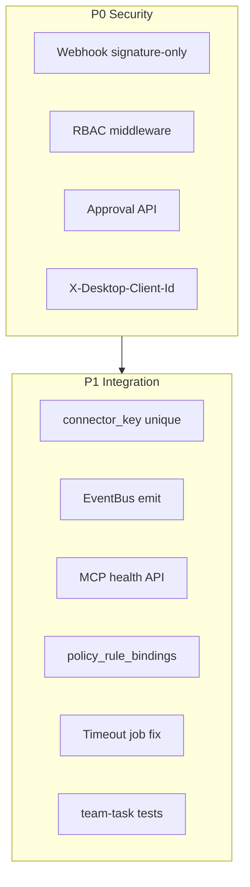

# team_v2.0.1_hotfix — P0/P1 全量修复计划

## 背景与范围

基于上一轮 review 的 **4 项 P0 + 9 项 P1**，在 v2.0 骨架上补齐 PRD 契约与安全闭环。**范围限定 Portal backend 单体**（`backend/`、`packages/shared/`、`packages/db/`），不触及 frontend / copilot-desktop / copilot-serve 客户端改造。



---

## Phase 0 — Hotfix 文档（轻量）

新增 [`prd/team_v2.0.1_hotfix_center_service.md`](prd/team_v2.0.1_hotfix_center_service.md)（参照 [`prd/team_v1.7.1_hotfix_install.md`](prd/team_v1.7.1_hotfix_install.md) 表格格式），列出 P0/P1 修复项、涉及文件、验收用例。

更新 [`backend/README.md`](backend/README.md) 增加 v2.0.1 hotfix 小节；[`docs/INDEX.md`](docs/INDEX.md) + [`AGENTS.md`](AGENTS.md) 第三节增加 hotfix PRD 索引条目。

---

## Phase 1 — P0-1：Webhook 免 JWT + Raw Body 验签

**问题：** [`auth-v2.ts`](backend/src/middleware/auth-v2.ts) 白名单不含 webhook；[`connectors.ts`](backend/src/routes/connectors.ts) 用 `JSON.stringify(req.body)` 验签。

**实现：**

1. **auth 路径例外** — 在 `authV2Middleware` 增加前缀匹配：
   - `req.path.startsWith("/api/v1/connectors/webhooks/")`
   - 设置 `req.ctx = { authSource: "webhook", permissions: [], roles: [], ...defaults }`，不要求 Bearer

2. **保留原始 body** — 在 [`app.ts`](backend/src/app.ts) 的 `express.json` 增加 `verify` 回调：
   ```typescript
   verify: (req, _res, buf) => {
     if (req.originalUrl?.includes("/connectors/webhooks/")) {
       (req as Request & { rawBody?: string }).rawBody = buf.toString("utf8");
     }
   }
   ```
   扩展 Express `Request` 类型（`backend/src/types/express.d.ts` 或现有声明文件）。

3. **路由使用 rawBody** — [`connectors.ts`](backend/src/routes/connectors.ts) 改为 `req.rawBody ?? ""`；JSON parse 失败仍走现有 Zod 校验。

4. **Connector 查找收紧** — [`connector.repository.ts`](backend/src/services/service-center/connectors/connector.repository.ts) 的 `getConnectorByKey` **webhook 路径强制要求 workspace 不可省略**；webhook handler 先按 key 查 connector，再用其 `workspaceId` 构造 ctx（现有逻辑保留，去掉无 workspace 的模糊匹配）。

5. **测试** — 扩展 [`connector-webhook-service.test.ts`](backend/tests/connector-webhook-service.test.ts)：增加「canonical body bytes vs re-stringify」对比用例，证明 rawBody 必要性。

---

## Phase 2 — P0-2：RBAC 权限码 + 路由挂载

**问题：** [`PERMISSION_CODES`](packages/shared/src/constants.ts) 无 team/service-center 权限；新路由未挂 [`rbacMiddleware`](backend/src/middleware/rbac.ts)。

**实现：**

1. **扩展共享常量** — 在 `packages/shared/src/constants.ts` 追加 PRD §5.1.3 权限（colon 命名，与 PRD 一致）：
   - `team_task:read|create|assign|approve|execute|cancel`
   - `profile:read|write`, `skill:read|write|publish`, `plugin:read|write`, `mcp:read|write`, `desktop:bootstrap`, `connector:read|write`（connector CRUD 用）

2. **更新 `SYSTEM_ROLE_PERMISSIONS`** — admin/owner 获 write+approve；user 获 read + `team_task:execute` + `desktop:bootstrap`。

3. **Seed 兼容** — [`packages/db/src/seed-auth-rbac.ts`](packages/db/src/seed-auth-rbac.ts) 已遍历 `PERMISSION_CODES`，无需改逻辑；文档注明 **hotfix 后需重跑 seed**（或 upsert 新 permissions）。

4. **路由挂 RBAC** — 各 route factory 增加 `db: Db` 参数（对齐 [`workspaces.ts`](backend/src/routes/workspaces.ts) 模式），按端点挂 middleware：

| 路由文件 | 读 | 写/变更 | 特殊 |
|---------|-----|---------|------|
| [`team-tasks.ts`](backend/src/routes/team-tasks.ts) | `team_task:read` | create/assign/cancel/retry | assigned/ack/status/result → `team_task:execute`；approve/reject → `team_task:approve` |
| [`service-center-profiles.ts`](backend/src/routes/service-center-profiles.ts) | `profile:read` | `profile:write` | |
| [`service-center-skills.ts`](backend/src/routes/service-center-skills.ts) | `skill:read` | write；publish 端点 → `skill:publish` | |
| [`service-center-plugins.ts`](backend/src/routes/service-center-plugins.ts) | `plugin:read` | `plugin:write` | |
| [`service-center-mcp.ts`](backend/src/routes/service-center-mcp.ts) | `mcp:read` | `mcp:write` | |
| [`desktop-sync.ts`](backend/src/routes/desktop-sync.ts) | clients 列表 → `profile:read` 或新 `desktop:read`（简化为 `profile:read`） | register/bootstrap/sync/heartbeat → `desktop:bootstrap` | |
| [`connectors.ts`](backend/src/routes/connectors.ts) | `connector:read` | `connector:write` | **webhook 路由不挂 RBAC** |

5. **Policy 与 RBAC 协同** — [`team-task-policy.service.ts`](backend/src/services/team-tasks/team-task-policy.service.ts) 增加 `hasPermission(ctx, code)` 辅助；`canApprove` 检查 `team_task:approve`；保留 super_admin/admin 快捷路径。

6. **更新 [`app.ts`](backend/src/app.ts)** — 传入 `db` 到各 route factory。

---

## Phase 3 — P0-3：审批流完整实现

**问题：** `team_task_approvals` 表未写入；无专用 approve/reject API。

**实现：**

1. **共享契约** — [`packages/shared/src/team-tasks/validators.ts`](packages/shared/src/team-tasks/validators.ts) 新增：
   - `teamTaskApproveSchema`（`reason?`, `auto_start?: boolean`）
   - `teamTaskRejectSchema`（`reason`）

2. **Service 方法** — [`team-task.service.ts`](backend/src/services/team-tasks/team-task.service.ts)：
   - `approveTask()`：`pending_approval → approved`（可选 `auto_start` 再转 `running`）
   - `rejectTask()`：`pending_approval → rejected`
   - 写入 [`team_task_approvals`](packages/db/src/schema/team-tasks.ts)（status=`approved|rejected`, approverUserId, resolvedAt）
   - 记录 `team_task_events` + audit `team_task.approve|reject`

3. **路由** — [`team-tasks.ts`](backend/src/routes/team-tasks.ts) 新增（放在 `/:task_id` 之前或与现有 POST 并列）：
   - `POST /:task_id/approve` + RBAC `team_task:approve`
   - `POST /:task_id/reject` + RBAC `team_task:approve`

4. **收紧 updateStatus** — 禁止客户端直接 `POST .../status { status: "approved" }`；必须通过 approve 端点（409 + 明确 error code）。

5. **进入 pending_approval 时创建 pending 记录** — 在 `updateStatus` 重定向到 `pending_approval` 时 `insertApproval({ status: "pending" })`。

---

## Phase 4 — P0-4：X-Desktop-Client-Id 校验 + assigned 路径

**问题：** copilot-serve 要求的 header 未校验；`listAssigned` 误用 `canCreate`；缺 PRD 路径参数端点。

**实现：**

1. **工具函数** — 新建 [`backend/src/middleware/desktop-client.ts`](backend/src/middleware/desktop-client.ts)：
   - `DESKTOP_CLIENT_HEADER = "x-desktop-client-id"`
   - `resolveDesktopClientId(req)`：header 优先，fallback query/body
   - `requireDesktopClientId(req)`：缺失则 400

2. **Desktop 校验** — 复用 [`DesktopClientService.assertClientActive`](backend/src/services/service-center/desktop-sync/desktop-client.service.ts)，并验证 `client.userId === ctx.userId` + workspace 一致。

3. **TeamTaskPolicy** — 新增 `assertDesktopClient(ctx, clientId, workspaceId)`；`canExecute` 在提供 clientId 时强制校验。

4. **listAssigned 改造** — [`team-task.repository.ts`](backend/src/services/team-tasks/team-task.repository.ts)：
   - 支持按 `desktopClientId` 过滤：join `team_task_assignments`，匹配 `desktop_client_id = :id OR desktop_client_id IS NULL`
   - 权限改为 `team_task:execute`

5. **路由** — [`team-tasks.ts`](backend/src/routes/team-tasks.ts)：
   - `GET /assigned` — require header + RBAC execute
   - **新增** `GET /assigned/:desktop_client_id`（path 必须在 `/:task_id` 之前注册）— 校验 path 与 header 一致
   - `POST .../ack|status|result` — require header + policy 校验

6. **assign 时绑定** — 已有 `desktop_client_id` 字段；`canExecute` 后续操作校验 assignment 上的 client 与 header 一致（[`team-task.repository.ts`](backend/src/services/team-tasks/team-task.repository.ts) 增加 `getLatestAssignment`）。

---

## Phase 5 — P1-1：Schema 约束 migration

**问题：** `connector_key` 无 workspace 级唯一。

**实现：**

1. 更新 [`packages/db/src/schema/connectors.ts`](packages/db/src/schema/connectors.ts) 增加 `unique("uq_connector_configs_workspace_key").on(table.workspaceId, table.connectorKey)`。

2. 运行 `pnpm db:generate` → 新 migration `0004_*.sql`。

3. `createConnector` 捕获 unique violation → 409 友好错误。

---

## Phase 6 — P1-2：EventBus 接入业务流

**问题：** [`globalEventBus`](backend/src/events/event-bus.ts) 仅挂载，无 emit。

**实现：**

1. 新建 [`backend/src/events/publish-domain-event.ts`](backend/src/events/publish-domain-event.ts) 薄封装，内部调用 `globalEventBus.emit(createDomainEvent(...))`。

2. 在以下 service 写操作后 emit（不替代 audit，仅领域事件）：
   - `TeamTaskService`：`team_task.created`, `team_task.status_changed`, `team_task.approved`, `team_task.rejected`
   - `ConnectorService.handleWebhook`：`connector.webhook.received`
   - `ProfileService` / `McpServerService` 关键 create/update

3. [`app.ts`](backend/src/app.ts) 注册 dev 日志 subscriber（`nodeEnv !== "test"`），便于观测；测试环境不注册。

---

## Phase 7 — P1-3：MCP Health API

**问题：** `mcp_server_health_events` 表与 `insertHealthEvent` 存在，无 API/探测。

**实现：**

1. 新建 [`backend/src/services/service-center/mcp/mcp-health.service.ts`](backend/src/services/service-center/mcp/mcp-health.service.ts)（PRD Phase 5 文件清单）：
   - `probeServer(serverId, workspaceId)` — 对 `mcp_servers.baseUrl` 发 HEAD/GET（timeout 5s），写入 health event（`healthy|unhealthy|unknown`）
   - `listHealthEvents(serverId, workspaceId, limit)`

2. [`mcp.repository.ts`](backend/src/services/service-center/mcp/mcp.repository.ts) 增加 `listHealthEvents`。

3. [`service-center-mcp.ts`](backend/src/routes/service-center-mcp.ts) 新增：
   - `POST /mcp-servers/:server_id/health-check` → `mcp:write`
   - `GET /mcp-servers/:server_id/health-events` → `mcp:read`

4. 单测 [`mcp-health.service.test.ts`](backend/tests/mcp-health.service.test.ts) — mock fetch，验证 event 写入逻辑（可用 mock repo）。

---

## Phase 8 — P1-4：policy_rule_bindings 接入 Bootstrap

**问题：** [`bootstrap.service.ts`](backend/src/services/service-center/desktop-sync/bootstrap.service.ts) 只读 `policy_rules`，忽略 [`policy_rule_bindings`](packages/db/src/schema/policy-rules.ts)。

**实现：**

1. Bootstrap 加载 rules 时 left join bindings：
   - `target_type = 'workspace'` 且 `target_id = workspace_id` → 全局 workspace 规则
   - `target_type = 'desktop_client'` 且 `target_id = client_id` → 客户端覆盖

2. 合并策略：client 绑定覆盖 workspace 默认同 `rule_key` 规则。

3. 响应 `workspace_policy` 增加 `bound_rules: [{ rule_key, rule_type, source: 'workspace'|'desktop_client' }]`（snake_case，向后兼容现有字段）。

4. 扩展 [`desktop-bootstrap-service.test.ts`](backend/tests/desktop-bootstrap-service.test.ts) 或抽纯函数 `mergePolicyRules()` 单测。

---

## Phase 9 — P1-5：Task Timeout Job 修正

**问题：** [`task-timeout-scan.job.ts`](backend/src/jobs/task-timeout-scan.job.ts) 用 `team_tasks.updatedAt`，assigned 任务易被误杀/漏杀。

**实现：**

1. `config.ts` 增加 `teamTaskTimeoutHours`（env `TEAM_TASK_TIMEOUT_HOURS`，默认 24）。

2. Job 逻辑分状态：
   - `assigned`：以 **最新 assignment.created_at** 为基准（repository 新方法 `listStaleAssignedTasks`）
   - 其他 active 状态：仍用 `team_tasks.updated_at`

3. expire 时调用 `AuditService.emit`（job 构造函数注入 auditService，[`app.ts`](backend/src/app.ts) 传入）。

---

## Phase 10 — P1-6：retryTask 与状态机对齐

**问题：** `failed → retrying` 后未自动回到 `assigned`；PRD 允许 `failed → assigned`。

**实现：**

- [`retryTask`](backend/src/services/team-tasks/team-task.service.ts) 改为直接 `failed|retrying → assigned`（利用状态机已有 `failed → assigned`），并写 event `task_reassigned`。

---

## Phase 11 — P1-7：team-task-service 集成测试

**问题：** 缺 [`team-task-service.test.ts`](backend/tests/team-task-service.test.ts)。

**实现：**

采用 **mock repository + 真实 service 编排**（与现有纯函数测试风格一致，无需 PG）：

| 用例 | 验证点 |
|------|--------|
| create → assign → ack | 状态链 + event 调用次数 |
| ack → running (low risk) | 直接 running |
| ack → running (high risk) | 重定向 pending_approval + approval 记录 |
| approve → running | approvals 表写入 |
| reject | status=rejected |
| listAssigned + client filter | repository 参数含 desktopClientId |
| updateStatus 直接 approved | 409 |

Mock `TeamTaskRepository` 方法返回可控 entity；断言 `assertTransition` 与 policy 交互。

---

## Phase 12 — 验收与文档同步

**命令：**

```bash
pnpm db:generate          # migration 0004
pnpm --filter @portal/server typecheck
pnpm --filter @portal/server test   # 目标 ≥30 tests
pnpm --filter @portal/server build
```

**手工验收清单（写入 hotfix PRD）：**

1. 无 Bearer 调用 webhook + 正确 HMAC → 201；错误签名 → 401
2. 普通 user 无 `team_task:create` → POST /team/tasks 403
3. `pending_approval` 任务 approve → approved（+ optional running）
4. GET /assigned 无 `X-Desktop-Client-Id` → 400
5. 重复 connector_key 同 workspace → 409
6. POST mcp health-check → health_events 有记录

**文档：** 完成 Phase 0 索引更新（规则 30-doc-sync）。

---

## 关键文件变更汇总

| 区域 | 主要文件 |
|------|----------|
| Auth/Webhook | `auth-v2.ts`, `app.ts`, `connectors.ts`, `types/express.d.ts` |
| RBAC | `packages/shared/src/constants.ts`, 全部 team/service-center routes, `app.ts` |
| Team Task | `team-task.service.ts`, `team-task.repository.ts`, `team-task-policy.service.ts`, `team-tasks.ts`, `validators.ts`, `desktop-client.ts` |
| DB | `connectors.ts` schema, `0004_*.sql` |
| MCP | `mcp-health.service.ts`, `service-center-mcp.ts`, `mcp.repository.ts` |
| Bootstrap | `bootstrap.service.ts` |
| Jobs | `task-timeout-scan.job.ts`, `config.ts` |
| Events | `publish-domain-event.ts`, 各 service |
| Tests | `team-task-service.test.ts`, `mcp-health.service.test.ts`, webhook test 扩展 |
| Docs | `prd/team_v2.0.1_hotfix_center_service.md`, `backend/README.md`, `docs/INDEX.md`, `AGENTS.md` |

---

## 风险与约束

- **RBAC 破坏性：** 现有 workspace 若未重跑 seed，新端点可能对 admin 以外角色 403 — hotfix PRD 必须注明 seed 步骤。
- **Webhook rawBody：** 仅对 webhook 路径启用 verify，不影响其他 JSON 端点。
- **路由顺序：** `GET /assigned/:desktop_client_id` 必须在 `GET /:task_id` 之前注册，否则被误匹配。
- **不纳入本 hotfix：** MCP Server 进程（PRD §13 built-in tool）、全表 FK 约束（范围过大，单独 migration 项目）。
