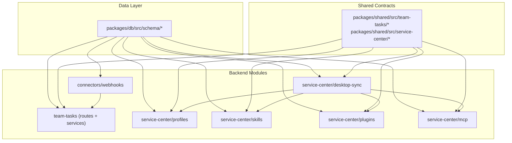

# team_v2.0 Backend 模块化单体升级实施计划

## 当前状态分析

backend 已有功能：Auth / Workspace / RBAC / Documents / Email / Audit（8 个路由文件、36 个服务文件、17 个 schema 文件）。`packages/shared/src/types/task.ts` 为空占位，`app.ts` 为手动组合根。

需新增两大核心域：**Team Task Hub**（任务协作闭环）和 **Hermes Service Center**（Profile / Skill / Plugin / MCP / Desktop Sync 配置中心），外加 Connector Webhooks。

## 架构决策

- 保持模块化单体（不拆微服务）
- 第一阶段沿用现有 `routes/ + services/` 结构，不做目录大迁移
- 新模块遵循 PRD 中的 `<module>.service.ts / .repository.ts / .policy.ts / .events.ts` 文件约定
- 所有 DTO / Validator 放入 `packages/shared/src/`
- 所有新增 schema 放入 `packages/db/src/schema/`
- app.ts 仍作为 Composition Root 手动注册新路由

## 依赖关系图



---

## Phase 0: 文档与边界落库

**目标**：更新 README 和索引文档，对齐新定位。

**修改文件**：
- [backend/README.md](backend/README.md) — 追加 team_v2.0 定位声明
- [AGENTS.md](AGENTS.md) — 第三节追加 team-tasks / service-center 条目
- [docs/INDEX.md](docs/INDEX.md) — 追加 PRD 条目

**验收**：README 明确 backend 新职责边界；AGENTS.md 地图可索引到新模块。

---

## Phase 1: 共享契约 + 数据库 Schema

**目标**：定义全部新增表和 DTO，生成 migration SQL。

**新增文件**：

```
packages/shared/src/team-tasks/constants.ts    — 状态枚举、任务类型、风险等级
packages/shared/src/team-tasks/types.ts        — TeamTask / TaskEvent / TaskResult DTO
packages/shared/src/team-tasks/validators.ts   — Zod schema
packages/shared/src/team-tasks/index.ts

packages/shared/src/service-center/profiles.ts  — Profile / ProfileManifest / ProfileTemplate
packages/shared/src/service-center/skills.ts    — SkillTemplate / SkillVersion / SkillManifest
packages/shared/src/service-center/plugins.ts   — PluginManifest / PluginVersion
packages/shared/src/service-center/mcp.ts       — McpServer / McpTool / McpToolManifest
packages/shared/src/service-center/desktop-sync.ts — BootstrapRequest / BootstrapResponse
packages/shared/src/service-center/connectors.ts
packages/shared/src/service-center/index.ts

packages/db/src/schema/team-tasks.ts           — 7 表
packages/db/src/schema/agent-profiles.ts       — 7 表
packages/db/src/schema/skill-templates.ts      — 6 表
packages/db/src/schema/plugin-manifests.ts     — 4 表
packages/db/src/schema/mcp-registry.ts         — 5 表
packages/db/src/schema/desktop-clients.ts      — 5 表
packages/db/src/schema/connectors.ts           — 3 表
packages/db/src/schema/policy-rules.ts         — 2 表
```

**修改文件**：
- [packages/shared/src/index.ts](packages/shared/src/index.ts)
- [packages/db/src/schema/index.ts](packages/db/src/schema/index.ts)

**执行命令**：`pnpm db:generate && pnpm typecheck`

**验收**：
- migration 文件可生成
- 所有新表均含 `workspace_id`
- team_tasks 状态枚举与 shared validators 一致
- typecheck 通过

---

## Phase 2: Team Task Hub

**目标**：实现任务全生命周期 API（12 端点）。

**新增文件**：

```
backend/src/routes/team-tasks.ts
backend/src/services/team-tasks/team-task.service.ts
backend/src/services/team-tasks/team-task.repository.ts
backend/src/services/team-tasks/team-task-policy.service.ts
backend/src/services/team-tasks/team-task-status-machine.ts
backend/src/services/team-tasks/team-task-event.service.ts
backend/src/services/team-tasks/team-task-result.service.ts
backend/src/services/team-tasks/team-task-assignment.service.ts
backend/src/services/team-tasks/index.ts
backend/tests/team-task-status-machine.test.ts
backend/tests/team-task-service.test.ts
```

**修改文件**：[backend/src/app.ts](backend/src/app.ts) — 注册 `/team/tasks` 路由

**实现 API**：

```
POST   /api/v1/team/tasks
GET    /api/v1/team/tasks
GET    /api/v1/team/tasks/:task_id
PATCH  /api/v1/team/tasks/:task_id
POST   /api/v1/team/tasks/:task_id/assign
POST   /api/v1/team/tasks/:task_id/ack
POST   /api/v1/team/tasks/:task_id/status
POST   /api/v1/team/tasks/:task_id/result
POST   /api/v1/team/tasks/:task_id/cancel
POST   /api/v1/team/tasks/:task_id/retry
GET    /api/v1/team/tasks/:task_id/events
GET    /api/v1/team/tasks/assigned
```

**核心逻辑**：
- 状态机：draft -> created -> assigned -> acknowledged -> pending_approval -> approved -> running -> succeeded（终态: succeeded/failed/cancelled/rejected/expired）
- 每次状态流转写入 `team_task_events` + `audit_events`
- GET /assigned 支持 `X-Desktop-Client-Id` header 用于 copilot-serve 拉取

**验收**：状态机闭环可走通；非法流转返回 `TEAM_TASK_INVALID_STATUS_TRANSITION`；Vitest 通过。

---

## Phase 3: Profile 配置中心

**目标**：Profile CRUD + Template + Manifest 下发。

**新增文件**：

```
backend/src/routes/service-center-profiles.ts
backend/src/services/service-center/profiles/profile.service.ts
backend/src/services/service-center/profiles/profile-template.service.ts
backend/src/services/service-center/profiles/profile-manifest.service.ts
backend/src/services/service-center/profiles/profile.repository.ts
backend/src/services/service-center/profiles/index.ts
backend/tests/profile-service.test.ts
```

**实现 API**（11 端点）：profiles CRUD + profile-templates CRUD + manifest 读写

**验收**：可创建/发布 template；可生成 manifest（不含本地运行态）；变更写入 audit。

---

## Phase 4: Skill Template Hub

**目标**：Skill 模板 CRUD + 版本 + 发布 + 安装。

**新增文件**：

```
backend/src/routes/service-center-skills.ts
backend/src/services/service-center/skills/skill-template.service.ts
backend/src/services/service-center/skills/skill-version.service.ts
backend/src/services/service-center/skills/skill-install.service.ts
backend/src/services/service-center/skills/skill.repository.ts
backend/src/services/service-center/skills/index.ts
backend/tests/skill-template-service.test.ts
```

**实现 API**（9 端点）：skill-templates CRUD + versions + publish + install + install-records

**验收**：Skill 可创建/版本化/发布/安装到 profile；发布与安装写入 audit。

---

## Phase 5: Plugin / MCP Registry

**目标**：Plugin manifest 注册 + MCP Server / Tool 注册与 Profile 绑定。

**新增文件**：

```
backend/src/routes/service-center-plugins.ts
backend/src/routes/service-center-mcp.ts
backend/src/services/service-center/plugins/plugin.service.ts
backend/src/services/service-center/plugins/plugin.repository.ts
backend/src/services/service-center/plugins/index.ts
backend/src/services/service-center/mcp/mcp-server.service.ts
backend/src/services/service-center/mcp/mcp-tool.service.ts
backend/src/services/service-center/mcp/mcp-profile-binding.service.ts
backend/src/services/service-center/mcp/mcp.repository.ts
backend/src/services/service-center/mcp/index.ts
backend/tests/mcp-registry-service.test.ts
backend/tests/plugin-service.test.ts
```

**实现 API**：Plugin（9 端点）+ MCP（11 端点）

**验收**：Plugin 可注册/版本/安装/启停；MCP Server + Tool 可注册/绑定 Profile；高风险 tool 默认 disabled。

---

## Phase 6: Desktop Sync / Bootstrap

**目标**：桌面端注册、心跳、bootstrap 配置下发。

**新增文件**：

```
backend/src/routes/desktop-sync.ts
backend/src/services/service-center/desktop-sync/desktop-client.service.ts
backend/src/services/service-center/desktop-sync/bootstrap.service.ts
backend/src/services/service-center/desktop-sync/sync.service.ts
backend/src/services/service-center/desktop-sync/heartbeat.service.ts
backend/src/services/service-center/desktop-sync/desktop-client.repository.ts
backend/src/services/service-center/desktop-sync/index.ts
backend/tests/desktop-bootstrap-service.test.ts
```

**实现 API**（7 端点）：register / bootstrap / sync / heartbeat / clients list / client detail / revoke

**验收**：desktop client 可注册；bootstrap 返回完整 workspace/profile/skill/plugin/mcp/policy；revoked client 不可 bootstrap。

---

## Phase 7: Connector Webhooks

**目标**：外部 Webhook 接入创建 Team Task。

**新增文件**：

```
backend/src/routes/connectors.ts
backend/src/services/service-center/connectors/connector.service.ts
backend/src/services/service-center/connectors/webhook.service.ts
backend/src/services/service-center/connectors/webhook-signature.service.ts
backend/src/services/service-center/connectors/connector.repository.ts
backend/src/services/service-center/connectors/index.ts
backend/tests/connector-webhook-service.test.ts
```

**实现 API**（5 端点）：webhook 接收 + connector CRUD

**验收**：Webhook signature 校验可用；payload 可映射为 Team Task；失败事件写入 connector_webhook_events。

---

## Phase 8: Config / Jobs / 集成收尾

**目标**：扩展 config、新增定时任务、最终集成测试。

**修改文件**：
- [backend/src/config.ts](backend/src/config.ts) — 追加 `teamTaskWebhookSecret` / `desktopSyncTokenSecret` / `mcpServerEnabled` 等配置项

**新增文件**：

```
backend/src/jobs/task-timeout-scan.job.ts
backend/src/jobs/desktop-heartbeat-cleanup.job.ts
backend/src/events/domain-event.ts
backend/src/events/event-bus.ts
```

**验收**：
- `pnpm typecheck` 通过
- `pnpm test` 通过
- `pnpm build` 通过
- `GET /health` 正常
- 既有 Auth/Documents/Email/Audit API 不受影响

---

## 安全边界总结

- 所有 `/api/v1/*` 默认需 Bearer Token（除 auth 三端点 + /health）
- 所有查询强制 `workspace_id` scope
- Team Task 验证来源用户 + 目标用户 + 风险等级
- copilot-serve 拉取任务需 `X-Desktop-Client-Id` + Bearer Token
- Webhook 使用 HMAC signature 校验
- Secret 不写入普通配置表

---

## 新增数据表统计（共 39 张）

| 域 | 新增表 | 数量 |
|---|---|---|
| Team Tasks | team_tasks / team_task_events / team_task_assignments / team_task_results / team_task_artifacts / team_task_approvals / team_task_context_refs | 7 |
| Agent Profiles | agent_profiles / agent_profile_templates / agent_profile_configs / agent_profile_manifests / agent_profile_skills / agent_profile_mcp_servers / agent_profile_policy_rules | 7 |
| Skills | skill_templates / skill_template_versions / skill_template_files / skill_install_records / skill_publish_records / skill_profile_bindings | 6 |
| Plugins | plugin_manifests / plugin_versions / plugin_install_records / plugin_permission_declarations | 4 |
| MCP | mcp_servers / mcp_tools / mcp_tool_permissions / mcp_profile_bindings / mcp_server_health_events | 5 |
| Desktop | desktop_clients / desktop_client_heartbeats / desktop_sync_cursors / desktop_bootstrap_events / desktop_client_revocations | 5 |
| Connectors | connector_configs / connector_webhook_events / connector_task_mappings | 3 |
| Policy | policy_rules / policy_rule_bindings | 2 |

---

## 实施约束提醒

- 不修改 frontend 全局 layout / components/ui
- 不修改 ai-os-api（已废弃）
- 不把本地 Gateway 运行态写入 backend
- 不在 Route 层写 SQL
- 不手写 migration SQL（必须 `pnpm db:generate`）
- 不引入微服务拆分 / 第二套 ORM / Python backend
- MCP Tool 必须复用 Service，不复制业务逻辑
