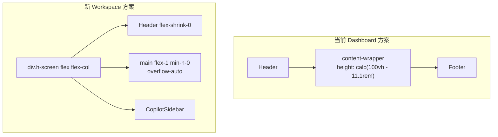

# Workspace Flex Layout Demo

## 背景

当前 `.app-height` 靠 `calc(100vh - 11.1rem)` 魔术数字扣除壳层高度，Header/Footer 变化时需要手动调。本次用一个独立路由组 `/workspace` 做 demo，验证 **flex 列布局自适应高度**方案。

## 架构对比



核心思路：根容器 `h-screen flex flex-col`，Header 固定不缩（`flex-shrink-0`），主内容区用 `flex-1 min-h-0` 自动填满剩余空间并在内部滚动，**无需计算/减去常数**。

## 涉及文件

### 新建（4 个文件）

1. **[frontend/provider/workspace.layout.provider.tsx](frontend/provider/workspace.layout.provider.tsx)** -- Workspace 壳层 Provider
2. **[frontend/app/[lang]/workspace/layout.tsx](frontend/app/[lang]/workspace/layout.tsx)** -- 路由组入口 layout
3. **[frontend/app/[lang]/workspace/page.tsx](frontend/app/[lang]/workspace/page.tsx)** -- demo 页面（复用 DocumentListPage）
4. **[frontend/app/[lang]/workspace/documents/page.tsx](frontend/app/[lang]/workspace/documents/page.tsx)** -- 可选子路由（复用文档列表）

### 修改（1 个文件）

5. **[frontend/components/partials/header/profile-info.tsx](frontend/components/partials/header/profile-info.tsx)** -- 头像下拉加「个人工作台」入口

---

## 详细方案

### 1. `workspace.layout.provider.tsx`

从 `dashboard.layout.provider.tsx` 精简而来：

- **去掉**：Sidebar、Footer、ThemeCustomize、`sidebarType`/`layout` 多分支、`collapsed` 侧栏 margin、`semibox`/`horizontal` 分支、`isDetailView` 逻辑、`WorkspaceFilesPanel`
- **保留**：Header（复用现有组件）、CopilotSidebar margin、LayoutLoader、HeaderSearch、页面过渡动画
- **关键改动**：用 flex 列替代 `page-min-height` / `app-height`

核心 DOM 结构：

```tsx
<div className="flex h-screen flex-col overflow-hidden">
  {/* Header: 自然高度，不被压缩 */}
  <div className="flex-shrink-0">
    <Header handleOpenSearch={() => setOpen(true)} trans={trans} />
  </div>

  {/* 主内容区: 自动吃满剩余高度 */}
  <main
    className="flex-1 min-h-0 overflow-auto px-6 pt-6 pb-6"
    style={{ marginRight: copilotOpen ? COPILOT_SIDEBAR_WIDTH : 0 }}
  >
    <motion.div ...>{children}</motion.div>
  </main>

  <HeaderSearch open={open} setOpen={setOpen} />
</div>
```

- `h-screen` = 整屏高度（等效 `100vh`，后续可换 `h-dvh`）
- `flex-shrink-0` 保证 Header 不被压缩
- `flex-1 min-h-0` 让 main 自动占满剩余空间；`min-h-0` 防止 flex 子项默认 `min-height: auto` 导致溢出
- `overflow-auto` 在 main 内部滚动

### 2. `app/[lang]/workspace/layout.tsx`

参考 `(dashboard)/layout.tsx`，接入认证 + i18n + WorkspaceLayoutProvider：

```tsx
import WorkspaceLayoutProvider from "@/provider/workspace.layout.provider";
import { authOptions } from "@/lib/auth";
import { getServerSession, NextAuthOptions } from "next-auth";
import { redirect } from "next/navigation";
import { getDictionary } from "@/app/dictionaries";

const layout = async ({ children, params: { lang } }: { children: React.ReactNode; params: { lang: any } }) => {
  const session = await getServerSession(authOptions as NextAuthOptions);
  if (!session?.user?.email) {
    redirect("/auth/login");
  }
  const trans = await getDictionary(lang);
  return (
    <WorkspaceLayoutProvider trans={trans}>{children}</WorkspaceLayoutProvider>
  );
};
export default layout;
```

### 3. `app/[lang]/workspace/page.tsx`

直接复用 DocumentListPage 作为 demo 内容：

```tsx
import DocumentListPage from "@/modules/documents/pages/DocumentListPage";

export default function WorkspacePage() {
  return <DocumentListPage />;
}
```

### 4. `profile-info.tsx` 加入口

在 `DropdownMenuGroup` 里「邮箱设置」前面加一项：

```tsx
<Link href="/workspace" className="cursor-pointer">
  <DropdownMenuItem className="flex items-center gap-2 text-sm font-medium text-default-600 px-3 py-1.5 dark:hover:bg-background cursor-pointer">
    <Icon icon="heroicons:squares-2x2" className="w-4 h-4" />
    个人工作台
  </DropdownMenuItem>
</Link>
```

---

## 不触及的文件

- `app/[lang]/layout.tsx` -- 根 layout 不动
- `app/[lang]/(dashboard)/layout.tsx` -- dashboard 壳不动
- `provider/*` -- 不改已有 Provider
- `components/ui/*` -- Shadcn 不动
- `globals.scss` -- `.app-height` 保持不变，本次不修改

## 验证标准

- 访问 `/zh/workspace` 看到文档列表页，只有顶栏，无侧栏/底栏
- 缩放浏览器窗口高度时，主内容区自动伸缩，**无溢出、无双滚动条**
- 修改 Header 高度（如加一行文字）后刷新，主内容区自动适应，无需改任何常数
- 头像下拉里出现「个人工作台」入口，点击跳转正确
