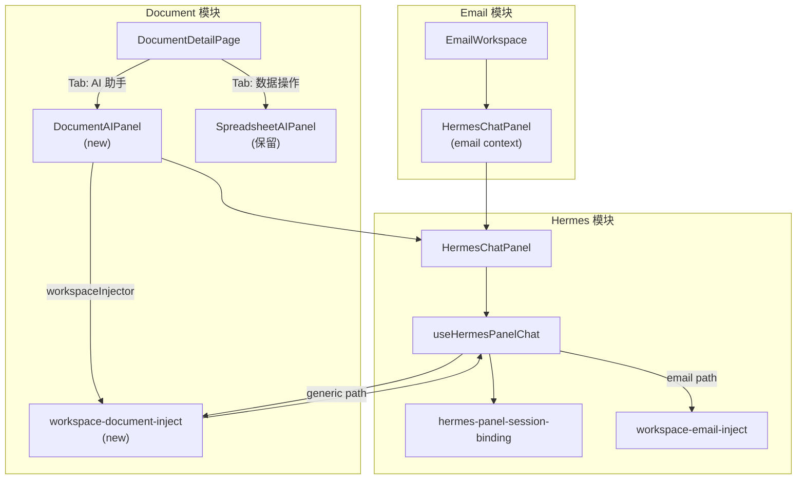

# 文档模块 AI 面板切换 Hermes + 多格式文档支持方案

## 一、现状分析

### 当前文档 AI 面板（SpreadsheetAIPanel）

- 位于 [frontend/modules/documents/components/SpreadsheetAIPanel.tsx](frontend/modules/documents/components/SpreadsheetAIPanel.tsx)
- 依赖 `useSpreadsheetDocumentAi` hook 走后端 SSE 流（Facade 模式）
- 强绑定表格选区（`SheetRangeContext`）和 Patch 预览/批准流程
- 挂载在 [DocumentDetailPage.tsx](frontend/modules/documents/pages/DocumentDetailPage.tsx) 右侧固定 320px 宽度栏

### 目标参考（Email 中的 HermesChatPanel）

- Email 工作区通过 Tab 切换在原有 AI 面板和 HermesChatPanel 之间切换
- HermesChatPanel 通过 `HermesPanelChatContext`（`{ type, payload, summary }`）传入业务上下文
- 通过 `sessionPersistenceKey` 支持会话续聊
- 通过 `emailForWorkspaceInject` 将邮件正文/附件注入 Hermes workspace

### 关键发现：HermesChatPanel 存在 email 硬耦合

- `useHermesPanelChat` hook 的 `emailForWorkspaceInject` 参数类型为 `EmailMessageResponse`
- workspace 注入逻辑（`injectEmailToWorkspace`）写死了 email 目录结构（`email-context/body.md`、`email-context/attachments/`）
- 导入了 `@/modules/email/lib/html-to-text`
- 首轮发送前通过 `ctx?.type === "email"` 判断是否注入

## 二、实施方案

### Phase 1：泛化 HermesChatPanel 的 workspace 注入机制

**目标**：将 email 专用的 workspace 注入抽象为通用接口，使文档模块可以复用。

**1.1 定义通用 workspace 注入接口**

在 `frontend/modules/hermes/hooks/use-hermes-panel-chat.ts` 中：

```typescript
export type WorkspaceContentInjector = (sessionId: string) => Promise<{
  ok: boolean;
  skipped?: boolean;
  error?: string;
}>;
```

将 hook 的 `emailForWorkspaceInject` + `onEmailWorkspaceInjected` 参数替换（或追加）为泛化参数：

```typescript
export function useHermesPanelChat(options: {
  context?: HermesPanelChatContext | null;
  presetSystemPrompt?: string;
  profile?: string;
  persistenceKey?: string;
  // 保留 email 兼容（不破坏 email 模块）
  emailForWorkspaceInject?: EmailMessageResponse | null;
  onEmailWorkspaceInjected?: (result: EmailWorkspaceInjectResult) => void;
  // 新增：泛化 workspace 注入
  workspaceInjector?: WorkspaceContentInjector;
  onWorkspaceInjected?: (result: { ok: boolean; skipped?: boolean; error?: string }) => void;
}) { ... }
```

在 `send()` 内部的注入逻辑中，优先使用 `workspaceInjector`（如果提供），否则走原有 email 注入路径。这样 email 模块完全不受影响。

**1.2 HermesChatPanel props 同步新增**

```typescript
export function HermesChatPanel(props: {
  // ... 保留原有 email 相关 props
  workspaceInjector?: WorkspaceContentInjector;
  onWorkspaceInjected?: (result: { ok: boolean; skipped?: boolean; error?: string }) => void;
}) { ... }
```

**1.3 添加 scopeKey 工厂函数**

在 `hermes-panel-session-binding.ts` 中新增：

```typescript
export function scopeKeyDocument(documentId: string): string {
  return `document:${documentId}`;
}
```

### Phase 2：创建文档模块的 Hermes AI 面板

**2.1 新建 `DocumentAIPanel` 组件**

路径：`frontend/modules/documents/components/DocumentAIPanel.tsx`

职责：
- 包装 HermesChatPanel，传入文档上下文
- 构建 `HermesPanelChatContext`（`type: "document"`）
- 提供文档专属的 `presetActions`（摘要/分析数据/生成公式/清洗数据等）
- 实现 `workspaceInjector` 将文档内容注入 Hermes workspace

```typescript
function DocumentAIPanel(props: {
  document: DocumentMeta;
  documentContent?: string | Record<string, unknown>;
  onApplyResult?: (markdown: string) => void;
}) {
  const context = useMemo<HermesPanelChatContext>(() => ({
    type: "document",
    payload: {
      id: props.document.id,
      title: props.document.title,
      document_type: props.document.document_type,
      version: props.document.current_version_no,
    },
    summary: `${props.document.title} (${props.document.document_type})`,
  }), [props.document]);

  const presetActions = useMemo(() => {
    // 根据 document_type 返回不同的预设动作
    if (props.document.document_type === "spreadsheet") {
      return [
        { label: "分析数据", prompt: "请分析此表格数据的结构和关键指标" },
        { label: "生成公式建议", prompt: "请根据数据内容建议适用的公式" },
        { label: "数据清洗", prompt: "请检查数据质量并给出清洗建议" },
      ];
    }
    // markdown/pdf/html 通用
    return [
      { label: "摘要", prompt: "请总结这份文档的要点" },
      { label: "改写润色", prompt: "请改写润色这份文档" },
      { label: "提取要点", prompt: "请提取文档中的关键要点和待办事项" },
    ];
  }, [props.document.document_type]);

  return (
    <HermesChatPanel
      sessionPersistenceKey={scopeKeyDocument(props.document.id)}
      context={context}
      presetSystemPrompt="你是文档工作区助手。请用简体中文回答，可使用 Markdown。"
      presetActions={presetActions}
      workspaceInjector={injector}
      onApplyResult={props.onApplyResult}
    />
  );
}
```

**2.2 实现文档 workspace 注入服务**

路径：`frontend/modules/documents/services/workspace-document-inject.ts`

参考 email 的 `workspace-email-inject.ts`，将文档内容（标题、正文/快照摘要）写入 Hermes workspace 的 `document-context/` 目录。

### Phase 3：改造 DocumentDetailPage 布局

**3.1 替换右侧面板**

将 [DocumentDetailPage.tsx](frontend/modules/documents/pages/DocumentDetailPage.tsx) 第 190-207 行的 `SpreadsheetAIPanel` 区域改为 `DocumentAIPanel`：

```typescript
// 之前
<div className="hidden w-[320px] shrink-0 lg:block xl:w-[340px]">
  <SpreadsheetAIPanel ... />
</div>

// 之后：使用 ResizablePanel + Tab，同时保留 SpreadsheetAIPanel 作为「数据操作」Tab
<ResizablePanel ...>
  <Tabs defaultValue="hermes-ai">
    <TabsList>
      <TabsTrigger value="hermes-ai">AI 助手</TabsTrigger>
      {doc.document_type === "spreadsheet" && (
        <TabsTrigger value="datasheet-ai">数据操作</TabsTrigger>
      )}
    </TabsList>
    <TabsContent value="hermes-ai">
      <DocumentAIPanel document={doc} ... />
    </TabsContent>
    {doc.document_type === "spreadsheet" && (
      <TabsContent value="datasheet-ai">
        <SpreadsheetAIPanel ... />  {/* 原有表格 Patch 功能保留 */}
      </TabsContent>
    )}
  </Tabs>
</ResizablePanel>
```

这样做的好处：
- 表格文档可以同时使用 Hermes Chat（通用对话）和 SpreadsheetAIPanel（Patch 写入）
- 非表格文档只显示 Hermes Chat
- 渐进式替换，不破坏原有功能

### Phase 4：扩展文档类型支持

**4.1 扩展 DocumentType**

在 `frontend/modules/documents/types/document.types.ts` 中：

```typescript
// 之前
export type DocumentType = "spreadsheet";

// 之后
export type DocumentType = "spreadsheet" | "markdown" | "pdf" | "html";
```

同步更新 `packages/shared/` 和 `packages/db/` 中对应的类型/枚举/Zod 验证器。

**4.2 扩展 DocumentEngine**

```typescript
// 之前
export type DocumentEngine = "univer";

// 之后
export type DocumentEngine = "univer" | "tiptap" | "pdf-viewer" | "html-viewer";
```

**4.3 文档编辑器条件渲染**

在 DocumentDetailPage 中根据 `document_type` 渲染不同的编辑器组件（后续新建编辑器时实现，本次先预留接口）：

```typescript
function DocumentEditor({ doc, snapshot, ... }) {
  switch (doc.document_type) {
    case "spreadsheet":
      return <UniverSheetEditor ... />;
    case "markdown":
      return <MarkdownEditor ... />;  // 后续实现
    case "pdf":
      return <PdfViewer ... />;       // 后续实现
    case "html":
      return <HtmlViewer ... />;      // 后续实现
  }
}
```

本次仅扩展类型定义和 DocumentAIPanel 的 `presetActions` 按类型分化逻辑。编辑器组件在后续需求中实现。

## 三、文件变更清单

| 文件 | 操作 | 说明 |
|------|------|------|
| `frontend/modules/hermes/hooks/use-hermes-panel-chat.ts` | 修改 | 新增 `WorkspaceContentInjector` 类型 + `workspaceInjector` 参数 |
| `frontend/modules/hermes/components/panel/HermesChatPanel.tsx` | 修改 | props 新增 `workspaceInjector` / `onWorkspaceInjected` |
| `frontend/modules/hermes/stores/hermes-panel-session-binding.ts` | 修改 | 新增 `scopeKeyDocument()` |
| `frontend/modules/documents/components/DocumentAIPanel.tsx` | 新建 | 文档 Hermes AI 面板封装 |
| `frontend/modules/documents/services/workspace-document-inject.ts` | 新建 | 文档内容注入 Hermes workspace |
| `frontend/modules/documents/pages/DocumentDetailPage.tsx` | 修改 | 替换右侧面板为 Tab（Hermes AI + SpreadsheetAI） |
| `frontend/modules/documents/types/document.types.ts` | 修改 | 扩展 DocumentType / DocumentEngine |
| `frontend/modules/documents/index.ts` | 修改 | 导出 DocumentAIPanel |
| `packages/shared/` 对应类型 | 修改 | 同步 DocumentType 扩展 |
| `packages/db/` 对应 schema | 修改 | 同步 document_type 枚举 |

## 四、不影响原有功能的保证

- email 模块：HermesChatPanel 的 `emailForWorkspaceInject` 参数保留不动，原有逻辑不变
- SpreadsheetAIPanel：作为「数据操作」Tab 保留，Patch/Validate/SSE 功能完整
- 文档路由和 Layout：不新增路由，仅修改 DocumentDetailPage 内部渲染

## 五、架构关系


