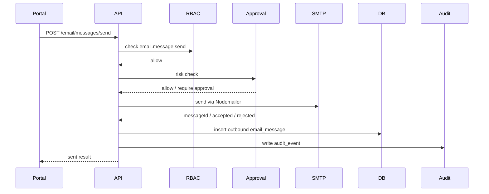
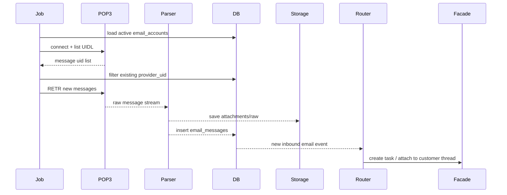

# 结论

**更合适：`JDIZM/supabase-express-api` 作为权限 / 多租户 / RBAC 参考主线；`tejachundru/node-ts-drizzle-starter` 只参考邮件发送模块和 Express 分层目录。**

原因很直接：

| 维度       | 判断                                                                                       |
| -------- | ---------------------------------------------------------------------------------------- |
| 权限系统     | JDIZM 明确有 workspace multi-tenancy、membership、SuperAdmin/Admin/User/Owner 角色体系            |
| 项目成熟度    | JDIZM 当前 GitHub 显示 401 commits；tejachundru 只有 1 commit 且 README 标注 WIP                   |
| Auth 基础  | JDIZM 用 Supabase JWT bearer，适合快速建立登录、用户、workspace、membership；但需抽象掉 Supabase 依赖           |
| Email 能力 | tejachundru README 明确内置 Nodemailer email service；JDIZM 没有邮件服务主线                          |
| AI OS 适配 | AI OS 更需要“组织 / workspace / role / permission / audit”底座，邮件可以单独加，不应为了 Nodemailer 选一个不成熟基座 |

JDIZM 的 README 明确定位为 Node/Express/TypeScript API 模板，包含 Supabase JWT、workspace 多租户、role-based permissions、Drizzle ORM、Swagger/OpenAPI，并列出 workspace、members、admin audit routes 等 API。([GitHub][1])
tejachundru 的 README 虽然覆盖 Express、TypeScript、PostgreSQL、Drizzle、JWT、Argon2/Bcrypt、S3、Nodemailer、Redoc、Pino，但仓库目前只有 1 commit，且项目自述为 WIP。([GitHub][2])

---

# 1. 核心对比

## 1.1 技术栈对齐

| 项目                                    | Runtime        | Framework | DB                             | ORM     | Auth                | RBAC                                | Email      |
| ------------------------------------- | -------------- | --------- | ------------------------------ | ------- | ------------------- | ----------------------------------- | ---------- |
| `JDIZM/supabase-express-api`          | Node 22+ / ESM | Express   | PostgreSQL / Supabase Postgres | Drizzle | Supabase JWT        | Workspace membership roles          | 未作为核心能力    |
| `tejachundru/node-ts-drizzle-starter` | Node / Bun     | Express   | PostgreSQL                     | Drizzle | JWT + Argon2/Bcrypt | README 声明 role-based access control | Nodemailer |

JDIZM 更像一个 **多租户 SaaS API 模板**。
tejachundru 更像一个 **通用企业后端 starter**，但当前成熟度不足。

---

## 1.2 权限与组织模型

| 能力                     | JDIZM                                      | tejachundru            | 判断         |
| ---------------------- | ------------------------------------------ | ---------------------- | ---------- |
| Account / User         | 有 account/profile                          | 有用户认证基础                | JDIZM 更完整  |
| Workspace / Tenant     | 有 workspace、membership                     | README 未体现完整 tenant 模型 | JDIZM 胜    |
| Role                   | SuperAdmin/Admin/User/Owner                | README 仅说明 RBAC        | JDIZM 更可验证 |
| Admin API              | accounts、workspaces、memberships、audit logs | README 未体现完整 admin 面   | JDIZM 胜    |
| Audit                  | admin audit logs                           | 未确认                    | JDIZM 胜    |
| Permission Granularity | role-based，偏 workspace membership          | 未确认                    | JDIZM 更实用  |

JDIZM 的 schema 说明包含 accounts、workspaces、profiles、workspace_memberships，适合直接映射到 AI OS 的 `company / workspace / member / role` 模型。([GitHub][1])

---

## 1.3 Auth 取舍

### [方案 A] JDIZM：Supabase JWT

| 优点                               | 问题                          |
| -------------------------------- | --------------------------- |
| 登录、JWT、用户生命周期现成                  | 依赖 Supabase Auth            |
| JWT bearer 模式清晰                  | 企业私有化时需要决定是否自建 Supabase     |
| 可配合 Supabase RLS / custom claims | 权限逻辑容易分散到 Supabase 与 API 两侧 |
| OAuth、Magic Link 等可由 Supabase 承担 | 与 AI OS 自建 IAM 长期方向存在耦合     |

适合：**快速搭建多租户 SaaS 后端、Portal 登录、workspace 权限。**

不适合：**完全自研 IAM、强私有化、不希望引入 Supabase Auth 的场景。**

### [方案 B] tejachundru：自建 JWT + Argon2/Bcrypt

| 优点                      | 问题                                                                 |
| ----------------------- | ------------------------------------------------------------------ |
| Auth 完全掌握在自己服务内         | 当前仓库成熟度低                                                           |
| 不依赖 Supabase            | RBAC 细节需要自行补齐                                                      |
| 更容易接入企业 LDAP/OIDC/企微/飞书 | 需要补 email verify、password reset、OAuth、refresh token、session revoke |
| 与 AI OS 自建 IAM 更一致      | 初期开发量高                                                             |

适合：**完全自建 IAM。**

不适合：**想快速得到 workspace/membership/admin/audit 的场景。**

---

# 2. 推荐路线

## 2.1 主路径

```text
JDIZM/supabase-express-api
作为：
- 多租户 workspace 模型参考
- account / profile / workspace_membership 表结构参考
- JWT middleware 参考
- Admin / Audit routes 参考
- Swagger/OpenAPI 组织方式参考

tejachundru/node-ts-drizzle-starter
只作为：
- Express 分层目录参考
- Nodemailer email service 参考
- Pino / S3 / Redoc 配置参考
```

## 2.2 不建议直接 fork 任一项目

更稳的方式是新建服务：

```text
ai-os-identity-service 或 ai-os-platform-api
├── auth
├── org
├── rbac
├── email
├── audit
├── workspace
└── integration
```

从两个项目抽设计，不直接迁入代码。

原因：

| 风险                | 说明                                                                           |
| ----------------- | ---------------------------------------------------------------------------- |
| JDIZM Supabase 耦合 | 后续如果换自建 Auth，会重构 middleware、claims、user lifecycle                            |
| tejachundru WIP   | 1 commit 项目不适合作为生产底座                                                         |
| AI OS 权限更复杂       | 需要 company / department / role / agent / tool / data scope / approval policy |
| Email 收发是独立域      | 不应污染核心 Auth/RBAC 模块                                                          |

---

# 3. Email 服务设计：SMTP 发信 + POP3 收信

## 3.1 技术选型

| 能力        | 推荐库                                  | 理由                                                                      |
| --------- | ------------------------------------ | ----------------------------------------------------------------------- |
| SMTP 发信   | `nodemailer`                         | Node.js 生态最成熟；官方支持 SMTP transport，通过 `createTransport()` 创建 transporter |
| 邮件解析      | `mailparser`                         | 支持 stream 解析大邮件，适合附件和 HTML/text 提取                                      |
| POP3 收信   | `mailpop3` 或 `@evo-team-corp/poplib` | 支持 POP3 常用命令；但生态活跃度不如 IMAP                                              |
| IMAP 可选增强 | `imapflow`                           | 更适合企业邮箱同步、文件夹、已读状态、增量拉取；建议作为 P1 支持                                      |

Nodemailer 官方文档明确 SMTP 发信通过 `nodemailer.createTransport()` 创建 transporter；Nodemailer 也说明内置完整 SMTP transport。([Nodemailer][3])
ImapFlow 是现代 Node.js IMAP client，支持 Promise / async-await；如果后续要做持续同步、文件夹、已读状态，IMAP 比 POP3 更适合。([ImapFlow][4])
`mailpop3` 支持 USER/PASS/APOP、LIST、TOP、RETR、DELE、UIDL、TLS、STLS 等 POP3 能力。([GitHub][5])

---

## 3.2 POP3 的现实限制

| 问题          | 影响                               |
| ----------- | -------------------------------- |
| POP3 是下载型协议 | 不适合多人协同邮箱状态同步                    |
| 文件夹能力弱      | 不适合按 Inbox/Sent/Archive/Label 分类 |
| 已读 / 未读状态弱  | 需要靠本地 DB 维护                      |
| 增量同步依赖 UIDL | 必须存储 `provider_uid` 防重复          |
| 删除语义危险      | `DELE` 误用可能删除服务器邮件               |
| Webhook 不存在 | 只能 polling                       |

结论：
**按用户要求支持 POP3，但邮件服务内部接口要抽象为 `MailboxProvider`，P1 增加 IMAP。**
不要把业务逻辑绑死在 POP3。

---

# 4. Email Service 模块边界

## 4.1 服务职责

| 模块                 | 职责                                          |
| ------------------ | ------------------------------------------- |
| SMTP Sender        | 发邮件、重试、失败记录、发信审计                            |
| POP3 Receiver      | 定时拉取邮件、去重、解析、入库                             |
| Mail Parser        | 提取 from/to/cc/subject/text/html/attachments |
| Mailbox Account    | 保存邮箱账号配置、加密密码 / app password                |
| Mail Message Store | 保存邮件元数据、正文摘要、附件索引                           |
| Attachment Store   | 附件写入 S3 / MinIO                             |
| Email Event Router | 将收信转成业务事件，如客户询价、订单回复、付款凭证                   |
| Audit              | 记录谁发了什么、哪个 Agent 读了什么、是否触发任务                |

---

## 4.2 推荐目录

```text
src/
├── modules/
│   ├── auth/
│   ├── org/
│   ├── rbac/
│   ├── audit/
│   └── email/
│       ├── controllers/
│       │   ├── email-accounts.controller.ts
│       │   ├── email-messages.controller.ts
│       │   └── email-send.controller.ts
│       ├── services/
│       │   ├── smtp-sender.service.ts
│       │   ├── pop3-receiver.service.ts
│       │   ├── mail-parser.service.ts
│       │   ├── email-sync.service.ts
│       │   ├── email-routing.service.ts
│       │   └── email-audit.service.ts
│       ├── providers/
│       │   ├── mailbox-provider.ts
│       │   ├── pop3-mailbox.provider.ts
│       │   └── imap-mailbox.provider.ts      # P1
│       ├── jobs/
│       │   └── email-polling.job.ts
│       ├── schemas/
│       │   ├── email-account.schema.ts
│       │   ├── email-message.schema.ts
│       │   └── email-send.schema.ts
│       └── routes.ts
├── db/
│   └── schema/
│       ├── users.ts
│       ├── workspaces.ts
│       ├── roles.ts
│       ├── permissions.ts
│       ├── email-accounts.ts
│       ├── email-messages.ts
│       ├── email-attachments.ts
│       └── audit-events.ts
```

---

# 5. Email 数据模型

## 5.1 `email_accounts`

```sql
CREATE TABLE email_accounts (
  id UUID PRIMARY KEY,
  workspace_id UUID NOT NULL,
  owner_user_id UUID,
  owner_agent_id UUID,

  display_name VARCHAR(128),
  email_address VARCHAR(320) NOT NULL,

  smtp_host VARCHAR(255) NOT NULL,
  smtp_port INTEGER NOT NULL,
  smtp_secure BOOLEAN NOT NULL DEFAULT true,

  pop3_host VARCHAR(255),
  pop3_port INTEGER,
  pop3_secure BOOLEAN DEFAULT true,

  username VARCHAR(320) NOT NULL,
  password_secret_ref VARCHAR(255) NOT NULL,

  provider_type VARCHAR(32) NOT NULL DEFAULT 'smtp_pop3',
  sync_enabled BOOLEAN NOT NULL DEFAULT false,
  sync_interval_seconds INTEGER NOT NULL DEFAULT 300,

  last_sync_at TIMESTAMPTZ,
  status VARCHAR(32) NOT NULL DEFAULT 'active',

  created_at TIMESTAMPTZ DEFAULT now(),
  updated_at TIMESTAMPTZ DEFAULT now(),
  deleted_at TIMESTAMPTZ
);
```

## 5.2 `email_messages`

```sql
CREATE TABLE email_messages (
  id UUID PRIMARY KEY,
  workspace_id UUID NOT NULL,
  email_account_id UUID NOT NULL,

  direction VARCHAR(16) NOT NULL, -- inbound | outbound
  provider_uid VARCHAR(255),
  message_id VARCHAR(512),

  from_address VARCHAR(320),
  from_name VARCHAR(255),
  to_addresses JSONB NOT NULL DEFAULT '[]',
  cc_addresses JSONB NOT NULL DEFAULT '[]',
  bcc_addresses JSONB NOT NULL DEFAULT '[]',

  subject TEXT,
  text_body TEXT,
  html_body TEXT,

  received_at TIMESTAMPTZ,
  sent_at TIMESTAMPTZ,

  parse_status VARCHAR(32) NOT NULL DEFAULT 'parsed',
  processing_status VARCHAR(32) NOT NULL DEFAULT 'pending',

  related_task_id UUID,
  related_customer_id UUID,
  related_thread_id UUID,

  raw_storage_key TEXT,
  metadata JSONB NOT NULL DEFAULT '{}',

  created_at TIMESTAMPTZ DEFAULT now(),

  UNIQUE(email_account_id, provider_uid)
);
```

## 5.3 `email_attachments`

```sql
CREATE TABLE email_attachments (
  id UUID PRIMARY KEY,
  workspace_id UUID NOT NULL,
  email_message_id UUID NOT NULL,

  filename TEXT,
  content_type VARCHAR(255),
  size_bytes BIGINT,
  storage_key TEXT NOT NULL,
  sha256 VARCHAR(64),

  created_at TIMESTAMPTZ DEFAULT now()
);
```

---

# 6. 权限模型

## 6.1 Email Permission Catalog

```text
email.account.create
email.account.update
email.account.delete
email.account.test

email.message.read
email.message.read_all
email.message.send
email.message.reply
email.message.forward
email.message.delete

email.attachment.read
email.attachment.download

email.sync.start
email.sync.stop
email.sync.run

email.routing.configure
```

## 6.2 数据权限

| 场景                 | 权限判断                                                 |
| ------------------ | ---------------------------------------------------- |
| 销售查看自己的客户邮件        | `workspace_id + owner_user_id + customer_binding`    |
| 主管查看团队邮件           | `department_id / team_id data scope`                 |
| Agent 读取邮箱         | `agent_roles + email.message.read + mailbox binding` |
| Agent 发邮件          | `email.message.send + approval policy`               |
| 涉及报价 / 付款 / 法务条款邮件 | 高风险策略，进入 approval gate                               |

---

# 7. 发信流程



---

# 8. 收信流程



---

# 9. 关键取舍

## 9.1 是否使用 JDIZM 的 Supabase Auth

| 方案                 | 优点                                     | 问题                     | 建议      |
| ------------------ | -------------------------------------- | ---------------------- | ------- |
| 直接使用 Supabase Auth | 快，JWT/OAuth/用户体系成熟                     | 依赖 Supabase；私有化部署复杂度上升 | POC 可用  |
| 抽象 Auth Provider   | 可先 Supabase，后切 OIDC/Better Auth/自研 JWT | 初期多写接口                 | **推荐**  |
| 完全自研 JWT           | 控制力强                                   | 要补 OAuth、邮箱验证、密码找回、风控  | P1 后再评估 |

推荐抽象：

```ts
interface AuthProvider {
  verifyAccessToken(token: string): Promise<AuthPrincipal>;
  getUser(userId: string): Promise<AuthUser>;
  createUser(input: CreateUserInput): Promise<AuthUser>;
  disableUser(userId: string): Promise<void>;
}
```

## 9.2 POP3 vs IMAP

| 方案     | 优点              | 问题             | 建议      |
| ------ | --------------- | -------------- | ------- |
| POP3   | 简单，很多企业邮箱支持     | 状态弱、只能轮询、不适合协同 | P0 兼容   |
| IMAP   | 文件夹、flag、增量同步更好 | 实现复杂一点         | P1 必须支持 |
| 邮件网关服务 | 可 REST 化邮件收发    | 多一个基础设施        | P2 评估   |

---

# 10. 最终建议

## 10.1 基座选择

```text
选择 JDIZM/supabase-express-api 作为主参考
不直接 fork
抽取：
- workspace multi-tenancy
- membership role model
- admin routes
- audit logs
- JWT middleware
- Drizzle schema style
- Swagger/OpenAPI style
```

## 10.2 邮件模块选择

```text
从 tejachundru/node-ts-drizzle-starter 参考：
- Nodemailer service
- Express controller/service/schema 目录
- Pino logging
- S3 file storage

但不要采用它作为主基座。
```

## 10.3 AI OS 目标架构

```text
AI OS Platform API
= JDIZM-style workspace/RBAC
+ 自建 permission catalog
+ SMTP/POP3 Email Service
+ Audit/Event Ledger
+ MinIO/S3 attachment storage
+ Secret Manager
+ Facade task/event integration
```

## 10.4 第一阶段最小可交付

| 阶段   | 功能                                           |
| ---- | -------------------------------------------- |
| P0.1 | 用户、workspace、membership、role、permission      |
| P0.2 | JWT Auth Provider 抽象，先接 Supabase 或自建 JWT 二选一 |
| P0.3 | SMTP 发信：Nodemailer                           |
| P0.4 | POP3 收信：UIDL 去重、mailparser 解析、附件入 S3         |
| P0.5 | Email → Task 事件：收到客户邮件后创建 Facade task        |
| P0.6 | 审计：发信、读信、Agent 访问、附件下载全部入 audit_events       |

**最终选型：JDIZM 为主，tejachundru 为辅。**
不要因为 tejachundru 有 Nodemailer 就选它做权限基座；邮件服务独立实现的成本低于补齐一个不成熟 RBAC/多租户基座的成本。

[1]: https://github.com/JDIZM/supabase-express-api "GitHub - JDIZM/supabase-express-api: A starter template for a backend API with Node, Express, TypeScript, Drizzle, PotsgreSQL. Authentication with Supabase with role based permissions. Deployment via DigitalOcean docker registry. · GitHub"
[2]: https://github.com/tejachundru/node-ts-drizzle-starter "GitHub - tejachundru/node-ts-drizzle-starter: A Enterprise level modern, scalable Backend system built with TypeScript, Express, and Drizzle ORM.(WIP) · GitHub"
[3]: https://nodemailer.com/smtp?utm_source=chatgpt.com "SMTP transport"
[4]: https://imapflow.com/?utm_source=chatgpt.com "ImapFlow - Modern IMAP Client for Node.js | ImapFlow"
[5]: https://github.com/javascriptlove/mailpop3?utm_source=chatgpt.com "javascriptlove/mailpop3: POP3 client library for Node.js"
