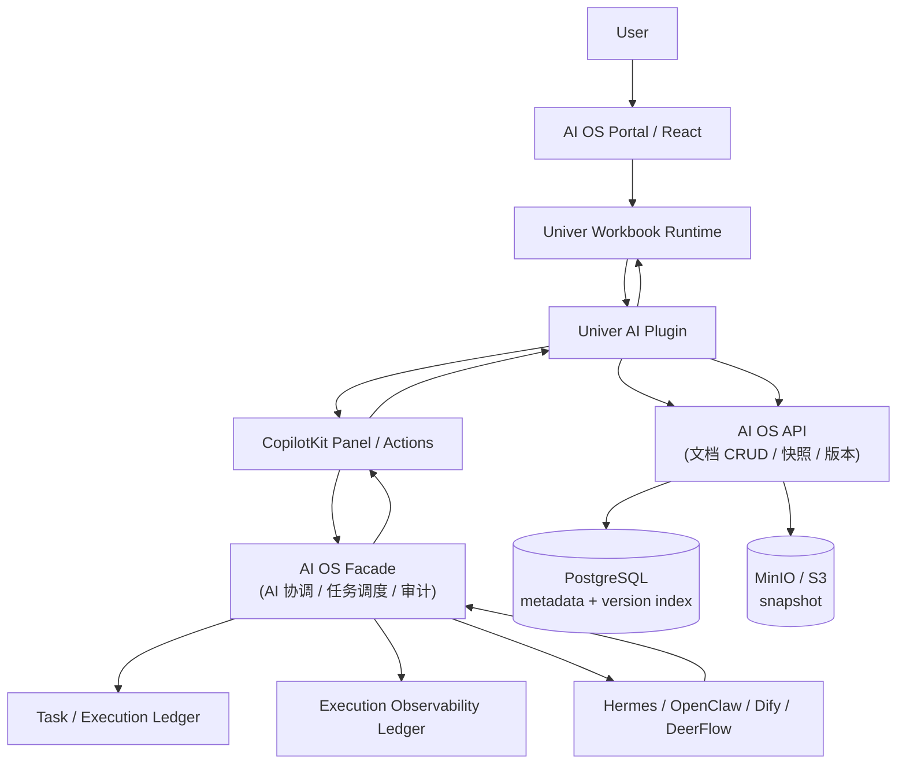
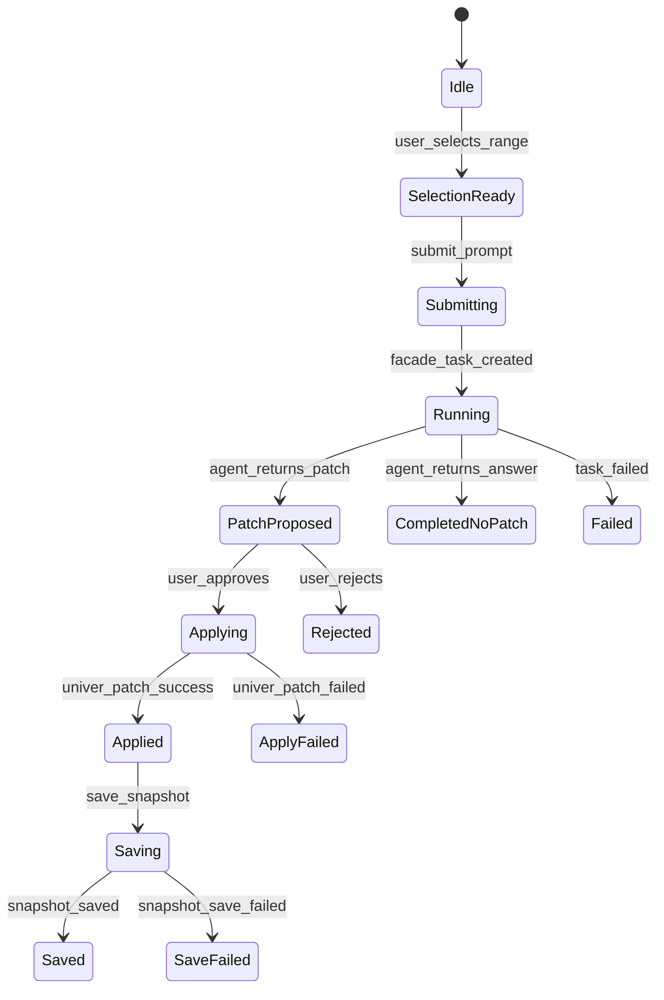
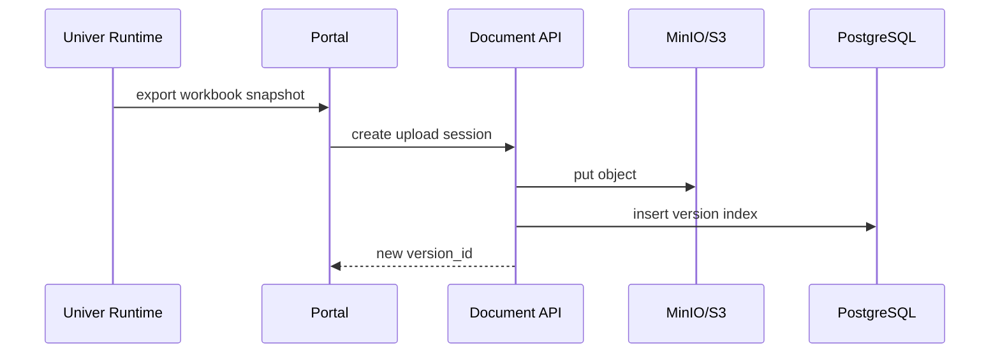

# Univer × CopilotKit × AI OS Facade：Datasheet GPT 功能迭代 Spec 包

## 0. 架构结论

采用：

```text
Univer 自定义 AI Plugin
+ CopilotKit UI / Action 层
+ AI OS Facade 统一 Agent 调度
+ Document Service 负责文档元数据、快照、版本
```

关键约束：

1. **Univer 只做 Excel 查看/编辑内核**
2. **CopilotKit 只做前端交互入口、上下文采集、Action 绑定**
3. **所有 Agent 请求必须走 AI OS Facade**
4. **Portal 不直接访问 Hermes / OpenClaw / Dify / DeerFlow**
5. **Agent 返回的修改必须先形成 Patch Preview，再由用户确认写入 Univer**
6. **文档快照仍走现有 PostgreSQL + MinIO/S3 + version index 方案**

AI OS Facade 现有定位是统一任务接入、任务路由、执行状态账本、审批、审计、知识/记忆策略，不执行 Agent 推理本身。该边界适合承接 datasheet AI 任务。
Portal 侧不应直接访问执行器内部接口，应通过 Facade 查询任务、执行、Todo、Step、Tool Call、Artifact。
Facade 内的 Execution Observability Ledger 已定义任务进度、Agent Todo、工具调用、分析摘要、产物、人工干预等对象，正好可复用为 datasheet AI 的执行可观测层。

---

# 1. 目标范围

## 1.1 MVP 目标

| 编号 | 功能                | 说明                                                                        |
| -: | ----------------- | ------------------------------------------------------------------------- |
| F1 | 选区上下文采集           | 用户选中单元格区域后，AI Plugin 读取 sheetId、range、values、formulas、headers、sample rows |
| F2 | Datasheet AI 对话入口 | 在 Univer 工具栏增加 `AI` 按钮，打开右侧 CopilotKit 面板                                 |
| F3 | 选区问答              | 用户基于当前选区提问，由 Facade 创建 Agent Task                                         |
| F4 | 公式生成              | 用户描述目标，Agent 返回公式建议，不直接写入                                                 |
| F5 | 数据清洗建议            | Agent 返回标准化 patch，例如去空格、统一日期、拆分字段、批量填充                                    |
| F6 | Patch Preview     | 前端展示变更前后 diff，用户确认后写入 Univer                                              |
| F7 | 保存版本              | 应用 patch 后保存 workbook snapshot 到 MinIO，并写入 PostgreSQL version index       |
| F8 | 执行过程查看            | 右侧面板展示任务状态、Agent Todo、步骤摘要、工具调用、产物                                        |
| F9 | 审计记录              | Facade 记录 interaction、patch、apply decision、actor、document version         |

## 1.2 MVP 非目标

| 非目标                    | 原因                               |
| ---------------------- | -------------------------------- |
| 多人实时协同编辑               | 初期只做单用户编辑内核，协同留给后续 OT/CRDT 或成熟产品 |
| Excel 导入导出             | 当前前提已排除，不进入本轮                    |
| Agent 直接操作 Univer 内部命令 | 必须先产出标准 patch，由用户确认              |
| 前端直连 LLM / Agent       | 违反 Facade 统一任务真相源                |
| 存储完整 Chain-of-Thought  | 只存结构化分析摘要、证据、决策记录                |
| 任意代码执行 / 宏执行           | Excel AI patch 只允许白名单操作          |

---

# 2. 总体架构



> **服务归属说明：**
>
> | 服务 | 项目 | API 基址 | 职责 |
> |---|---|---|---|
> | Document API | `ai-os-api` | `/api/documents/...` | 文档 CRUD、快照上传/下载、版本管理、权限 |
> | AI Facade | `ai-os-facade/apps/os-facade` | `/api/v1/document-ai/...` | AI Interaction、Patch 校验/决策、SSE 事件流、审计 |
>
> Portal 前端按以上分属分别调用两个后端服务：
> - `services/document.api.ts` → AI OS API（数据 CRUD）
> - `services/documentAi.api.ts` → AI OS Facade（AI 交互）

---

# 3. 核心取舍

## 3.1 CopilotKit 直接控制 Univer vs Facade 控制 Agent

| 方案 | 路径                                           | 优点              | 问题                          | 判断  |
| -- | -------------------------------------------- | --------------- | --------------------------- | --- |
| A  | CopilotKit → LLM → Univer                    | 前端开发快           | 绕开 Facade，无法统一审计、审批、权限、执行轨迹 | 禁止  |
| B  | CopilotKit → Portal BFF → LLM                | 可隐藏 key         | BFF 会变成新的 Agent 控制层，破坏架构边界  | 不采用 |
| C  | CopilotKit → Facade → Agent → Patch → Univer | 任务、审计、审批、执行轨迹统一 | 首期需要定义 patch 协议和事件协议        | 采用  |

## 3.2 Patch 写入策略

| 方案                  | 说明                             | 优点           | 风险         | 判断     |
| ------------------- | ------------------------------ | ------------ | ---------- | ------ |
| 前端直接写 cell          | Agent 返回 values，前端立即 setValues | 实现简单         | 用户不可控，审计弱  | 禁止     |
| Patch Preview 后确认写入 | Agent 返回标准 patch，用户确认后 apply   | 可审计、可回滚、风险可控 | 多一步交互      | MVP 必须 |
| 后端直接改 snapshot      | Agent 修改 MinIO snapshot        | 可批处理         | 容易与前端编辑态冲突 | P2 再评估 |

---

# 4. 领域对象定义

## 4.1 Spec Object Registry

所有对象必须有稳定 ID，Cursor 生成代码时按 ID 建文件、DTO、测试。

| Spec ID                  | 对象                      | 类型                  | 所属层              |
| ------------------------ | ----------------------- | ------------------- | ---------------- |
| `doc.workbook`           | WorkbookDocument        | Domain Entity       | Document Service |
| `doc.snapshot`           | WorkbookSnapshot        | Domain Entity       | Document Service |
| `doc.version`            | WorkbookVersionIndex    | Domain Entity       | Document Service |
| `sheet.context`          | SheetRangeContext       | DTO                 | Portal / Facade  |
| `sheet.ai.interaction`   | SheetAIInteraction      | Domain Entity       | Facade           |
| `sheet.ai.request`       | SheetAIRequest          | DTO                 | Portal → Facade  |
| `sheet.ai.result`        | SheetAIResult           | DTO                 | Facade → Portal  |
| `sheet.ai.patch`         | SpreadsheetPatch        | Domain Value Object | Facade / Portal  |
| `sheet.ai.patch.preview` | PatchPreview            | UI Model            | Portal           |
| `sheet.ai.apply`         | PatchApplyDecision      | Domain Event        | Portal / Facade  |
| `sheet.ai.event`         | SheetAIExecutionEvent   | Event DTO           | Facade SSE       |
| `ui.univer.host`         | UniverSheetEditor (AI扩展) | React Component     | Portal           |
| `ui.ai.toolbar`          | SpreadsheetAIToolbar    | React Component     | Portal           |
| `ui.ai.panel`            | SpreadsheetAIPanel      | React Component     | Portal           |
| `ui.ai.patchPreview`     | SpreadsheetPatchPreview | React Component     | Portal           |
| `ui.ai.timeline`         | AgentExecutionTimeline  | React Component     | Portal           |

---

# 5. 前端功能 Spec

## 5.1 页面布局

```text
DocumentWorkbookPage                    ← 新增独立页面 (路由: /documents/[documentId]/workbook)
├── Header
│   ├── DocumentTitle
│   ├── SaveButton
│   ├── VersionButton
│   └── AIButton
├── Main
│   ├── UniverSheetEditor               ← 已有组件，扩展支持 AI Plugin 注入
│   └── SpreadsheetAIPanel
└── PatchPreviewDrawer
```

## 5.2 Univer AI Plugin 职责

| 模块                          | 职责                                      |
| --------------------------- | --------------------------------------- |
| `DocumentAIPlugin`          | 注册 AI 命令、菜单、快捷入口                        |
| `SelectionContextCollector` | 读取当前选区上下文                               |
| `SpreadsheetPatchApplier`   | 将标准 patch 转成 Univer 操作                  |
| `SpreadsheetPatchValidator` | 前端二次校验 patch 是否可应用                      |
| `WorkbookSnapshotAdapter`   | 从 Univer runtime 导出当前 workbook snapshot |
| `WorkbookDirtyTracker`      | 判断 patch 后是否需要保存                        |

## 5.3 CopilotKit 职责

CopilotKit 在本方案中不是 Agent 控制面，只承担：

| 能力                     | 用法                                                                                  |
| ---------------------- | ----------------------------------------------------------------------------------- |
| `useCopilotReadable`   | 暴露当前文档、当前 sheet、当前选区摘要                                                              |
| `useCopilotAction`     | 注册 `analyzeSelection`、`generateFormula`、`cleanSelection`、`createPatch`、`applyPatch` |
| Copilot Sidebar / Chat | 作为 datasheet AI 对话入口                                                                |
| Generative UI          | 展示 patch preview、执行 timeline、确认按钮                                                   |

## 5.4 Copilot Actions

```ts
export const spreadsheetAIActions = [
  "analyzeSelection",
  "generateFormula",
  "cleanSelection",
  "summarizeSheet",
  "createPatch",
  "applyPatch",
  "rejectPatch",
] as const;
```

### `analyzeSelection`

```ts
type AnalyzeSelectionInput = {
  documentId: string;
  workbookId: string;
  versionId: string;
  sessionId: string;
  prompt: string;
  context: SheetRangeContext;
};

type AnalyzeSelectionOutput = {
  interactionId: string;
  taskId: string;
  status: "submitted";
};
```

### `createPatch`

```ts
type CreatePatchInput = {
  interactionId: string;
  userInstruction: string;
  context: SheetRangeContext;
};

type CreatePatchOutput = {
  patchId: string;
  patch: SpreadsheetPatch;
  riskLevel: "low" | "medium" | "high";
  preview: PatchPreview;
};
```

### `applyPatch`

```ts
type ApplyPatchInput = {
  patchId: string;
  decision: "approved";
  applyMode: "current_workbook";
};

type ApplyPatchOutput = {
  applied: boolean;
  affectedCells: number;
  newDirtyState: boolean;
};
```

---

# 6. SheetRangeContext 标准

## 6.1 TypeScript

```ts
export type SheetRangeContext = {
  workbookId: string;
  worksheetId: string;
  worksheetName: string;
  range: {
    startRow: number;
    endRow: number;
    startColumn: number;
    endColumn: number;
    a1Notation?: string;
  };
  headers?: string[];
  values: Array<Array<string | number | boolean | null>>;
  formulas?: Array<Array<string | null>>;
  numberFormats?: Array<Array<string | null>>;
  sampleLimit: {
    maxRows: number;
    maxColumns: number;
    truncated: boolean;
  };
  selectionHash: string;
};
```

## 6.2 上下文限制

| 限制项            |  MVP 值 | 原因 |
| -------------- | -----: | -- |
| 最大行数           |    100 |    |
| 最大列数           |     30 |    |
| 最大单元格          |  3,000 |    |
| 最大字符数          | 60,000 |    |
| 是否允许整 workbook |      否 |    |
| 是否允许隐藏 sheet   |      否 |    |
| 是否发送公式         |   默认发送 |    |
| 是否发送样式         |  默认不发送 |    |

超过限制时，前端必须提示用户缩小选区，不能直接把整表提交给 Agent。

---

# 7. SpreadsheetPatch 协议

## 7.1 Patch 类型

```ts
export type SpreadsheetPatch =
  | SetCellValuesPatch
  | SetCellFormulasPatch
  | InsertRowsPatch
  | InsertColumnsPatch
  | DeleteRowsPatch
  | CreateSheetPatch
  | RenameSheetPatch;
```

## 7.2 Patch 基础结构

```ts
export type SpreadsheetPatchBase = {
  patchId: string;
  interactionId: string;
  workbookId: string;
  worksheetId?: string;
  op:
    | "set_cell_values"
    | "set_cell_formulas"
    | "insert_rows"
    | "insert_columns"
    | "delete_rows"
    | "create_sheet"
    | "rename_sheet";
  reason: string;
  riskLevel: "low" | "medium" | "high";
  beforeSelectionHash?: string;
};
```

## 7.3 设置值

```ts
export type SetCellValuesPatch = SpreadsheetPatchBase & {
  op: "set_cell_values";
  range: {
    startRow: number;
    startColumn: number;
    rowCount: number;
    columnCount: number;
  };
  values: Array<Array<string | number | boolean | null>>;
};
```

## 7.4 设置公式

```ts
export type SetCellFormulasPatch = SpreadsheetPatchBase & {
  op: "set_cell_formulas";
  range: {
    startRow: number;
    startColumn: number;
    rowCount: number;
    columnCount: number;
  };
  formulas: Array<Array<string>>;
};
```

## 7.5 Patch 禁止项

| 禁止项           | 说明                |
| ------------- | ----------------- |
| 任意 JS 执行      | 不允许 Agent 返回可执行代码 |
| 宏             | 不支持               |
| 外部网络函数        | 不支持               |
| 删除整个 workbook | 不支持               |
| 跨文档写入         | 不支持               |
| 未经确认直接写入      | 不支持               |

---

# 8. Facade API Spec

Facade 现有 API 规范要求 router 只调用 service，外部调用放 adapter，数据库读写放 repository，callback 校验 token，写请求支持 `Idempotency-Key`，日志带 `correlation_id`。本模块继续沿用这些约束。

## 8.1 新增路由

```text
ai-os-facade/apps/os-facade/app/api/v1/document_ai.py
```

### API 清单

| Method | Path                                                              | 说明                                          |
| ------ | ----------------------------------------------------------------- | ------------------------------------------- |
| `POST` | `/api/v1/document-ai/interactions`                                | 创建 datasheet AI interaction，并创建 Facade Task |
| `GET`  | `/api/v1/document-ai/interactions/{interaction_id}`               | 查询 interaction                              |
| `GET`  | `/api/v1/document-ai/interactions/{interaction_id}/events/stream` | SSE 获取执行事件                                  |
| `POST` | `/api/v1/document-ai/patches/validate`                            | 校验 Agent 返回 patch                           |
| `POST` | `/api/v1/document-ai/patches/{patch_id}/decision`                 | 记录用户接受/拒绝                                   |
| `GET`  | `/api/v1/document-ai/patches/{patch_id}`                          | 查询 patch                                    |

## 8.2 创建 Interaction

```http
POST /api/v1/document-ai/interactions
Content-Type: application/json
Idempotency-Key: <uuid>
```

```json
{
  "document_id": "doc_001",
  "workbook_id": "wb_001",
  "version_id": "ver_001",
  "session_id": "sess_001",
  "mode": "analyze_selection",
  "prompt": "分析这组销售数据异常点",
  "actor": {
    "user_id": "u_001",
    "role_id": "sales_manager"
  },
  "org_scope": {
    "company_id": "c_001",
    "department_id": "sales"
  },
  "sheet_context": {
    "workbookId": "wb_001",
    "worksheetId": "sheet_001",
    "worksheetName": "Sales",
    "range": {
      "startRow": 0,
      "endRow": 20,
      "startColumn": 0,
      "endColumn": 8,
      "a1Notation": "A1:I21"
    },
    "headers": ["客户", "金额", "日期"],
    "values": [["A客户", 1200, "2026-04-01"]],
    "formulas": [[null, null, null]],
    "sampleLimit": {
      "maxRows": 100,
      "maxColumns": 30,
      "truncated": false
    },
    "selectionHash": "sha256_xxx"
  }
}
```

Response:

```json
{
  "interaction_id": "iai_001",
  "task_id": "task_001",
  "execution_id": "exec_001",
  "status": "submitted",
  "stream_url": "/api/v1/document-ai/interactions/iai_001/events/stream"
}
```

## 8.3 Patch Validate

```http
POST /api/v1/document-ai/patches/validate
```

```json
{
  "interaction_id": "iai_001",
  "patch": {
    "patchId": "patch_001",
    "interactionId": "iai_001",
    "workbookId": "wb_001",
    "worksheetId": "sheet_001",
    "op": "set_cell_formulas",
    "reason": "生成毛利率公式",
    "riskLevel": "low",
    "range": {
      "startRow": 1,
      "startColumn": 9,
      "rowCount": 20,
      "columnCount": 1
    },
    "formulas": [["=(H2-G2)/H2"]]
  }
}
```

Response:

```json
{
  "valid": true,
  "patch_id": "patch_001",
  "risk_level": "low",
  "affected_cells": 20,
  "warnings": []
}
```

## 8.4 Patch Decision

```http
POST /api/v1/document-ai/patches/{patch_id}/decision
```

```json
{
  "decision": "approved",
  "actor_user_id": "u_001",
  "client_applied": true,
  "applied_at_client_version": "ver_001",
  "result": {
    "affected_cells": 20,
    "new_selection_hash": "sha256_yyy"
  }
}
```

Response:

```json
{
  "patch_id": "patch_001",
  "apply_status": "approved_applied",
  "audit_event_id": "audit_001"
}
```

---

# 9. Facade 后端文件级 Spec

## 9.1 目录树

> 遵循 os-facade 已有的目录分离模式（models/、repositories/、services/、adapters/）。

```text
ai-os-facade/apps/os-facade/
├── app/
│   ├── api/v1/
│   │   └── document_ai.py
│   ├── schemas/
│   │   └── document_ai.py
│   ├── models/
│   │   ├── document_ai_interaction.py
│   │   └── document_ai_patch.py
│   ├── repositories/
│   │   └── document_ai_repo.py
│   ├── services/
│   │   ├── document_ai_service.py
│   │   ├── spreadsheet_patch_service.py
│   │   └── document_ai_event_service.py
│   ├── adapters/
│   │   └── document_agent_adapter.py
│   └── tests/
│       ├── test_document_ai_api.py
│       ├── test_spreadsheet_patch_service.py
│       └── test_document_ai_service.py
└── alembic/
    └── versions/
        └── xxxx_add_document_ai_tables.py
```

## 9.2 SQLAlchemy Models

### `DocumentAIInteraction`

```python
class DocumentAIInteraction(Base, IdMixin, TimestampMixin):
    __tablename__ = "document_ai_interactions"

    document_id: Mapped[str]
    workbook_id: Mapped[str]
    version_id: Mapped[str]
    session_id: Mapped[str]
    task_id: Mapped[str | None]
    execution_id: Mapped[str | None]

    mode: Mapped[str]
    prompt: Mapped[str]
    actor_user_id: Mapped[str]
    org_scope: Mapped[dict]
    sheet_context: Mapped[dict]

    status: Mapped[str]  # submitted/running/proposed/completed/failed/cancelled
    result_summary: Mapped[str | None]
    error: Mapped[dict | None]
```

### `DocumentAIPatch`

```python
class DocumentAIPatch(Base, IdMixin, TimestampMixin):
    __tablename__ = "document_ai_patches"

    interaction_id: Mapped[str]
    document_id: Mapped[str]
    workbook_id: Mapped[str]
    version_id: Mapped[str]

    patch_type: Mapped[str]
    patch_json: Mapped[dict]
    risk_level: Mapped[str]

    validation_status: Mapped[str]  # pending/valid/invalid
    apply_status: Mapped[str]       # proposed/approved_applied/rejected/failed

    before_selection_hash: Mapped[str | None]
    after_selection_hash: Mapped[str | None]
    actor_user_id: Mapped[str | None]
    decision_reason: Mapped[str | None]
```

## 9.3 Alembic Migration

```text
ai-os-facade/apps/os-facade/alembic/versions/xxxx_add_document_ai_tables.py
```

必须创建：

```sql
document_ai_interactions
document_ai_patches
idx_document_ai_interactions_document_id
idx_document_ai_interactions_task_id
idx_document_ai_patches_interaction_id
idx_document_ai_patches_document_id
```

---

# 10. Portal 前端文件级 Spec

## 10.1 目录树

> 路径基于项目实际结构。已有文件标注 `(existing)`，新增文件无标注。

```text
ai-os-portal/
├── modules/
│   └── documents/
│       ├── pages/
│       │   ├── DocumentListPage.tsx              (existing)
│       │   ├── DocumentDetailPage.tsx            (existing)
│       │   └── DocumentWorkbookPage.tsx          ← 新增 AI Workbook 页面
│       ├── components/
│       │   ├── UniverSheetEditor.tsx             (existing, 扩展 AI Plugin 注入)
│       │   ├── SpreadsheetAIToolbar.tsx
│       │   ├── SpreadsheetAIPanel.tsx
│       │   ├── SpreadsheetPatchPreview.tsx
│       │   ├── SpreadsheetPatchDiffTable.tsx
│       │   ├── AgentExecutionTimeline.tsx
│       │   └── SelectionContextCard.tsx
│       ├── adapters/
│       │   ├── SpreadsheetEngineAdapter.ts       (existing, 接口)
│       │   └── univer/
│       │       ├── UniverSpreadsheetAdapter.ts   (existing, Univer 实现)
│       │       ├── DocumentAIPlugin.ts
│       │       ├── SelectionContextCollector.ts
│       │       ├── SpreadsheetPatchApplier.ts
│       │       ├── SpreadsheetPatchValidator.ts
│       │       ├── WorkbookSnapshotAdapter.ts
│       │       └── commands.ts
│       ├── copilot/
│       │   ├── useSpreadsheetCopilotReadable.ts
│       │   ├── useSpreadsheetCopilotActions.ts
│       │   └── spreadsheetCopilotActions.ts
│       ├── hooks/
│       │   ├── useDocuments.ts                   (existing)
│       │   ├── useDocumentDetail.ts              (existing)
│       │   ├── useDocumentSnapshot.ts            (existing)
│       │   ├── useDocumentCreate.ts              (existing)
│       │   ├── useUniverWorkbook.ts
│       │   ├── useSheetSelectionContext.ts
│       │   ├── useDocumentAIInteraction.ts
│       │   ├── useDocumentAIEventStream.ts
│       │   ├── useSpreadsheetPatchPreview.ts
│       │   └── useApplySpreadsheetPatch.ts
│       ├── services/
│       │   ├── document.api.ts                   (existing, 调用 AI OS API)
│       │   └── documentAi.api.ts                 ← 新增，调用 AI OS Facade
│       ├── types/
│       │   ├── document.types.ts                 (existing)
│       │   └── documentAi.types.ts              ← 新增，AI 交互相关类型
│       ├── mocks/
│       │   └── document.mock.ts                  (existing)
│       └── __tests__/
│           ├── SelectionContextCollector.test.ts
│           ├── SpreadsheetPatchValidator.test.ts
│           ├── SpreadsheetPatchApplier.test.ts
│           └── document-ai-flow.test.tsx
├── app/[lang]/(dashboard)/documents/
│   ├── page.tsx                                  (existing, 列表页)
│   ├── layout.tsx                                (existing)
│   ├── [documentId]/page.tsx                     (existing, 详情/编辑页)
│   └── [documentId]/workbook/page.tsx            ← 新增路由，AI Workbook 页面
└── specs/
    └── document-univer-ai/                       ← Spec 驱动文件（项目根级）
        ├── 00-context.md
        ├── 01-product-requirements.md
        ├── 02-domain-objects.md
        ├── 03-api-contract.openapi.yaml
        ├── 04-ui-components.md
        ├── 05-state-machine.md
        ├── 06-spreadsheet-patch-protocol.md
        ├── 07-storage-versioning.md
        ├── 08-security-and-audit.md
        ├── 09-acceptance-tests.md
        └── 10-implementation-plan.md
```

### 10.1.1 路由说明

| 路由 | 页面组件 | 说明 |
|---|---|---|
| `/(dashboard)/documents` | `DocumentListPage` | 文档列表（已有） |
| `/(dashboard)/documents/[documentId]` | `DocumentDetailPage` | 文档查看/编辑（已有） |
| `/(dashboard)/documents/[documentId]/workbook` | `DocumentWorkbookPage` | **新增** AI Workbook 工作台 |

### 10.1.2 前端调用目标说明

| 服务文件 | 调用目标 | 环境变量 |
|---|---|---|
| `services/document.api.ts` | AI OS API (`ai-os-api`) | `NEXT_PUBLIC_API_URL` |
| `services/documentAi.api.ts` | AI OS Facade (`ai-os-facade/apps/os-facade`) | `NEXT_PUBLIC_FACADE_API_BASE_URL` |

## 10.2 `DocumentWorkbookPage`

> 路径：`ai-os-portal/modules/documents/pages/DocumentWorkbookPage.tsx`
> 路由：`/[lang]/(dashboard)/documents/[documentId]/workbook`
> 与已有 `DocumentDetailPage` 的区别：本页面集成 AI 面板 + CopilotKit + Patch Preview，是 AI 工作台入口。

职责：

| 项                   | 要求                                                    | 调用目标 |
| ------------------- | ----------------------------------------------------- | ----- |
| 初始化文档               | 通过 documentId 加载 metadata、latest version、snapshot URL | AI OS API |
| 初始化 Univer          | 通过已有 `UniverSheetEditor` 将 snapshot 加载到 Univer runtime | 前端本地 |
| 注册 AI Plugin        | 注入 `DocumentAIPlugin`（位于 `adapters/univer/`）          | 前端本地 |
| 注册 Copilot readable | 当前 workbook、sheet、selection                           | 前端本地 |
| 注册 Copilot actions  | 所有 action 只调用 Facade                                  | AI OS Facade |
| 保存                  | 导出 Univer snapshot，上传 MinIO，写 version index           | AI OS API |
| 展示执行过程              | 订阅 Facade SSE                                         | AI OS Facade |

## 10.3 `SpreadsheetAIPanel`

组件状态：

```ts
type SpreadsheetAIPanelState =
  | "idle"
  | "selection_ready"
  | "submitting"
  | "running"
  | "patch_proposed"
  | "applying"
  | "applied"
  | "failed";
```

面板区块：

```text
SpreadsheetAIPanel
├── CurrentSelectionCard
├── PromptInput
├── QuickActions
│   ├── 分析选区
│   ├── 生成公式
│   ├── 清洗数据
│   └── 总结表格
├── AgentExecutionTimeline
├── PatchPreview
└── Apply / Reject Buttons
```

## 10.4 `SpreadsheetPatchPreview`

必须展示：

| 字段             | 说明                                      |
| -------------- | --------------------------------------- |
| patch type     | `set_cell_values` / `set_cell_formulas` |
| affected range | A1 notation                             |
| affected cells | 数量                                      |
| before preview | 原值                                      |
| after preview  | 新值                                      |
| risk level     | low/medium/high                         |
| warnings       | 越界、选区变化、版本冲突                            |

---

# 11. 状态机 Spec



状态约束：

| 状态               | 允许操作         |
| ---------------- | ------------ |
| `Idle`           | 选择区域         |
| `SelectionReady` | 提交 prompt    |
| `Running`        | 查看事件、取消任务    |
| `PatchProposed`  | 预览、批准、拒绝     |
| `Applying`       | 禁止重复提交       |
| `Applied`        | 保存快照         |
| `Saved`          | 可继续下一轮 AI 操作 |
| `Failed`         | 重试或关闭        |

---

# 12. 事件流 Spec

Facade SSE：

```http
GET /api/v1/document-ai/interactions/{interaction_id}/events/stream
Accept: text/event-stream
```

事件类型：

```ts
export type SheetAIExecutionEvent =
  | { type: "task.created"; taskId: string; title: string }
  | { type: "task.running"; taskId: string; title: string }
  | { type: "todo.created"; title: string; status: "pending" }
  | { type: "todo.updated"; title: string; status: "running" | "completed" | "blocked" }
  | { type: "analysis.summary"; title: string; summary: string; evidenceRefs?: string[] }
  | { type: "tool.started"; toolName: string; title: string }
  | { type: "tool.completed"; toolName: string; title: string }
  | { type: "patch.proposed"; patchId: string; title: string }
  | { type: "approval.required"; title: string; reason: string }
  | { type: "task.succeeded"; title: string }
  | { type: "task.failed"; title: string; error: string };
```

Agent 原始事件不能直接暴露给 Portal，需要 Facade normalizer 标准化。该模式已在 Hermes Event Normalizer 设计中明确。

---

# 13. Spec Driver 文件要求

Cursor 必须先创建以下 spec 文件，再写实现代码。

> 路径：`ai-os-portal/specs/document-univer-ai/`（项目根级 `specs/` 目录）。

```text
ai-os-portal/specs/document-univer-ai/
├── 00-context.md
├── 01-product-requirements.md
├── 02-domain-objects.md
├── 03-api-contract.openapi.yaml
├── 04-ui-components.md
├── 05-state-machine.md
├── 06-spreadsheet-patch-protocol.md
├── 07-storage-versioning.md
├── 08-security-and-audit.md
├── 09-acceptance-tests.md
└── 10-implementation-plan.md
```

## 13.1 `00-context.md`

必须写明：

```md
# Context

本功能将 Univer 作为 AI OS Portal 的 Excel 查看/编辑内核。
CopilotKit 只作为交互入口与前端 action 编排。
所有 Agent 请求必须走 AI OS Facade。
Document Service 负责 metadata、snapshot、version index。
```

## 13.2 `02-domain-objects.md`

必须包含：

```md
# Domain Objects

- WorkbookDocument
- WorkbookSnapshot
- WorkbookVersionIndex
- SheetRangeContext
- SheetAIInteraction
- SheetAIRequest
- SheetAIResult
- SpreadsheetPatch
- PatchPreview
- PatchApplyDecision
- SheetAIExecutionEvent
```

## 13.3 `06-spreadsheet-patch-protocol.md`

必须包含：

```md
# Spreadsheet Patch Protocol

禁止 Agent 直接修改 Univer runtime。
Agent 只能返回标准 patch。
前端必须 preview。
用户确认后才 apply。
apply 后必须记录 patch decision。
保存后必须创建新 snapshot version。
```

---

# 14. 安全与权限

## 14.1 强制规则

| 规则                         | 实现位置                                                          | 所属项目 |
| -------------------------- | ------------------------------------------------------------- | ------ |
| 前端不保存 Facade service token | Portal auth / BFF / user JWT                                  | Portal |
| 所有写请求带 `Idempotency-Key`   | `services/documentAi.api.ts`                                  | Portal |
| Patch 必须服务端 validate       | `app/services/spreadsheet_patch_service.py`                   | os-facade |
| Patch 必须前端二次 validate      | `adapters/univer/SpreadsheetPatchValidator.ts`                | Portal |
| 高风险 patch 需要审批             | Facade Approval Gate                                          | os-facade |
| 不存原始 CoT                   | Facade Event Normalizer                                       | os-facade |
| 不发送整 workbook              | `adapters/univer/SelectionContextCollector.ts`                | Portal |
| 不允许任意代码执行                  | `adapters/univer/SpreadsheetPatchValidator.ts`                | Portal |
| 保存 snapshot 前计算 hash       | `adapters/univer/WorkbookSnapshotAdapter.ts`                  | Portal |

## 14.2 高风险 Patch 判定

| 条件                         | riskLevel |
| -------------------------- | --------- |
| 影响单元格 <= 100               | low       |
| 影响单元格 101 - 3000           | medium    |
| 删除行/列                      | high      |
| 创建新 sheet                  | medium    |
| 修改公式                       | medium    |
| 覆盖非空单元格超过 500 个            | high      |
| 选区 hash 不一致                | high      |
| 当前 version 与提交 version 不一致 | high      |

---

# 15. 存储与版本

## 15.1 保存流程



## 15.2 AI Patch 后保存

```text
Agent Patch Applied
→ workbook dirty = true
→ user click save
→ export snapshot
→ upload MinIO
→ insert version index
→ link version_id to patch decision
```

## 15.3 Version Index 字段

```ts
type WorkbookVersionIndex = {
  versionId: string;
  documentId: string;
  workbookId: string;
  objectKey: string;
  contentHash: string;
  parentVersionId?: string;
  createdBy: string;
  createdFrom: "manual_save" | "ai_patch_apply";
  relatedInteractionId?: string;
  relatedPatchId?: string;
  createdAt: string;
};
```

## 15.4 AI OS API 代码变更清单

> AI OS API（`ai-os-api`）采用扁平模块结构 (`app/modules/documents/` 下单文件)，以下变更遵循已有约定。

### 15.4.1 需扩展的文件

| 文件 | 变更 |
|---|---|
| `ai-os-api/app/modules/documents/models.py` | `DocumentVersion` 模型新增 3 个可选字段 |
| `ai-os-api/app/modules/documents/schemas.py` | DTO 新增对应字段 |
| `ai-os-api/app/modules/documents/repository.py` | 快照保存时支持写入扩展字段 |
| `ai-os-api/app/db/migrations/versions/0002_add_version_ai_fields.py` | 新 Alembic 迁移 |

### 15.4.2 `DocumentVersion` 新增字段

```python
# ai-os-api/app/modules/documents/models.py — DocumentVersion 表扩展
class DocumentVersion(Base):
    # ... existing fields ...

    # ↓ 新增：AI Patch 追溯字段（全部可选，手动保存时为 NULL）
    created_from: Mapped[str | None]              # "manual_save" | "ai_patch_apply"
    related_interaction_id: Mapped[str | None]    # 关联 Facade interaction ID
    related_patch_id: Mapped[str | None]          # 关联 Facade patch ID
```

### 15.4.3 Alembic 迁移

```sql
-- 0002_add_version_ai_fields.py
ALTER TABLE document_versions ADD COLUMN created_from VARCHAR(32);
ALTER TABLE document_versions ADD COLUMN related_interaction_id VARCHAR(64);
ALTER TABLE document_versions ADD COLUMN related_patch_id VARCHAR(64);

CREATE INDEX idx_document_versions_interaction_id ON document_versions(related_interaction_id);
```

### 15.4.4 Schema 扩展

```python
# ai-os-api/app/modules/documents/schemas.py — SnapshotSaveRequest 扩展
class SnapshotSaveRequest(BaseModel):
    # ... existing fields ...
    created_from: str | None = None                # "manual_save" | "ai_patch_apply"
    related_interaction_id: str | None = None
    related_patch_id: str | None = None
```

---

# 16. Cursor 实现顺序

## Phase 0：Spec 落库

| 任务                                                  | 输出                                 |
| --------------------------------------------------- | ---------------------------------- |
| 创建 `ai-os-portal/specs/document-univer-ai/*`       | 10 个 spec 文件                       |
| 创建 patch protocol                                   | `06-spreadsheet-patch-protocol.md` |
| 创建 UI spec                                          | `04-ui-components.md`              |
| 创建 acceptance spec                                  | `09-acceptance-tests.md`           |

DoD：

```text
- specs 文件完整
- 每个 spec 文件有稳定对象 ID
- 每个对象有 owner、state、events、invariants
```

## Phase 1：Facade 后端骨架

> 所有路径相对于 `ai-os-facade/apps/os-facade/`。

| 任务            | 文件                                                              |
| ------------- | --------------------------------------------------------------- |
| DTO           | `app/schemas/document_ai.py`                                    |
| Models        | `app/models/document_ai_interaction.py`, `document_ai_patch.py` |
| Repository    | `app/repositories/document_ai_repo.py`                          |
| Service       | `app/services/document_ai_service.py`                           |
| Patch Service | `app/services/spreadsheet_patch_service.py`                     |
| Router        | `app/api/v1/document_ai.py`                                     |
| Migration     | `alembic/versions/*_add_document_ai_tables.py`                  |

DoD：

```text
- POST /document-ai/interactions 可创建 interaction
- 创建 interaction 时同步创建 Facade task
- POST /document-ai/patches/validate 可校验 patch
- POST /document-ai/patches/{patch_id}/decision 可记录用户决策
- pytest 通过
```

## Phase 2：Portal Univer AI Plugin

> 所有路径相对于 `ai-os-portal/modules/documents/adapters/univer/`。

| 任务                  | 文件                             |
| ------------------- | ------------------------------ |
| AI Plugin           | `DocumentAIPlugin.ts`          |
| Selection Collector | `SelectionContextCollector.ts` |
| Patch Applier       | `SpreadsheetPatchApplier.ts`   |
| Patch Validator     | `SpreadsheetPatchValidator.ts` |
| Commands            | `commands.ts`                  |

DoD：

```text
- Univer 工具栏出现 AI 按钮
- 能读取当前选区
- 能生成 SheetRangeContext
- 能 validate patch
- 能 apply set_cell_values / set_cell_formulas
```

## Phase 3：CopilotKit Actions

> 所有路径相对于 `ai-os-portal/modules/documents/`。

| 任务       | 文件                                          |
| -------- | ------------------------------------------- |
| readable | `copilot/useSpreadsheetCopilotReadable.ts`  |
| actions  | `copilot/useSpreadsheetCopilotActions.ts`   |
| client   | `services/documentAi.api.ts`                |
| types    | `types/documentAi.types.ts`                 |
| panel    | `components/SpreadsheetAIPanel.tsx`         |

DoD：

```text
- Copilot 面板能读取当前选区摘要
- analyzeSelection 调用 Facade
- generateFormula 调用 Facade
- cleanSelection 调用 Facade
- 不存在前端直连 LLM 的代码
```

## Phase 4：Patch Preview + Apply

| 任务             | 文件                              |
| -------------- | ------------------------------- |
| preview drawer | `SpreadsheetPatchPreview.tsx`   |
| diff table     | `SpreadsheetPatchDiffTable.tsx` |
| apply hook     | `useApplySpreadsheetPatch.ts`   |
| event stream   | `useDocumentAIEventStream.ts`   |

DoD：

```text
- Agent 返回 patch 后进入 preview
- 用户确认后才 apply 到 Univer
- 用户拒绝后记录 reject decision
- apply 后 workbook dirty = true
```

## Phase 5：Snapshot Save + Version Index

| 任务              | 文件                                                    |
| --------------- | ----------------------------------------------------- |
| export snapshot | `ai-os-portal/modules/documents/adapters/univer/WorkbookSnapshotAdapter.ts` |
| save client     | `ai-os-portal/modules/documents/services/document.api.ts`（扩展已有） |
| version schema  | `ai-os-api/app/modules/documents/schemas.py`（扩展已有）  |
| version model   | `ai-os-api/app/modules/documents/models.py`（扩展已有）   |
| migration       | `ai-os-api/app/db/migrations/versions/0002_add_version_ai_fields.py` |

DoD：

```text
- apply patch 后保存生成新 version_id
- version index 记录 relatedInteractionId / relatedPatchId
- MinIO objectKey 可追溯
- PostgreSQL 版本链可查询
```

## Phase 6：测试

| 类型             | 目标                                           |
| -------------- | -------------------------------------------- |
| Unit Test      | patch validate、selection context、patch apply |
| API Test       | interaction、patch validate、decision          |
| Component Test | AI panel、preview drawer                      |
| E2E Test       | 选区 → 提问 → patch → preview → apply → save     |

DoD：

```text
- 所有核心测试通过
- 无 direct LLM call
- 无 direct executor call
- 无未确认 patch 写入
```

---

# 17. 验收用例

## AC-01：选区分析

```gherkin
Given 用户打开 workbook
And 用户选中 A1:D20
When 用户点击 AI 并输入 "分析异常数据"
Then 前端生成 SheetRangeContext
And 调用 Facade 创建 interaction
And 面板展示 task running
And 最终展示 analysis.summary
```

## AC-02：公式生成

```gherkin
Given 用户选中 E2:E20
When 用户输入 "根据销售额和成本生成毛利率公式"
Then Agent 返回 set_cell_formulas patch
And 前端展示 Patch Preview
And 用户点击 Apply 后公式写入 Univer
And patch decision 被记录到 Facade
```

## AC-03：禁止直接写入

```gherkin
Given Agent 返回 patch
When 用户未点击 Apply
Then Univer workbook 不发生任何变更
```

## AC-04：版本保存

```gherkin
Given 用户已 apply patch
When 用户点击保存
Then 当前 workbook snapshot 上传 MinIO
And PostgreSQL 写入新 version index
And version index 关联 patch_id
```

## AC-05：上下文限制

```gherkin
Given 用户选中超过 3000 个单元格
When 用户提交 AI 请求
Then 前端阻止提交
And 提示用户缩小选区
```

---

# 18. Cursor 禁止修改清单

```text
禁止：
- 改全局 CopilotKit Provider，除非现有项目明确要求
- 在前端写 OpenAI / Anthropic / Ollama key
- 让 CopilotKit 直接调用 LLM
- 让 Agent 返回结果直接写 Univer
- 绕过 Facade 调 Hermes / OpenClaw / Dify / DeerFlow
- 把完整 workbook 无限制发送给 Agent
- 存储原始 Chain-of-Thought
- 让 patch 支持任意 JS / macro
```

---

# 19. Cursor 执行提示词

```text
你现在为 ai-os-portal 增加 Univer Datasheet AI 功能。

三项目架构：
- ai-os-portal/       ← 前端（Next.js），modules/documents/ 下开发
- ai-os-api/          ← 数据服务（FastAPI），app/modules/documents/ 下扩展 version 字段
- ai-os-facade/apps/os-facade/ ← AI 协调（FastAPI），新增 document_ai 模块

架构固定：
- Univer 是 Excel 查看/编辑内核
- CopilotKit 是前端 AI 交互入口和 action 层
- 所有 Agent 请求必须走 AI OS Facade（ai-os-facade/apps/os-facade）
- Facade 负责 interaction、task、execution、patch、audit、event stream
- Document Service（ai-os-api）负责 PostgreSQL metadata、MinIO snapshot、PostgreSQL version index

目录约定：
- Portal 前端：modules/documents/ 下用 services/ + types/（不建 api/ 目录）
- Portal AI Plugin 文件：adapters/univer/ 目录
- Facade 后端：遵循 os-facade 的 models/ + repositories/ + services/ + adapters/ 模式
- AI OS API 后端：遵循扁平模块模式（单文件 models.py / schemas.py / service.py）

先创建 ai-os-portal/specs/document-univer-ai/ 下的 spec 文件，再写代码。

必须实现：
1. Facade document_ai API（ai-os-facade/apps/os-facade/app/）
2. SheetRangeContext DTO
3. SpreadsheetPatch 协议
4. Portal Univer AI Plugin（ai-os-portal/modules/documents/adapters/univer/）
5. CopilotKit readable/actions（ai-os-portal/modules/documents/copilot/）
6. Patch Preview
7. 用户确认后 apply patch
8. apply 后保存 snapshot version（调用 ai-os-api，含扩展字段）
9. SSE 展示 Agent 执行过程
10. 测试覆盖

禁止：
- 前端直连 LLM
- 前端直连执行器
- Agent 直接写 Univer
- 未确认 patch 自动 apply
- 发送整 workbook
- 存储原始 CoT

输出要求：
- 每个阶段提交前先更新 spec
- 每个功能对象必须能追溯到 Spec ID
- 每个 API 必须有 DTO
- 每个 patch op 必须有 validator
- 每个用户写入动作必须有 audit / decision 记录
```

---

# 20. 当前 MVP 最小闭环

最小可上线闭环：

```text
打开 workbook
→ 选中区域
→ 打开 AI 面板
→ 输入问题
→ CopilotKit Action 调 Facade
→ Facade 创建 Task
→ Agent 返回分析 / patch
→ Portal 展示执行过程
→ 用户确认 patch
→ Univer 写入
→ 保存 snapshot
→ PostgreSQL 写 version index
→ Facade 记录 audit
```

本阶段优先实现：

```text
P0:
1. analyzeSelection
2. generateFormula
3. set_cell_values patch
4. set_cell_formulas patch
5. Patch Preview
6. Apply / Reject
7. Save Snapshot Version
8. SSE Timeline

P1:
1. cleanSelection
2. summarizeSheet
3. createSheet patch
4. high-risk approval
5. artifact export

P2:
1. 跨 sheet 推理
2. 模板化批处理
3. 成熟文档产品迁移适配层
```
