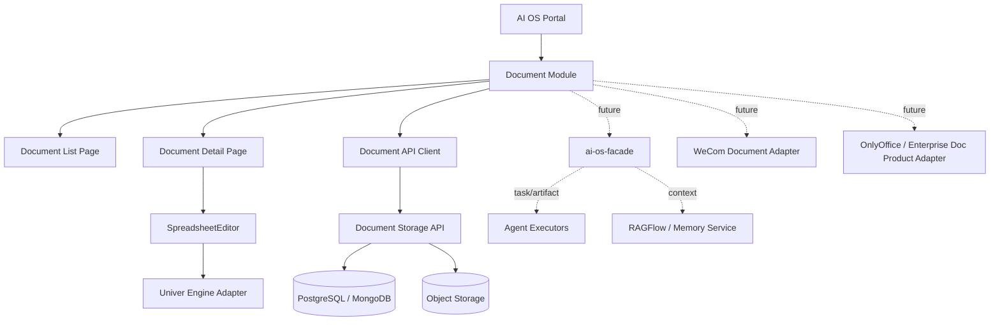

# AI OS Portal 文档模块：Univer 集成实施方案

## 1. 定位

先把 **Univer 作为 AI OS Portal 内置 Excel 查看 / 编辑内核**，但文档模块必须保持独立产品边界。

当前阶段不做：

| 暂不做                 | 原因                                                                                                       |
| ------------------- | -------------------------------------------------------------------------------------------------------- |
| XLSX / DOCX 高保真导入导出 | 成本高，且容易把第一阶段拖入格式兼容泥潭                                                                                     |
| 在线多人协同编辑            | Univer 协同依赖 Univer Server，不应在第一阶段直接引入服务端协同复杂度；官方协同插件需要通过 `unitId` 从 Univer Server 获取协同文档数据 ([Univer][1]) |
| Word 编辑             | 先保留 Markdown / 富文本方案，Excel 先用 Univer                                                                     |
| 与企业微信文档深度打通         | 后续作为外部文档源 Adapter                                                                                        |
| AI 自动改表             | 先只暴露只读上下文 / 保存接口，后续再接 CopilotKit / ai-os-facade tool                                                     |

当前阶段要做：

| 能力         | 实现方式                             |
| ---------- | -------------------------------- |
| 文档列表       | Portal 本地模块页面                    |
| Excel 文档查看 | Univer Sheets                    |
| Excel 文档编辑 | Univer Sheets Core Preset        |
| 保存         | 保存 Univer workbook snapshot JSON |
| 权限         | Portal 自己控制入口权限；Univer 内部权限后续再接  |
| 独立模块边界     | `modules/documents/**` 独立封装      |
| 未来可替换      | 通过 `SpreadsheetEngineAdapter` 抽象 |

Univer 官方 React 集成示例使用 `@univerjs/preset-sheets-core`、`@univerjs/presets`、`createUniver`、`LocaleType`，并通过 `container` 将表格挂载到 React DOM 容器中 ([Univer][2])。官方也说明 Preset Mode 更适合快速构建，不需要手动关注插件注册顺序，但牺牲了更细粒度的插件级懒加载能力 ([Univer][3])。

---

## 2. 架构边界



AI OS Facade 仍然只做跨系统任务、执行态、审计、执行体适配，不直接承载文档编辑内核；文档产品作为独立模块，通过 artifact / document reference 与 Facade 关联，避免把 Portal 编辑器和 Agent 编排层耦合。该边界与现有 ai-os-facade 的任务接入、执行状态、适配器化定位保持一致。

---

## 3. 技术选型

| 项        | 选择                            | 理由                                          |
| -------- | ----------------------------- | ------------------------------------------- |
| Excel 内核 | Univer Free / OSS             | React 可嵌入，canvas 渲染，官方提供 Sheets Core Preset |
| UI 外壳    | React + shadcn/ui             | 与 Portal 现有前端栈一致                            |
| 编辑器隔离    | `SpreadsheetEngineAdapter`    | 未来可替换 Luckysheet / 企业微信文档 / OnlyOffice      |
| 保存格式     | Univer workbook snapshot JSON | 第一阶段不做 XLSX round-trip，先保证编辑状态可持久化          |
| 文档元数据    | Portal Document API           | 文件名、类型、owner、版本、权限、关联任务                     |
| 大文件存储    | Object Storage                | workbook snapshot / 原始文件 / 导出文件统一落对象存储      |
| 协同       | 第一阶段不启用                       | Univer 协同需要 Univer Server，后续单独评估            |

Univer 自身具备 spreadsheet、document、presentation 方向的产品化能力，并提供公式、条件格式、数据校验、筛选、排序等 Sheets 功能；其渲染和公式能力是后续扩展 Excel 能力的主要价值点。([GitHub][4])

---

## 4. 第一阶段功能范围

### 4.1 页面

| 页面    | 路由                                | 说明            |
| ----- | --------------------------------- | ------------- |
| 文档首页  | `/documents`                      | 文档列表、创建、搜索、筛选 |
| 表格编辑页 | `/documents/:documentId`          | Univer 编辑器    |
| 表格预览页 | `/documents/:documentId/preview`  | 只读模式          |
| 文档设置页 | `/documents/:documentId/settings` | 名称、权限、归档、删除   |

### 4.2 文档类型

```ts
export type DocumentType = "spreadsheet" | "markdown" | "word-placeholder";

export type DocumentEngine = 
  | "univer-sheet"
  | "markdown-editor"
  | "external-wecom"
  | "external-onlyoffice";
```

第一阶段只实装：

```ts
DocumentType = "spreadsheet"
DocumentEngine = "univer-sheet"
```

Markdown 可保留原有编辑器，Word 暂只占位。

---

## 5. 目录结构

按独立模块落地。

```bash
src/
  modules/
    documents/
      README.md

      routes/
        DocumentsRoutes.tsx

      pages/
        DocumentListPage.tsx
        DocumentDetailPage.tsx
        DocumentPreviewPage.tsx
        DocumentSettingsPage.tsx

      components/
        DocumentModuleShell.tsx
        DocumentToolbar.tsx
        DocumentBreadcrumb.tsx
        DocumentStatusBadge.tsx
        DocumentCreateDialog.tsx
        DocumentDeleteDialog.tsx
        DocumentPermissionPanel.tsx

      spreadsheet/
        SpreadsheetEditor.tsx
        SpreadsheetViewer.tsx
        UniverSheetHost.tsx
        UniverSheetToolbar.tsx
        UniverLoading.tsx
        UniverErrorBoundary.tsx

      adapters/
        SpreadsheetEngineAdapter.ts
        UniverSpreadsheetAdapter.ts
        MockSpreadsheetAdapter.ts

      api/
        documentApi.ts
        documentTypes.ts
        documentSchemas.ts

      hooks/
        useDocuments.ts
        useDocumentDetail.ts
        useDocumentSave.ts
        useSpreadsheetAutosave.ts
        useDocumentPermissions.ts

      store/
        documentStore.ts

      mocks/
        mockDocuments.ts
        mockWorkbook.ts

      utils/
        documentId.ts
        workbookSnapshot.ts
        debounce.ts

      styles/
        univer-overrides.css
```

如果当前项目是 Next.js App Router：

```bash
app/
  documents/
    page.tsx
    [documentId]/
      page.tsx
      preview/
        page.tsx
      settings/
        page.tsx
```

如果当前项目是 React Router：

```bash
src/routes/documents.tsx
```

Cursor 执行时优先改：

```bash
src/modules/documents/**
```

除非项目路由必须挂载，否则不改全局 layout、全局 provider、全局 store。

---

## 6. 依赖安装

```bash
pnpm add @univerjs/presets @univerjs/preset-sheets-core
```

如项目使用 pnpm，官方文档提示某些情况下可能需要显式安装 `react` 和 `react-dom`；当前 Portal 已有 React 时通常无需重复安装。([Univer][5])

---

## 7. 核心类型定义

### `src/modules/documents/api/documentTypes.ts`

```ts
export type DocumentId = string;

export type DocumentType = "spreadsheet" | "markdown" | "word-placeholder";

export type DocumentEngine =
  | "univer-sheet"
  | "markdown-editor"
  | "external-wecom"
  | "external-onlyoffice";

export type DocumentStatus = "draft" | "active" | "archived" | "deleted";

export interface DocumentMeta {
  id: DocumentId;
  title: string;
  type: DocumentType;
  engine: DocumentEngine;
  status: DocumentStatus;
  ownerId: string;
  workspaceId: string;
  createdAt: string;
  updatedAt: string;
  version: number;
  source?: {
    provider: "local" | "wecom" | "onlyoffice" | "external";
    externalId?: string;
    externalUrl?: string;
  };
}

export interface SpreadsheetDocument extends DocumentMeta {
  type: "spreadsheet";
  engine: "univer-sheet";
  snapshot: UniverWorkbookSnapshot;
}

export interface UniverWorkbookSnapshot {
  id: string;
  name: string;
  appVersion?: string;
  data: Record<string, unknown>;
}

export interface CreateDocumentRequest {
  title: string;
  type: DocumentType;
  engine?: DocumentEngine;
  workspaceId: string;
}

export interface UpdateDocumentRequest {
  title?: string;
  snapshot?: UniverWorkbookSnapshot;
  version: number;
}

export interface DocumentSaveResult {
  documentId: string;
  version: number;
  updatedAt: string;
}
```

---

## 8. Adapter 抽象

### `src/modules/documents/adapters/SpreadsheetEngineAdapter.ts`

```ts
import type { UniverWorkbookSnapshot } from "../api/documentTypes";

export interface SpreadsheetEngineMountOptions {
  container: HTMLElement;
  readonly?: boolean;
  initialSnapshot?: UniverWorkbookSnapshot;
  onDirtyChange?: (dirty: boolean) => void;
  onSnapshotChange?: (snapshot: UniverWorkbookSnapshot) => void;
}

export interface SpreadsheetEngineInstance {
  getSnapshot(): UniverWorkbookSnapshot;
  setReadonly(readonly: boolean): void;
  dispose(): void;
}

export interface SpreadsheetEngineAdapter {
  engine: "univer-sheet";
  mount(options: SpreadsheetEngineMountOptions): SpreadsheetEngineInstance;
}
```

这个接口是后续替换引擎的关键。页面不直接依赖 Univer API，只依赖 `SpreadsheetEngineAdapter`。

---

## 9. Univer Adapter 实现

### `src/modules/documents/adapters/UniverSpreadsheetAdapter.ts`

```ts
import { UniverSheetsCorePreset } from "@univerjs/preset-sheets-core";
import UniverPresetSheetsCoreEnUS from "@univerjs/preset-sheets-core/locales/en-US";
import { createUniver, LocaleType, mergeLocales } from "@univerjs/presets";

import "@univerjs/preset-sheets-core/lib/index.css";

import type {
  SpreadsheetEngineAdapter,
  SpreadsheetEngineInstance,
  SpreadsheetEngineMountOptions,
} from "./SpreadsheetEngineAdapter";

import type { UniverWorkbookSnapshot } from "../api/documentTypes";

export class UniverSpreadsheetAdapter implements SpreadsheetEngineAdapter {
  engine = "univer-sheet" as const;

  mount(options: SpreadsheetEngineMountOptions): SpreadsheetEngineInstance {
    const { container, initialSnapshot, readonly } = options;

    const { univerAPI } = createUniver({
      locale: LocaleType.EN_US,
      locales: {
        [LocaleType.EN_US]: mergeLocales(UniverPresetSheetsCoreEnUS),
      },
      presets: [
        UniverSheetsCorePreset({
          container,
        }),
      ],
    });

    const workbookData =
      initialSnapshot?.data && Object.keys(initialSnapshot.data).length > 0
        ? initialSnapshot.data
        : {};

    univerAPI.createWorkbook(workbookData);

    let isReadonly = Boolean(readonly);

    return {
      getSnapshot(): UniverWorkbookSnapshot {
        const activeWorkbook = univerAPI.getActiveWorkbook();

        return {
          id: initialSnapshot?.id ?? crypto.randomUUID(),
          name: initialSnapshot?.name ?? "Untitled Sheet",
          appVersion: "univer",
          data: activeWorkbook?.save?.() ?? {},
        };
      },

      setReadonly(nextReadonly: boolean) {
        isReadonly = nextReadonly;

        // 第一阶段先在 Portal 层禁用保存按钮。
        // 后续再接 Univer permission / command interceptor。
        void isReadonly;
      },

      dispose() {
        univerAPI.dispose();
      },
    };
  }
}
```

说明：

1. 第一阶段不直接使用复杂 plugin mode。
2. `readonly` 先在 Portal 层控制按钮和入口。
3. 如果后续需要单元格级权限，再接 Univer Permission Control。官方权限能力可限制 workbook、sheet、range，但持久化规则、组织结构需要业务系统自己实现，因此应该由 Portal / BFF 保存权限规则。([Univer][6])

---

## 10. Univer Host 组件

### `src/modules/documents/spreadsheet/UniverSheetHost.tsx`

```tsx
import { useEffect, useRef } from "react";
import type { UniverWorkbookSnapshot } from "../api/documentTypes";
import { UniverSpreadsheetAdapter } from "../adapters/UniverSpreadsheetAdapter";
import type { SpreadsheetEngineInstance } from "../adapters/SpreadsheetEngineAdapter";

interface UniverSheetHostProps {
  snapshot?: UniverWorkbookSnapshot;
  readonly?: boolean;
  onReady?: (instance: SpreadsheetEngineInstance) => void;
  onSnapshotChange?: (snapshot: UniverWorkbookSnapshot) => void;
}

export function UniverSheetHost(props: UniverSheetHostProps) {
  const containerRef = useRef<HTMLDivElement | null>(null);
  const instanceRef = useRef<SpreadsheetEngineInstance | null>(null);

  useEffect(() => {
    if (!containerRef.current) return;

    const adapter = new UniverSpreadsheetAdapter();

    const instance = adapter.mount({
      container: containerRef.current,
      readonly: props.readonly,
      initialSnapshot: props.snapshot,
      onSnapshotChange: props.onSnapshotChange,
    });

    instanceRef.current = instance;
    props.onReady?.(instance);

    return () => {
      instance.dispose();
      instanceRef.current = null;
    };
  }, []);

  useEffect(() => {
    instanceRef.current?.setReadonly(Boolean(props.readonly));
  }, [props.readonly]);

  return (
    <div className="h-full w-full overflow-hidden rounded-md border bg-background">
      <div ref={containerRef} className="h-full w-full" />
    </div>
  );
}
```

---

## 11. 编辑页实现

### `src/modules/documents/pages/DocumentDetailPage.tsx`

```tsx
import { useRef, useState } from "react";
import { Button } from "@/components/ui/button";
import { DocumentModuleShell } from "../components/DocumentModuleShell";
import { UniverSheetHost } from "../spreadsheet/UniverSheetHost";
import type { SpreadsheetEngineInstance } from "../adapters/SpreadsheetEngineAdapter";
import { useDocumentDetail } from "../hooks/useDocumentDetail";
import { useDocumentSave } from "../hooks/useDocumentSave";

interface DocumentDetailPageProps {
  documentId: string;
}

export function DocumentDetailPage({ documentId }: DocumentDetailPageProps) {
  const { document, loading, error, refetch } = useDocumentDetail(documentId);
  const saveMutation = useDocumentSave(documentId);
  const engineRef = useRef<SpreadsheetEngineInstance | null>(null);
  const [dirty, setDirty] = useState(false);

  if (loading) {
    return <DocumentModuleShell>加载文档...</DocumentModuleShell>;
  }

  if (error || !document) {
    return (
      <DocumentModuleShell>
        <div className="space-y-4">
          <div className="text-sm text-destructive">文档加载失败</div>
          <Button variant="outline" onClick={refetch}>重试</Button>
        </div>
      </DocumentModuleShell>
    );
  }

  const handleSave = async () => {
    const snapshot = engineRef.current?.getSnapshot();
    if (!snapshot) return;

    await saveMutation.mutateAsync({
      snapshot,
      version: document.version,
    });

    setDirty(false);
  };

  return (
    <DocumentModuleShell
      title={document.title}
      actions={
        <div className="flex items-center gap-2">
          {dirty && <span className="text-xs text-muted-foreground">未保存</span>}
          <Button
            size="sm"
            disabled={saveMutation.isPending}
            onClick={handleSave}
          >
            保存
          </Button>
        </div>
      }
    >
      <div className="h-[calc(100vh-160px)]">
        <UniverSheetHost
          snapshot={document.snapshot}
          readonly={false}
          onReady={(instance) => {
            engineRef.current = instance;
          }}
          onSnapshotChange={() => setDirty(true)}
        />
      </div>
    </DocumentModuleShell>
  );
}
```

---

## 12. API Client

### `src/modules/documents/api/documentApi.ts`

```ts
import type {
  CreateDocumentRequest,
  DocumentMeta,
  DocumentSaveResult,
  SpreadsheetDocument,
  UpdateDocumentRequest,
} from "./documentTypes";

const API_BASE = import.meta.env.VITE_DOCUMENT_API_BASE_URL ?? "/api/documents";

async function request<T>(path: string, init?: RequestInit): Promise<T> {
  const res = await fetch(`${API_BASE}${path}`, {
    ...init,
    headers: {
      "Content-Type": "application/json",
      ...(init?.headers ?? {}),
    },
  });

  if (!res.ok) {
    throw new Error(`Document API failed: ${res.status}`);
  }

  return res.json() as Promise<T>;
}

export const documentApi = {
  list(params?: { workspaceId?: string; keyword?: string }) {
    const query = new URLSearchParams();

    if (params?.workspaceId) query.set("workspaceId", params.workspaceId);
    if (params?.keyword) query.set("keyword", params.keyword);

    return request<DocumentMeta[]>(`?${query.toString()}`);
  },

  get(documentId: string) {
    return request<SpreadsheetDocument>(`/${documentId}`);
  },

  create(payload: CreateDocumentRequest) {
    return request<DocumentMeta>("", {
      method: "POST",
      body: JSON.stringify(payload),
    });
  },

  update(documentId: string, payload: UpdateDocumentRequest) {
    return request<DocumentSaveResult>(`/${documentId}`, {
      method: "PUT",
      body: JSON.stringify(payload),
    });
  },

  remove(documentId: string) {
    return request<void>(`/${documentId}`, {
      method: "DELETE",
    });
  },
};
```

---

## 13. 后端 API 契约预留

即使第一阶段只做前端 mock，也按这个契约写，后续 BFF / Document Service 可直接补。

```yaml
openapi: 3.0.3
info:
  title: AI OS Document API
  version: 0.1.0

paths:
  /api/documents:
    get:
      summary: List documents
      parameters:
        - name: workspaceId
          in: query
          schema:
            type: string
        - name: keyword
          in: query
          schema:
            type: string
      responses:
        "200":
          description: Document list

    post:
      summary: Create document
      requestBody:
        required: true
        content:
          application/json:
            schema:
              $ref: "#/components/schemas/CreateDocumentRequest"
      responses:
        "200":
          description: Created document

  /api/documents/{documentId}:
    get:
      summary: Get document detail
      parameters:
        - name: documentId
          in: path
          required: true
          schema:
            type: string
      responses:
        "200":
          description: Document detail

    put:
      summary: Update document snapshot
      parameters:
        - name: documentId
          in: path
          required: true
          schema:
            type: string
      requestBody:
        required: true
      responses:
        "200":
          description: Save result

    delete:
      summary: Delete document
      parameters:
        - name: documentId
          in: path
          required: true
          schema:
            type: string
      responses:
        "204":
          description: Deleted
```

---

## 14. 文档数据模型

### 第一阶段前端 Mock

```ts
export const mockWorkbook = {
  id: "workbook-demo",
  name: "Demo Sheet",
  data: {
    id: "workbook-demo",
    name: "Demo Sheet",
    sheetOrder: ["sheet-001"],
    sheets: {
      "sheet-001": {
        id: "sheet-001",
        name: "Sheet1",
        cellData: {
          0: {
            0: { v: "物料型号" },
            1: { v: "数量" },
            2: { v: "单价" },
          },
          1: {
            0: { v: "STM32F103C8T6" },
            1: { v: 1000 },
            2: { v: 1.25 },
          },
        },
      },
    },
  },
};
```

### 后端持久化建议

```sql
create table document_file (
  id uuid primary key,
  workspace_id uuid not null,
  owner_id uuid not null,
  title varchar(255) not null,
  type varchar(64) not null,
  engine varchar(64) not null,
  status varchar(32) not null default 'active',
  current_version int not null default 1,
  source_provider varchar(64) default 'local',
  source_external_id varchar(255),
  source_external_url text,
  created_at timestamptz not null default now(),
  updated_at timestamptz not null default now()
);

create table document_version (
  id uuid primary key,
  document_id uuid not null references document_file(id),
  version int not null,
  snapshot_object_key text not null,
  created_by uuid not null,
  created_at timestamptz not null default now(),
  unique(document_id, version)
);

create table document_permission (
  id uuid primary key,
  document_id uuid not null references document_file(id),
  subject_type varchar(32) not null,
  subject_id varchar(128) not null,
  role varchar(32) not null,
  created_at timestamptz not null default now(),
  unique(document_id, subject_type, subject_id)
);
```

---

## 15. 与 ai-os-facade 的集成方式

第一阶段不让 Facade 直接操作 Univer。只给 Facade 一个稳定的文档引用。

### Document Reference

```ts
export interface DocumentReference {
  documentId: string;
  title: string;
  type: "spreadsheet" | "markdown" | "word";
  engine: "univer-sheet" | "markdown-editor" | "external-wecom" | "external-onlyoffice";
  version: number;
  viewUrl: string;
  editUrl: string;
  snapshotApiUrl: string;
}
```

### Facade 可使用的文档能力

| 场景           | Facade 调用                            | 文档模块响应                        |
| ------------ | ------------------------------------ | ----------------------------- |
| Agent 生成表格结果 | `POST /api/documents`                | 创建 spreadsheet 文档             |
| Agent 需要读取表格 | `GET /api/documents/{id}/snapshot`   | 返回 workbook snapshot          |
| Agent 生成任务产物 | `POST /api/tasks/{taskId}/artifacts` | artifact 绑定 documentId        |
| 用户打开任务产物     | Portal 跳转 `/documents/{id}`          | 进入 Univer 编辑页                 |
| 审计           | 文档模块记录 version                       | Facade 只记录 artifact reference |

### 不允许的耦合

| 禁止项                                 | 原因                        |
| ----------------------------------- | ------------------------- |
| Facade 内部 import Univer             | Facade 是后端任务协调层，不应依赖前端编辑器 |
| Agent 直接写 Univer 内部状态               | 会破坏权限、版本、审计               |
| Portal 文档模块直接调用 OpenClaw / DeerFlow | 执行体必须经过 Facade            |
| Univer snapshot 直接塞进任务日志            | 快照体积不可控，应存对象存储，只记录引用      |

---

## 16. 与企业微信文档的未来关系

保留 Adapter，不现在实现。

```ts
export interface ExternalDocumentProviderAdapter {
  provider: "wecom" | "onlyoffice" | "lark" | "google";
  createDocument(input: CreateExternalDocumentInput): Promise<ExternalDocumentRef>;
  getViewUrl(documentId: string): Promise<string>;
  getEditUrl(documentId: string): Promise<string>;
  syncMetadata(documentId: string): Promise<void>;
}
```

未来策略：

| 阶段      | 本地 Univer                   | 企业微信文档                                 |
| ------- | --------------------------- | -------------------------------------- |
| Phase 1 | 本地查看 / 编辑 workbook snapshot | 不接                                     |
| Phase 2 | 支持导出静态文件                    | 企业微信作为外部发布目标                           |
| Phase 3 | 本地编辑 + 外部协同二选一              | 企业微信承担多人协同                             |
| Phase 4 | 文档中心统一索引                    | 企业微信 / Univer / OnlyOffice 都是 Provider |

关键取舍：

| 方案            | 优点                     | 风险                |
| ------------- | ---------------------- | ----------------- |
| 本地 Univer 为主  | 可控、嵌入快、适合 AI OS Portal | 多人协同、Office 兼容要自建 |
| 企业微信文档为主      | 协同成熟、企业已使用             | API/权限/格式能力受平台限制  |
| OnlyOffice 为主 | Office 格式兼容强           | 服务端部署和商业限制更重      |
| Adapter 抽象    | 可迁移                    | 第一阶段需要多写一层接口      |

建议路线：**Portal 内置 Univer 做轻量 Excel 编辑内核；企业微信文档作为外部协同 Provider；OnlyOffice 作为未来高保真 Office Provider。**

---

## 17. Cursor 执行顺序

### Step 1：创建模块骨架

生成：

```bash
src/modules/documents/
```

完成：

| 文件                                     | 目标         |
| -------------------------------------- | ---------- |
| `api/documentTypes.ts`                 | 类型定义       |
| `api/documentApi.ts`                   | API client |
| `adapters/SpreadsheetEngineAdapter.ts` | 引擎接口       |
| `adapters/UniverSpreadsheetAdapter.ts` | Univer 封装  |
| `spreadsheet/UniverSheetHost.tsx`      | React 宿主组件 |
| `pages/DocumentListPage.tsx`           | 列表页        |
| `pages/DocumentDetailPage.tsx`         | 编辑页        |

### Step 2：接入路由

React Router：

```tsx
{
  path: "/documents",
  element: <DocumentListPage />,
},
{
  path: "/documents/:documentId",
  element: <DocumentDetailRoute />,
}
```

Next.js：

```tsx
// app/documents/page.tsx
export default function Page() {
  return <DocumentListPage />;
}

// app/documents/[documentId]/page.tsx
export default function Page({ params }: { params: { documentId: string } }) {
  return <DocumentDetailPage documentId={params.documentId} />;
}
```

### Step 3：Mock 跑通

先使用：

```ts
src/modules/documents/mocks/mockDocuments.ts
```

不要等后端。

验收：

| 验收项              | 标准                  |
| ---------------- | ------------------- |
| `/documents` 可打开 | 显示 mock 文档          |
| 点击文档             | 进入 `/documents/:id` |
| Univer 加载        | 能看到 spreadsheet     |
| 单元格可编辑           | 可输入                 |
| 点击保存             | 控制台 / mock API 返回成功 |
| 返回列表             | 文档更新时间变化            |

### Step 4：替换真实 API

将 `documentApi.ts` 从 mock 切换到：

```bash
VITE_DOCUMENT_API_BASE_URL=/api/documents
```

如果当前项目有 BFF：

```bash
VITE_DOCUMENT_API_BASE_URL=/api/portal/documents
```

### Step 5：加自动保存

```ts
useSpreadsheetAutosave({
  enabled: true,
  intervalMs: 10000,
  getSnapshot: () => engineRef.current?.getSnapshot(),
  save: documentApi.update,
});
```

第一阶段只做 debounce autosave，不做实时协同。

---

## 18. DoD

| 分类     | 验收标准                                           |
| ------ | ---------------------------------------------- |
| 架构     | 文档模块代码全部在 `modules/documents/**`               |
| 路由     | `/documents`、`/documents/:id` 可访问              |
| Univer | 能创建 workbook、编辑单元格、销毁实例                        |
| 保存     | 能保存 workbook snapshot JSON                     |
| 权限     | 只读模式下隐藏保存入口                                    |
| 可替换    | 页面不直接依赖 Univer API，只依赖 Adapter                 |
| 样式     | 使用 shadcn/ui 外壳，不污染全局 CSS                      |
| 稳定性    | 页面切换后 `univerAPI.dispose()` 正常执行               |
| 迁移     | 保留 external provider 字段                        |
| Facade | 只通过 document reference / artifact reference 集成 |

---

## 19. Cursor Prompt

直接复制给 Cursor：

```md
# 任务：在 AI OS Portal 中新增独立 documents 模块，并集成 Univer 作为 Excel 查看/编辑内核

## 不允许修改
- 不修改全局 layout
- 不修改全局 provider
- 不引入 OnlyOffice
- 不实现 XLSX 导入导出
- 不实现多人实时协同
- 不让 ai-os-facade 直接依赖 Univer

## 允许修改
- src/modules/documents/**
- 当前项目路由注册文件
- package.json 增加 Univer 依赖

## 技术栈
- React
- shadcn/ui
- @univerjs/presets
- @univerjs/preset-sheets-core

## 实现目标
1. 新增 /documents 文档列表页
2. 新增 /documents/:documentId 表格编辑页
3. 使用 Univer 渲染 spreadsheet
4. 支持编辑单元格
5. 支持点击保存，保存 workbook snapshot JSON
6. 所有 Univer 相关逻辑封装在 UniverSpreadsheetAdapter
7. 页面只依赖 SpreadsheetEngineAdapter，不直接依赖 Univer API
8. 文档模块保留未来 external provider 字段，用于企业微信 / OnlyOffice 迁移

## 文件结构
按以下结构生成：

src/modules/documents/
  api/documentTypes.ts
  api/documentApi.ts
  adapters/SpreadsheetEngineAdapter.ts
  adapters/UniverSpreadsheetAdapter.ts
  spreadsheet/UniverSheetHost.tsx
  pages/DocumentListPage.tsx
  pages/DocumentDetailPage.tsx
  components/DocumentModuleShell.tsx
  mocks/mockDocuments.ts
  mocks/mockWorkbook.ts
  hooks/useDocumentDetail.ts
  hooks/useDocuments.ts
  hooks/useDocumentSave.ts

## 第一阶段使用 mock API
documentApi 先可使用 mock 数据，但接口形态必须保持：
- list()
- get(documentId)
- create(payload)
- update(documentId, payload)
- remove(documentId)

## 验收
- pnpm install 成功
- pnpm dev 成功
- /documents 可打开
- 点击文档进入编辑页
- Univer 正常渲染
- 单元格可编辑
- 保存按钮可触发 snapshot 保存
- 页面卸载时 dispose Univer 实例
```

---

## 20. 最终取舍

当前最优方案不是把 Univer 做成完整 Office，而是把它作为 **AI OS Portal 的独立 Excel 编辑内核**。

架构上必须坚持三点：

1. **Univer 只在 Document Module 内部出现。**
2. **Document Module 通过 Adapter 暴露文档能力。**
3. **ai-os-facade 只拿 document reference，不碰编辑器内部实现。**
