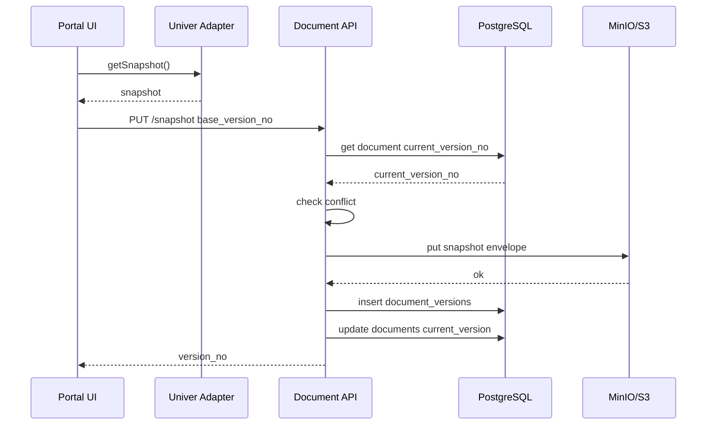

# Cursor Spec 包：AI OS Portal 独立文档模块 + Univer MVP

## 0. 目录结构

```text
docs/specs/document-product/
├── 00-boundary.md
├── 01-domain-model.md
├── 02-storage-schema.md
├── 03-api-contract.md
├── 04-backend-implementation.md
├── 05-univer-runtime.md
├── 06-frontend-implementation.md
├── 07-permission.md
├── 08-versioning-save.md
├── 09-acceptance-test.md
└── 10-cursor-execution-plan.md
```

---

# `00-boundary.md`

````md
# SPEC 00 - Document Product Boundary

## 1. 目标

在 AI OS Portal 中新增独立 Document Product 模块，首期只实现 Univer Sheet 的在线查看与单人编辑。

## 2. MVP 范围

### In Scope

- 文档列表
- 创建空白 spreadsheet 文档
- 打开 spreadsheet 文档
- 使用 Univer 渲染 Sheet
- 单用户编辑
- 手动保存
- 保存完整 Workbook Snapshot 到 MinIO / S3 compatible storage
- PostgreSQL 存 metadata 与 version index
- view/edit/owner 三档权限
- 版本记录
- 基础审计事件

### Out of Scope

- XLSX 导入
- XLSX 导出
- 多人实时协同
- Univer Server
- Univer Pro
- 企业微信文档 API
- OnlyOffice
- Word 编辑
- Markdown 编辑
- RAGFlow 入库
- Agent 自动编辑表格
- ai-os-facade 直接访问 Univer 内核

## 3. 系统边界

```mermaid
flowchart TD
    Portal[AI OS Portal] --> DocUI[Document UI]
    DocUI --> DocAPI[Document API]
    DocAPI --> PG[(PostgreSQL)]
    DocAPI --> S3[(MinIO / S3)]
    DocUI --> Univer[Univer Sheet Runtime]

    Facade[ai-os-facade] -. artifact reference .-> DocAPI
    Agent[Agent Executors] -. no direct access .-> DocAPI
````

## 4. 强制规则

1. Document Product 是独立模块，不写入 ai-os-facade。
2. ai-os-facade 只能持有 document reference。
3. Univer 只存在于 Portal 前端 `documents` 模块。
4. 后端不理解 Univer 内部单元格语义，只保存 snapshot。
5. Snapshot 内容存 MinIO / S3，不直接塞 PostgreSQL JSONB。
6. PostgreSQL 只存 metadata、version index、permission、event。
7. MVP 保存策略为 full snapshot，不做 patch / operation log。
8. 页面层不得直接 import `@univerjs/*`。
9. 只有 Univer Adapter 可以 import Univer 依赖。
10. 不做双事实源编辑：本地 Univer 与外部企业微信文档不能同时编辑同一份正式文档。

## 5. Document Reference

Facade / Agent 只能引用以下结构：

```ts
export interface DocumentReference {
  document_id: string;
  title: string;
  document_type: "spreadsheet";
  engine: "univer";
  version_no: number;
  view_url: string;
  edit_url: string;
  snapshot_api_url: string;
}
```

## 6. MVP 完成定义

* `/documents` 可显示文档列表
* `/documents/:documentId` 可打开 Univer Sheet
* 单元格可编辑
* 点击保存后生成新版本
* 刷新页面后恢复上次保存内容
* Snapshot 文件落 MinIO / S3
* Metadata 与 version index 落 PostgreSQL
* 无 edit 权限不能保存

````

---

# `01-domain-model.md`

```md
# SPEC 01 - Domain Model

## 1. 核心实体

```text
Document
DocumentVersion
DocumentPermission
DocumentEvent
SnapshotObject
````

## 2. Document

```ts
export type DocumentType = "spreadsheet";
export type DocumentEngine = "univer";
export type DocumentStatus = "draft" | "active" | "archived" | "deleted";
export type DocumentProvider = "local" | "wecom" | "onlyoffice";

export interface Document {
  id: string;
  tenant_id: string;
  workspace_id: string;

  title: string;
  document_type: DocumentType;
  engine: DocumentEngine;
  status: DocumentStatus;

  provider: DocumentProvider;
  external_id?: string | null;
  external_url?: string | null;

  current_version_no: number;
  current_version_id?: string | null;

  owner_id: string;
  created_by: string;
  updated_by?: string | null;

  created_at: string;
  updated_at: string;
  archived_at?: string | null;
  deleted_at?: string | null;
}
```

## 3. DocumentVersion

```ts
export interface DocumentVersion {
  id: string;
  document_id: string;
  version_no: number;

  snapshot_bucket: string;
  snapshot_key: string;
  snapshot_size_bytes: number;
  snapshot_checksum_sha256: string;

  engine: "univer";
  engine_version: string;
  schema_version: number;

  save_mode: "manual" | "autosave" | "system";
  created_by: string;
  created_at: string;
}
```

## 4. DocumentPermission

```ts
export type PermissionSubjectType = "user" | "role" | "department";
export type DocumentPermissionRole = "view" | "edit" | "owner";

export interface DocumentPermission {
  id: string;
  document_id: string;
  subject_type: PermissionSubjectType;
  subject_id: string;
  role: DocumentPermissionRole;
  created_by: string;
  created_at: string;
}
```

## 5. DocumentEvent

```ts
export type DocumentEventType =
  | "document.created"
  | "document.opened"
  | "document.saved"
  | "document.renamed"
  | "document.archived"
  | "document.deleted"
  | "permission.updated"
  | "version.created"
  | "snapshot.read"
  | "snapshot.write";

export interface DocumentEvent {
  id: string;
  document_id: string;
  event_type: DocumentEventType;
  actor_id: string;
  version_no?: number;
  payload?: Record<string, unknown>;
  created_at: string;
}
```

## 6. Snapshot DTO

后端保存对象存储的 payload 必须包含 envelope，不允许只存 Univer 原始 JSON。

```ts
export interface DocumentSnapshotEnvelope {
  document_id: string;
  document_type: "spreadsheet";
  engine: "univer";
  engine_version: string;
  schema_version: 1;

  version_no: number;
  saved_at: string;
  saved_by: string;

  snapshot: Record<string, unknown>;
}
```

## 7. 版本规则

* 文档创建时生成 version 1。
* 每次手动保存生成新版本。
* `documents.current_version_no` 指向最新版本。
* `document_versions.version_no` 在单文档内递增。
* 同一 `document_id + version_no` 必须唯一。
* 客户端保存必须提交 `base_version_no`。
* 如果 `base_version_no != current_version_no`，后端返回 `409 version_conflict`。

## 8. 状态规则

```text
draft -> active
active -> archived
archived -> active
archived -> deleted
active -> deleted
```

MVP 不做物理删除，只做 soft delete。

````

---

# `02-storage-schema.md`

```md
# SPEC 02 - PostgreSQL + MinIO Storage Schema

## 1. 存储策略

```text
metadata        -> PostgreSQL
version index   -> PostgreSQL
permission      -> PostgreSQL
audit event     -> PostgreSQL
snapshot body   -> MinIO / S3 compatible storage
````

## 2. PostgreSQL DDL

```sql
CREATE TABLE documents (
    id UUID PRIMARY KEY,
    tenant_id UUID NOT NULL,
    workspace_id UUID NOT NULL,

    title VARCHAR(255) NOT NULL,
    document_type VARCHAR(32) NOT NULL,
    engine VARCHAR(32) NOT NULL,
    status VARCHAR(32) NOT NULL DEFAULT 'active',

    provider VARCHAR(32) NOT NULL DEFAULT 'local',
    external_id VARCHAR(255),
    external_url TEXT,

    current_version_no INTEGER NOT NULL DEFAULT 1,
    current_version_id UUID,

    owner_id UUID NOT NULL,
    created_by UUID NOT NULL,
    updated_by UUID,

    created_at TIMESTAMPTZ NOT NULL DEFAULT now(),
    updated_at TIMESTAMPTZ NOT NULL DEFAULT now(),
    archived_at TIMESTAMPTZ,
    deleted_at TIMESTAMPTZ,

    CONSTRAINT chk_documents_type CHECK (document_type IN ('spreadsheet')),
    CONSTRAINT chk_documents_engine CHECK (engine IN ('univer')),
    CONSTRAINT chk_documents_status CHECK (status IN ('draft', 'active', 'archived', 'deleted')),
    CONSTRAINT chk_documents_provider CHECK (provider IN ('local', 'wecom', 'onlyoffice'))
);

CREATE TABLE document_versions (
    id UUID PRIMARY KEY,
    document_id UUID NOT NULL REFERENCES documents(id),

    version_no INTEGER NOT NULL,

    snapshot_bucket VARCHAR(128) NOT NULL,
    snapshot_key TEXT NOT NULL,
    snapshot_size_bytes BIGINT NOT NULL,
    snapshot_checksum_sha256 CHAR(64) NOT NULL,

    engine VARCHAR(32) NOT NULL,
    engine_version VARCHAR(64) NOT NULL,
    schema_version INTEGER NOT NULL DEFAULT 1,

    save_mode VARCHAR(32) NOT NULL DEFAULT 'manual',
    created_by UUID NOT NULL,
    created_at TIMESTAMPTZ NOT NULL DEFAULT now(),

    CONSTRAINT uq_document_versions_doc_version UNIQUE (document_id, version_no),
    CONSTRAINT chk_document_versions_engine CHECK (engine IN ('univer')),
    CONSTRAINT chk_document_versions_save_mode CHECK (save_mode IN ('manual', 'autosave', 'system'))
);

ALTER TABLE documents
ADD CONSTRAINT fk_documents_current_version
FOREIGN KEY (current_version_id) REFERENCES document_versions(id)
DEFERRABLE INITIALLY DEFERRED;

CREATE TABLE document_permissions (
    id UUID PRIMARY KEY,
    document_id UUID NOT NULL REFERENCES documents(id),

    subject_type VARCHAR(32) NOT NULL,
    subject_id UUID NOT NULL,
    role VARCHAR(32) NOT NULL,

    created_by UUID NOT NULL,
    created_at TIMESTAMPTZ NOT NULL DEFAULT now(),

    CONSTRAINT uq_document_permission UNIQUE (document_id, subject_type, subject_id),
    CONSTRAINT chk_document_permission_subject CHECK (subject_type IN ('user', 'role', 'department')),
    CONSTRAINT chk_document_permission_role CHECK (role IN ('view', 'edit', 'owner'))
);

CREATE TABLE document_events (
    id UUID PRIMARY KEY,
    document_id UUID NOT NULL REFERENCES documents(id),

    event_type VARCHAR(64) NOT NULL,
    actor_id UUID NOT NULL,
    version_no INTEGER,
    payload JSONB,

    created_at TIMESTAMPTZ NOT NULL DEFAULT now()
);
```

## 3. Index

```sql
CREATE INDEX idx_documents_workspace_status
ON documents(workspace_id, status, updated_at DESC);

CREATE INDEX idx_documents_owner
ON documents(owner_id, updated_at DESC);

CREATE INDEX idx_document_versions_document
ON document_versions(document_id, version_no DESC);

CREATE INDEX idx_document_permissions_subject
ON document_permissions(subject_type, subject_id);

CREATE INDEX idx_document_events_document_created
ON document_events(document_id, created_at DESC);
```

## 4. MinIO Object Key 规范

```text
documents/{tenant_id}/{workspace_id}/{document_id}/versions/v{version_no}.json
```

示例：

```text
documents/tnt_001/ws_001/doc_001/versions/v00000004.json
```

## 5. Snapshot Object Content-Type

```text
application/json
```

## 6. Snapshot Envelope

对象存储内容：

```json
{
  "document_id": "uuid",
  "document_type": "spreadsheet",
  "engine": "univer",
  "engine_version": "0.x",
  "schema_version": 1,
  "version_no": 4,
  "saved_at": "2026-04-29T13:00:00Z",
  "saved_by": "uuid",
  "snapshot": {}
}
```

## 7. Checksum

后端写入 MinIO 前必须计算：

```text
sha256(JSON.stringify(envelope))
```

保存到：

```text
document_versions.snapshot_checksum_sha256
```

## 8. 大小限制

MVP 默认限制：

```text
单个 snapshot <= 20MB
单个 workspace 文档数 <= 10000
单文档版本数不限制，但列表默认分页
```

超过 20MB 返回：

```json
{
  "code": "snapshot_too_large",
  "message": "Snapshot exceeds max size 20MB"
}
```

````

---

# `03-api-contract.md`

```md
# SPEC 03 - API Contract

## 1. Base Path

```text
/api/documents
````

## 2. Auth Context

后端从现有认证上下文读取：

```text
tenant_id
workspace_id
user_id
roles
departments
```

MVP 不从请求 body 接收 `tenant_id`。

## 3. API List

```http
GET    /api/documents
POST   /api/documents
GET    /api/documents/{document_id}
PATCH  /api/documents/{document_id}
DELETE /api/documents/{document_id}

GET    /api/documents/{document_id}/snapshot
PUT    /api/documents/{document_id}/snapshot

GET    /api/documents/{document_id}/versions
GET    /api/documents/{document_id}/versions/{version_no}

GET    /api/documents/{document_id}/permissions
PUT    /api/documents/{document_id}/permissions

GET    /api/documents/{document_id}/events
```

## 4. Create Document

```http
POST /api/documents
Content-Type: application/json
```

Request:

```json
{
  "title": "客户报价测算表",
  "document_type": "spreadsheet",
  "engine": "univer"
}
```

Response:

```json
{
  "id": "uuid",
  "title": "客户报价测算表",
  "document_type": "spreadsheet",
  "engine": "univer",
  "status": "active",
  "provider": "local",
  "current_version_no": 1,
  "owner_id": "uuid",
  "current_user_permission": "owner",
  "created_at": "2026-04-29T13:00:00Z",
  "updated_at": "2026-04-29T13:00:00Z"
}
```

## 5. List Documents

```http
GET /api/documents?keyword=&status=active&page=1&page_size=20
```

Response:

```json
{
  "items": [
    {
      "id": "uuid",
      "title": "客户报价测算表",
      "document_type": "spreadsheet",
      "engine": "univer",
      "status": "active",
      "provider": "local",
      "current_version_no": 3,
      "owner_id": "uuid",
      "current_user_permission": "edit",
      "created_at": "2026-04-29T13:00:00Z",
      "updated_at": "2026-04-29T13:10:00Z"
    }
  ],
  "page": 1,
  "page_size": 20,
  "total": 1
}
```

## 6. Get Document

```http
GET /api/documents/{document_id}
```

Response:

```json
{
  "id": "uuid",
  "title": "客户报价测算表",
  "document_type": "spreadsheet",
  "engine": "univer",
  "status": "active",
  "provider": "local",
  "current_version_no": 3,
  "owner_id": "uuid",
  "current_user_permission": "edit",
  "created_at": "2026-04-29T13:00:00Z",
  "updated_at": "2026-04-29T13:10:00Z"
}
```

## 7. Get Snapshot

```http
GET /api/documents/{document_id}/snapshot
```

Response:

```json
{
  "document_id": "uuid",
  "document_type": "spreadsheet",
  "engine": "univer",
  "engine_version": "0.x",
  "schema_version": 1,
  "version_no": 3,
  "saved_at": "2026-04-29T13:10:00Z",
  "saved_by": "uuid",
  "snapshot": {}
}
```

## 8. Save Snapshot

```http
PUT /api/documents/{document_id}/snapshot
Content-Type: application/json
```

Request:

```json
{
  "base_version_no": 3,
  "save_mode": "manual",
  "engine_version": "0.x",
  "schema_version": 1,
  "snapshot": {}
}
```

Response:

```json
{
  "document_id": "uuid",
  "version_no": 4,
  "snapshot_size_bytes": 10240,
  "snapshot_checksum_sha256": "hex",
  "saved_at": "2026-04-29T13:12:00Z"
}
```

## 9. Version Conflict

Status:

```http
409 Conflict
```

Response:

```json
{
  "code": "version_conflict",
  "message": "Document version conflict",
  "current_version_no": 4,
  "base_version_no": 3
}
```

## 10. Permission Error

Status:

```http
403 Forbidden
```

Response:

```json
{
  "code": "permission_denied",
  "message": "Current user has no edit permission"
}
```

## 11. OpenAPI Minimal

```yaml
openapi: 3.0.3
info:
  title: AI OS Document Product API
  version: 0.1.0
paths:
  /api/documents:
    get:
      summary: List documents
    post:
      summary: Create document
  /api/documents/{document_id}:
    get:
      summary: Get document
    patch:
      summary: Update document metadata
    delete:
      summary: Soft delete document
  /api/documents/{document_id}/snapshot:
    get:
      summary: Get current snapshot
    put:
      summary: Save new snapshot version
  /api/documents/{document_id}/versions:
    get:
      summary: List versions
  /api/documents/{document_id}/versions/{version_no}:
    get:
      summary: Get snapshot by version
  /api/documents/{document_id}/permissions:
    get:
      summary: List permissions
    put:
      summary: Replace permissions
  /api/documents/{document_id}/events:
    get:
      summary: List document events
```

````

---

# `04-backend-implementation.md`

```md
# SPEC 04 - Backend Implementation

## 1. 技术栈

```text
Python 3.12
FastAPI
SQLAlchemy 2.x
Alembic
PostgreSQL
MinIO / S3 compatible storage
Pydantic v2
````

## 2. 后端目录

```text
backend/app/modules/documents/
├── __init__.py
├── router.py
├── schemas.py
├── models.py
├── repository.py
├── service.py
├── storage.py
├── permission.py
├── checksum.py
├── exceptions.py
└── events.py

backend/alembic/versions/
└── xxxx_create_documents_tables.py

backend/tests/modules/documents/
├── test_document_create.py
├── test_document_snapshot_save.py
├── test_document_permission.py
└── test_document_version_conflict.py
```

## 3. Env

```env
DOCUMENT_SNAPSHOT_BUCKET=aios-documents
DOCUMENT_SNAPSHOT_MAX_BYTES=20971520

S3_ENDPOINT_URL=http://localhost:9000
S3_ACCESS_KEY=minioadmin
S3_SECRET_KEY=minioadmin
S3_REGION=us-east-1
S3_FORCE_PATH_STYLE=true
```

## 4. SQLAlchemy Models

`models.py` 必须包含：

```python
Document
DocumentVersion
DocumentPermission
DocumentEvent
```

字段与 `02-storage-schema.md` 保持一致。

## 5. Pydantic Schemas

`schemas.py` 必须包含：

```python
class DocumentCreateRequest(BaseModel)
class DocumentUpdateRequest(BaseModel)
class DocumentResponse(BaseModel)
class DocumentListResponse(BaseModel)

class SnapshotSaveRequest(BaseModel)
class SnapshotEnvelope(BaseModel)
class SnapshotSaveResponse(BaseModel)

class DocumentVersionResponse(BaseModel)
class DocumentPermissionRequest(BaseModel)
class DocumentEventResponse(BaseModel)
```

## 6. Repository 职责

`repository.py`

```python
class DocumentRepository:
    async def list_documents(...)
    async def get_document(...)
    async def create_document(...)
    async def update_document(...)
    async def soft_delete_document(...)

    async def get_current_version(...)
    async def create_version(...)
    async def list_versions(...)
    async def get_version_by_no(...)

    async def list_permissions(...)
    async def upsert_permissions(...)
    async def create_event(...)
```

Repository 不允许访问 MinIO。

## 7. Storage 职责

`storage.py`

```python
class SnapshotStorage:
    async def put_snapshot(
        bucket: str,
        key: str,
        payload: bytes,
        content_type: str = "application/json"
    ) -> SnapshotPutResult

    async def get_snapshot(
        bucket: str,
        key: str
    ) -> bytes

    async def object_exists(
        bucket: str,
        key: str
    ) -> bool
```

Storage 不允许访问数据库。

## 8. Service 职责

`service.py`

```python
class DocumentService:
    async def create_document(...)
    async def list_documents(...)
    async def get_document(...)
    async def save_snapshot(...)
    async def get_current_snapshot(...)
    async def list_versions(...)
    async def get_snapshot_by_version(...)
    async def update_permissions(...)
```

Service 负责事务编排：

```text
create document:
1. insert documents
2. build empty Univer snapshot envelope
3. write snapshot to MinIO
4. insert document_versions version 1
5. update documents.current_version_id/current_version_no
6. insert owner permission
7. insert document.created event
```

```text
save snapshot:
1. check document exists
2. check edit permission
3. check base_version_no == current_version_no
4. build envelope with next version
5. serialize JSON
6. check max size
7. sha256
8. put object to MinIO
9. insert document_versions
10. update documents.current_version_id/current_version_no
11. insert document.saved/version.created event
```

## 9. Empty Univer Snapshot

MVP 创建空表时，后端可以返回最小空 snapshot：

```json
{
  "id": "workbook",
  "name": "Untitled",
  "sheetOrder": ["sheet-001"],
  "sheets": {
    "sheet-001": {
      "id": "sheet-001",
      "name": "Sheet1",
      "cellData": {}
    }
  }
}
```

如果 Univer 版本要求更完整结构，由前端 adapter 归一化。

## 10. Error Codes

```python
DOCUMENT_NOT_FOUND = "document_not_found"
PERMISSION_DENIED = "permission_denied"
VERSION_CONFLICT = "version_conflict"
SNAPSHOT_TOO_LARGE = "snapshot_too_large"
SNAPSHOT_NOT_FOUND = "snapshot_not_found"
INVALID_DOCUMENT_STATUS = "invalid_document_status"
```

## 11. Transaction Rule

* 数据库事务只包 PostgreSQL 操作。
* MinIO 写入发生在创建 version 之前。
* 如果 MinIO 写入成功但 DB 写入失败，允许产生 orphan object。
* 后续通过定时清理 orphan object。
* MVP 不实现分布式事务。

## 12. Router

`router.py` 只负责 HTTP 入参出参，不写业务逻辑。

````

---

# `05-univer-runtime.md`

```md
# SPEC 05 - Univer Runtime

## 1. 目标

前端通过 Adapter 集成 Univer Sheet，页面不直接依赖 Univer API。

## 2. 依赖

```bash
pnpm add @univerjs/presets @univerjs/preset-sheets-core @formatjs/intl-segmenter
````

## 3. 强制约束

```text
只有以下文件允许 import @univerjs/*
src/modules/documents/adapters/univer/*
```

不允许：

```text
pages/** import @univerjs/*
components/** import @univerjs/*
hooks/** import @univerjs/*
```

## 4. 前端目录

```text
src/modules/documents/adapters/univer/
├── create-univer-app.ts
├── univer-lifecycle.ts
├── univer-snapshot.ts
└── univer-types.ts
```

## 5. Adapter Contract

```ts
export interface SpreadsheetEngineMountOptions {
  container: HTMLElement;
  readonly: boolean;
  initialSnapshot: Record<string, unknown>;
  onDirtyChange?: (dirty: boolean) => void;
}

export interface SpreadsheetEngineInstance {
  getSnapshot(): Record<string, unknown>;
  setReadonly(readonly: boolean): void;
  dispose(): void;
}

export interface SpreadsheetEngineAdapter {
  mount(options: SpreadsheetEngineMountOptions): SpreadsheetEngineInstance;
}
```

## 6. Lifecycle

```text
mount:
1. validate container
2. create Univer app
3. create workbook from snapshot
4. bind dirty listener if available
5. return instance

save:
1. get active workbook
2. call workbook.save()
3. return snapshot

dispose:
1. call univerAPI.dispose()
2. null local references
```

## 7. React Host

```text
UniverSheetEditor
- owns container ref
- owns engine instance ref
- calls adapter.mount on mount
- calls instance.dispose on unmount
- calls instance.getSnapshot on save
```

## 8. Readonly

MVP readonly 分两层：

```text
前端层：
- 隐藏保存按钮
- 禁止触发 save
- 显示 readonly badge

后端层：
- PUT snapshot 必须验证 edit 权限
```

Univer 内部 cell-level readonly 不在 MVP 实现。

## 9. Dirty State

MVP dirty 策略：

```text
第一阶段：
- 用户点击保存前，不强依赖 Univer 内部 operation listener
- 页面进入后，只要编辑器获得焦点并发生 keydown/paste，就标记 dirty

第二阶段：
- 接 Univer command / operation listener
```

## 10. Dispose Rule

必须满足：

```text
[ ] 路由离开时 dispose
[ ] documentId 变化时 dispose old instance
[ ] React StrictMode 下不能重复创建残留 canvas
[ ] containerRef 为 null 时不创建实例
```

## 11. Polyfill

入口文件或 Document Module 初始化文件引入：

```ts
import "@formatjs/intl-segmenter/polyfill";
```

## 12. Snapshot Normalize

`univer-snapshot.ts` 提供：

```ts
export function normalizeUniverSnapshot(input: unknown): Record<string, unknown>
export function createEmptyUniverSnapshot(title: string): Record<string, unknown>
export function validateUniverSnapshot(input: unknown): boolean
```

````

---

# `06-frontend-implementation.md`

```md
# SPEC 06 - Frontend Implementation

## 1. 技术栈

```text
React
TypeScript
shadcn/ui
React Router 或 Next App Router，按现有项目选择
TanStack Query 可用则使用，否则使用本地 hooks
````

## 2. 目录

```text
src/modules/documents/
├── routes.tsx
├── types/
│   └── document.types.ts
├── services/
│   └── document-api.ts
├── hooks/
│   ├── use-documents.ts
│   ├── use-document.ts
│   ├── use-document-snapshot.ts
│   └── use-save-document-snapshot.ts
├── pages/
│   ├── DocumentListPage.tsx
│   └── DocumentEditorPage.tsx
├── components/
│   ├── DocumentShell.tsx
│   ├── DocumentToolbar.tsx
│   ├── DocumentBreadcrumb.tsx
│   ├── DocumentSaveStatus.tsx
│   ├── DocumentPermissionBadge.tsx
│   └── UniverSheetEditor.tsx
├── adapters/
│   └── univer/
│       ├── create-univer-app.ts
│       ├── univer-lifecycle.ts
│       ├── univer-snapshot.ts
│       └── univer-types.ts
└── mocks/
    └── mock-document-api.ts
```

## 3. TypeScript Types

```ts
export type DocumentType = "spreadsheet";
export type DocumentEngine = "univer";
export type DocumentStatus = "draft" | "active" | "archived" | "deleted";
export type DocumentPermissionRole = "view" | "edit" | "owner";

export interface DocumentMeta {
  id: string;
  title: string;
  document_type: DocumentType;
  engine: DocumentEngine;
  status: DocumentStatus;
  provider: "local" | "wecom" | "onlyoffice";
  current_version_no: number;
  owner_id: string;
  current_user_permission: DocumentPermissionRole;
  created_at: string;
  updated_at: string;
}

export interface SnapshotEnvelope {
  document_id: string;
  document_type: DocumentType;
  engine: DocumentEngine;
  engine_version: string;
  schema_version: number;
  version_no: number;
  saved_at: string;
  saved_by: string;
  snapshot: Record<string, unknown>;
}
```

## 4. API Client

```ts
export const documentApi = {
  listDocuments(params): Promise<Paginated<DocumentMeta>>,
  createDocument(input): Promise<DocumentMeta>,
  getDocument(documentId): Promise<DocumentMeta>,
  updateDocument(documentId, input): Promise<DocumentMeta>,

  getSnapshot(documentId): Promise<SnapshotEnvelope>,
  saveSnapshot(documentId, input): Promise<SnapshotSaveResponse>,

  listVersions(documentId): Promise<DocumentVersion[]>,
  getVersionSnapshot(documentId, versionNo): Promise<SnapshotEnvelope>,
};
```

## 5. DocumentListPage

必须实现：

```text
- 标题：文档
- 新建按钮
- 搜索框
- 文档表格
- 状态 badge
- 更新时间
- 当前权限
- 点击行跳转编辑页
```

## 6. DocumentEditorPage

必须实现：

```text
- 读取 document meta
- 读取 snapshot
- loading 状态
- error 状态
- toolbar
- save button
- readonly badge
- dirty state
- version display
- UniverSheetEditor
```

## 7. Save Button Rule

```text
disabled when:
- loading
- saving
- permission === view
- not dirty
```

## 8. Version Conflict UI

如果保存返回 409：

```text
- 不清空当前编辑器
- 显示冲突提示
- 提供“刷新文档”按钮
- MVP 不做 merge
```

## 9. Error State

```text
404 -> 文档不存在
403 -> 无权限
409 -> 版本冲突
500 -> 服务异常
```

## 10. Route

React Router:

```tsx
{
  path: "/documents",
  element: <DocumentListPage />
},
{
  path: "/documents/:documentId",
  element: <DocumentEditorPage />
}
```

Next App Router:

```text
app/documents/page.tsx
app/documents/[documentId]/page.tsx
```

## 11. No Global Pollution

不允许修改：

```text
app/layout.tsx
src/main.tsx
global provider
global store
```

除非路由注册必须改动。

````

---

# `07-permission.md`

```md
# SPEC 07 - Permission

## 1. Permission Roles

```text
view
edit
owner
````

## 2. Permission Matrix

| 操作          | view | edit | owner |
| ----------- | ---: | ---: | ----: |
| 查看文档列表      |    ✅ |    ✅ |     ✅ |
| 打开文档        |    ✅ |    ✅ |     ✅ |
| 读取 snapshot |    ✅ |    ✅ |     ✅ |
| 保存 snapshot |    ❌ |    ✅ |     ✅ |
| 修改标题        |    ❌ |    ✅ |     ✅ |
| 查看权限        |    ❌ |    ❌ |     ✅ |
| 修改权限        |    ❌ |    ❌ |     ✅ |
| 删除文档        |    ❌ |    ❌ |     ✅ |
| 归档文档        |    ❌ |    ❌ |     ✅ |

## 3. 后端鉴权

每个 API 必须执行权限判断：

```text
GET document        -> require view
GET snapshot        -> require view
PUT snapshot        -> require edit
PATCH document      -> require edit
DELETE document     -> require owner
GET permissions     -> require owner
PUT permissions     -> require owner
```

## 4. 用户权限解析

按优先级：

```text
owner direct permission
user direct permission
role permission
department permission
fallback deny
```

## 5. 创建文档权限

创建者自动获得：

```text
role = owner
```

## 6. 前端行为

```text
view:
- 显示只读 badge
- 隐藏保存按钮或 disable
- 允许复制、查看

edit:
- 允许保存
- 不允许权限管理

owner:
- 允许保存
- 允许进入设置页
```

## 7. 安全要求

前端 readonly 只是 UI 控制，不能替代后端鉴权。

## 8. 403 Response

```json
{
  "code": "permission_denied",
  "message": "Current user has no permission for this operation"
}
```

````

---

# `08-versioning-save.md`

```md
# SPEC 08 - Versioning and Save

## 1. Save Strategy

MVP 使用 full snapshot save。

不做：

```text
operation log
patch diff
merge
collaboration conflict resolution
````

## 2. Save Flow



## 3. Conflict Rule

```text
if request.base_version_no != document.current_version_no:
    return 409 version_conflict
```

## 4. Version Number

```text
next_version_no = current_version_no + 1
```

## 5. Snapshot Key

```text
documents/{tenant_id}/{workspace_id}/{document_id}/versions/v{version_no_padded}.json
```

Example:

```text
documents/tnt_001/ws_001/doc_001/versions/v00000004.json
```

## 6. Save Request

```json
{
  "base_version_no": 3,
  "save_mode": "manual",
  "engine_version": "0.x",
  "schema_version": 1,
  "snapshot": {}
}
```

## 7. Save Response

```json
{
  "document_id": "uuid",
  "version_no": 4,
  "snapshot_size_bytes": 10240,
  "snapshot_checksum_sha256": "hex",
  "saved_at": "2026-04-29T13:12:00Z"
}
```

## 8. Autosave

MVP 不默认启用 autosave。

预留：

```text
save_mode = autosave
```

## 9. Snapshot Size

```text
max snapshot size = 20MB
```

超过限制：

```http
413 Payload Too Large
```

Response:

```json
{
  "code": "snapshot_too_large",
  "message": "Snapshot exceeds max size"
}
```

## 10. Rollback

MVP 不提供 rollback API。

可查看历史版本：

```http
GET /api/documents/{document_id}/versions/{version_no}
```

后续再实现：

```http
POST /api/documents/{document_id}/versions/{version_no}/restore
```

````

---

# `09-acceptance-test.md`

```md
# SPEC 09 - Acceptance Test

## 1. MVP DoD

### Backend

```text
[ ] Alembic migration 可执行
[ ] documents 表创建成功
[ ] document_versions 表创建成功
[ ] document_permissions 表创建成功
[ ] document_events 表创建成功
[ ] MinIO bucket 自动检测或启动时校验
[ ] POST /api/documents 可创建文档
[ ] 创建文档自动生成 version 1
[ ] 创建文档自动写入 snapshot object
[ ] GET /api/documents 可分页查询
[ ] GET /api/documents/{id} 可读取 metadata
[ ] GET /api/documents/{id}/snapshot 可读取当前 snapshot
[ ] PUT /api/documents/{id}/snapshot 可保存新版本
[ ] version_no 正确递增
[ ] base_version_no 冲突返回 409
[ ] view 权限保存返回 403
[ ] snapshot > 20MB 返回 413
````

### Frontend

```text
[ ] /documents 可打开
[ ] 文档列表正常显示
[ ] 可创建空白 spreadsheet
[ ] 点击文档进入 /documents/:documentId
[ ] Univer 正常渲染
[ ] 单元格可编辑
[ ] 保存按钮能调用 PUT snapshot
[ ] 保存成功后版本号更新
[ ] 刷新页面后恢复已保存内容
[ ] 无 edit 权限时保存按钮禁用
[ ] 保存失败显示错误
[ ] 409 显示版本冲突
[ ] 路由离开时 dispose Univer instance
```

## 2. Backend Unit Tests

```text
test_create_document_should_create_initial_version
test_save_snapshot_should_increment_version
test_save_snapshot_should_reject_version_conflict
test_save_snapshot_should_reject_without_edit_permission
test_get_snapshot_should_read_from_s3
test_snapshot_too_large_should_return_413
```

## 3. Frontend Tests

```text
DocumentListPage renders documents
DocumentEditorPage loads document and snapshot
Save button disabled for view permission
Save button calls getSnapshot and saveSnapshot
Version conflict shows conflict banner
Unmount calls dispose
```

## 4. Manual Test Script

```text
1. 启动 PostgreSQL
2. 启动 MinIO
3. 执行 alembic upgrade head
4. 启动后端
5. 启动前端
6. 打开 /documents
7. 新建文档
8. 进入编辑页
9. 修改 A1
10. 点击保存
11. 刷新页面
12. 确认 A1 内容仍存在
13. 连续保存 3 次
14. 检查 document_versions 有 4 个版本
15. 检查 MinIO 有 4 个 json object
```

## 5. Performance Acceptance

```text
100KB snapshot 保存 < 500ms
1MB snapshot 保存 < 1500ms
5MB snapshot 保存 < 3000ms
文档列表 20 条查询 < 300ms
编辑页首次可交互 < 3000ms
```

````

---

# `10-cursor-execution-plan.md`

```md
# SPEC 10 - Cursor Execution Plan

## 1. 执行原则

Cursor 必须按阶段提交，不允许一次性生成全量混杂代码。

## 2. Phase 1 - Backend Storage Foundation

### 目标

完成 PostgreSQL 表、SQLAlchemy Model、Alembic Migration、MinIO Storage Client。

### 允许修改

```text
backend/app/modules/documents/**
backend/alembic/versions/**
backend/.env.example
````

### 产物

```text
models.py
schemas.py
storage.py
checksum.py
exceptions.py
alembic migration
```

### DoD

```text
alembic upgrade head 成功
MinIO client 可初始化
pytest storage/checksum 基础测试通过
```

## 3. Phase 2 - Backend API

### 目标

完成 Document API。

### 允许修改

```text
backend/app/modules/documents/**
backend/app/main.py 或 router registry
```

### 产物

```text
repository.py
permission.py
events.py
service.py
router.py
```

### DoD

```text
POST /api/documents 成功
GET /api/documents 成功
GET /snapshot 成功
PUT /snapshot 成功
409 conflict 正常
403 permission 正常
```

## 4. Phase 3 - Frontend Module Skeleton

### 目标

创建 documents 前端模块与路由。

### 允许修改

```text
src/modules/documents/**
src/routes 或 app/documents/**
package.json
```

### 不允许修改

```text
全局 layout
全局 provider
其它业务模块
```

### 产物

```text
types
services
hooks
pages
components
mock api
```

### DoD

```text
/documents 可打开
可显示 mock 文档列表
可跳转编辑页
```

## 5. Phase 4 - Univer Adapter

### 目标

接入 Univer Sheet Runtime。

### 允许修改

```text
src/modules/documents/adapters/univer/**
src/modules/documents/components/UniverSheetEditor.tsx
```

### 产物

```text
create-univer-app.ts
univer-lifecycle.ts
univer-snapshot.ts
univer-types.ts
UniverSheetEditor.tsx
```

### DoD

```text
Univer 可渲染
单元格可编辑
页面卸载 dispose
页面层无 @univerjs import
```

## 6. Phase 5 - Frontend Real API Integration

### 目标

前端连接真实后端 API。

### 产物

```text
document-api.ts
use-document.ts
use-document-snapshot.ts
use-save-document-snapshot.ts
```

### DoD

```text
创建文档 -> 后端落库
编辑保存 -> MinIO 生成版本
刷新恢复 -> 读取最新 snapshot
```

## 7. Phase 6 - Acceptance

### 目标

补测试与验收脚本。

### 产物

```text
backend tests
frontend tests
manual test checklist
README
```

## 8. Cursor Prompt

```md
# Task
根据 docs/specs/document-product 的 SPEC，实现 AI OS Portal 独立 Document Product MVP。

# Backend Storage Decision
metadata -> PostgreSQL
snapshot -> MinIO / S3 compatible storage
version index -> PostgreSQL

# Hard Constraints
1. Document Product 独立于 ai-os-facade。
2. 不实现 XLSX import/export。
3. 不实现多人协同。
4. 不接 Univer Server。
5. 不接企业微信文档。
6. 后端只保存 Univer snapshot，不理解单元格业务语义。
7. Snapshot body 不允许保存到 PostgreSQL。
8. Snapshot 必须保存到 MinIO / S3。
9. PostgreSQL 只保存 metadata、version index、permission、event。
10. 前端页面层不允许 import @univerjs/*。
11. 只有 Univer Adapter 可以 import @univerjs/*。
12. 保存必须做 base_version_no 冲突检测。
13. PUT snapshot 必须校验 edit 权限。
14. 页面卸载必须 dispose Univer instance。

# Execute Order
Phase 1: Backend Storage Foundation
Phase 2: Backend API
Phase 3: Frontend Module Skeleton
Phase 4: Univer Adapter
Phase 5: Frontend Real API Integration
Phase 6: Acceptance Tests

# MVP Acceptance
- /documents 可打开
- 可创建 spreadsheet 文档
- 可进入编辑页
- Univer 可编辑单元格
- 点击保存生成新版本
- MinIO 有 snapshot json
- PostgreSQL 有 document/version index
- 刷新页面恢复保存内容
- view 权限不能保存
- version conflict 返回 409
```

````

---

# 推荐落库后的项目结构

## Backend

```text
backend/app/modules/documents/
├── __init__.py
├── router.py
├── schemas.py
├── models.py
├── repository.py
├── service.py
├── storage.py
├── permission.py
├── checksum.py
├── exceptions.py
└── events.py
````

## Frontend

```text
src/modules/documents/
├── routes.tsx
├── types/document.types.ts
├── services/document-api.ts
├── hooks/
├── pages/
├── components/
└── adapters/univer/
```

---

# 当前最小落地顺序

```text
1. PostgreSQL schema + MinIO storage
2. Create document + initial snapshot
3. Get snapshot + save snapshot
4. Frontend documents route
5. Univer adapter
6. Save / reload closed loop
7. Permission + version conflict
```

