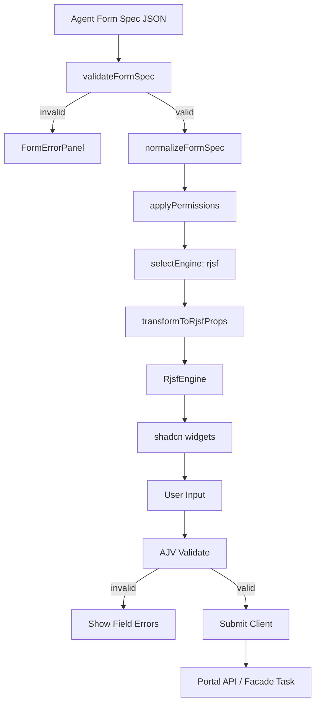
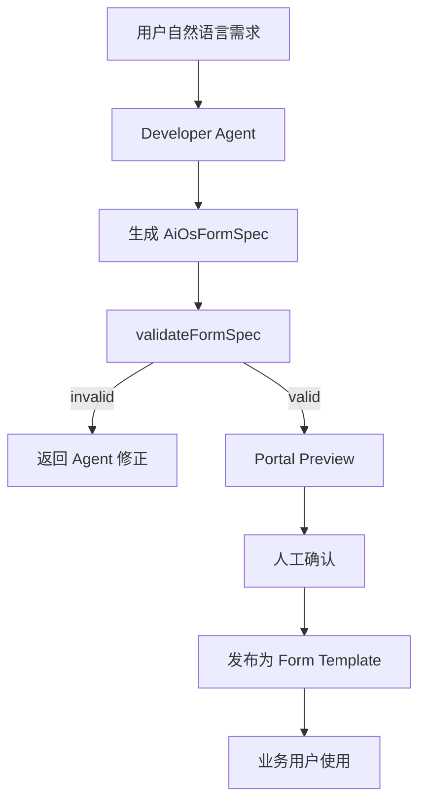

# AI-OS Portal Form 模块需求方案 / Cursor 执行稿

## 1. 当前阶段目标

在 `ai-os-portal` 中新增 `form` 模块，实现：

```text
Developer Agent 生成 AI-OS Form Spec JSON
→ Portal 前端接收 JSON
→ Form Spec Validator 校验
→ DynamicFormSandbox 渲染标准表单
→ 用户填写
→ 前端校验
→ 提交到 Portal API / Facade Task
→ 保存提交记录与审计信息
```

当前阶段只做 **标准简单表单运行时**，不做低代码设计器、不做复杂流程编排、不允许 Agent 生成 JSX/TSX。

---

## 2. 技术选型边界

| 组件                          | 当前阶段策略              | 原因                                                                                        |
| --------------------------- | ------------------- | ----------------------------------------------------------------------------------------- |
| `json-schema-form-renderer` | 自研模块                | 需要统一 AI-OS Form Spec、权限、审计、提交协议、后续引擎切换                                                    |
| `@rjsf/core`                | 当前默认 engine         | RJSF 的定位就是基于 JSON Schema 自动生成 React 表单，适合“给定 schema 即渲染表单”的场景 ([rjsf-team.github.io][1])  |
| `@rjsf/validator-ajv8`      | 当前默认 validator      | RJSF v5+ 要求向 `Form` 传入 validator，官方提供基于 AJV v8 的实现 ([rjsf-team.github.io][2])             |
| `AJV`                       | Form Spec 与提交数据校验   | AJV 支持 JSON Schema draft-04/06/07/2019-09/2020-12，并可将 schema 编译为高性能校验函数 ([ajv.js.org][3]) |
| `shadcn/ui`                 | Widget 外观层          | shadcn/ui 本质是可复制进项目的组件体系，不是传统 npm 组件库，适合 Portal 统一视觉资产 ([Shadcn][4])                      |
| `Formily`                   | 后续扩展 engine         | 复杂联动、复杂布局、企业表单设计器阶段再引入                                                                    |
| `json-render-react`         | 后续非表单 Generative UI | 用于卡片、结果页、任务面板，不作为表单主引擎                                                                    |
| `uniforms`                  | 暂不进入主路径             | 与当前 AI-OS Form Spec + RJSF 路线重叠，收益不足                                                      |

---

## 3. 当前阶段范围

### 3.1 必须实现

| 能力             | 要求                                                                           |
| -------------- | ---------------------------------------------------------------------------- |
| Form Spec 协议   | 定义 `AiOsFormSpec` TypeScript 类型与 JSON Schema                                 |
| Spec 校验        | 前端运行时校验 Agent 返回 JSON                                                        |
| RJSF 渲染        | 使用 `@rjsf/core` 渲染 JSON Schema                                               |
| AJV 校验         | 使用 `@rjsf/validator-ajv8` 校验表单数据                                             |
| shadcn widgets | 封装 TextInput、Textarea、NumberInput、MoneyInput、Select、Radio、Checkbox、DateInput |
| Layout         | 支持 single-column、two-column、sectioned                                        |
| 权限             | 支持 hiddenFields、readonlyFields                                               |
| 提交             | 支持 `portal_api` 与 `facade_task` 两种提交模式                                       |
| Sandbox        | 数据驱动渲染，不执行动态代码，不允许动态组件                                                       |
| Demo 页面        | 提供 `/form/playground` 或模块路由入口                                                |
| Mock Spec      | 提供 2 个示例：客户预下单、资金日报参数表单                                                      |
| 错误页            | Spec 不合法时显示校验错误，不渲染表单                                                        |

### 3.2 当前阶段不做

| 能力                | 状态                          |
| ----------------- | --------------------------- |
| Formily engine    | 只预留接口，不实现                   |
| json-render-react | 只预留 `generative-ui` 扩展点，不接入 |
| uniforms          | 不引入依赖                       |
| 表单设计器             | 不做                          |
| 拖拽布局              | 不做                          |
| 动态脚本              | 禁止                          |
| 任意 HTML 渲染        | 禁止                          |
| 复杂联动表达式           | 只预留 DSL，不执行                 |
| 文件上传              | 预留 widget，不实现真实上传           |
| 多步骤 wizard        | 预留 layout 类型，不进入 MVP        |

---

## 4. 模块目录结构

按模块隔离，不污染全局 CopilotKit、全局 layout、其它业务模块。

```text
ai-os-portal/
├── modules/
│   └── form/
│       ├── README.md
│       ├── index.ts
│       ├── types/
│       │   ├── form-spec.ts
│       │   ├── form-runtime.ts
│       │   ├── form-submit.ts
│       │   └── engine.ts
│       ├── schemas/
│       │   ├── ai-os-form-spec.schema.json
│       │   └── examples/
│       │       ├── pre-order-intake.form.json
│       │       └── cash-daily-report.form.json
│       ├── validators/
│       │   ├── create-ajv.ts
│       │   ├── validate-form-spec.ts
│       │   └── validate-form-data.ts
│       ├── renderer/
│       │   ├── JsonSchemaFormRenderer.tsx
│       │   ├── DynamicFormSandbox.tsx
│       │   ├── FormRendererProvider.tsx
│       │   ├── FormErrorPanel.tsx
│       │   ├── FormDebugPanel.tsx
│       │   └── FormSubmitBar.tsx
│       ├── engines/
│       │   ├── rjsf/
│       │   │   ├── RjsfEngine.tsx
│       │   │   ├── rjsf-widgets.ts
│       │   │   ├── rjsf-templates.tsx
│       │   │   └── rjsf-transform.ts
│       │   └── formily/
│       │       └── README.future.md
│       ├── widgets/
│       │   ├── TextWidget.tsx
│       │   ├── TextareaWidget.tsx
│       │   ├── NumberWidget.tsx
│       │   ├── MoneyWidget.tsx
│       │   ├── SelectWidget.tsx
│       │   ├── RadioWidget.tsx
│       │   ├── CheckboxWidget.tsx
│       │   ├── DateWidget.tsx
│       │   └── UnsupportedWidget.tsx
│       ├── services/
│       │   ├── form-submit-client.ts
│       │   ├── form-spec-loader.ts
│       │   └── form-audit-client.ts
│       ├── hooks/
│       │   ├── useDynamicForm.ts
│       │   ├── useFormSpecValidation.ts
│       │   └── useFormSubmit.ts
│       ├── pages/
│       │   ├── FormPlaygroundPage.tsx
│       │   ├── FormPreviewPage.tsx
│       │   └── FormSubmitResultPage.tsx
│       └── __tests__/
│           ├── validate-form-spec.test.ts
│           ├── rjsf-transform.test.ts
│           └── dynamic-form-sandbox.test.tsx
├── app/
│   ├── form/
│   │   ├── playground/
│   │   │   └── page.tsx
│   │   └── preview/
│   │       └── page.tsx
│   └── api/
│       └── forms/
│           ├── submit/
│           │   └── route.ts
│           └── validate/
│               └── route.ts
```

若项目不是 Next.js App Router，`app/**` 改为现有路由注册方式，`modules/form/**` 不变。

---

## 5. 依赖安装

```bash
npm install @rjsf/core @rjsf/utils @rjsf/validator-ajv8 ajv ajv-formats
```

shadcn/ui 组件按项目已有组件库复用。缺失时补齐：

```bash
npx shadcn@latest add input textarea select checkbox radio-group button card label alert calendar popover separator tabs
```

---

## 6. AI-OS Form Spec 协议

### 6.1 TypeScript 类型

文件：`modules/form/types/form-spec.ts`

```ts
export type AiOsFormVersion = "1.0";

export type AiOsFormLayoutType =
  | "single-column"
  | "two-column"
  | "sectioned"
  | "wizard";

export type AiOsSubmitMode =
  | "portal_api"
  | "facade_task"
  | "workflow";

export interface AiOsFormSpec {
  kind: "form";
  version: AiOsFormVersion;

  formId: string;
  title: string;
  description?: string;

  schema: Record<string, unknown>;
  uiSchema?: Record<string, unknown>;

  layout?: AiOsFormLayout;

  actions: AiOsFormAction[];

  submit: AiOsFormSubmit;

  permissions?: AiOsFormPermissions;

  runtime?: AiOsFormRuntimePolicy;

  metadata?: {
    generatedBy?: "developer_agent" | "human" | "system";
    sourceTaskId?: string;
    traceId?: string;
    tags?: string[];
  };
}

export interface AiOsFormLayout {
  type: AiOsFormLayoutType;
  sections?: AiOsFormSection[];
}

export interface AiOsFormSection {
  id: string;
  title: string;
  description?: string;
  fields: string[];
  collapsible?: boolean;
  defaultCollapsed?: boolean;
}

export interface AiOsFormAction {
  id: string;
  label: string;
  type: "submit" | "reset" | "cancel" | "draft";
  variant?: "default" | "secondary" | "destructive" | "outline";
  confirm?: {
    title: string;
    message: string;
  };
}

export interface AiOsFormSubmit {
  mode: AiOsSubmitMode;

  endpoint?: string;
  method?: "POST" | "PUT" | "PATCH";

  taskType?: string;
  workflowId?: string;

  successMessage?: string;
  failureMessage?: string;
}

export interface AiOsFormPermissions {
  readonlyFields?: string[];
  hiddenFields?: string[];
}

export interface AiOsFormRuntimePolicy {
  allowDebug?: boolean;
  allowDraft?: boolean;
  allowExternalEndpoint?: boolean;
  maxFields?: number;
  maxDepth?: number;
}
```

---

## 7. JSON Schema 约束

文件：`modules/form/schemas/ai-os-form-spec.schema.json`

核心限制：

```json
{
  "$id": "https://ai-os.local/schemas/ai-os-form-spec.schema.json",
  "type": "object",
  "additionalProperties": false,
  "required": ["kind", "version", "formId", "title", "schema", "actions", "submit"],
  "properties": {
    "kind": {
      "const": "form"
    },
    "version": {
      "enum": ["1.0"]
    },
    "formId": {
      "type": "string",
      "pattern": "^[a-zA-Z0-9_-]{3,80}$"
    },
    "title": {
      "type": "string",
      "minLength": 1,
      "maxLength": 120
    },
    "description": {
      "type": "string",
      "maxLength": 1000
    },
    "schema": {
      "type": "object"
    },
    "uiSchema": {
      "type": "object"
    },
    "layout": {
      "type": "object",
      "additionalProperties": false,
      "properties": {
        "type": {
          "enum": ["single-column", "two-column", "sectioned", "wizard"]
        },
        "sections": {
          "type": "array",
          "items": {
            "type": "object",
            "required": ["id", "title", "fields"],
            "additionalProperties": false,
            "properties": {
              "id": {
                "type": "string"
              },
              "title": {
                "type": "string"
              },
              "description": {
                "type": "string"
              },
              "fields": {
                "type": "array",
                "items": {
                  "type": "string"
                }
              },
              "collapsible": {
                "type": "boolean"
              },
              "defaultCollapsed": {
                "type": "boolean"
              }
            }
          }
        }
      }
    },
    "actions": {
      "type": "array",
      "minItems": 1,
      "items": {
        "type": "object",
        "required": ["id", "label", "type"],
        "additionalProperties": false,
        "properties": {
          "id": {
            "type": "string"
          },
          "label": {
            "type": "string"
          },
          "type": {
            "enum": ["submit", "reset", "cancel", "draft"]
          },
          "variant": {
            "enum": ["default", "secondary", "destructive", "outline"]
          },
          "confirm": {
            "type": "object"
          }
        }
      }
    },
    "submit": {
      "type": "object",
      "required": ["mode"],
      "additionalProperties": false,
      "properties": {
        "mode": {
          "enum": ["portal_api", "facade_task", "workflow"]
        },
        "endpoint": {
          "type": "string"
        },
        "method": {
          "enum": ["POST", "PUT", "PATCH"]
        },
        "taskType": {
          "type": "string"
        },
        "workflowId": {
          "type": "string"
        },
        "successMessage": {
          "type": "string"
        },
        "failureMessage": {
          "type": "string"
        }
      }
    },
    "permissions": {
      "type": "object",
      "additionalProperties": false,
      "properties": {
        "readonlyFields": {
          "type": "array",
          "items": {
            "type": "string"
          }
        },
        "hiddenFields": {
          "type": "array",
          "items": {
            "type": "string"
          }
        }
      }
    },
    "runtime": {
      "type": "object",
      "additionalProperties": false,
      "properties": {
        "allowDebug": {
          "type": "boolean"
        },
        "allowDraft": {
          "type": "boolean"
        },
        "allowExternalEndpoint": {
          "type": "boolean"
        },
        "maxFields": {
          "type": "integer",
          "minimum": 1,
          "maximum": 100
        },
        "maxDepth": {
          "type": "integer",
          "minimum": 1,
          "maximum": 8
        }
      }
    },
    "metadata": {
      "type": "object"
    }
  }
}
```

---

## 8. Agent 输出约束

Developer Agent 只能输出 JSON，不允许输出代码。

### 8.1 允许

```json
{
  "kind": "form",
  "version": "1.0",
  "formId": "pre_order_intake",
  "title": "客户预下单信息采集",
  "schema": {
    "type": "object",
    "required": ["customerName", "materialCode", "quantity"],
    "properties": {
      "customerName": {
        "type": "string",
        "title": "客户名称"
      },
      "materialCode": {
        "type": "string",
        "title": "物料型号"
      },
      "quantity": {
        "type": "integer",
        "title": "数量",
        "minimum": 1
      }
    }
  },
  "actions": [
    {
      "id": "submit",
      "label": "提交",
      "type": "submit",
      "variant": "default"
    }
  ],
  "submit": {
    "mode": "facade_task",
    "taskType": "pre_order_intake"
  }
}
```

### 8.2 禁止

```tsx
export default function DynamicForm() {
  return <input name="customerName" />;
}
```

```json
{
  "component": "script",
  "props": {
    "dangerouslySetInnerHTML": "<script>alert(1)</script>"
  }
}
```

```json
{
  "submit": {
    "mode": "portal_api",
    "endpoint": "https://external.example.com/collect"
  }
}
```

---

## 9. 安全设计

### 9.1 渲染安全

| 风险             | 控制                                       |
| -------------- | ---------------------------------------- |
| Agent 返回任意代码   | 只接受 JSON                                 |
| XSS            | 禁止 raw HTML，禁止 `dangerouslySetInnerHTML` |
| 任意组件调用         | Widget allowlist                         |
| 任意 endpoint 提交 | endpoint allowlist                       |
| 超大 schema      | 限制字段数、深度、JSON 字节大小                       |
| 隐藏字段篡改         | 后端重新校验 permissions                       |
| 前端绕过校验         | 后端再次 AJV 校验                              |
| 表单钓鱼           | 页面显示 formId、来源 taskId、generatedBy        |

### 9.2 Widget 白名单

```ts
export const ALLOWED_WIDGETS = [
  "TextInput",
  "Textarea",
  "NumberInput",
  "MoneyInput",
  "Select",
  "Radio",
  "Checkbox",
  "DateInput"
] as const;
```

未识别 widget：

```text
不渲染原始字段
显示 UnsupportedWidget
记录 audit warning
```

### 9.3 Submit endpoint 白名单

当前阶段只允许：

```text
/api/forms/submit
/api/facade/tasks
/api/workflows/run
```

禁止 Agent 自定义外部 URL。`runtime.allowExternalEndpoint` 即使为 `true`，当前阶段也不启用。

---

## 10. 渲染流程



---

## 11. Engine 抽象

文件：`modules/form/types/engine.ts`

```ts
import type { AiOsFormSpec } from "./form-spec";

export interface FormEngineRenderInput {
  spec: AiOsFormSpec;
  formData?: Record<string, unknown>;
  readonly?: boolean;
  debug?: boolean;
  onChange?: (data: Record<string, unknown>) => void;
  onSubmit?: (data: Record<string, unknown>) => Promise<void> | void;
  onError?: (errors: unknown[]) => void;
}

export interface FormEngine {
  name: "rjsf" | "formily";
  render(input: FormEngineRenderInput): React.ReactNode;
  validate?(spec: AiOsFormSpec, formData: Record<string, unknown>): Promise<{
    valid: boolean;
    errors: unknown[];
  }>;
}
```

当前实现：

```text
modules/form/engines/rjsf/RjsfEngine.tsx
```

后续扩展：

```text
modules/form/engines/formily/FormilyEngine.tsx
```

要求：业务层只能依赖 `FormEngine`，不能直接依赖 RJSF API。

---

## 12. RJSF Engine 实现要求

文件：`modules/form/engines/rjsf/RjsfEngine.tsx`

职责：

1. 接收 `AiOsFormSpec`
2. 提取 `schema`
3. 合并 `uiSchema`
4. 应用 `hiddenFields`
5. 应用 `readonlyFields`
6. 注入 widgets
7. 注入 templates
8. 使用 `validator-ajv8`
9. 禁用 RJSF 默认 submit button
10. 交给 `FormSubmitBar` 控制提交按钮

伪代码：

```tsx
import Form from "@rjsf/core";
import validator from "@rjsf/validator-ajv8";
import type { RJSFSchema, UiSchema } from "@rjsf/utils";

export function RjsfEngine(props: RjsfEngineProps) {
  const { spec, formData, onChange, onSubmit, onError } = props;

  const transformed = transformAiOsSpecToRjsf(spec);

  return (
    <Form
      schema={transformed.schema as RJSFSchema}
      uiSchema={transformed.uiSchema as UiSchema}
      formData={formData}
      validator={validator}
      widgets={rjsfWidgets}
      templates={rjsfTemplates}
      noHtml5Validate
      showErrorList={false}
      onChange={(event) => onChange?.(event.formData)}
      onSubmit={(event) => onSubmit?.(event.formData)}
      onError={onError}
    >
      <></>
    </Form>
  );
}
```

---

## 13. Widget 实现要求

### 13.1 Widget 映射

文件：`modules/form/engines/rjsf/rjsf-widgets.ts`

```ts
import { TextWidget } from "../../widgets/TextWidget";
import { TextareaWidget } from "../../widgets/TextareaWidget";
import { NumberWidget } from "../../widgets/NumberWidget";
import { MoneyWidget } from "../../widgets/MoneyWidget";
import { SelectWidget } from "../../widgets/SelectWidget";
import { RadioWidget } from "../../widgets/RadioWidget";
import { CheckboxWidget } from "../../widgets/CheckboxWidget";
import { DateWidget } from "../../widgets/DateWidget";
import { UnsupportedWidget } from "../../widgets/UnsupportedWidget";

export const rjsfWidgets = {
  TextInput: TextWidget,
  Textarea: TextareaWidget,
  NumberInput: NumberWidget,
  MoneyInput: MoneyWidget,
  Select: SelectWidget,
  Radio: RadioWidget,
  Checkbox: CheckboxWidget,
  DateInput: DateWidget,
  UnsupportedWidget
};
```

### 13.2 Widget 行为规范

| Widget      | JSON Schema 类型            | UI 规则             |
| ----------- | ------------------------- | ----------------- |
| TextInput   | `string`                  | 单行文本              |
| Textarea    | `string`                  | 多行文本              |
| NumberInput | `number` / `integer`      | 数字输入              |
| MoneyInput  | `number`                  | 保留 2-4 位小数，显示币种前缀 |
| Select      | `string` + `enum`         | 下拉                |
| Radio       | `string` + `enum`         | 单选                |
| Checkbox    | `boolean`                 | 布尔值               |
| DateInput   | `string` + `format: date` | 日期                |

---

## 14. Layout 规则

### 14.1 `single-column`

默认布局。字段纵向排列。

```json
{
  "layout": {
    "type": "single-column"
  }
}
```

### 14.2 `two-column`

字段按顺序两列布局。

```json
{
  "layout": {
    "type": "two-column"
  }
}
```

### 14.3 `sectioned`

按 sections 分组展示。

```json
{
  "layout": {
    "type": "sectioned",
    "sections": [
      {
        "id": "basic",
        "title": "基础信息",
        "fields": ["customerName", "materialCode", "quantity"]
      },
      {
        "id": "commercial",
        "title": "商务条件",
        "fields": ["targetPrice", "paymentTerm"]
      }
    ]
  }
}
```

当前阶段 `sectioned` 可通过 `ObjectFieldTemplate` 或外层分段渲染实现。Cursor 优先实现可维护方案，不强制一次完成复杂模板。

---

## 15. 提交协议

### 15.1 提交请求

文件：`modules/form/types/form-submit.ts`

```ts
export interface AiOsFormSubmitRequest {
  formId: string;
  specVersion: string;
  formData: Record<string, unknown>;
  submitMode: "portal_api" | "facade_task" | "workflow";
  taskType?: string;
  workflowId?: string;
  sourceTaskId?: string;
  traceId?: string;
}

export interface AiOsFormSubmitResponse {
  ok: boolean;
  submissionId?: string;
  taskId?: string;
  workflowRunId?: string;
  message?: string;
  errors?: Array<{
    path: string;
    message: string;
    code?: string;
  }>;
}
```

### 15.2 `portal_api`

用于普通表单提交。

```text
POST /api/forms/submit
```

Body：

```json
{
  "formId": "pre_order_intake",
  "specVersion": "1.0",
  "formData": {},
  "submitMode": "portal_api"
}
```

### 15.3 `facade_task`

用于把表单提交转为 AI-OS Facade 任务。

```text
POST /api/facade/tasks
```

内部映射：

```json
{
  "taskType": "pre_order_intake",
  "input": {
    "formId": "pre_order_intake",
    "formData": {}
  },
  "source": "dynamic_form"
}
```

---

## 16. API 路由要求

### 16.1 `POST /api/forms/validate`

用途：校验 Form Spec。

输入：

```json
{
  "spec": {}
}
```

输出：

```json
{
  "valid": true,
  "errors": []
}
```

### 16.2 `POST /api/forms/submit`

用途：提交表单数据。

处理流程：

```text
1. 接收 formId、specVersion、formData、metadata
2. 校验请求体结构
3. 根据 formId 加载 spec
4. 使用 spec.schema 校验 formData
5. 写入 submission 记录
6. 写入 audit log
7. 返回 submissionId
```

当前没有后端存储时，先 mock 返回：

```json
{
  "ok": true,
  "submissionId": "sub_mock_001",
  "message": "提交成功"
}
```

---

## 17. 示例表单

### 17.1 客户预下单表单

文件：`modules/form/schemas/examples/pre-order-intake.form.json`

```json
{
  "kind": "form",
  "version": "1.0",
  "formId": "pre_order_intake",
  "title": "客户预下单信息采集",
  "description": "用于销售员或 AI 客服采集客户预下单信息。",
  "schema": {
    "type": "object",
    "required": ["customerName", "materialCode", "quantity", "targetPrice", "paymentTerm"],
    "properties": {
      "customerName": {
        "type": "string",
        "title": "客户名称",
        "minLength": 2
      },
      "materialCode": {
        "type": "string",
        "title": "物料型号"
      },
      "quantity": {
        "type": "integer",
        "title": "数量",
        "minimum": 1
      },
      "targetPrice": {
        "type": "number",
        "title": "目标单价",
        "minimum": 0
      },
      "deliveryDate": {
        "type": "string",
        "title": "期望交期",
        "format": "date"
      },
      "paymentTerm": {
        "type": "string",
        "title": "付款方式",
        "enum": ["30%预付", "月结30天", "月结60天", "款到发货"]
      },
      "logisticsMode": {
        "type": "string",
        "title": "付运方式",
        "enum": ["客户自提", "快递", "空运", "海运", "待确认"]
      },
      "remark": {
        "type": "string",
        "title": "备注"
      }
    }
  },
  "uiSchema": {
    "customerName": {
      "ui:widget": "TextInput"
    },
    "materialCode": {
      "ui:widget": "TextInput"
    },
    "quantity": {
      "ui:widget": "NumberInput"
    },
    "targetPrice": {
      "ui:widget": "MoneyInput"
    },
    "deliveryDate": {
      "ui:widget": "DateInput"
    },
    "paymentTerm": {
      "ui:widget": "Select"
    },
    "logisticsMode": {
      "ui:widget": "Select"
    },
    "remark": {
      "ui:widget": "Textarea"
    }
  },
  "layout": {
    "type": "sectioned",
    "sections": [
      {
        "id": "basic",
        "title": "基础信息",
        "fields": ["customerName", "materialCode", "quantity"]
      },
      {
        "id": "commercial",
        "title": "商务条件",
        "fields": ["targetPrice", "deliveryDate", "paymentTerm", "logisticsMode"]
      },
      {
        "id": "extra",
        "title": "补充说明",
        "fields": ["remark"]
      }
    ]
  },
  "actions": [
    {
      "id": "submit",
      "label": "提交",
      "type": "submit",
      "variant": "default"
    },
    {
      "id": "draft",
      "label": "保存草稿",
      "type": "draft",
      "variant": "secondary"
    }
  ],
  "submit": {
    "mode": "facade_task",
    "taskType": "pre_order_intake",
    "successMessage": "预下单信息已提交"
  },
  "runtime": {
    "allowDebug": true,
    "allowDraft": true,
    "maxFields": 50,
    "maxDepth": 5
  },
  "metadata": {
    "generatedBy": "developer_agent",
    "tags": ["sales", "order", "intake"]
  }
}
```

---

## 18. 页面需求

### 18.1 `/form/playground`

用途：开发调试与 Agent 输出验证。

功能：

| 区域             | 说明                                   |
| -------------- | ------------------------------------ |
| 左侧 JSON Editor | 粘贴 / 修改 Form Spec                    |
| 中间 Preview     | 渲染表单                                 |
| 右侧 Debug Panel | 显示校验结果、formData、submit payload       |
| 顶部示例选择         | pre-order-intake / cash-daily-report |
| 提交按钮           | mock submit                          |

当前阶段 JSON Editor 可以先用 `<textarea>` 实现，不引入 Monaco，避免复杂依赖。

### 18.2 `/form/preview`

用途：真实运行时预览。

输入来源：

```text
query: ?formId=pre_order_intake
或者 props 注入 spec
```

---

## 19. Cursor 开发顺序

### Phase 1：协议与校验

完成文件：

```text
modules/form/types/form-spec.ts
modules/form/types/form-submit.ts
modules/form/schemas/ai-os-form-spec.schema.json
modules/form/validators/create-ajv.ts
modules/form/validators/validate-form-spec.ts
modules/form/validators/validate-form-data.ts
```

完成定义：

```text
- validateFormSpec(spec) 能返回 valid/errors
- invalid spec 不进入 renderer
- examples 通过校验
```

### Phase 2：RJSF Engine

完成文件：

```text
modules/form/types/engine.ts
modules/form/engines/rjsf/RjsfEngine.tsx
modules/form/engines/rjsf/rjsf-widgets.ts
modules/form/engines/rjsf/rjsf-transform.ts
modules/form/renderer/JsonSchemaFormRenderer.tsx
modules/form/renderer/DynamicFormSandbox.tsx
```

完成定义：

```text
- 能渲染 pre-order-intake
- 能实时输出 formData
- 能显示字段校验错误
- 不使用 RJSF 默认 submit button
```

### Phase 3：shadcn Widgets

完成文件：

```text
modules/form/widgets/*.tsx
```

完成定义：

```text
- TextInput / Textarea / NumberInput / MoneyInput / Select / Radio / Checkbox / DateInput 可用
- 不支持 widget 显示 UnsupportedWidget
- readonlyFields 生效
- hiddenFields 生效
```

### Phase 4：提交与 API

完成文件：

```text
modules/form/services/form-submit-client.ts
modules/form/hooks/useFormSubmit.ts
app/api/forms/submit/route.ts
app/api/forms/validate/route.ts
```

完成定义：

```text
- portal_api mock submit 成功
- facade_task 生成标准 payload
- submit error 能显示在页面
```

### Phase 5：页面与验收

完成文件：

```text
modules/form/pages/FormPlaygroundPage.tsx
modules/form/pages/FormPreviewPage.tsx
app/form/playground/page.tsx
app/form/preview/page.tsx
```

完成定义：

```text
- /form/playground 可打开
- 可切换示例 JSON
- 可编辑 JSON 后重新渲染
- invalid JSON 显示错误
- submit 后显示 response
```

---

## 20. 验收标准 DoD

### 20.1 功能验收

| 编号    | 验收项            | 标准                                            |
| ----- | -------------- | --------------------------------------------- |
| F-001 | Form Spec 校验   | 缺少 `kind/version/schema/actions/submit` 时拒绝渲染 |
| F-002 | JSON Schema 渲染 | `pre-order-intake.form.json` 能完整渲染            |
| F-003 | 必填校验           | 未填 required 字段时无法提交                           |
| F-004 | 数字校验           | `quantity < 1` 显示错误                           |
| F-005 | enum 渲染        | `paymentTerm` 显示为 Select                      |
| F-006 | readonlyFields | 指定字段不可编辑                                      |
| F-007 | hiddenFields   | 指定字段不显示                                       |
| F-008 | submit         | mock API 返回成功响应                               |
| F-009 | invalid widget | 不崩溃，显示 UnsupportedWidget                      |
| F-010 | debug          | Playground 能显示 formData 与 errors              |

### 20.2 安全验收

| 编号    | 验收项          | 标准                    |
| ----- | ------------ | --------------------- |
| S-001 | 禁止 JSX       | Agent 返回 JSX 字符串不执行   |
| S-002 | 禁止 script    | JSON 中包含 script 字段不执行 |
| S-003 | 禁止 raw HTML  | 不渲染 HTML 字符串          |
| S-004 | endpoint 白名单 | 外部 URL 被拒绝            |
| S-005 | 字段数量限制       | 超过 `maxFields` 拒绝渲染   |
| S-006 | schema 深度限制  | 超过 `maxDepth` 拒绝渲染    |

### 20.3 代码验收

| 编号    | 验收项                 | 标准                                           |
| ----- | ------------------- | -------------------------------------------- |
| C-001 | 模块隔离                | 新增代码集中在 `modules/form/**` 与 `app/form/**`    |
| C-002 | 引擎隔离                | 业务组件不直接依赖 RJSF                               |
| C-003 | 类型完整                | `AiOsFormSpec`、submit request/response 有明确类型 |
| C-004 | 可测试                 | validator 与 transform 有单测                    |
| C-005 | 无 Formily           | 当前阶段不引入 Formily 依赖                           |
| C-006 | 无 uniforms          | 当前阶段不引入 uniforms 依赖                          |
| C-007 | 无 json-render-react | 当前阶段不引入 json-render-react 依赖                 |

---

## 21. 后续扩展规划

### 21.1 Phase 2：Formily Engine

触发条件：

```text
- 表单字段超过 50 个
- 有 3 层以上字段联动
- 有复杂数组明细行
- 有审批流配置表单
- 需要表单设计器
```

扩展目录：

```text
modules/form/engines/formily/
├── FormilyEngine.tsx
├── formily-transform.ts
├── formily-widgets.ts
└── formily-effects.ts
```

关键要求：

```text
AiOsFormSpec 不变
新增 engine = formily
旧表单不需要迁移
```

### 21.2 Phase 3：Generative UI

`json-render-react` 只用于非表单 UI：

```text
- 表单提交结果摘要
- Agent 分析卡片
- 审批建议卡片
- 任务状态面板
- 数据解释区域
```

建议新增模块：

```text
modules/generative-ui/
├── component-catalog/
├── json-render-runtime/
└── cards/
```

不要与 `modules/form` 混在一起。

### 21.3 Phase 4：表单模板中心

新增：

```text
modules/form-template/
├── template-list
├── template-version
├── template-preview
├── template-publish
└── template-audit
```

存储建议：

| 数据               | 存储                       |
| ---------------- | ------------------------ |
| form metadata    | PostgreSQL               |
| form spec JSON   | PostgreSQL JSONB 或 MinIO |
| form submission  | PostgreSQL               |
| audit log        | PostgreSQL / OpenSearch  |
| large attachment | MinIO                    |

### 21.4 Phase 5：Agent 表单生成闭环

流程：



---

## 22. Cursor 约束指令

直接给 Cursor：

```text
只实现当前阶段 form 模块 MVP。

允许修改：
- modules/form/**
- app/form/**
- app/api/forms/**

禁止修改：
- 全局 layout
- 全局 CopilotKit Provider
- 其它业务模块
- 现有认证逻辑
- 现有主题配置，除非缺少必要 shadcn/ui 基础组件

当前阶段禁止引入：
- Formily
- uniforms
- json-render-react
- Monaco Editor
- iframe sandbox
- 动态 JSX 执行
- 任意 HTML 渲染

必须实现：
- AiOsFormSpec 类型
- Form Spec JSON Schema
- validateFormSpec
- DynamicFormSandbox
- RjsfEngine
- shadcn widgets
- playground 页面
- mock submit API
- 示例表单 JSON
- validator / transform 单测
```

---

## 23. 当前阶段最终交付物

```text
1. /form/playground 可运行
2. Developer Agent 生成的 AiOsFormSpec JSON 可粘贴预览
3. JSON 不合法时显示错误
4. JSON 合法时渲染标准表单
5. 用户填写后可校验并 mock submit
6. 代码已预留 FormEngine 抽象，后续可接 Formily
7. json-render-react 与 uniforms 不进入当前主路径
```

核心边界：

```text
当前阶段做“受控 JSON 表单运行时”
不是做“低代码平台”
不是做“AI 生成 React 页面”
不是做“任意 UI 渲染器”
```

[1]: https://rjsf-team.github.io/react-jsonschema-form/docs/?utm_source=chatgpt.com "Introduction | react-jsonschema-form"
[2]: https://rjsf-team.github.io/react-jsonschema-form/docs/usage/validation/?utm_source=chatgpt.com "Validation | react-jsonschema-form"
[3]: https://ajv.js.org/?utm_source=chatgpt.com "Ajv JSON schema validator"
[4]: https://ui.shadcn.com/docs?utm_source=chatgpt.com "Introduction - Shadcn UI"
