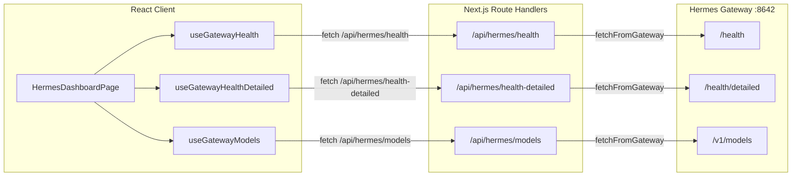

# Hermes Gateway 状态接入 Dashboard

## 背景与问题

当前 `HermesDashboardPage` 的所有数据均来自 mock（`hermes.api.ts` 中 `USE_MOCK = true`），从未真正连接过 Hermes Gateway。需要将 Dashboard 收窄为**真实 Gateway 只读监控页**，只使用 Hermes 官方公开 API。

关键差距：
- `hermes.bff.ts` 读 `HERMES_GATEWAY_URL`，但 `.env.local` 配的是 `HERMES_GATEWAY_BASE_URL` -- 需对齐
- 现有 `HermesHealth` 类型是复杂嵌套结构，但真实 `/health` 只返回 `{"status":"ok"}`
- Dashboard 引用了 sessions/skills/copilot 等组件，这些依赖不存在的 Gateway 接口

## 数据流架构



## 实施步骤

### 1. 修复 BFF 层环境变量对齐

文件：[`modules/hermes/services/hermes.bff.ts`](modules/hermes/services/hermes.bff.ts)

- 将 `getGatewayConfig()` 中的 `process.env.HERMES_GATEWAY_URL` 改为 `process.env.HERMES_GATEWAY_BASE_URL`
- fallback 改为 `http://localhost:8642`（Hermes 默认端口）

### 2. 新增 Gateway DTO 类型

文件：[`modules/hermes/types/gateway.types.ts`](modules/hermes/types/gateway.types.ts)（新建）

对齐真实 Hermes API 响应结构，不动现有 mock 类型：

```typescript
// /health 返回
export type GatewayHealthDto = { status: string };

// /health/detailed 返回
export type GatewayHealthDetailedDto = {
  status?: string;
  active_sessions?: number;
  running_agents?: number;
  resource_usage?: {
    cpu_percent?: number;
    memory_mb?: number;
    memory_percent?: number;
  };
  [key: string]: unknown;
};

// /v1/models 返回（OpenAI-compatible）
export type GatewayModelDto = {
  id: string;
  object?: string;
  owned_by?: string;
};
export type GatewayModelsResponseDto = {
  object?: string;
  data: GatewayModelDto[];
};
```

### 3. 新增 Gateway Zod Schema

文件：[`modules/hermes/types/gateway.schemas.ts`](modules/hermes/types/gateway.schemas.ts)（新建）

为 BFF 层做响应校验，复用现有的 `ResponseDriftError` 机制。

### 4. 新增 BFF Route: health-detailed

文件：[`app/api/hermes/health-detailed/route.ts`](app/api/hermes/health-detailed/route.ts)（新建）

- 调用 `fetchFromGateway("/health/detailed", { schema: GatewayHealthDetailedSchema })`

### 5. 更新现有 BFF Routes

- [`app/api/hermes/health/route.ts`](app/api/hermes/health/route.ts): Schema 改为 `GatewayHealthSchema`，路径保持 `/health`
- [`app/api/hermes/models/route.ts`](app/api/hermes/models/route.ts): 路径改为 `/v1/models`，Schema 改为 `GatewayModelsResponseSchema`

### 6. 新增前端 API 调用层

文件：[`modules/hermes/services/hermes-gateway.api.ts`](modules/hermes/services/hermes-gateway.api.ts)（新建）

不改动原有 `hermes.api.ts`（保持 mock 兼容），新建独立的 Gateway API 调用文件：

```typescript
export async function getGatewayHealth(): Promise<GatewayHealthDto> { ... }
export async function getGatewayHealthDetailed(): Promise<GatewayHealthDetailedDto> { ... }
export async function getGatewayModels(): Promise<GatewayModelsResponseDto> { ... }
```

### 7. 新增 React Query Hooks

在 [`modules/hermes/hooks/`](modules/hermes/hooks/) 下新增三个 hook 文件：

- `use-gateway-health.ts`: 轮询 `/api/hermes/health`，15s 间隔
- `use-gateway-health-detailed.ts`: 轮询 `/api/hermes/health-detailed`，10s 间隔
- `use-gateway-models.ts`: 轮询 `/api/hermes/models`，60s 间隔

### 8. 新增 Dashboard Card 组件

在 [`modules/hermes/components/dashboard/`](modules/hermes/components/dashboard/) 下新增：

- `GatewayHealthCard.tsx`: 显示 Gateway 基础健康状态（status ok/error + 连接状态指示器）
- `GatewayRuntimeCard.tsx`: 显示 active_sessions / running_agents / CPU / Memory
- `GatewayModelsCard.tsx`: 显示可用 model 列表（OpenAI-compatible model id）

### 9. 重构 HermesDashboardPage

文件：[`modules/hermes/pages/HermesDashboardPage.tsx`](modules/hermes/pages/HermesDashboardPage.tsx)

将页面从"全功能仪表盘"收窄为"Gateway 只读监控页"：

- **保留**: `HermesModuleShell` 外壳布局
- **替换内容为**: Gateway 三卡片布局（Health / Runtime / Models）
- **移除引用**: `ActivityChart`、`MetricsCards`、`SkillsPanel`、`RecentSessions`、`HermesCopilotPanel`、`QuickActions`（这些组件文件不删除，只是不在 dashboard 中引用）
- **保留**: `HealthStrip` 改用新的 Gateway Health hook（或替换为 GatewayHealthCard）
- **保留**: 错误状态展示（`HermesErrorState`）

最终页面结构：

```
HermesModuleShell (title="Hermes Dashboard")
  ├── GatewayHealthCard     (gateway 连接状态)
  ├── GatewayRuntimeCard    (运行时详情)
  └── GatewayModelsCard     (模型列表)
```
