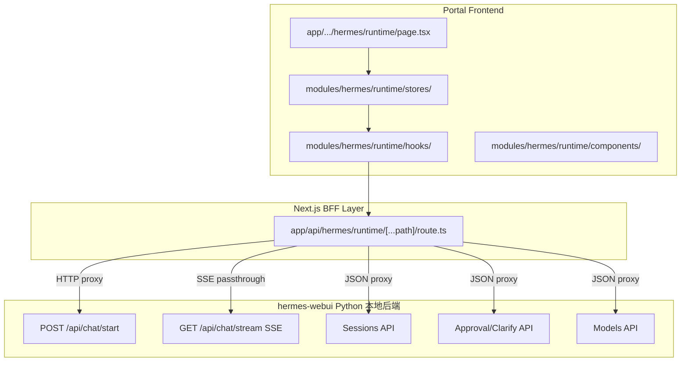

# Hermes Runtime 对话模块构建计划

## 架构总览



## 一、环境变量与 BFF 代理层

新增环境变量 `HERMES_WEBUI_BASE_URL`（默认 `http://localhost:8787`），指向本地 hermes-webui Python 后端。

### 1.1 通用代理 Route Handler

创建 `app/api/hermes/runtime/[...path]/route.ts`，用 catch-all 动态路由代理所有请求到 Python 后端。复用 [hermes.bff.ts](modules/hermes/services/hermes.bff.ts) 的模式但独立配置：

- **GET/POST JSON 端点**：读取请求体，转发到 `${HERMES_WEBUI_BASE_URL}/api/${path}`，返回 JSON 响应
- **SSE 端点**（`/api/chat/stream`）：用 `ReadableStream` 透传，不缓冲，设置 SSE headers
- **文件上传**（`/api/upload`）：透传 multipart/form-data

关键端点映射表：

| Portal BFF 路径 | 转发目标 | 类型 |
|---|---|---|
| `GET /api/hermes/runtime/sessions` | `/api/sessions` | JSON |
| `GET /api/hermes/runtime/session?session_id=X` | `/api/session?session_id=X` | JSON |
| `POST /api/hermes/runtime/session/new` | `/api/session/new` | JSON |
| `POST /api/hermes/runtime/session/rename` | `/api/session/rename` | JSON |
| `POST /api/hermes/runtime/session/delete` | `/api/session/delete` | JSON |
| `POST /api/hermes/runtime/chat/start` | `/api/chat/start` | JSON |
| `GET /api/hermes/runtime/chat/stream?stream_id=X` | `/api/chat/stream?stream_id=X` | SSE |
| `GET /api/hermes/runtime/chat/stream/status` | `/api/chat/stream/status` | JSON |
| `POST /api/hermes/runtime/chat/cancel` | `/api/chat/cancel` | JSON |
| `GET /api/hermes/runtime/approval/pending` | `/api/approval/pending` | JSON |
| `POST /api/hermes/runtime/approval/respond` | `/api/approval/respond` | JSON |
| `GET /api/hermes/runtime/clarify/pending` | `/api/clarify/pending` | JSON |
| `POST /api/hermes/runtime/clarify/respond` | `/api/clarify/respond` | JSON |
| `GET /api/hermes/runtime/models` | `/api/models` | JSON |
| `POST /api/hermes/runtime/upload` | `/api/upload` | multipart |

### 1.2 SSE 透传实现要点

```typescript
// SSE 透传核心模式（伪代码）
const upstream = await fetch(`${WEBUI_BASE}/api/chat/stream?stream_id=${streamId}`);
const stream = new ReadableStream({
  async start(controller) {
    const reader = upstream.body!.getReader();
    while (true) {
      const { done, value } = await reader.read();
      if (done) break;
      controller.enqueue(value);
    }
    controller.close();
  }
});
return new Response(stream, { headers: sseHeaders });
```

## 二、State Management（Zustand Stores）

所有 store 放 `modules/hermes/runtime/stores/`。

### 2.1 runtime-session-store.ts

管理会话列表和当前会话状态：

```typescript
type RuntimeSessionState = {
  sessions: RuntimeSession[];
  currentSession: RuntimeSession | null;
  messages: RuntimeMessage[];
  busy: boolean;
  activeStreamId: string | null;
  // actions
  loadSessions: () => Promise<void>;
  loadSession: (sessionId: string) => Promise<void>;
  createSession: (model?: string) => Promise<RuntimeSession>;
  deleteSession: (sessionId: string) => Promise<void>;
  renameSession: (sessionId: string, title: string) => Promise<void>;
  setMessages: (msgs: RuntimeMessage[]) => void;
  setBusy: (busy: boolean) => void;
};
```

### 2.2 runtime-stream-store.ts

管理 SSE 流连接和在飞行中（INFLIGHT）状态：

```typescript
type RuntimeStreamState = {
  inflight: Record<string, InflightState>; // 多会话并行
  toolCalls: RuntimeToolCall[];
  // actions
  markInflight: (sessionId: string, streamId: string, messages: RuntimeMessage[]) => void;
  clearInflight: (sessionId: string) => void;
  addToolCall: (tc: RuntimeToolCall) => void;
  updateToolCall: (name: string, update: Partial<RuntimeToolCall>) => void;
};
```

### 2.3 runtime-approval-store.ts

审批/澄清卡片状态（从 `messages.js` 的 approval/clarify 逻辑迁移）。

## 三、Hooks 层

放 `modules/hermes/runtime/hooks/`。

### 3.1 use-runtime-sse.ts（核心，最复杂）

封装两阶段 SSE 连接逻辑，对应 hermes-webui 的 `messages.js::send()` + `attachLiveStream()`：

1. `POST /api/hermes/runtime/chat/start` 获取 `stream_id`
2. 创建 `EventSource` 连接 `/api/hermes/runtime/chat/stream?stream_id=X`
3. 监听全部 SSE 事件：`token`/`reasoning`/`tool`/`tool_complete`/`approval`/`clarify`/`done`/`apperror`/`cancel`/`title`/`compressed`/`stream_end`
4. rAF 节流渲染文本 delta
5. 断连重连（一次）
6. 返回 `{ send, cancel, isStreaming }`

### 3.2 use-runtime-sessions.ts

会话列表 CRUD 操作，包装 TanStack Query：
- `useQuery(['hermes', 'runtime', 'sessions'])`
- 新建/删除/重命名的 mutation

### 3.3 use-runtime-models.ts

模型列表获取（`GET /api/hermes/runtime/models`），填充模型选择器。

### 3.4 use-runtime-approval.ts

审批轮询 + SSE 推送双通道（对应 `startApprovalPolling` + SSE `approval` 事件），同理 `use-runtime-clarify.ts`。

## 四、UI 组件层

放 `modules/hermes/runtime/components/`，全部复用 Shadcn/UI 原子组件。

### 4.1 页面组件 RuntimeChatPage.tsx

三栏布局复刻 hermes-webui 的 sidebar + main + rightpanel，但用 portal 的 layout 壳：

```
modules/hermes/runtime/pages/RuntimeChatPage.tsx
├── RuntimeSessionSidebar     左侧会话列表
├── RuntimeChatArea            中间对话区
│   ├── RuntimeChatHeader      顶栏（标题 + 模型选择器）
│   ├── RuntimeMessageList     消息列表
│   │   ├── RuntimeUserBubble
│   │   ├── RuntimeAssistantBubble（含 Markdown 渲染）
│   │   ├── RuntimeToolCard     工具调用卡片
│   │   └── RuntimeThinkingIndicator
│   ├── RuntimeApprovalCard    审批卡片
│   ├── RuntimeClarifyCard     澄清卡片
│   └── RuntimeComposer        输入框 + 发送/取消按钮
└── (右侧面板 P1 延后)
```

### 4.2 各组件说明

| 组件 | 复用的 Shadcn 组件 | 对应 hermes-webui 功能 |
|---|---|---|
| RuntimeSessionSidebar | `ScrollArea`, `Button`, `Input` | sessions.js 侧边栏 |
| RuntimeChatHeader | `Select`, `Badge` | 模型选择器 + 会话标题 |
| RuntimeMessageList | `ScrollArea` | messages area |
| RuntimeAssistantBubble | `Card` | 使用 `react-markdown` + `rehype-highlight` 渲染 |
| RuntimeToolCard | `Card`, `Badge`, `Collapsible` | tool card（started/completed/error 三态） |
| RuntimeApprovalCard | `Card`, `Button` (4 按钮) | 审批卡片 |
| RuntimeClarifyCard | `Card`, `Input`, `Button` | 澄清卡片 |
| RuntimeComposer | `Textarea`, `Button` | 输入框（Enter 发送 + 文件拖放） |
| RuntimeThinkingIndicator | `Skeleton` | thinking / reasoning 展示 |

### 4.3 Markdown 渲染

不复刻 hermes-webui 手写正则渲染器，改用：
- `react-markdown` + `remark-gfm` + `rehype-highlight`
- 代码块用 `@/components/ui/` 的样式包裹
- Mermaid 图用动态 import `mermaid` 库渲染

## 五、类型定义

放 `modules/hermes/runtime/types.ts`：

```typescript
type RuntimeSession = {
  session_id: string;
  title: string;
  workspace: string;
  model: string;
  message_count: number;
  created_at: string;
  updated_at: string;
  pinned: boolean;
  archived: boolean;
  is_cli_session?: boolean;
};

type RuntimeMessage = {
  role: 'user' | 'assistant' | 'tool' | 'system';
  content: string;
  attachments?: string[];
  reasoning?: string;
  timestamp?: number;
  _ts?: number;
  _error?: boolean;
};

type RuntimeToolCall = {
  name: string;
  preview: string;
  args: Record<string, string>;
  snippet: string;
  done: boolean;
  is_error?: boolean;
  duration?: number;
  tid: string;
};

type RuntimeApproval = {
  command: string;
  description: string;
  pattern_keys: string[];
  approval_id?: string;
};

type RuntimeClarify = {
  question: string;
  choices_offered: string[];
  session_id: string;
};
```

## 六、路由入口

`app/[lang]/(dashboard)/hermes/runtime/page.tsx` 作为轻壳：

```typescript
import RuntimeChatPage from "@/modules/hermes/runtime/pages/RuntimeChatPage";
export default function Page() {
  return <RuntimeChatPage />;
}
```

需要在 sidebar 导航菜单 config 中添加 Runtime 入口。

## 七、与 copilot 模块的关系

| 维度 | copilot 模块 | runtime 模块 |
|---|---|---|
| 目录 | `modules/hermes/copilot/` | `modules/hermes/runtime/` (新建) |
| 协议 | AG-UI events -> CopilotKit Runtime | 原生 SSE -> EventSource 自管理 |
| 后端 | `/api/copilot` (Next.js CopilotKit Runtime) | `/api/hermes/runtime/*` (BFF) -> hermes-webui Python |
| Agent 能力 | 文本对话 + 前端导航 action | 文本 + 工具调用 + 审批 + 澄清 + 文件操作 |
| 会话持久化 | 无（刷新丢失） | 完全持久化到 Python 后端 |
| UI | CopilotKit 内置侧栏 | 独立全功能页面 |
| 共存方式 | 全局侧栏（所有页面可用） | /hermes/runtime 独立路由页面 |

两个模块完全独立，互不影响。copilot 继续作为全站 AI 助手侧栏；runtime 是 Hermes 的全功能对话工作台。

## 八、不需要迁移的部分

- hermes-webui 的 workspace 文件树面板 -> P1 延后
- hermes-webui 的 cron/skills/memory/profiles 面板 -> 已有独立页面覆盖
- hermes-webui 的语音输入 -> P1 延后
- hermes-webui 的 CLI bridge (SQLite) -> 不需要

## 九、依赖项

需新增的 npm 依赖：
- `react-markdown` (Markdown 渲染)
- `remark-gfm` (GFM 表格/任务列表支持)
- `rehype-highlight` (代码高亮)

确认已有的依赖：`zustand`, `@tanstack/react-query`, Shadcn/UI 全套, `lucide-react`。
