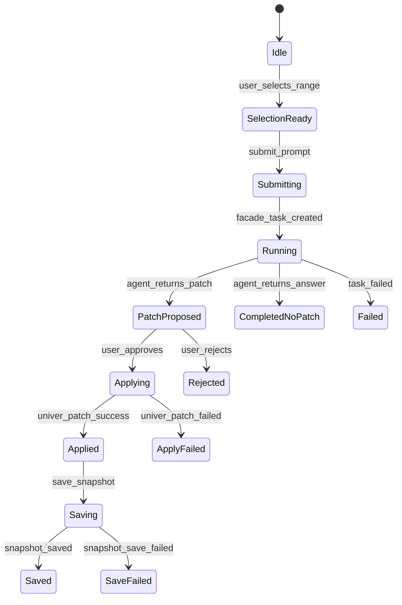

# State Machine

## Constraints

- **Idle**：允许选择区域
- **SelectionReady**：允许提交 prompt（若 context 超限则禁止）
- **Running**：只允许查看事件/取消任务（MVP 可不实现 cancel）
- **PatchProposed**：允许预览/批准/拒绝
- **Applying**：禁止重复提交
- **Applied**：允许保存快照
- **Saved**：允许下一轮 AI 操作

